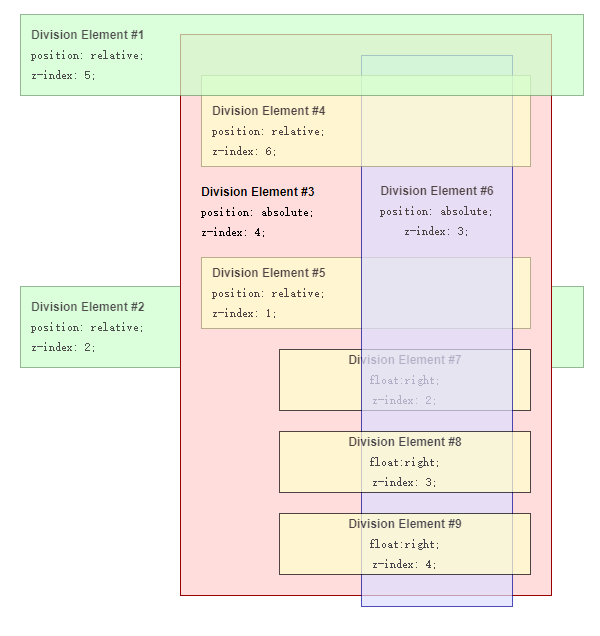
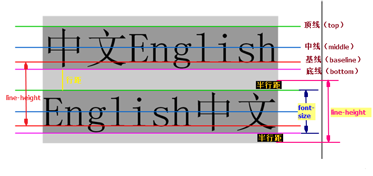

<a id="top"></a>

# [常用链接](/details/website/CSS.md)


# 目录

<details open>
  <summary>
    目录
  </summary>

* <a href="#CSS">**`CSS`**</a>

* <a href="#概述">概述</a>
* <a href="#常见浏览器及其内核、私有化前缀">常见浏览器及其内核、私有化前缀</a>
* <a href="#权重、优先级">权重、优先级</a>
* <a href="#CSS引入的方式">CSS引入的方式有哪些? link和@import的区别是? 如何避免FOUC?</a>
* <a href="#盒模型">盒模型</a>
* <a href="#css选择器">css选择器</a>
* <a href="#content属性">:before和:after伪元素的content属性</a>
* <a href="#CSS书写顺序、规范">CSS书写顺序、规范</a>
* <a href="#哪些属性可继承">哪些属性可继承</a>
* <a href="#文字、盒子阴影">text-shadow 、box-shadow</a>
* <a href="#max-,min-">max-width,max-height,min-width,min-height</a>

* <a href="#百分数相对于width">padding/margin-top/bottom的百分数相对于width</a>
* <a href="#zIndex">层叠上下文(stacking context )</a>
* <a href="#float特性">float特性</a>
* <a href="#格式化上下文">格式化上下文BFC、IFC、FFC、GFC</a>
* <a href="#display、visibility、overflow、opacity">display、visibility、overflow、opacity的隐藏问题</a>
* <a href="#border-style">border-style属性值</a>
* <a href="#line-hieght">line-hieght,vertical-align</a>
* <a href="#文本换行">文本换行 white-space word-wrap word-break</a>
* <a href="#定位">position定位</a>
* <a href="#Flex">Flex</a>
* <a href="#Grid">Grid</a>
* <a href="#background">background属性值</a>
  * <a href="#background-blend-mode和mix-blend-mode">background-blend-mode和mix-blend-mode</a>
 * <a href="#渐变">渐变linear-gradient,radial-gradient,conic-gradient</a>
* <a href="#transform">transform变形</a>
* <a href="#transition">transition过渡</a>
* <a href="#animation">animation动画</a>
* <a href="#移动端开发相关知识">移动端开发相关知识</a>
  * <a href="#响应式、自适应">响应式、自适应</a>
  * <a href="#尺寸单位">像素定义 尺寸单位</a>
  * <a href="#移动端适配">移动端适配</a>
* <a href="#获取CSS样式">获取CSS样式</a>
* <a href="#用CSS开启硬件加速来提高网站性能">用CSS开启硬件加速来提高网站性能</a>
* <a href="#@规则">@规则</a>
* <a href="#CSS hack">CSS hack</a>


* <a href="#一些css属性及其他">**一些css属性及其他**</a>

  * <a href="#注意事项">注意事项</a>
  * <a href="#CSSOM视图模式">CSSOM视图模式</a>
  * <a href="#css自定义变量属性">css自定义变量属性</a>
  * <a href="#shape-outside">shape-outside</a>
  * <a href="#文字超出省略">文字超出省略</a>
  * <a href="#text-align-last">text-align-last文本中最后一行在被强制换行之前的对齐规则</a>
  * <a href="#writing-mode">writing-mode调整文本排版方向</a>
  * <a href="#改变input placeholder颜色">改变input placeholder颜色</a>
  * <a href="#input自动填充上背景色">input自动填充上背景色</a>
  * <a href="#取消部分浏览器数字输入控件的操作按钮">取消部分浏览器数字输入控件的操作按钮</a>
  * <a href="#selection">selection 改变选中内容的字体、背景颜色</a>
  * <a href="#user-select">user-select 文本是否可选中</a>
  * <a href="#禁止保存或拷贝图像">禁止保存或拷贝图像</a>
  * <a href="#-webkit-text-size-adjust">-webkit-text-size-adjust</a>
  * <a href="#为破碎图象定义样式">为破碎图象定义样式content: "(url:'attr(src)')"</a>
  * <a href="#pointer-events">pointer-events 使用指针事件來控制鼠标事件</a>
  * <a href="#透明方格的绘制">透明方格的绘制</a>
  * <a href="#移动端1px">移动端1px</a>
  * <a href="#清除手机端a链接点击高亮">清除手机端a链接点击高亮</a>
  * <a href="#三角形">三角形</a>
  * <a href="#图片缩放">图片缩放matrix,transform+transition</a>
  * <a href="#clip-path">clip-path</a>
  * <a href="#filter滤镜">filter滤镜</a>
  * <a href="#多方法描绘一个边框">多方法描绘一个边框</a>
  * <a href="#滚动">滚动</a>
    * <a href="#-webkit-scrollbar">-webkit-scrollbar 自定义滚动条样式</a>
    * <a href="#页面滑动不顺畅的问题">页面滑动不顺畅的问题</a>
    * <a href="#滚动传播">滚动传播</a>
    * <a href="#纯css横向、垂直滑动">纯css横向、垂直滑动</a>
    * <a href="#纯css页面滚动进度条">纯css页面滚动进度条</a>
  * <a href="#"></a>
</details>

# <a name="CSS">**CSS**</a>

## <a name="概述">概述</a>[](#top)

CSS 是层叠样式表 ( Cascading Style Sheets ) 的简称。  
CSS 是一种标记语言，属于浏览器解释型语言，可以直接由浏览器执行，不需要编译。  
CSS 是用来表现HTML或XML的标记语言。  
CSS 样式可以让页面变得美观。  
CSS 语法由三部分构成：选择器、属性和值; selector {property: value} 

CSS的优势：
>
    内容与表现分离，有了CSS，网页的内容(XHMTL)与表现就可以分开了。
    使用CSS可以减少网页的代码量，增加网页的浏览速度。

## <a name="常见浏览器及其内核、私有化前缀">常见浏览器及其内核、私有化前缀</a>[](#top)


| | Chrome | Firefox | IE | Safari | Opera |
:-:| :-:|:-:|:-:|:-:|:-:|
| 渲染引擎(内核) | Blink | Gecko | Trident | Webkit | Blink(原Presto) |
| JS 引擎 | V8 | SpiderMonkey | Nitro | Chakra | V8 |
| 私有化前缀 | -webkit- | -moz- | -ms- | -webkit- | -webkit- |

## <a name="权重、优先级">权重、优先级</a>[](#top)
>

    内联样式 > 内部样式表 > 外部样式表  
    !important > 内联样式 > ID选择器 > 类选择器/属性选择器/伪类选择器 > 元素选择器/关系选择器/伪元素选择器 > 通配符(*)  
    权值: 10000   1000      0100      0010                         0001                                000000

    max-width、mix-width、max-height、min-height 权重大于 !important
    mix-width,min-height 权重大于 max-width,max-height

    同权重下样式定义最近者为准
    载入样式以最后载入的定位为准;


## <a name="CSS引入的方式">CSS引入的方式? link和@import的区别是? 如何避免FOUC？</a>[](#top)

### CSS引入的方式
>
    内联样式：直接在 HTML 标签中的 style 属性中添加 <div style=''>
    内部样式：写在head中style, <head><style> div{}</style></head>  
    外部样式：在head标签中引入外部的 CSS 文件<head><link rel="stylesheet" href="demo.css"></head>  
    @import: <style>@import url(style.css);</style>

### link与@important区别：
>
    link是html标签,无兼容性问题;@import是在css2.1提出的，IE5以上才识别。 
    link不只能加载css，还可定义RSS等其；@import属于css范畴，只能加载css。  
    link引入的css与页面同时加载，而@important则需等页面完全载入后再加载。  
    linnk支持使用javascript控制dom去改变样式；而@import不支持。

### FOUC（文档样式短暂失效）
Flash Of Unstyled Content：文档样式短暂失效; 用户定义样式表加载之前浏览器使用默认样式显示文档，用户样式加载渲染之后再从新显示文档，造成页面闪烁。

原因：
>
    使用import方法导入样式表(需等页面完全载入后再加载)
    将样式表放在页面底部
    有几个样式表，放在html结构的不同位置。其实原理很清楚：当样式表晚于结构性html加载，当加载到此样式表时，页面将停止之前的渲染。此样式表被下载和解析后，将重新渲染页面，也就出现了短暂的花屏现象

解决方法：
>
    使用link标签将样式表放在head中

## <a name="盒模型">盒模型</a>[](#top)

* 定义：
HTML中每个元素都被描绘成一个矩形盒子，这些盒子通过一个模型来描述其占有空间，该模型称为盒模型。盒模型通过四个边界描述:内边距（padding）、外边距(margin)、边框(border)、内容(content)

* 区  别：box-sizing:content-box | border-box 
1. 标准盒子模型(W3C):  
    宽高 不包含border和padding  
    box-sizing: content-box; 默认值  

2. 怪异盒模型（IE）: 
    宽高 包含border和padding  
    box-sizing: border-box;   
    


盒模型相关的周边问题
>
    内联元素，例如<a>、<span>等，定义上下边界不会影响到行高（line-height），内联元素距离上一行元素的距离由行高决定，而不是填充或边界
    margin的边界合并
    inline-block元素之间的小空白
        原因为：HTML 中的换行符、空格符、制表符等合并为空白符, 字体大小不为 0 的情况下, 空白符自然占据一定的宽度, 因此产生了元素间的空隙.
        解决方案：
          可以为inline-block元素设置为负的margin-left;
          父元素font-size设置为0, 子元素再重新设置回来;
          直接在HTML文档里改变文本排列，使行间元素尾标签和下一个头便签间不留任何空格，如<span>第一个元素</span><span>第二个元素</span>

## <a name="css选择器">css选择器</a>[](#top)

#### 
* 通配符选择器(*)
* id选择器（ #myid）
* class选择器（.myclass）
* 标签选择器（div, h1, p）
* 子代选择器（div > p）
* 后代选择器（div p）
* 相邻选择器（div + p）紧挨div后面的第一个p（必须紧挨着div，若中间隔着其他标签不生效,包括script、style标签）
* 通用兄弟选择器(div ~ p) //div后面所有的兄弟p
* 属性选择器（a[rel = "external"]）
* 伪类选择器（a:hover, li:nth-child）
* .....

#### 属性选择器

E[attr]        //E中带有attr属性  
E[attr=val]    //E中带有attr属性 且值为 val  
E[attr*=val]   //E中带有attr属性 且值包含 val  
E[attr^=val]   //E中带有attr属性 且值以 val 开始  
E[attr$=val]   //E中带有attr属性 且值以 val 结尾   
E[attr~=val]   //E中带有attr属性 且值具有多个空格分隔的值，其中一个值为val  
E[attr|=val]   //E中带有attr属性 且值具有 val 或以 val- 开始的值，常用于lang（lang='en-us'）  

#### 伪类  
>
    是基于元素的特征而不是他们的id、class、属性或者内容。一般来说，元素的特征是不可以从DOM树上推断得到的，而且其是动态的，当用户和DOM进行交互的时候，元素可以获得或者失去一个伪类。
    伪类其实就是基于普通DOM元素而产生的不同状态，他是DOM元素的某一特征

* 结构伪类：
>
    E:first-child        //第一个子元素F  
    E:last-child         //最后一个子元素  
    E:nth-child(n)       //第n个 n=1,2,3...n ;  
    E:nth-last-child(n)  //倒数第n个子元素 n=1,2..
    E:nth-child(odd)     //奇数  
    E:nth-child(2n+1)    //奇数 在表达式中n取值范围：n=0,1,2..  
    E:nth-child(even)    //偶数 n=1,2.. 
    E:nth-child(2n)      //偶数 n=1,2.. 
    E:nth-child(-n+5)    //前5个子元素   n=0,1..
    E:nth-last-child(-n+5)//后5个子元素  n=0,1..
    E:nth-child(7n)      //选择7的倍数的E  n=0,1..
    E:only-child          //只包含一个子元素    

    E:first-of-type      //选择指定类型的第1个F  
    E:last-of-type       //选择指定类型的倒数第1个F  
    E:nth-of-type(n)     //选择指定类型的第n个F  
    E:nth-last-of-type(n)//选择指定类型倒数的第n个F  
    E:only-of-type       //选择只包含一个同类型的F子元素  

* 空伪类
>
    E:empty 选择 空元素 。空元素是指没有任何内容的元素，甚至空格都不行。//无内容 无子元素  

    E:blank 选择 没有子节点、仅有空的文本节点、仅有空白符的文本节点--浏览器不支持

* 目标伪类：
>
    E:target   //表示元素被激活的状态  配合锚点使用
    
* 排除伪类：
>
    E:not(selector) //除selector（任意选择器）外的元素会被选中；

* 动态伪类：
>
    a:link{...} 选择所有未访问过的超链接  
    a:visited{...} 选择所有访问过的超链接  
    a:hover{...} 当鼠标悬停于元素上方时  
    a:active{...} 当元素被激活时  

    input:foucs{...} 当元素获得输入焦点    

    css书写顺序 link visited hover active 不然有些效果不会呈现

* 语言伪类
>
    E:lang 匹配E的所有指定lang值为language的元素
    状态伪类： 
    E:checked 匹配选中的单选和复选按钮表单元素  
    E:enabled  匹配所有启动的表单元素  
    E:disabled  匹配所有禁用的表单元素  

#### 伪元素
>
    是创造文档树之外的对象。例如文档不能提供访问元素内容第一字或者第一行的机制。伪元素还提供一些在源文档中不存在的内容分配样式，例如:before和:after能够访问产生的内容。伪元素的内容实际上和普通DOM元素是相同的，但是它本身只是基于元素的抽象，并不存在于文档中，所以叫伪元素。
>
    E::before{content:"";......}
    E::after{content:"";......}
    E::first-letter     //选中第一个单词、字(常见的标点符号、各类括号和引号在::first-letter中全部都是“辅助类”字符，)
    E::first-line     //选中第一行的伪元素
    E::selection       //选中的区域 
    E::placeholder  //设置placeholder样式
    //兼容写法
      ::-webkit-input-placeholder {//chrome
          color: red;
      }
      :-ms-input-placeholder { //ie
          color: red;
      }
      ::-moz-placeholder { //ff
          color: red;
      }

css2伪类和伪元素都是用单冒号，所有的浏览器都兼容，
但是css3伪类为单冒号如:hover ，伪元素为双冒号::before；但是双冒号IE8以下不兼容


## <a name="content属性">::before和::after伪元素的content属性</a>[](#top)

| 值 |	说明
|:-|:-|
| none	|默认值
| normal	|正常
| string	|指定的文本
| attr(attribute)	| 读取该元素的属性值如 attr(href) , attr(title) , 或者自定义的属性值如 attr(data-content)。
| url(url)	| 设置某种媒体（图像，声音，视频等内容）
| counter|	设定计数器内容(序列只是 1、2、3、4)
| counters|	设定计数器内容（可自定义序列）
| open-quote	|添加开口引号
| close-quote	|添加闭合引号
| no-open-quote	|移除开始引号
| no-close-quote	| 移除闭合引号
| inherit	| 从父元素继承

* 特点：

content 属性生成的内容都是替换元素

使用 content 生成的文本是无法选中、无法复制的

content 生成的文本无法被屏幕阅读设备读取，也无法被搜索引擎抓取,因此 重要内容不要用content生成

不能左右:empty 伪类（即使content有内容，元素为空时，:empty依旧生效）

* [counters属性使用](https://blog.csdn.net/qq_37815596/article/details/80046996)
>
counter-reset：[identifier  integer] | none | inherit
>必需值。必须用于选择器，主要用来标识该作用域，其值可以自定义,不能是CSS的关键词（默认none）。  
>identifier:自定义定义计数器的名称  
>integer： 设置调用计算数器时起始值(任意整数，如果你设置的值为1，那么计数从2开始)，默认值为 0

counter-increment：[identifier  integer] | none | inherit
>用来标识计数器与实际相关联的范围（默认none）  
>identifier:计数器名称，就调用counter-reset声明的计数器的标识符。  
>integer：一个整数值，指定计数起始值。其值允许是0或者负整数值，如果未指定任何值，则该值为1（前提是counter-reset未显式设置计数的起始值）。其值递增是按倍数值递增，如果设置了值为2,后面元素递增值为4、6、8，依此类推。

content：用来生成内容，其为:before、:after或::before、::after的一个属性。在生成计数器内容，主要配合counter()一起使用。

counters()：该函数用来设置插入计数器的值,接受两个参数，而且两参数之间使用逗号(,)来分隔。
>第一个参数是counter-increment定义的属性值,用来告诉该文档插入的计数器标识符名称是什么。
>第二个是用来设置计数器的风格，有点类似于list-style-type。默认情况之下取值为十制，但你也可以重置这个样式风格，比如upper-roman或者upper-alpha等。

```html
<style>
  ol {
    counter-reset: name 0;
    list-style-type: none;
    /* display: none; */
    visibility: visible;
  }
  li::before {
    counter-increment: name ; 
    /* counter-increment: name 2;  */
    content: counters(name, ".") " "; 
  }
</style>
<ol>
  <li>
    a
    <ol>
      <li>aa</li>
      <li>
        aaa
        <ol>
          <li>aaaa</li>
          <li>aaaa</li>
        </ol>
      </li>
    </ol>
  </li>
  <li>b</li>
  <li>c</li>
</ol>
```    


## <a name="CSS书写顺序、规范">CSS书写顺序、命名规范</a>[](#top)

#### 书写顺序
*  位置属性(position, top, right, z-index,display, float等)  
*  大小(width, height, padding, margin,border)
*  文字系列(font, line-height, letter-spacing,color- text-align等)
*  背景 颜色(background, color等)
* 其他(animation, transition等)

#### 书写规范
* 属性缩写
* 去掉小数点前的 0
* 使用单引号
* 避免使用复杂的选择器，层级越少越好 建议选择器的嵌套最好不要* 超过三层
* 尽量使用简写属性(padding,margin,background,font...)
* 声明结束都应该带一个分号
* 颜色尽量用三位字符表示 #AAA
* 除16进制颜色和字体设置外，CSS文件中的所有的代码都应该小写

#### 命名规范

正确命名 CSS 中的类名可以让你的代码变得更易理解和维护

* 连字符（-） .box-left{}  

* BEM  
  >B 代表区块  
  >E 代表元素  
  >M 代表修饰符 
  .block{}
  .block__element{}
  .block--modifier{}

* 使用 js- 类名:用这种方法来表明这个 DOM 元素和 JavaScript 代码的关联。
>
    <div class="site-navigation js-site-navigation">
    </div>


## <a name="哪些属性可继承">哪些属性可继承</a>[](#top)

* 不可继承的样式：
>
    border 、padding、 margin、 width 、height、position、
    ）
    h1-h6 标题标签不能继承父元素中的font-size,font-weight

* 可继承的样式：
>
    font- (font-family、font-size、 ...)
    line- (line-height ...)
    text- (text-align,text-indent,text-transform,text-shadow ...)
    letter-spacing
    word-break
    word-spacing
    white-space
    color // a标签不能继承父元素中的color（被浏览器默认样式给覆盖）（解决：a{color:inherit} 
    visibility
    cursor

* font属性:

[font-family中文字体对应的英文名称一览表](https://www.zhangxinxu.com/study/201703/font-family-chinese-english.html)
>
    font: font-style?  font-weight?  font-size/line-height?  font-family;
    //font-size和font-family必须，其他可选 
    // font:italic 700 16px/40px  '微软雅黑';

    font-style: normal | italic;      normal 默认值  italic  斜体  

    font-weight:
        normal	默认值。标准的字符。
        bold	粗体字符。
        bolder	更粗的字符。
        lighter 更细的
        inherit	继承
        100-900 (400 等同于 normal，700 等同于 bold)

    font-size:16px;  文字大小
    

## <a name="文字、盒子阴影">text-shadow 、box-shadow</a>[](#top)

文字阴影：text-shadow 
>
    text-shadow:h-shadow v-shadow blur  color
                 水平位移 垂直位移  模糊程度  阴影颜色;
    //正值向右、下 ， 负值向左、上 ;模糊度不能为负值;
    //可以设置多个阴影 用逗号隔开

    .tu{ text-shadow: -1px -1px 1px #fff, 1px 1px 1px #000; } //凸
    .ao{ text-shadow: -1px -1px 1px #000, 1px 1px 1px #fff; } //凹

盒子阴影box-shadow
>
    box-shadow: h-shadow v-shadow blur spread color inset;
    值	说明
    h-shadow	必需的。水平阴影偏移量。正值：阴影在元素右边；负值：阴影在元素左边
    v-shadow	必需的。垂直阴影偏移量。正值：阴影在元素底部；负值：阴影在元素顶部
    blur	可选。模糊距离  
    spread	可选。阴影的大小  正值：阴影扩大；负值：阴影缩小
    color	可选。阴影的颜色。在CSS颜色值寻找颜色值的完整列表
    inset	可选。从外层的阴影（开始时）改变阴影内侧阴影

## <a name="max-,min-">max-width,max-height,min-width,min-height</a>[](#top)

min-width/max-width 出现的场景一定是自适应布局或者流体布局中

width/height 的默认值是 auto

max-width 和 max-height 的初始值是 none

min-width 和 min-height 的初始值是 auto

max-width、mix-width、max-height、min-height 权重大于 !important
mix-width,min-height 权重大于 max-width,max-height

[max-height与任意高度元素滑动展开收起效果实例页面](https://demo.cssworld.cn/3/3-2.php)

## <a name="百分数相对于width">为什么padding/margin-top/bottom的百分数相对于width？</a>[](#top)

CSS权威指南中的解释：
>
    正常流中的大多数元素都会足够高以包含其后代元素（包括外边距），如果一个元素的上下外边距时父元素的height的百分数，就可能导致一个无限循环，父元素的height会增加，以适应后代元素上下外边距的增加，而相应的，上下外边距因为父元素height的增加也会增加，如果循环。


## <a name="zIndex">层叠上下文(stacking context )</a>[](#top)

[MDN](https://developer.mozilla.org/zh-CN/docs/Web/Guide/CSS/Understanding_z_index/The_stacking_context)

[z-index堆叠规则](https://www.cnblogs.com/starof/p/4424926.html)

[深入理解CSS中的层叠上下文和层叠顺序](https://www.zhangxinxu.com/wordpress/2016/01/understand-css-stacking-context-order-z-index/) -- 张鑫旭

[CSS世界.pdf--第7章](https://www.cssworld.cn/)-- 张鑫旭

### **什么是层叠上下文**

层叠上下文，英文称作 stacking context，是 HTML 中的一个三维的概念。如果一个元素含有层叠上下文，我们可以理解为这个元素在 z 轴上就“高人一等”。

### **什么是层叠水平**
层叠水平，英文称作 stacking level，决定了同一个层叠上下文中元
素在 z 轴上的显示顺序。

页面中的每个元素都是独立的个体，它们一定是会有一个类似的排名顺序的存
在。而这个排名顺序就是这里所说的“层叠水平”

所有的元素都有层叠水平，包括层叠上下文元素，也包括普通元素

需要注意的是，诸位`千万不要把层叠水平和 CSS 的 z-index 属性混为一谈`。尽管某些情况下 z-index 确实可以影响层叠水平，但是只限于定位元素以及 flex 盒子的孩子元素；而层叠水平是所有的元素都存在的。

### **层叠顺序**
层叠顺序，英文称作 stacking order，表示元素发生层叠时有着特定的垂直显示顺序。注意，这里跟上面两个不一样，上面的“层叠上下文”和“层叠水平”是**概念**，
而这里的“层叠顺序”是**规则**。

css2层叠顺序规则


为什么内联元素的层叠顺序要比浮动元素和块状元素都高？
>
    诸如border/background一般为装饰属性，而浮动和块状元素一般用作布局，而内联元素都是内容。网页中最重要的是什么？当然是内容了哈，对不对！

    因此，一定要让内容的层叠顺序相当高，当发生层叠时，重要的文字、图片内容才可以优先显示在屏幕上


### **层叠准则**

当元素发生层叠的时候，其覆盖关系遵循下面两条准则：
* 同一个层叠上下文中，层叠级别（z-index属性值）大的显示在上面。
* 同一个层叠上下文中，层叠级别相同的两个元素，依据它们在HTML文档流中的顺序，写在后面的会覆盖前面的。

### **层叠上下文的特性**
* 层叠上下文的层叠水平要比普通元素高（原因后面会说明）。
* 层叠上下文可以阻断元素的混合模式（[见此文第二部分说明](https://www.zhangxinxu.com/wordpress/2016/01/understand-css3-isolation-isolate/)）。
* 层叠上下文可以嵌套，内部层叠上下文及其所有子元素均受制于外部的“层叠上下文”。
* 每个层叠上下文和兄弟元素独立，也就是说，当进行层叠变化或渲染的时候，只需要
考虑后代元素。
* 每个层叠上下文是自成体系的，当元素发生层叠的时候，整个元素被认为是在父层叠
上下文的层叠顺序中。

### **层叠上下文创建条件**： 满足以下任一条件即可
* 文档根元素（html）
* position: fixed | sticky  
* z-index 值不为 "auto"的 绝对 | 相对定位， 
* z-index 值不为 "auto"的 flex | grid  
* opacity值 < 1  
* transform 值不为 none  
* filter值不为 none
* perspective值不为 none 的元素，
* isolation 值为 isolate 的元素，  
* mix-blend-mode 值不为 normal
* 在 will-change 中指定了任意 CSS 属性，即便你没有直接指定这些属性的值  
* -webkit-overflow-scrolling 值为"touch"的元素  

层叠上下文的层级是 HTML 元素层级的一个层级，因为只有某些元素才会创建层叠上下文。可以这样说，没有创建自己的层叠上下文的元素 将被父层叠上下文包含。

在层叠上下文中，其子元素同样也按照上面解释的规则进行层叠。 
<b>其子元素的 z-index 值只在父级层叠上下文中有意义</b>。子级层叠上下文被自动视为父级层叠上下文的一个独立单元。(每个层叠上下文完全独立于它的兄弟元素：当处理层叠时只考虑子元素。)


### 层叠顺序-优先级
* 不使用z-index的情况，默认的情况，即所有元素都不用z-index时，堆叠顺序如下：（低-->高)
>

    根元素（即HTML元素）的background和borders <
    正常流中非定位后代元素(没定位层级比有定位的低) <   
        总是先于定位元素渲染，所以表现就是在定位元素下方，跟在HTML中出现的顺序无关。 
    浮动元素(浮动元素之间是不会出现z-index重叠的) <
    有定位后代元素(越靠后出现 层级越高)  
        没有指定z-index值的定位元素，他们的堆叠顺序取决于在HTML文档中的顺序，越靠后出现的元素，位置越高，和定位属性无关。  


分析：
>
    #5没有定位，处于正常流，所以根据以上规则，先于#1,#2,#3,#4这些已定位元素渲染，在最下方。

    #1，#2，#3，#4都是已定位元素，且未设置z-index，所以根据其在文档中出现的顺序依次被渲染，可以去掉apacity查看清晰效果。

* 使用z-index
z-index只适用于已经定位的元素
>
    定位元素z-index越大 层级越高（限同一父元素）
    定位元素与浮动元素（先看zindex，越大越高；若相同，再看其在html顺序，越后越高）




### z-index不起作用情况：
>
    1、父标签 position属性为relative；（改为position:absolute；）
    2、问题标签无position属性,不包括static (添加position属性)
    3、问题标签含有浮动(float)属性。(去除浮动)

## <a name="float特性">float特性</a>[](#top)

由于float意味着使用块布局，所以它会修改元素的display值为block|table

* 浮动的本意：是为了实现文字环绕效果(主要指的是文字环绕图片显示的效果)
  >由两个特性（即“父级高度塌陷”和“行框盒子区域限制”）共同作用的结果

* 特性：
>
    包裹性(由“包裹”和“自适应性”两部分组成)
    块状化并格式化上下文；
    破坏文档流；
    没有任何 margin 合并；

* 规则：
>
    不会超越前面的块元素，仅在本行浮动 
    脱离文档流后，下分的块元素会填充  
    两个浮动元素的垂直外边距将不会折叠 
    浮动后的元素不会影响其他块元素的布局，仅会影响被它覆盖的行内元素  
    浮动盒子的顶部不会超出在html文档中早出现的的块级元素(block)或者是浮动元素的顶部

包裹:假设浮动元素父元素宽度 200px，浮动元素子元素是一个 128px 宽度的图片，
则此时浮动元素宽度表现为“包裹”，就是里面图片的宽度 128px，代
>
    <div class="father">
      <div class="float">
      
      </div>
    </div>

自适应性:元素尺寸由内部元素决定，但永远小于“包含块”容器的
尺寸（除非容器尺寸小于元素的“首选最小宽度”）

如果浮动元素的子元素不只是一张 128px 宽度的图片，还有一大波普通
的文字，则此时浮动元素宽度就自适应父元素的 200px 宽度，最终的宽度表现也是 200px。
>
    <div class="father">
    <div class="float">
      我是帅哥，好巧啊，我也是帅哥，原来看这本书的人都是帅哥~
    </div>

clear:left | right | both

clear 属性是让自身不能和前面的浮动元素相邻

clear 属性只有块级元素才有效的，而::after 等伪元素默认都是内联水平，

由于 clear:both 的作用本质是让自己不和 float 元素在一行显示，并不是真正意义上
的清除浮动，因此 float 元素一些不好的特性依然存在，于是，会有类似下面的现象。
>
    （1）如果 clear:both 元素前面的元素就是 float 元素，则 margin-top 负值即使设
    成-9999px，也不见任何效果。
    （2）clear:both 后面的元素依旧可能会发生文字环绕的现象。举个例子，如下 HTML
    和 CSS： 


## <a name="格式化上下文">格式化上下文BFC、IFC、FFC、GFC</a>[](#top)

https://juejin.im/post/5ea45801e51d4546d4399055

格式化上下文即Formatting context，它是指页面上的一个局部独立渲染区域，根据Formatting context中包含的是元素类型的不同，分为BFC(块级格式上下文)、IFC(行内格式化上下文)、FFC(自适应格式化上下文)、GFC(网格布局格式化上下文)


### [BFC](https://developer.mozilla.org/zh-CN/docs/Web/Guide/CSS/Block_formatting_context)


概述：BFC(Block Formatting Context)是Web页面中盒模型布局的CSS渲染模式。它的定位体系属于常规文档流。

BFC形成条件：
*  根元素 html
*  float的值不为none
*  position的值为absolute或fixed（不为static或relative或sticky）
*  overflow的值不为visible( hidden,scroll,auto,... )的块元素
*  display的值为 inline-block  | inline-table | table-cell | table-caption | flow-root
*  弹性元素（display为 flex 或 inline-flex元素的`直接子元素`）
*  网格元素（display为 grid 或 inline-grid 元素的`直接子元素`）
*  contain 值为 layout、content或 paint 块元素
*  多列容器colunm-count或column-width不为auto 的块元素  
*  column-span 为 all的块元素
.....

BFC的布局规则
* 内部的元素会在垂直排列，可以理解为是BFC中的一个常规流
* 元素垂直方向的距离由margin决定，同一个BFC的相邻元素的margin可能会重叠
* BFC的区域不会与float元素区域重叠
* 计算BFC的高度时，浮动子元素也参与计算
* 每个元素的左外边距与包含块的左边界相接触(从左往右，否则相反)，即使存在浮动*如此(说明BFC中的子元素不会超出它的包含块)
* BFC就是页面上的一个隔离的独立容器，容器里面的子元素不会影响到外面的元素，反之亦然

BFC的作用
1. 清除浮动--BFC元素不和浮动元素重叠：
>
    如果一个浮动元素后面跟着一个非浮动的元素，那么就会产生一个覆盖的现象。清除元素内部浮动，只要把父元素设为BFC就可以清理子元素的浮动了，最常见的用法就是在父元素上设置overflow: hidden样式 

2. 解决margin边距折叠问题
>
    按照BFC的定义，只有同属于一个BFC时，两个元素才有可能发生垂直Margin的重叠，这个包括相邻元素，嵌套元素，只要他们之间没有阻挡(例如边框，非空内容，padding等)就会发生margin重叠。

    因此要解决margin重叠问题，只要让它们不在同一个BFC就行了，但是对于两个相邻元素来说，意义不大，没有必要给它们加个外壳，但是对于嵌套元素来说就很有必要了，只要把父元素设为BFC就可以了。这样子元素的margin就不会和父元素的margin发生重叠了。

3. 防止文字环绕（给环绕元素添加BFC）

4. 在多列布局中使用BFC（最后一个子元素添加BFC）
>
    如果我们正在创建的一个多列布局占满了整个容器的宽度，在某些浏览器中最后一列有时候将会被挤到下一行。会发生这样可能是因为浏览器舍入（取整）了列的宽度使得总和的宽度超过了容器的宽度。然而，如果我们在一个列的布局中建立了一个新的BFC，它将会在前一列填充完之后的后面占据所剩余的空间

* 清除浮动
```css
.clearfix:after,.clearfix:before{
  content: " ";
  display: block;
  height: 0;
  line-height:0;
  clear: both;
  overflow: hidden;
  visibility: hidden;
}
```
### IFC 
行内格式化上下文IFC(Inlinel Formatting context)

布局规则：
* 子元素水平方向横向排列，并且垂直方向起点为元素顶部。
* 在垂直方向上，子元素会以不同形式来对齐（vertical-align）。
* 能把在一行上的框都完全包含进去的一个矩形区域，被称为该行的行框（line box）。行框的宽度是由包含块（containing box）和与其中的浮动来决定。
* IFC中的“line box”一般左右边贴紧其包含块，但float元素会优先排列。
* IFC中的“line box”高度由 CSS 行高计算规则来确定，同个IFC下的多个line box高度可能会不同。
* 当 inline-level boxes的总宽度少于包含它们的line box时，其水平渲染规则由 text-align 属性值来决定。
* 当一个“inline box”超过父元素的宽度时，它会被分割成多个boxes，这些 oxes 分布在多个“line box”中。如果子元素未设置强制换行的情况下，“inline box”将不可被分割，将会溢出父元素。


当一个span里面的内容大于line box的宽度，它的内容自动拆分成两个部分，分布在两行（两个line box）中
```css
#container{
  width: 100px;
  height: 200px;
  background: gold;
}
#container span{
  color: #fff;
  background:#000;
}

<div id="container">
    <span>This is a span</span>
</div>
```

两个span元素的宽度总和已经大于line box的宽度了，但是第二个元素没有进行换行布局。
因为第一个span里面的字符串和第二个span里面的字符串之间不存在空格，因此IFC把他们的内容理解成一个连续的字符串，他们也就成了不可拆分的整体，第二个span也就没有办法进行换行了。

解决方法：
>
    span间加空格 
    span设置强制换行：word-break;break-all; | word-break: break-word; |  word-wrap: break-word;

```css
#container{
  width: 100px;
  height: 200px;
  background: gold;
}
#container span{
  color: #fff;
  background:#000;
}
#container span:last-child{
  color: #ff0000;
  background-color: #233;
}
<div id="container"><span>inlineinline</span><span>inlineinline</span></div>
```


## <a name="display、visibility、overflow、opacity">display、visibility、overflow、opacity的隐藏问题</a>[](#top)

* display：block | none | inline | table | flex | grid ....   
* overflow : visible | auto | hidden | scroll
      visible:不处理,  auto:默认属性  
      hidden:溢出隐藏, scroll:总是显示滚动条  


* visibility(可见性): inherit | visible | hidden|collapse
    inherit:继承  
    visible:可视  
    hidden:隐藏  
    collapse: 主要用来隐藏表格的行或列。隐藏的行或列能够被其他内容使用。其他对象，等同于hidden。  

* opacity：[0,1] 不透明度

### 隐藏方式差别
* 渲染上的差异:
1. display:none:隐藏且不占空间，会导致浏览器的回流和重绘。
2. visibility为hidden:隐藏但占空间，只会导致浏览器重绘而不会回流。
3. opacity:0,隐藏但占空间, 不重绘也不回流

* 事件绑定的差异
1. display:none：不会触发绑定的所有事件.
2. visibility:hidden：不会触发其点击事件
3. opacity:0：可以触发点击事件。设置元素透明度为0后，元素只是相对于人眼不存在而已，对浏览器来说，它还是存在的，所以可以触发绑定事件

* 动画属性的差异
1. display:none：完全不受transition属性的影响，元素立即消失
2. visibility：hidden：元素消失的时间跟transition属性设置的时间一样，但是没有动画效果.
3. opacity:0,动画属性生效,能够进行正常的动画效果.


## <a name="border-style">border-style属性值</a>[](#top)
none 无、  
hidden 与 "none" 相同。不过应用于表时除外，对于表，hidden 用于解决边框冲突、  
solid（实线）、  
dashed（虚线）、  
dotted（点线）、  
double（双线边框）宽度等于 border-width 的值、  
inset（内凹）、  
outset（外凸）、  
groove（沟槽）、  
ridge（山脊）


## <a name="line-hieght">line-hieght,vertical-align</a>[](#top)
### line-height


定义：两行文字基线之间的距离。//不同字体之间的基线是不同的。  
line-height:normal(默认)  | number  | lenght |  percent  |  inherit;

子元素未设置行高：
|父元素行高单位   | 子元素行高值|
|:---|:---|
| px  | 行高=父元素行高 | 
| em、% | 行高=父元素字体大小*行高值（与子元素字体大小无关）|
| 无 | 行高=子元素字体大小*行高值 |

---

子元素设置行高：
|子元素行高 | 子元素行高值 |
|:---|:---|
| inherit  | 见上表格 | 
| px  | 行高 = 子元素行高 | 
| em、% 、无| 行高= 子元素行高 * 子元素字体大小|


对于非替换元素的纯内联元素，其可视高度完全由 line-height 决定

要想让单行文字垂直居中，只要设置line-height 或 设置ine-height和
height高度一样

### vertical-align

[文章](https://juejin.im/post/5e64ee1df265da573e6734ed)

[CSS世界：]()
>
    线类，如 baseline（默认值）、top、middle、bottom；
    文本类，如 text-top、text-bottom；  
    上标下标类，如 sub、super；  
    数值百分比类，如 20px、2em、20%等(vertical-align 的百分比值是相对于 line-height 计算)  

vertical-align起作用是有前提条件的：只能应用于内联元
素(inline、inlineblock，inline-table)以及 display 值为 table-cell 的元素


有些 CSS 属性值会在背后默默
地改变元素 display 属性的计算值，从而导致 vertical-align 不起作用。比方说，
浮动和绝对定位会让元素块状化


此时图片顶着.box 元素的上边缘显示，根本没垂直居中，完全没起作用！
```CSS
box {
  height: 128px;
  line-height: 128px; /* 若不设置， 子元素的vertical-align: middle;不会起作用*/ 
}
.box > img {
  height: 96px;
  vertical-align: middle;
}
<div class="box">
  
</div>
```

实际上，只是行框盒子前面的“幽灵空白节点”高度太小，如果我们通过设置一个
足够大的行高让“幽灵空白节点”高度足够，就会看到 vertical-align:middle 起作用了，

table-cell 元素设置 vertical-align 垂
直对齐的是子元素，但是其作用的并不是子元素，而是 table-cell 元素自
身。就算 table-cell 元素的子元素是一个块级元素，也一样可以让其有各
种垂直对齐表现。
```CSS
box {
  height: 128px;
  display:table-cell;
  vertical-align: middle; 
}
.box > img {
  height: 96px;
}
<div class="box">
  
</div>
```

## <a name="文本换行">文本换行 white-space word-wrap word-break</a>[](#top)

white-space
```CSS
normal: 忽略/合并空白(默认值)
pre: 保留空白，如同<pre>的行为
nowrap: 忽略/合并空白，文本不会换行，直到遇到<br/>
pre-wrap: 保留空白，但是会正常地进行换行
pre-line: 忽略/合并空白，但是会正常地进行换行
inherit: 从父元素继承。
```

word-wrap
```CSS
normal: 只在允许的断字点换行(默认值)
break-word: 在长单词或URL地址内部进行换行
```

word-break
```CSS  
normal：依照亚洲语言和非亚洲语言的文本规则，允许在字内换行。

keep-all：与所有非亚洲语言的normal相同。对于中文，韩文，日文，不允许字断开。适合包含少量亚洲文本的非亚洲文本。

break-all：该行为与亚洲语言的normal相同。也允许非亚洲语言文本行的任意字内断开。该值适合包含一些非亚洲文本的亚洲文本，比如使连续的英文字母间断行。
```
---

强制不换行
>
    white-space:nowrap;

正常文字的换行(亚洲文字和非亚洲文字)
>
    white-space:normal;

强制英文单词断行
>
    word-break:break-all;

自动换行
>
    word-wrap: break-word; 
    word-break: break-all; 
    //white-space:normal;

<a href="#文字超出省略">文字超出省略</a>

## <a name="定位">position定位</a>[](#top)
* inherit： 继承值。但是任何的版本的 Internet Explorer （包括 IE8）都不支持属性值 “inherit”。

* static：默认值。位置设置为static的元素，它始终会处于文档流给予的位置。

* relative：相对定位，相对于该元素在文档中的初始位置进行定位。通过 left、top、right、bottom 属性来设置此元素相对于自身位置的偏移。

* absolute：绝对定位，相对于距该元素最近的已定位的祖先元素进行定位。此元素的位置可通过left、top、right、bottom 属性来规定。

* fixed：固定定位。默认情况下，可定位于相对于浏览器窗口的指定坐标。元素的位置通过left、top、right、bottom 属性进行规定。不论窗口滚动与否，元素都会留在那个位置。


注意：
* 一旦给元素加上absolute或float就相当于给元素加上了display:block
* absolute元素覆盖正常文档流内元素（不用设z-index，自然覆盖）
* absolute可以减少重绘和回流的开销（如absolute+ top:-9999em，或absolute +  visibility:hidden，将动画效果放到absolute元素中）

* 定位的元素的margin依旧能起作用
* 含有定位属性的元素，其top、bottom单位为百分比时，是相对于父元素的高度的。left、right则是相对于父元素的宽度的。

* 当子元素是绝对定位，子元素设置width:100% = 父容器的padding+content     
* 当子元素是非绝对定位，子元素设置width:100% = 父元素的content

* position:fixed 降级问题:其父元素中有使用 transform 、filter属性，fixed 的效果会降级为 absolute。
[参考](http://www.zhangxinxu.com/wordpress/2015/05/css3-transform-affect/)

解决：当使用 fixed 的直接父元素的高度和屏幕的高度相同时 fixed 和 absolute 的表现效果会是一样的。如果这个直接父级内的元素存在滚动的情况，那就加上 overflow-y:auto。

----

* position:relative  

  relative 的定位有两大特性：一是相对自身；二是无侵入
  >相对自身:当 relative 进行定位偏移的时候,是相对于自身进行偏移定位的  
  >无侵入:当 relative 进行定位偏移的时候，一般情况下不会影响周围元素的布
  局。


  当相对定位元素同时应用对立方向定位值的时候，也就是 top/bottom 和 left/right
  同时使用的时候，其表现和绝对定位差异很大。绝对定位是尺寸拉伸，保持流体特性，但是相
  对定位却是“你死我活”的表现，也就是说，只有一个方向的定位属性会起作用。而孰强孰弱
  则是与文档流的顺序有关的，默认的文档流是自上而下、从左往右，因此 top/bottom 同时使
  用的时候，bottom 被干掉；left/right 同时使用的时候，right 毙命。

  >
      .example {
        position: relative;
        top: 10px;
        right: 10px; /* 无效 */
        bottom: 10px; /* 无效 */
        left: 10px;
      } 

----

* position:absolute  
绝对定位元素的 margin:auto 的填充规则和普通流体元素的一模一样：
• 如果一侧定值，一侧 auto，auto 为剩余空间大小；
• 如果两侧均是 auto，则平分剩余空间。
  >
      // 水平垂直居中
      position:absolute;
      top:0;
      bottom:0;
      left:0;
      right:0;
      margin:auto;

## <a name="Flex">Flex</a>[](#top)
[Flex](/details/Flex.md)

## <a name="Grid">Grid</a>[](#top)
[Grid](/details/Grid.md)

## <a name="background">background属性值</a>[](#top)

### [background](https://developer.mozilla.org/zh-CN/docs/Web/CSS/background)

简写：background: background-color  background-image background-repeat  background-attachment background-position

* inherit

* background-color  背景颜色  
>值：transparent(默认) | 十六进制 | RGB | 颜色名称 | currentColor | inherit

* [background-image](https://developer.mozilla.org/zh-CN/docs/Web/CSS/background-image)   背景图像  
>值：url('URL') | none

* [background-repeat](https://developer.mozilla.org/zh-CN/docs/Web/CSS/background-repeat)  背景图像的重复方式 
>值：repeat | no-repeat | repeat-x | repeat-y | round | space
>双值语法: 水平horizontal | 垂直vertical  
>>background-repeat: repeat space;

* background-attachment  背景图像是否固定或者随着页面的其余部分滚动  
>值：scroll(默认值) | fixed
>>scroll: 默认值。背景图像会随着页面其余部分的滚动而移动    
>>fixed: 当页面的其余部分滚动时，背景图像不会移动。

* background-position  背景图像的位置  
>值：top/center/bottom left/center/right | x% y% | xpos ypos (单位一般用px)
>> 如果您仅规定了一个关键词，那么第二个值将是"center"。
>> x% y% | xpos ypos 第一个值是水平位置，第二个值是垂直位置。如果您仅规定了一个值，另一个值将是 50%。
>> 默认值0% 0%  

* background-size  背景图像的尺寸  
>值： length | percentage | cover | contain
>> length | percentage: 第一个值设置宽度，第二个值设置高度。如果只设置一个值，则第二个值会被设置为 "auto"。  
>> cover: 把背景图像扩展至足够大，以使背景图像完全覆盖背景区域。背景图像的某些部分也许无法显示在背景定位区域中。  
>>contain: 把图像图像扩展至最大尺寸，以使其宽度和高度完全适应内容区域。

* background-origin  背景图片的定位区域  
>值：border-box | content-box | padding-box 
>>border-box:背景被裁剪到边框盒。  
>>content-box:背景被裁剪到内边距框   
>>padding-box:背景被裁剪到内容框   


* background-clip  背景的绘制区域  
>值：border-box | content-box | padding-box 
>>border-box:背景被裁剪到边框盒。  
>>content-box:背景被裁剪到内边距框   
>>padding-box:背景被裁剪到内容框   

>
    .icon-menu {
        display: inline-block;
        width: 140px; height: 10px;
        padding: 35px 0;
        border-top: 10px solid;
        border-bottom: 10px solid;
        background-color: currentColor;
        background-clip: content-box;
    }
    .icon-dot {
        display: inline-block;
        width: 100px; height: 100px;
        padding: 10px;
        border: 10px solid;    
        border-radius: 50%;
        background-color: currentColor;
        background-clip: content-box;
    }


### background-blend-mode和mix-blend-mode

[mix-blend-mode 混合模式](https://blog.csdn.net/Geoooo/article/details/80063852)

通过拾色器改变图像色相
>
    .color-changer {
      overflow: hidden;
      position: relative;
      height: 100%;
    }
    input {
      position: absolute;
      width: 100%;
      height: 100%;
      cursor: pointer;
      mix-blend-mode: hue;
    }
    img {
      width: 100%;
      height: 100%;
      object-fit: cover;
    }

    <div class="color-changer">
      <input type="color" value="#ff6666">
      
      <!--  -->
    </div>


## <a name="渐变">渐变linear-gradient,radial-gradient,conic-gradient</a>[](#top)

### linear-gradient()线性渐变
[你真的理解CSS的linear-gradient？](https://www.w3cplus.com/css3/do-you-really-understand-css-linear-gradients.html)--大漠 


linear-gradient(angle | to direction , color1 range,...colorn range)  
* 第一个参数（可省略）接受一个表示角度的值（可用的单位deg、rad、grad或turn）或者是表示方向的关键词（top、right、bottom、left、left top、top right、bottom right或者left bottom）。  
如果省略，默认to bottom（对应180deg或者.5turn）  

* 第二个参数是接受一系列颜色节点 并且可指定颜色控制的范围(像素,百分比)。

>
    background: linear-gradient(to right, green 10%, white 30px, yellow);  
    background: linear-gradient(to right, green 10%, white 10%, yellow);  
    background: linear-gradient(to right, green 10%, white -30px, yellow);  

background:linear-gradient(blue, red),   background:linear-gradient(90deg, blue, red)  


### radial-gradient()径向渐变
radial-gradient(shape size at position, color1 range,...colorn range)   
* shape(形状,可略)：ellipse(默认): 椭圆形，circle：圆形  
* size(半径,可略): 
  >数值： x(横向的长度) y(纵向的长度)；传两个值默认为椭圆；

  >farthest-corner(默认): 指定径向渐变的半径长度为从圆心到离圆心最远的角

  >farthest-side ：渐变的边缘形状与容器距离渐变中心点最远的一边相切（圆形）或者至少与距离渐变中心点最远的垂直和水平边相切（椭圆）

  >closest-side ：渐变的边缘形状与容器距离渐变中心点最近的一边相切（圆形）或最近的垂直和水平边（椭圆）。与farthest-side相反  

  >closest-corner：指定径向渐变的半径长度为从圆心到离圆心最近的角  

* position(圆心位置): center(默认), top, bottom, left, right, length|百分比(相对于左上角，值可正负数)
* colors:接受一系列颜色节点 并且可指定颜色控制的范围(length|百分比)。

>
    radial-gradient(ellipse farthest-corner at left, red, yellow, green)
    radial-gradient(ellipse farthest-corner at 80px 50px, red, yellow, green)
    radial-gradient(ellipse farthest-corner at 10% -40%, red, yellow, green)

### conic-gradient
[MDN](https://developer.mozilla.org/en-US/docs/Web/CSS/conic-gradient)

### repeating-linear-gradient()，repeating-radial-gradient()重复渐变


### 应用
* 描绘彩带：
  >
      repeating-linear-gradient(90deg, red,red 40px, blue 40px,blue 80px)

* 描绘方格背景: 
  >
      <div class="square-bg"></div>
      .square-bg {
        width: 500px;
        height: 300px;
        background-image: linear-gradient(45deg, #eee 25%, transparent 25%, transparent 75%, #eee 75%),
          linear-gradient(45deg, #eee 25%, transparent 25%, transparent 75%, #eee 75%);
        background-position: 0 0, 20px 20px;
        background-size: 40px 40px;
      }

### 兼容
带有私有前缀的不加to,at，方向就是起始点
>
    /*线性渐变*/
    background: -webkit-linear-gradient(left, hotpink , darkblue); /* Safari 5.1 - 6.0 */
    background: -o-linear-gradient(left, hotpink, darkblue); /* Opera 11.1 - 12.0 */
    background: -moz-linear-gradient(left, hotpink, darkblue); /* Firefox 3.6 - 15 */
    background: linear-gradient(to right, hotpink , darkblue); /* 标准的语法 */
    /*径向渐变*/
    background: -webkit-radial-gradient(center, hotpink , darkblue); /* Safari 5.1 - 6.0 */
    background: -o-radial-gradient(center, hotpink, darkblue); /* Opera 11.1 - 12.0 */
    background: -moz-radial-gradient(center, hotpink, darkblue); /* Firefox 3.6 - 15 */
    background: radial-gradient(at center, hotpink , darkblue); /* 标准的语法 */


## <a name="transform">[transform变形](http://css.cuishifeng.cn/transform.html)</a>[](#top)

matrix()：以一个含六值的(a,b,c,d,e,f)变换矩阵的形式指定一个2D变换，相当于直接应用一个[a,b,c,d,e,f]变换矩阵  
matrix3d(): 以一个4x4矩阵的形式指定一个3D变换  

translate()：指定对象的2D平移。第一个参数对应X轴，第二个参数对应Y轴。如果第二个参数未提供，则默认值为0  
translate3d(): 指定对象的3D位移。第1个参数对应X轴，第2个参数对应Y轴，第3个参数对应Z轴，参数不允许省略  
translateX()：指定对象X轴（水平方向）的平移  
translateY()：指定对象Y轴（垂直方向）的平移  
translateZ()：指定对象Z轴的平移  

rotate()：指定对象的2D旋转，需先有 <' transform-origin '> 属性的定义  
rotate3d()：指定对象的3D旋转，其中前3个参数分别表示旋转的方向x,y,z，第4个参数表示旋转的角度，参数不允许省略   
rotatey()：指定对象在y轴上的旋转角度   
rotatez()：指定对象在z轴上的旋转角度   

scale()：指定对象的2D缩放。第一个参数对应X轴，第二个参数对应Y轴。如果第二个参数未提供，则默认取第一个参数的值  
scale3d()：指定对象的3D缩放。第1个参数对应X轴，第2个参数对应Y轴，第3个参数对应Z轴，参数不允许省略  
scaleX()：指定对象X轴的（水平方向）缩放  
scaleY()：指定对象Y轴的（垂直方向）缩放  
scaleZ()：指定对象Z轴的缩放  

skew()：指定对象斜切扭曲。第一个参数对应X轴，第二个参数对应Y轴。如果第二个参数未提供，则默认值为0,单位deg,turn  
skewX()：指定对象X轴的（水平方向）扭曲  
skewY()：指定对象Y轴的（垂直方向）扭曲  
skewZ()：指定对象Z轴的扭曲  

perspective()：指定3d的透视距离


* matrix
```js
transform: matrix(a,b,c,d,e,f)
a c e   x   ax + cy + e // ax+cy+e:变换后的水平坐标
b d f . y = bx + dy + f // bx+dy+f:变换后的垂直位置 
0 0 1   1   0  + 0  + 1


x, y表示转换元素的所有坐标（变量）

matrix(sx, 0, 0, sy, 0, 0) 等同于scale(sx, sy)

matrix(0, 0, 0, 0, tx, ty) 等同于translate(tx, ty)
```

### [ transform的影响](http://www.zhangxinxu.com/wordpress/2015/05/css3-transform-affect/)

#### transform限制position:fixed的跟随效果，

父元素有transform属性（filter属性也会）， fixed 的效果会降级为 absolute。


#### [transform 奇数值导致字体模糊](https://www.cnblogs.com/milo-wjh/p/6364138.html)
[解决](https://stackoverflow.com/questions/20326220/blurry-text-on-transformrotate-in-chrome)

当元素设置有transform，且其值为奇数或小数，同事其整体高度也有奇数时，其内部文字会变模糊

这是因为transform变换会在浏览器上单独创建一个绘画层并重新进行渲染，rotate渲染的时候，由于图层渲染的时候也处理了周围的文字，如果高度为奇数的文字可能会存在半个像素的计算量，浏览器对这半个像素会进行优化渲染，所以边缘会出现模糊的情况。

```css
.box{
  transform: translate3d(30px,30px,0);

}
.box1 { /* 文本模糊 */
  transform: translate3d(1.5px, 1.5px,0);
}
```

<a href="#图片缩放">图片缩放matrix,transform+transition</a>

## <a name="transition">[transition过渡](http://css.cuishifeng.cn/transform.html)</a>[](#top)
用于设置元素的样式过度，和animation有着类似的效果

就是元素从这个属性(color)的某个值(red)过渡到这个属性(color)的另外一个值(green)，这是一个状态的转变，需要一种条件来触发这种转变，比如我们平时用到的:hoever、:focus、:checked、媒体查询或者JavaScript。

transition: property duration  timing-function delay  

>property 执行过渡效果对应的属性，
>>例如 color，background 等，可以使用 all 来指定所有的属性 ；并不是所有的CSS属性都可添加transition 效果 如:display...[详细](http://css.cuishifeng.cn/transition-property.html)

>duration 过渡动画的持续时间  

>timing-function 动画的速度曲线，
>>常见的有：linear(匀速)，ease(快-慢-慢)，ease-in(快-快)，ease-out(慢-慢)，ease-in-out(慢-快-慢),cubic-bezier...[详细](http://css.cuishifeng.cn/transition-timing-function.html)  

>delay 延迟多久后开始动画  

如果需要不同属性对应不同的效果，可以这么来写：
```css
.demo {
  transition-property: all, border-radius, opacity;
  transition-duration: 1s, 2s, 3s;
  /* 当这样使用时，确保 all 在第一个，因为如果 all 在后边的话，它的规则会覆盖掉前边的属性 */
}
```
## <a name="animation">animation动画</a>[](#top)
animation: name duration timing-function delay iteration-count direction play-state fill-mode;  

>name: 用来调用@keyframes定义好的动画，与@keyframes定义的动画名称一致  

>duration: 指定动画完成一个周期所需时间（ms|s），默认是 0。

>timing-function: 规定动画的速度曲线，ease(默认) | linear | ease-in | ease-out...

>delay: 指定动画延迟时间，即动画何时开始，默认是 0。

>iteration-count: 指定动画播放的次数（number | infinite）,默认是 1

>direction: 指定动画播放方向：normal(按时间轴顺序)(默认值),reverse(时间轴反方向运行),alternate(轮流，即来回往复进行),alternate-reverse(动画先反运行再正方向运行，并持续交替运行)

>play-state: 指定控制元素动画的播放状态，通过此来控制动画的暂停和继续，running(继续)（默认值），paused(暂停)

>fill-mode: 控制动画结束后，元素的样式，有四个值：none(回到动画没开始时的状态)（默认值），forwards(动画结束后动画停留在结束状态)，backwords(动画回到第一帧的状态)，both(根据animation-direction轮流应用forwards和backwards规则)，注意与iteration-count不要冲突(动画执行无限次)


使用 animation 的前提是我们需要先使用 @keyframes 来定义一个动画效果，用来控制动画过程中的各个状态的情况，
```css
@keyframes animationName {
  from { left: 0; top: 0; }
  to { left: 100%; top: 100%; }
}
@keyframes animationName {
  0% { left: 0; top: 0; }
  100% { left: 100%; top: 100%; }
}

.animation {
  width: 200px;
  height: 300px;
  background-image: linear-gradient(blue, red);
}
.animation{
  animation: a 2s ease-in-out infinite alternate both;
}
@keyframes a{
  0%{
    opacity: 1;
    transform: translate(0,0)
  }
  100%{
    opacity: 0;
    transform: translate(200px,0) scale(.5) skew(2turn)
  }
}
```

简易loading
>
    .loading{
      width: 100px;
      height: 100px;
      border: .5rem solid #9e9e9e;
      border-left: .5rem solid #fff;
      border-radius: 50%;
      animation: move 1s linear infinite;
    }
    @keyframes move{
      0%{
        transform: rotate(0deg)
      }
      100%{
        transform: rotate(360deg)
      }
    }

[animate.css](https://daneden.github.io/animate.css/)

## <a name="移动端开发相关知识">移动端开发相关知识</a>[](#top)

[关于移动端适配，你必须要知道的](https://juejin.im/post/5cddf289f265da038f77696c)

[移动端开发的屏幕、图像、字体与布局的兼容适配](https://juejin.im/post/5d70747cf265da03e16897c8)

### <a name="响应式、自适应">响应式、自适应</a>[](#top)
响应式设计是 Responsive Web Design（RWD）:响应式的概念覆盖了自适应，但包括的更多。响应式布局可以根据屏幕的大小自动的调整页面的展现方式，以及布局。  
* 采用 CSS 的 media query 技术
* 流体布局（ fluid grids ）
* 自适应的图片/视频等资源素材

自适应设计是 Adaptive Web Design（AWD）：解决在不同大小的设备上呈现同样的网页问题（主体的内容和布局是没有变的)
* CSS media query 技术（仅针对有限几种预设的屏幕尺寸设计）
* 用 Javascript 来操作 HTML 内容
* 在服务器端操作 HTML 内容（比如为移动端减少内容，为桌面端提供更多内容）

RWD 和 AWD 两者都是为了适配各种不同的移动设备，致力于提升用户体验所产生的的技术。核心思想是用技术来使网页适应从小到大（现在到超大）的不同分辨率的屏幕。


### <a name="尺寸单位">像素定义 尺寸单位</a>[](#top)

#### 尺寸单位
|单位|描述|
|:--|:--|
|% |占父元素的百分比|
|px |像素，指屏幕上的一个点  .绝对尺寸单位，其值是固定的|
|em |相对单位， 标准字体大小的倍率 ,继承父级元素的字体大小，如果元素的 font-size 为 14px ，那么 1em = 14px；|果 font-size 为 18px，那么 1em = 18px|
|rem |相对单位，相对于根元素 html 的 font-size|
|rpx |微信小程序相对单位。1rpx = 屏幕宽度/750 px。在 750px 的设计稿上,1rpx = 1px|
|vw、vh、vmin、vmax| 视窗单位, 1vw/1vh 等于1/100的视口宽度/高度 |

vw、vh、vmin、vmax 的含义

    vw、vh、vmin、vmax 是一种视窗单位，也是相对单位。它相对的不是父节点或者��面的根节点。而是由视窗（Viewport）大小来决定的，单位 1. 代表类似于 1%。

    视窗(Viewport)是你的浏览器实际显示内容的区域—，换句话说是你的不包括工具栏和按钮的网页浏览器。

    vw: 视窗高度的百分比; 1vw 等于1/100的视口宽度。  视口宽度750px, 1vw = 750px/100 = 7.5 px。
    vh: 视窗宽度的百分比; 1vh 等于1/100的视口高度。浏览器高度900px, 1 vh = 900px/100 = 9 px。
    vmin 、vmax：关于视口高度和宽度两者的最小或者最大值。比如，浏览器的宽度设置为1100px，高度设置为700px， 1vmin = 7px， 1vmax = 11px。

    vmin、vmax 用处
    做移动页面开发时，如果使用 vw、wh 设置字体大小（比如 5vw），在竖屏和横屏状态下显示的字体大小是不一样的。
    由于 vmin 和 vmax 是当前较小的 vw 和 vh 和当前较大的 vw 和 vh。这里就可以用到 vmin 和 vmax。使得文字大小在横竖屏下保持一致。

vw、vh 与 % 百分比的区别
>

    % 是相对于父元素的大小设定的比率，vw、vh 是视窗大小决定的。
    vw、vh 优势在于能够直接获取高度，而用 % 在没有设置 body 高度的情况下，是无法正确获得可视区域的高度。


#### 像素
https://blog.csdn.net/qq_42704649/article/details/86507883

https://www.cnblogs.com/ranyonsue/p/6795943.html
>
    在CSS中我们一般使用px作为单位，需要注意的是，CSS样式里面的px和物理像素并不是相等的。CSS中的像素只是一个抽象的单位，在不同的设备或不同的环境中，CSS中的1px所代表的物理像素是不同的。在PC端，CSS的1px一般对应着电脑屏幕的1个物理像素，但在移动端，CSS的1px等于几个物理像素是和屏幕像素密度有关的。


##### 物理像素(physical pixel)
>
    物理像素（也叫设备像素）。
    显示屏是由一个个物理像素点组成的，一个物理像素是显示器(手机屏幕)上最小的物理显示单元。
    如分辨率：1334 x 750 表示手机分别在垂直和水平上所具有的像素点数。通过控制每个像素点的颜色，就可以使屏幕显示出不同的图像，屏幕从工厂出来那天起，它上面的物理像素点就固定不变了，单位为pt。

##### 设备独立像素(DIP)(density-independent pixel)
>
    设备独立像素(也叫密度无关像素)，可以认为是计算机坐标系统中得一个点，这个点代表一个可以由程序使用的虚拟像素(比如: css像素)，然后由相关系统转换为物理像素。

    设备独立像素 = CSS 像素 = 逻辑像素

##### 设备像素比(DPR)(device pixel ratio) 

    定义了物理像素和设备独立像素的对应关系
>
    window.devicePixelRatio获取到当前设备的dpr

    设备像素比 = 物理像素 / 设备独立像素  // 在某一方向上，x方向或者y方向

    媒体查询判断当前设备的dpr：
    -webkit-device-pixel-ratio,
    -webkit-min-device-pixel-ratio,  -webkit-max-device-pixel-ratio
>
    普通密度桌面显示屏的DPR = 1
    高密度桌面显示屏(Mac Retina)的DPR = 2
    主流手机显示屏的DPR = 2 | 3

##### DIPS(device-independent pixels) CSS像素是一个抽象概念，设备无关像素

#####  DPI(dots per inch) :每英寸包括的点数。
>
    这里的点是一个抽象的单位，它可以是屏幕像素点、图片像素点也可以是打印机的墨点。 
    为打印机每英寸可以喷的墨汁点数，用于印刷行业中度量空间点的密度

    1英寸 = 2.54 厘米
    1in = 2.54cm

#####  PPI(pixels per inch)像素密度
>
    为屏幕每英寸的像素数量(即在一个对角线长度为1英寸的正方形内所拥有的像素数)，用于度量计算机显示屏上像素的密度。目前PPI(主要是iOS)和DPI(比如在Android中)都会用在计算机显示设备的参数描述中，并且二者的意思是一样的，都是代表像素密度


##### CSS像素(CSS Pixels)
>

    CSS像素(CSS Pixels)是WEB编程中诞生的概念，用于定于浏览器中每个模型不同CSS的值大小。由于CSS像素（CSS Pixels）是个逻辑性的像素，而非物理性的像素，所以1个CSS像素在不同设备上大小可能会有不同。


### <a name="移动端适配">移动端适配</a>[](#top)


## <a name="用CSS开启硬件加速来提高网站性能">用CSS开启硬件加速来提高网站性能</a>[](#top)

#### 何为硬件加速

就是将浏览器的渲染过程交给GPU处理，而不是使用自带的比较慢的渲染器。这样就可以使得animation与transition更加顺畅。

我们可以在浏览器中用css开启硬件加速，使GPU (Graphics Processing Unit) 发挥功能，从而提升性能

现在大多数电脑的显卡都支持硬件加速。鉴于此，我们可以发挥GPU的力量，从而使我们的网站或应用表现的更为流畅。

#### 硬件加速原理

浏览器接收到页面文档后，会将文档中的标记语言解析为DOM树。DOM树和CSS结合后形成浏览器构建页面的渲染树。渲染树中包含了大量的渲染元素，每一个渲染元素会被分到一个图层中，每个图层又会被加载到GPU形成渲染纹理，而图层在GPU中transform 是不会触发 repaint 的，最终这些使用 transform 的图层都会由独立的合成器进程进行处理。

CSS transform 会创建了一个新的复合图层，可以被GPU直接用来执行 transform 操作。

浏览器什么时候会创建一个独立的复合图层呢:
>
    3D 或者 CSS transform
    <video> 和 <canvas> 标签
    CSS filters
    元素覆盖时，比如使用了 z-index 属性
 

#### 为什么硬件加速会使页面流畅

因为 transform 属性不会触发浏览器的 repaint（重绘），而绝对定位absolute中的 left 和 top 则会一直触发 repaint（重绘）。

为什么 transform 没有触发 repaint 呢？简而言之，transform 动画由GPU控制，支持硬件加速，并不需要软件方面的渲染。
 

#### 哪些CSS属性能触发GPU的硬件加速：
>
    transform
    opacity
    filter

#### 如何在桌面端和移动端用CSS开启硬件加速

CSS animations, transforms 以及 transitions 不会自动开启GPU加速，而是由浏览器的缓慢的软件渲染引擎来执行。那我们怎样才可以切换到GPU模式呢，很多浏览器提供了某些触发的CSS规则。

现在，像Chrome, FireFox, Safari, IE9+和最新版本的Opera都支持硬件加速，当它们检测到页面中某个DOM元素应用了某些CSS规则时就会开启，最显著的特征的元素的3D变换。

例如：

.cube {
   -webkit-transform: translate3d(250px,250px,250px)
   rotate3d(250px,250px,250px,-120deg)
   scale3d(0.5, 0.5, 0.5);
}

可是在一些情况下，我们并不需要对元素应用3D变换的效果，那怎么办呢？这时候我们可以使用个小技巧“欺骗”浏览器来开启硬件加速。

虽然我们可能不想对元素应用3D变换，可我们一样可以开启3D引擎。例如我们可以用transform: translateZ(0); 来开启硬件加速 。

.cube {
   -webkit-transform: translateZ(0);
   -moz-transform: translateZ(0);
   -ms-transform: translateZ(0);
   -o-transform: translateZ(0);
   transform: translateZ(0);
   /* Other transform properties here */
}

在 Chrome and Safari中，当我们使用CSS transforms 或者 animations时可能会有页面闪烁的效果，下面的代码可以修复此情况：

.cube {
   -webkit-backface-visibility: hidden;
   -moz-backface-visibility: hidden;
   -ms-backface-visibility: hidden;
   backface-visibility: hidden;
   -webkit-perspective: 1000;
   -moz-perspective: 1000;
   -ms-perspective: 1000;
   perspective: 1000;
   /* Other transform properties here */
}

在webkit内核的浏览器中，另一个行之有效的方法是
.cube {
   -webkit-transform: translate3d(0, 0, 0);
   -moz-transform: translate3d(0, 0, 0);
   -ms-transform: translate3d(0, 0, 0);
   transform: translate3d(0, 0, 0);
  /* Other transform properties here */
}

原生的移动端应用(Native mobile applications)总是可以很好的运用GPU，这是为什么它比网页应用(Web apps)表现更好的原因。硬件加速在移动端尤其有用，因为它可以有效的减少资源的利用(移动端本身资源有限)。

 

#### 使用硬件加速的问题

1. 内存。如果GPU加载了大量的纹理，那么很容易就会发生内容问题，这一点在移动端浏览器上尤为明显，所以，一定要牢记不要让页面的每个元素都使用硬件加速。

2. 使用GPU渲染会影响字体的抗锯齿效果。这是因为GPU和CPU具有不同的渲染机制。即使最终硬件加速停止了，文本还是会在动画期间显示得很模糊。


#### 总结：

只对我们需要实现动画效果的元素应用以上方法

小心使用这些方法，如果通过你的测试，结果确是提高了性能，你才可以使用这些方法。使用GPU可能会导致严重的性能问题，因为它增加了内存的使用，而且它会减少移动端设备的电池寿命。

 


## <a name="获取CSS样式">获取CSS样式</a>[](#top)

https://my.oschina.net/i33/blog/126960


* document.styleSheets 获取文档中所有的样式表

//style只能获取元素的内联样式，内部样式和外部样式使用style是获取不到的。  （这里我测试的在IE和FF下没有用，Chrome下有用，所有有歧义）

//currentStyle可以弥补style的不足，但是只适用于IE。

//getComputedStyle("元素", "伪类" || null) 同currentStyle作用相同，但是适用于FF、opera、safari、chrome。


## <a name="@规则">@规则</a>[](#top)

* @charset 
>
    定义样式表中使用的字符编码。它必须写在样式表的最开头且前面不可有别的字符。

    @charset "UTF-8";

* @font-face
>
    给网页指定文本字体。
    @font-face {
      font-family: ICON;
      src:url('icon.eot') format('eot');
      src:url('icon.eot?#iefix') format('embedded-opentype'),
          url('icon.woff2') format("woff2")
          url('icon.woff') format("woff"),
          url('icon.ttf') format("typetrue"),
          url('icon.svg#icon') format('svg');
      font-weight:normal;
      font-style:normal;
    } 

    .body {
        font-family: 'ICON'
    }

多个字体的作用
>
    • woff(web open font format)，是专门为 Web 开发而设计的字体格式，显然是优先使用的字体格式，其字体尺寸更小，加载更快。Android 4.4 开始全面支持。
    • woff2 是比 woff 尺寸更小的字体，小得非常明显。因此，Web 开发第一首选字体就
    是 woff2，只是此字体目前仅 Chrome 和 Firefox 支持得比较好。
    • svg 格式是为了兼容 iOS 4.1 及其之前的版本，考虑到现如今 iOS 的版本数已经翻了一
    番，所以 svg 格式的兼容代码大可舍弃。
    • eot 格式是 IE 私有的。目前所有版本的 IE 浏览器都支持 eot 格式，。只是，IE6～IE8 仅支持 eot 这一种字体格式。
    • ttf 格式作为系统安装字体比较多，Web 开发也能用，就是尺寸大了点儿，优点在于
    老版本 Android 也支持。

    综合上面的分析，我们可以得到如下的结论。
    （1）svg 格式果断舍弃。
    （2）如果无须兼容 IE8 浏览器，eot 格式果断舍弃。
    （3）如果无须兼容 Android 4.3 之前版本手机，ttf 格式果断舍弃。

\#iefix作用
>
    IE9 之前的版本解析有一个严重的问题，当 src
    属性包含多个 url()时，会把长长的字符当作一个地址解析而返回 404 错误。因此把 eot
    格式放在第一位，然后在字体文件 url 地址后加上问号，这样 IE9 之前的版本会把问号之后
    的内容当作 url 的参数。

format()作用
>
    让浏览器提前知道字体的格式，以决定是否需要加载这个字体，而不是加载完了之后再自动判断
    
    浏览器对文件格式的判断不是基于后缀名，下面这种写法只会加载 ttf 这一种格式字体，
    因为浏览器提前知道了文件格式是自己无法识别的：
    @font-face {
      font-family: ICON;
      src: url('icon.eot') format("embedded-opentype"),
      url('icon.ttf');
    } 

* @import
>
    导入外部CSS样式表文件
    @import url('a.css')

* @media
>
    定义在一个或多个设备类型、具体特点和环境的媒体查询来应用样式。

    @media screen and (min-width: 900px) {
    }

* @keyframs
>
    通过定义动画序列中的关键帧来控制CSS动画不同步骤的状态。
    @keyframes name{
        from{}
        to{}
    }

* @supports
>
    检测规则组的规则是否生效。规则与@media类似
    @supports (display: flex) {
        div {
            display: flex;
        }
    }

* @viewport
>
    设置视口（viewport）的特性。

* @page
>
    用于在打印文档时修改某些CSS属性。@page规则只能修改margin、orphans、widow 和 page breaks of the document，对其他属性的修改是无效的。
    @page {
        size: 10in 20in;
        margin: 10% 20%;
    }

## <a name="CSS hack">CSS hack</a>[](#top)

[CSS hack](https://blog.csdn.net/freshlover/article/details/12132801)

//IE6-9
>
    <!--[if IE]>
    <style type="text/css">
    </style>
    <![endif]-->

//IE10、11
>
    <style type="text/css">
      @media all and (-ms-high-contrast: none), (-ms-high-contrast: active) {

      }
    </style>


# <a name="一些css属性及其他">**一些css属性及其他**</a>[](#top)

## <a name="注意事项">注意事项</a>[](#top)

* margin的top、bottom及padding的top、bottom使用百分比作为单位时，是相对父元素的宽度width的而不是高度height；


* 边框宽度不允许使用百分比值


* 使用calc时运算符之间要有空格 ，否则可能无效 

*  background引入图片的一个缺点是页面的Web可访问性会受到轻微的影响，因为屏幕阅读器和搜索引擎无法正确地获取到图像。可以通过CSS object-fit属性解决(object-position和object-fit只针对替换元素有作用)

* div内置img元素，底部总有间距

原因是img是行内元素，浏览器为下行字符（如：g、y、j、p、q）留下的一些空间，这些字符是会比其他字符多占据底部一些空间（具体以当前字体大小有关），这种规则会影响行内元素img标签（其默认垂直对齐方式是依照基线来的，即vertical-align: baseline），同样行内元素都会和外部元素留这么一丢丢安全距离

解决：  
img设置 display:block，使其变成块级元素。   
img设置 vertical-align: top 或者 middle/，使其不再以默认基线为对齐方式；  
<del>div设置font-size: 0或line-height: 0，进而行高为0；</del>  


## <a name="CSSOM视图模式">CSSOM视图模式</a>[](#top)
[CSSOM视图模式(CSSOM View Module)相关整理](https://www.zhangxinxu.com/wordpress/2011/09/cssom%E8%A7%86%E5%9B%BE%E6%A8%A1%E5%BC%8Fcssom-view-module%E7%9B%B8%E5%85%B3%E6%95%B4%E7%90%86%E4%B8%8E%E4%BB%8B%E7%BB%8D/)-张鑫旭

## <a name="css自定义变量属性">css自定义变量属性</a>[](#top)

<b>IE不支持</b>

* 特点：
>
    自定义元素的定义由 -- 开头(如：--a,--a--b, ....)，这样浏览器能够区分自定义属性和原生属性，从而将它俩分开处理。 

    可以在:root中定义全局变量; :root{--color:red}
    也可在别的作用域定义局部变量; div{--color:red}

    对大小写敏感：--color 与 --COLOR 不同

    可以级联继承 

    CSS 变量字符限制为： [0-9]、[a-zA-Z]、_、-、中文和韩文等

* 获取方式
>
    css：var() 方法获取值: var(--my--color)
        支持第二个参数: var(--my-color, green) 当--my--color不存在或不起作用时应用

    js：window.getComputedStyle(element)的getPropertyValue方法获取属性值  
        el.style.setProperty来设置属性值
>
    例子
    :root{
        --color: green;
    }
    div{
        --div--color: #000;
    }
    .a{
        color: var(--color)
    }
    <div class="a">fsffs</div>
    <script>
        const div = document.querySelector('.a')
        const styles = getComputedStyle(div) //获取所有css样式
        const color = styles.getPropertyValue('--color') //获取属性值
        console.log(color) //--> red
        div.style.setProperty('--color', 'green') //设置属性值
    </script>

## <a name="shape-outside">shape-outside</a>[](#top)
[MDN](https://developer.mozilla.org/zh-CN/docs/Web/CSS/shape-outside)

  
定义了一个可以是非矩形的形状，相邻的内联内容应围绕该形状进行包装。 默认情况下，内联内容包围其边距框; shape-outside提供了一种自定义此包装的方法，可以将文本包装在复杂对象周围而不是简单的框中。

值：
>inherit  
>initial  
>unset  
>none  // 默认margin box  
>margin-box  
>border-box  
>padding-box  
>content-box  
>circle()  
>ellipse()  
>inset(10px 10px 10px 10px)  
>polygon(10px 10px, 20px 20px, 30px 30px)  
>url(image.png)  


## <a name="文字超出省略">文字超出省略</a>[](#top)
[](https://juejin.im/post/5dc15b35f265da4d432a3d10)
#### 单行省略
    .ov1{
      white-space: nowrap; //强制文本在一行内输出
      overflow: hidden; //隐藏溢出部分
      text-overflow: ellipsis; //对溢出部分加上...
    }

#### 多行省略
    <!-- 只适用于webkit内核 -->
    .ov( @clamp:2 ){
      position: relative;
      overflow: hidden;
      text-overflow: ellipsis;
      word-wrap: break-word;
      word-break: break-all; 
      -webkit-line-clamp: @clamp; /* 限制在显示的文本的行数 */
      display: -webkit-box; /* 将对象作为弹性伸缩盒子模型显示 */
      /* 防止打包后这段代码被删除 */
      /*! autoprefixer: off */
        -webkit-box-orient: vertical;/* 伸缩盒子的子元素排列：从上到下 */
      /* autoprefixer: on */
    }

    /* 其他浏览器 */
    .ov(@maxHeight:40px){
      max-height: @maxHeight;
      &::after{
        content: "...";
        position: absolute;
        bottom: 0;
        right: 0;
        padding-left: 40px;
        /* //以上三个属性，可以后续调整，看要把...放在哪个位置 */
        background: -webkit-linear-gradient(left, transparent, #fff 55%);
        background: -o-linear-gradient(right, transparent, #fff 55%);
        background: -moz-linear-gradient(right, transparent, #fff 55%);
        background: linear-gradient(to right, transparent, #fff 55%);
        /* 背景色可写成渐变也可写成一样的颜色 */
      }
    }

    <!-- 火狐 -->
    @-moz-document url-prefix() {
      .ov
    }
    
    <!-- IE10、11 -->
    @media all and (-ms-high-contrast: none), (-ms-high-contrast: active) {
      .ov
    }


## <a name="text-align-last">text-align-last文本中最后一行在被强制换行之前的对齐规则</a>[](#top)
[MDN](https://developer.mozilla.org/zh-CN/docs/Web/CSS/text-align-last)

[兼容性](https://caniuse.com/#feat=css-grid&search=text-align-last)

text-align-last: justify;  


text-align-last: auto;
>由 text-align 的值来确定

text-align-last: start;
>与 direction 的设置有关

text-align-last: end;
>与 direction 的设置有关

text-align-last: left;
>最后一行文字与内容盒子的左侧对齐

text-align-last: right;
>最后一行文字与内容盒子的右侧对齐

text-align-last: center;
>最后一行文字与内容盒子居中对齐

text-align-last: justify;
>最后一行文字的开头与内容盒子的左侧对齐，末尾与右侧对齐。

text-align-last: inherit;  
text-align-last: initial;  
text-align-last: unset;  


## <a name="writing-mode">writing-mode、direction、unicode-bidi</a>[](#top)

### [writing-mode](https://developer.mozilla.org/zh-CN/docs/Web/CSS/writing-mode)

调整文本排版方向,将页面默认的水平流改成了垂直流,实现文字竖向呈现的

* W3c:
>writing-mode:horizontal-tb;//默认：水平方向，从上到下

>writing-mode:  vertical-lr;//垂直方向，从左向右

>writing-mode: vertical-rl;//垂直方向，从右向左


* IE: writing-mode:lr-tb | tb-lr | tb-rl ;


#### 实现元素垂直居中
>
    text-align:center; /* 兼容 IE下替换元素无法垂直居中 */
    writing-mode: tb-rl; /* 兼容IE */
    -webkit-writing-mode: vertical-rl;
    writing-mode: vertical-rl;

[writing-mode与图片margin:auto垂直居中](https://demo.cssworld.cn/12/2-2.php)--张鑫旭    
[writing-mode与普通块状元素margin:auto垂直居中](https://demo.cssworld.cn/12/2-3.php)--张鑫旭    

IE下图片这类替换元素无法垂直居中（[只需添加text-align:center即可垂直居中](https://demo.cssworld.cn/12/2-4.php)），普通的 block 元素都是可以


#### 使用 text-indent 实现文字下沉效果
[下沉实例](https://demo.cssworld.cn/12/2-5.php)
>
    // 核心代码
    .btn {
    }
    .btn:active {
      text-indent: 2px;
    }
    .verticle-mode {
    writing-mode: tb-rl;
    writing-mode: vertical-rl;
    }
    <a href="javascript:" class="btn verticle-mode">领</a>

### [direction](https://developer.mozilla.org/zh-CN/docs/Web/CSS/direction)
设置文本、表列水平溢出的方向  
direction 属性似乎只能改变图片或者按钮的呈现顺序，但对纯字符内容（尤其中文）好像并没有什么效果,可使用unicode-bidi属性


direction: rtl | ltr  
>ltr(默认值) 表示 left-to-right，就是从左往右的意思  
>rtl表示 right-to-left，就是从右往左的意思  

也可以写在标签上： dir="ltr"
>`<p dir="ltr"></p>`

### [unicode-bidi](https://developer.mozilla.org/zh-CN/docs/Web/CSS/unicode-bidi)
配合direction 属性，决定如何处理文档中的双书写方向文本  

>normal  
>embed  
>isolate  
>bidi-override  
>isolate-override  
>plaintext  

[unicode-bidi:embed和unicode-bidi:normal对比实例](https://demo.cssworld.cn/12/1-4.php)--张鑫旭

## <a name="改变input placeholder颜色">改变input placeholder颜色</a>[](#top)
>
    ::-webkit-input-placeholder { color: ; }/*WebKit, Blink, Edge*/
    :-moz-placeholder { color: ; }/*Mozilla Firefox 4 to 18*/
    ::-moz-placeholder { color: ; }/*Mozilla Firefox 19+*/
    :-ms-input-placeholder { color: ; }/*Internet Explorer 10-11 */

## <a name="input自动填充上背景色">input自动填充上背景色</a>[](#top)
* 
>
    :-webkit-autofill{
      box-shadow: 0 0 0px 1000px #fff inset !important;
    }

* autocomplete="off"，直接关闭自动填充

## <a name="取消部分浏览器数字输入控件的操作按钮">取消部分浏览器数字输入控件的操作按钮</a>[](#top)
```css
input[type="number"] { /* firefox */
  -moz-appearance: textfield;
}

input[type="number"]::-webkit-inner-spin-button,
input[type="number"]::-webkit-outer-spin-button { /* chrome */
  margin: 0;
  -webkit-appearance: none;
}
```

## <a name="selection">selection 改变选中内容的字体、背景颜色</a>[](#top)
```css
::-moz-selection { 
  background-color: red; 
  color: #333; 
} 
::-webkit-selection { 
  background-color: red; 
  color: #333; 
}
::selection { 
  background-color: red; 
  color: #333; 
}
```

意外发现 

background-color为 #fff 或者 transparent 时，文本不可选中


## <a name="user-select">user-select 文本是否可选中</a>[](#top)
```css
-webkit-user-select: none;
-khtml-user-select: none;
-moz-user-select: none;
-ms-user-select: none;
user-select: none;
```


语法
>
    user-select:none | text | all | element
    默认值：text
    适用范围：除替换元素外的所有元素

取值说明
>
    none:文本不能被选择
    text:可以选择文本
    all：当所有内容作为一个整体时可以被选择。如果双击或者在 上下文上点击子元素，
        那么被选择的部分将是以该子元素 向上回溯的最高祖先元素。

## <a name="禁止保存或拷贝图像">禁止保存或拷贝图像</a>[](#top)
```css
img {
  -webkit-touch-callout: none;
}

```

## <a name="-webkit-text-size-adjust">-webkit-text-size-adjust: none</a>[](#top)

Chrome 中文界面下默认会将小于 12px 的文本强制按照 12px 显示；

可关闭字体大小自动调整功能; 

放在body中会导致页面缩放失效,不要把-webkit-text-size-adjust设置为全局或者可继承的


## <a name="为破碎图象定义样式">为破碎图象定义样式content: "(url:'attr(src)')"[](#top)

```css
    img {
      display: block;
      font-family: sans-serif;
      font-weight: 300;
      height: auto;
      line-height: 2;
      position: relative;
      text-align: center;
      width: 100%;
    }

    img::before {
      content: "We're sorry, the image below is broken ";
      display: block;
      margin-bottom: 10px;
    }

    img::after {
      content: "(url:'attr(src)')";
      display: block;
      font-size: 12px;
    }
```

## <a name="pointer-events">pointer-events 使用指针事件來控制鼠标事件</a>[](#top)

例如：要禁用按钮上的默认指针事件
```css
.button.disabled {
  opacity: .5;
  pointer-events: none;
}
```

## <a name="透明方格的绘制">透明方格的绘制</a>[](#top)

```css
    .square {
      display: inline-block;
      padding: 300px;
      background-color: #fff;
      background-image: linear-gradient(45deg, #eee 25%, transparent 25%, transparent 75%, #eee 75%), linear-gradient(45deg, #eee 25%, transparent 25%, transparent 75%, #eee 75%);
      background-size: 16px 16px;
      background-position: 0 0, 8px 8px;
    }
```

## <a name="移动端1px">移动端1px</a>[](#top)

[参考](https://juejin.im/entry/584e427361ff4b006cd22c7c)


造成边框变粗的原因
>
    因为css中的1px并不等于移动设备的1px，这些由于不同的手机有不同的像素密度。在window对象中有一个devicePixelRatio属性，他可以反应css中的像素与设备的像素比。

devicePixelRatio：设备物理像素和设备独立像素的比例   
devicePixelRatio = 物理像素 / 独立像素。

### border-image
```css
.border-bottom-1px {
  border:0 solid transparent;
  border-width: 0 0 1px 0;
  -webkit-border-image: url('./line1.png') 0 0 2 0 stretch;
  border-image: url('./line1.png') 0 0 2 0 stretch;
}
```

### background-image

```css
.background-image-1px {
  background: url('./line1.png') repeat-x left bottom;
  -webkit-background-size: 100% 1px;
  background-size: 100% 1px;
}
```

### box-shadow
```css
.box-shadow-1px {
  box-shadow: inset 0 -1px 1px -1px #c8c7cc;
}
/* 边框颜色变浅 */
```

### 伪类 + transform
```css

.border-1px,
.border-top-1px{
  position: relative;
}

.border-top-1px:after{
  content: " ";
  position: absolute;
  left: 0;
  top: 0;
  width:100%;
  height: 1px;
  /* border-top: 1px solid #000; */
  background-color: #000;
  -webkit-transform-origin: 0 0;
  transform-origin: 0 0;
  -webkit-transform: scaleY(0.5);
  transform: scaleY(0.5);
}

.border-1px:after{
    content: "";
    position: absolute;
    left: 0;
    top: 0;
    width: 200%;
    height: 200%;
    border: 1px solid #000;
    background-color: #000;
    transform-origin: 0 0;
    -webkit-transform-origin: 0 0;
    transform: scale(.5);
    -webkit-transform: scale(.5);
}
```

### 完整版

```css
.border-1px,
.border-bottom-1px,
.border-top-1px,
.border-left-1px,
.border-right-1px {
  position: relative;
  margin: 20px;
}

/*线条颜色 黑色*/
.border-bottom-1px::after,
.border-top-1px::after,
.border-left-1px::after,
.border-right-1px::after {
  content: "";
  position: absolute;
  background-color: #000;
  transform-origin: 0 0;
}

/*底边边框一像素*/
.border-bottom-1px::after {
  left: 0;
  bottom: 0;
  width: 100%;
  height: 1px;
}

/*上边边框一像素*/
.border-top-1px::after {
  left: 0;
  top: 0;
  width: 100%;
  height: 1px;
}

/*左边边框一像素*/
.border-left-1px::after {
  left: 0;
  top: 0;
  width: 1px;
  height: 100%;
}

/*右边边框1像素*/
.border-right-1px::after {
  right: 0;
  top: 0;
  width: 1px;
  height: 100%;
}

/*边框一像素*/
.border-1px::after {
  content: '';
  position: absolute;
  left: 0;
  top: 0;
  width: 100%;
  height: 100%;
  border: 1px solid gray;
}

/*设备像素比*/
/*显示屏最小dpr为2*/
@media (-webkit-min-device-pixel-ratio: 2) {
  .border-bottom-1px::after,
  .border-top-1px::after {
    transform: scaleY(0.5);
  }

  .border-left-1px::after,
  .border-right-1px::after {
    transform: scaleX(0.5);
  }

  .border-1px::after {
    width: 200%;
    height: 200%;
    transform: scale(0.5);
    transform-origin: 0 0;
  }
}

/*显示屏最小dpr为3*/
@media (-webkit-min-device-pixel-ratio: 3) {
  .border-bottom-1px::after,
  .border-top-1px::after {
    transform: scaleY(0.333);
  }

  .border-left-1px::after,
  .border-right-1px::after {
    transform: scaleX(0.333);
  }

  .border-1px::after {
    width: 300%;
    height: 300%;
    transform: scale(0.333);
    transform-origin: 0 0;
  }
}
```

## <a name="清除手机端a链接点击高亮">清除手机端a链接点击高亮[](#top)
-webkit-tap-highlight-color: rgba(0,0,0,0);  
tap-highlight-color: rgba(0, 0, 0, 0);  

```css
/* 图片作为a标签点击按钮 */
a,a:hover,a:active,a:visited,a:link,a:focus{
  tap-highlight-color: rgba(0, 0, 0, 0);
  -webkit-tap-highlight-color:rgba(0,0,0,0);
  outline:none;
  background: none;
  text-decoration: none;
}
```

## <a name="三角形">三角形</a>[](#top)
```css
.triangle{
  width:0; 
  height:0; 
  border-style: solid;
  border-width: 30px 10px;
  border-color:  transparent transparent transparent #f4f4f4;
}
```

## <a name="图片缩放">图片缩放matrix,transform+transition</a>[](#top)
```css
/* 先放大1.1倍 ，再还原。 */
.img{
  transform: matrix(1.1, 0, 0, 1.1, 0, 0);
  /* 等同于transfrom:scale(1.1,1.1) */
  transition: all 0.4s ease 1.2s;
}

.img:hover{
  transform: matrix(1, 0, 0, 1, 0, 0);
  /* 等同于transfrom:scale(1,1)*/
  transition: all 7.0s ease 0.4s;  
}
```

## <a name="clip-path">clip-path</a>[](#top)
[MDN](https://developer.mozilla.org/zh-CN/docs/Web/CSS/clip-path)
创建一个只有元素的部分区域可以显示的剪切区域。区域内的部分显示，区域外的隐藏。剪切区域是被引用内嵌的URL定义的路径或者外部svg的路径，或者作为一个形状例如circle().。clip-path属性代替了现在已经弃用的剪切 clip属性。

[clip-path](https://juejin.im/post/5de6fdbae51d4557e76a422f)

值：
>inherit  
>initial  
>unset  
>none  
>margin-box  
>border-box  
>padding-box  
>content-box  
>fill-box  
>stroke-box  
>view-box  
>circle()  
>ellipse()  
>inset(10px 10px 10px 10px)  
>polygon(10px 10px, 20px 20px, 30px 30px)  
>url(image.png)  
>path()  

## <a name="filter滤镜">filter滤镜（不是IE的filter:alpha(opacity=50)）</a>[](#top)
[在线演示](https://codepen.io/JowayYoung/pen/NWKbVNQ)

[CSSgram插件](https://github.com/una/CSSgram/blob/master/README-CN.md)


## <a name="多方法描绘一个边框">多方法描绘一个边框</a>[](#top)
[参考](https://www.w3cplus.com/css/css-tips-0904-1.html)

### 其他方法 绘制一个实心边框(border-style:solid)
```css
outline:1em solid #000; //不占用盒模型空间
``` 

```css
box-shadow: 0 0 0 1em #000; //不占用盒模型空间
```

```css
{
  padding: 1em;
  background: linear-gradient(to right, #fff, #fff), #000;
  background-clip: content-box, padding-box;
}
```

```css
{
  border: 1em solid transparent;
  border-image: linear-gradient(to right, #000, #000) 10% round;
}
```

> 伪元素


### 层叠边框

```css
    .div1{
      width: 300px;
      height: 100px;
      margin: 20px auto;
      outline: 10px dashed red;
      box-shadow: 0 0 0 10px #000;
    }
```
  
```css
    .div2{
      margin: 20px auto;
      width: 300px;
      height: 100px;
      border: 10px dashed;
      background:
        linear-gradient(to top, red, 10px, transparent 10px),
        linear-gradient(to right, red, 10px, transparent 10px),
        linear-gradient(to bottom, red, 10px, transparent 10px),
        linear-gradient(to left, red, 10px, transparent 10px);
      background-origin: border-box;
    }
```    
```css    
    .div3{
      margin: 20px auto;
      width: 300px;
      height: 100px;
      border: 10px dashed;
      background: linear-gradient(to top, #fff, #fff), red;
      background-clip: padding-box, border-box;
    }
```

## <a name="滚动">滚动</a>[](#top)

## <a name="页面滑动不顺畅的问题">页面滑动不顺畅的问题</a>[](#top)
解决IOS局部滚动不顺畅(粘手)
除了浏览器原生滚动，自定义的滚动条都会出现这种情况，加以下属性就可以解决：
>
    html,body{
      -webkit-overflow-scrolling: touch;
      overflow-scrolling: touch;
      overflow-y: visible;
    }

## <a name="滚动传播">滚动传播</a>[](#top)

指有多个滚动区域，当一个滚动区域滚动完之后，继续滚动会传播到到父区域继续滚动的行为：
>
    .box {
      overscroll-behavior: contain; // 阻止滚动传播
    }

## <a name="-webkit-scrollbar">-webkit-scrollbar 自定义滚动条样式</a>[](#top)
chrome
>
    ::-webkit-scrollbar 滚动条整体部分

    ::-webkit-scrollbar-thumb 滚动条里面的小方块，能向上向下移动（或往左往右移动，取决于是垂直滚动条还是水平滚动条）

    ::-webkit-scrollbar-track 滚动条的轨道（里面装有Thumb）

    ::-webkit-scrollbar-button 滚动条的轨道的两端按钮，允许通过点击微调小方块的位置。

    ::-webkit-scrollbar-track-piece 内层轨道，滚动条中间部分（除去）

    ::-webkit-scrollbar-corner 边角，即两个滚动条的交汇处
    
    ::-webkit-resizer 两个滚动条的交汇处上用于通过拖动调整元素大小的小控件

IE
>
    scrollbar-arrow-color: color; /*三角箭头的颜色*/
    scrollbar-face-color: color; /*立体滚动条的颜色（包括箭头部分的背景色）*/
    scrollbar-3dlight-color: color; /*立体滚动条亮边的颜色*/
    scrollbar-highlight-color: color; /*滚动条的高亮颜色（左阴影？）*/
    scrollbar-shadow-color: color; /*立体滚动条阴影的颜色*/
    scrollbar-darkshadow-color: color; /*立体滚动条外阴影的颜色*/
    scrollbar-track-color: color; /*立体滚动条背景颜色*/
    scrollbar-base-color:color; /*滚动条的基色*/

firefox    
[插件](https://github.com/malihu/malihu-custom-scrollbar-plugin)

## <a name="纯css横向、垂直滑动">纯css横向、竖直滑动</a>[](#top)
横向
>
    * {
      margin: 0;
      padding: 0;
    }

    .slide-box {
      display: -webkit-box;
      overflow: -moz-scrollbars-none;
      overflow-x: scroll;
      -webkit-overflow-scrolling: touch;
      -ms-overflow-style: none;
    }

    /* 隐藏下方的滚动条 */
    .slide-box::-webkit-scrollbar {
      width: 0;
      background-color: transparent;
    }

    .slide-item {
      width:20%;
      height: 40px;
      line-height: 40px;
      text-align: center;
    }

    <div class="slide-box">
      <div class="slide-item">slide1</div>
      <div class="slide-item">slide2</div>
      <div class="slide-item">slide3</div>
      <div class="slide-item">slide4</div>
      <div class="slide-item">slide5</div>
      <div class="slide-item">slide6</div>
    </div>

竖直滑动
>
    .slide-box {
      width: 100px;
      height: 100vh;
      overflow-y: scroll;
      -webkit-overflow-scrolling: touch;
      -ms-overflow-style: none;
    }

    /* 隐藏滚动条 */
    .slide-box::-webkit-scrollbar {
      width: 0;
      background-color: transparent;
    }

    .slide-item {
      width:100%;
      height: 40px;
      line-height: 40px;
      text-align: center;
    }    


## <a name="纯css页面滚动进度条">纯css页面滚动进度条</a>[](#top)
>
    *{
      margin: 0;
      padding: 0;
    }
    html{
      height: 3000px;
    }
    body {
      /* 添加从左下到到右上角的线性渐变 */
      background-image: linear-gradient(to right top, red 50%, #eee 50%);
      /* 减去一个屏幕的高度，这样渐变刚好在滑动到底部的时候与右上角贴合。 */
      background-size: 100% calc(100% - 100vh + 5px);
      background-repeat: no-repeat;
    }
    /* 用一个伪元素，遮住多余部分 */
    body::before {
      content: "";
      position: fixed;
      top: 1px;
      left: 0;
      bottom: 0;
      right: 0;
      width:100%;
      background: #fff;
      z-index: -1;
    }

缺点：
>
    页面内容不能有背景色或背景图！
    body自身也不能有背景图！
    他们都会覆盖进度条


优化：ix-blend-mode:darken;  
>
    传统CSS滚动指示器为了防止对角渐变（也就是滚动进度条）的覆盖页面上的元素内容，因此写在了最底层的body元素上，这就导致如果body元素内的普通元素内容有背景色，或者背景图之类的，就会覆盖进度条，产生致命缺陷。

    我的优化方法是把对角渐变（也就是滚动进度条）连同里面的白色覆盖层写在了普通元素的上面，这样避开被覆盖的致命缺陷。但是这样实现带来另外一个问题，页面的内容都被白色图层覆盖了，那页面内容岂不是都看不见了？不要担心，有CSS声明可以让白色的图层变成透明，那就是mix-blend-mode:darken，也就是darken混合模式。darken混合模式的混合方式很好理解，两个颜色进行混合，哪个颜色深就使用哪个颜色？

    要知道所有的颜色里面最浅的就是白色，于是我们只要把我们的白色覆盖层的混合模式设置为darken，那必然最终呈现出来的颜色一定是覆盖层下面元素内容的颜色，换句话说我们的白色透明覆盖层变透明了。


[来源](https://www.zhangxinxu.com/wordpress/2019/06/better-css-scroll-indicator/)
>
    *{
      margin:0;
      padding: 0;
    }
    body {
      position: relative;
      height: 2000px;
    }
    .indicator {
      position: absolute;
      top: 0; right: 0; left: 0; bottom: 0;
      background: linear-gradient(to right top, teal 50%, transparent 50%) no-repeat;
      background-size: 100% calc(100% - 100vh);
      z-index: 1;
      pointer-events: none;
      mix-blend-mode: darken;
    }
    .indicator::after {
      content: '';
      position: fixed;
      top: 1px; bottom: 0; right: 0; left: 0;
      background: #fff;
      z-index: 1;
    }

缺点：
>
    进度条的颜色尽量取深色，因为本身包含darken混合模式，如果颜色过浅，很容易被底部的内容颜色给混合。

    需要在页面滚动高度超过一屏的时候才出现。原因有两方面：一是如果滚动高度过小，没有必要使用滚动指示器；二是滚动指示器本质上是一个渐变，如果滚动高度不足，则进度条的边缘会过于倾斜而导致显示效果不完美。


## <a name=""></a>
## <a name=""></a>

