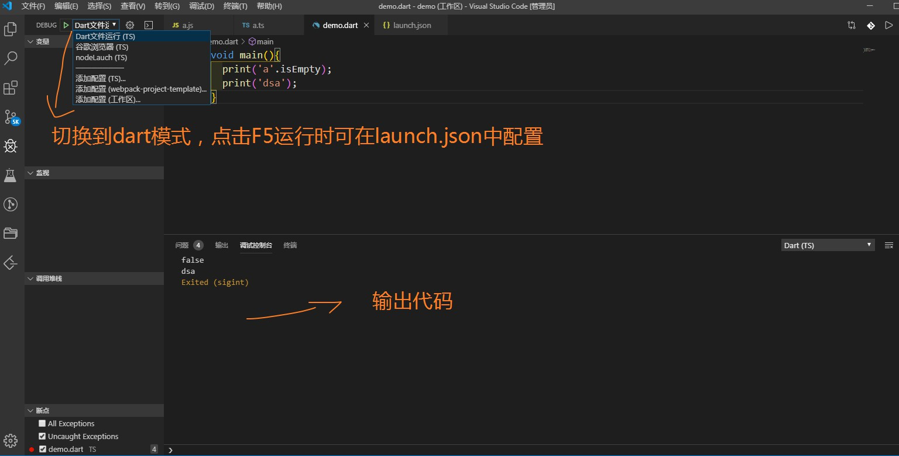

[dart代码-线上运行](https://dartpad.cn/)

[dart-英文](https://dart.dev/guides/language/language-tour)
[dart-中文](https://dartcn.com/guides/language/language-tour)

* <a href="了解Dart">了解Dart</a>
* <a href="变量">变量</a>
* <a href="基本类型">基本类型</a>
* <a href="内建类型">内建类型</a>
  * <a href="Number">Number</a>
  * <a href="String">String</a>
  * <a href="Boolean">Boolean</a>
  * <a href="List">List</a>
  * <a href="Set">Set</a>
  * <a href="Map">Map</a>
  * <a href="Rune">Rune</a>
* <a href="函数">函数</a>
* <a href="类">类</a>
* <a href=""></a>

<a name=""></a>


# [vscode运行dart文件](https://blog.csdn.net/u010351267/article/details/87865318)
[Dart SDK下载--Windows](https://gekorm.com/dart-windows/)  

vscode里安装 code runner插件

右键点击run code或者点击右上角三角按钮。就可以运行当前代码,运行结果会展示在控制台的`输出`一栏

在setting.json文件里，追加 "code-runner.runInTerminal": true,
运行结果会展示在控制台的`终端`一栏

### dart调试

点击F5调试运行，它会弹出launch的配置,添加以下代码：

```json
{
  "version": "0.2.0",
  "configurations": [
    {
      "name": "Dart",
      "program": "${file}",
      "request": "launch",
      "type": "dart"
    }
  ]
}
```
将debug切换为之前在launch.json设定的dart  
运行结果会展示在`调试控制台`一栏


# <a name="了解Dart">了解Dart</a>
Dart 是单线程的  
Dart 属于是强类型语言,dart也支持一些弱类型，Dart 中弱类型有var, Object 以及dynamic


[风格建议指南](https://dartcn.com/guides/language/effective-dart/design#types)

代码必须在`void main(){}`内运行
```dart
void main () {
  print('test');
}
或
main () {
  print('test');
}
```

`每行代码末尾必须加封号(;) 否则直接报错`

Dart是强类型语音，没有隐式转换,判断是否相等时`只有==  没有===`

?? 、??= 属于操作符，如: AA ?? "999" 表示如果 AA 为空，返回999(类似于js的||)；AA ??= "999" 表示如果 AA 为空，给 AA 设置成 999。

控制台打印方法: print()

断言 assert():如果表达式结果为 false ， 则断言失败，并抛出异常.  
>在生产环境代码中 assert() 函数会被忽略，不会被调用。 在开发过程中, assert(condition) 会在非 true 的条件下抛出异常

is判断类型
```dart
print(1 is int); // true
print(1 is Object); // true
print(1.0 is double); // true
print('str' is String); // true
print([] is List); // true
print([] is Object); // true
print({} is Object); // true
```
所有的变量终究是一个对象（一个类的实例）

箭头函数:  
* Dart箭头右侧为()时，只能写一个表达式  
* Dart箭头右侧为{}时，可写多个表达式，以逗号(,)为间隔

### 函数写法
同JS，不过命名函数时，无需加function
* func() {} 
* () => {}  
* () => ()

```dart
printInteger(int val) {
  print(val);
}

var func = (val)=> (print(val));

var func = (val)=> {print(val)};

var func = (val)=> print(val); //只一行表达式可省略括号

// 多行表达式需以逗号隔开
var func = (val)=> {
  (print(val)),
  (print(val))
};

var func = list.map((item)=> {
  print(item),
  print(1)
});
```

以下会报错
```dart

var list1 = list.map((item)=> (print(item),print(1)));;

var list1 = list.map(function(item) {
  print(item)
});
```

# <a name="变量">变量</a>
Dart 属于是强类型语言，也支持一些弱类型如var, Object 以及dynamic 。

var, Object 以及dynamic区别：
* var 初始可定义,初始化确定类型后不可更改类型
* Object 动态任意类型，可以更改类型，编译阶段检查类型  
* dynamic 动态任意类型，可以更改类型，编译阶段不检查类型（被编译后，实际是一个 object 类型），而是在运行期进行类型检查

用 var 来声明变量，Dart 会自推导出数据类型，所以 var 实际上是编译期的“语法糖”。


```dart
var name = 'str'; // 定型为String类型，不可更改
name = 222; //err；
```

```dart
  Object name = 'tom';
  name = 13; // 不会报错，可更改类型
  print(name); // 13
  print(name + 3); // err，不能对对象类进行运算符'+'的操作，编译阶段直接报错
```

```dart
dynamic name = 'tom';
name = 13; // 不会报错，可更改类型
print(name); // 13
print(name + 3); // 16 编译阶段不会检查类型，类型相同，因此不会报错
print(name + 'a'); // err, 编译阶段不会检查类型，运行后，发现不同类型的相加，因此报错了

---

下面代码，对字符串操作List的add方法,如果是var，或Object定义的话，编译阶段就会报错，而dynamic定义时，只在运行时报错

dynamic name = 'tom';
print(name.add(3434));
print(name);
```


显式声明可以推断出的类型：  
`String name = 'str';`  

### Final 和 Const 表示常量
从来不会被修改的变量， 可以使用 final 或 const, 而不是 var 或者其他类型，
Final 变量在初始化后值不变；无法在编译时（运行之前）知道这个变量的值 
Const 变量值在编译时就已经固定
const比final更加严格


```dart
final c = new DateTime.now(); // 在编译时可以不知道他的值
print(c); // 2019-12-19 17:50:19.061015
const d = new DateTime.now(); // 报错, cosnt变量必须在编译时确定其值
```

* Const 关键字不仅可以用于声明常量变量。 还可以用来创建常量值，以及声明创建常量值的构造函数。 任何变量都可以拥有常量值。
```dart
var foo = const [];
final bar = const [];
const baz = []; //此时const可略, 等同于 const baz = const []
```

非 Final ， 非 const 的变量是可以被修改的，即使这些变量 曾经引用过 const 值。  
`foo = [1, 2, 3]; // 曾经引用过 const [] 常量值。`

Const 变量的值不可以修改：  
`baz = [42]; // Error: 常量变量不能赋值修改。`


### 默认值
未初始化的变量默认值是 `null`。即使变量是数字 类型默认值也是 null，因为在 Dart 中一切都是对象，数字类型 也不例外。
```dart
var some;  // null
bool flag;  // null
int number;  // null
String str;  // null
Object obj;  // null
// final namic;  // Error: must be initialized
// const namic;  // Error: must be initialized
```

# <a name="基本类型">基本类型</a>

* 用关键字 is 进行类型判断
```dart
1 is num // true
1 is int // true
1 is double // false
'str' is dynamic // true
'str' is Object // true
'str' is String // true
[] is List // true
{} is Map // true
{} is Set // false 因为先有的 Map 语法，所以 {} 默认是 Map 类型
{1} is Set // true
Symbol('a') is Symbol // true
```

# <a name="内建类型">内建类型</a>
* Number  
* String  
* Boolean  
* List (也被称为 Array)  
* Set  
* Map  
* Symbol  
* Rune (用于在字符串中表示 Unicode 字符)  

所有的变量终究是一个对象（一个类的实例）， 所以变量可以使用 构造涵数 进行初始化

## <a name="Number">Number</a>
### Number 有两种类型:
* int 
>整数值不大于64位， 具体取决于平台。 在 Dart VM 上， 值的范围从 -263 到 263 - 1. Dart 被编译为 JavaScript 时，使用 JavaScript numbers, 值的范围从 -253 到 253 - 1.
* double 
>64位（双精度）浮点数，依据 IEEE 754 标准。

### 方法：
* num.parse()字符串转数字:可能会创建一个整型，否则为浮点型对象：  
* int.parse()字符串转换为整型  
* double.parse()字符串转换为双浮点型对象 

```dart
num.parse('111'); // 111
int.parse('111'); // 111
double.parse('111'); // 111
int.parse('a'); // Uncaught Error: FormatException: a
```

parse通过添加 radix 参数，指定整数的进制基数：
```dart
int.parse('42', radix: 16); // 66
```

## <a name="String">String</a>
### 字符串拼接
* ${expression} 的方式内嵌表达式
```dart
String name = 'Tom';
print('I am ${name}'); // I am Tom
```

* +运算符拼接字符串
```dart
String name = 'Tom';
print('I am ' + name); // I am Tom
```

* \*运算符重复拼接
```dart
'str ' * 3 // 'str str str'
```

* 连续三个单引号或者三个双引号实现多行字符串对象的创建(类似ES6的``)
```dart
String name = 'Tom';
print('''
  I am ${name}
  Nice to meet you
''');
//   
I am Tom
Nice to meet you
```

* r 前缀，可以创建 “原始 raw” 字符串：
```dart
print("I am Tom \n Nice to meet you"); 
// I am Tom 
// Nice to meet you

print(r"I am Tom \n Nice to meet you"); 
// I am Tom \n Nice to meet you

print(r"I am ${name} \n Nice to meet you");
// I am ${name} \n Nice to meet you
```
### 属性
* length 长度  
* isEmpty 检查字符串是否为空  
* isNotEmpty 检查字符串是否不为空  
* codeUnits 获取一个字符串的所有 UTF-16 编码单元，返回数组。

```dart
''.isEmpty; // true
'a'.isNotEmpty // true
''.isNotEmpty // false

'ab'.codeUnits; // [97,98]
'ab'.codeUnits.toList(); // [97,98]
'ab'.codeUnits[0] is int // true ；为数组内容为int类型
```

### 字符串方法
转为字符串
* toString() 转换为字符串类型
```dart
42.5.toString() // '42.5'
42.toString() // '42'
```

* toStringAsFixed 指定小数点后的位数
```dart
123.456.toStringAsFixed(2) // '123.45'
```

* toStringAsPrecision 指定有效数字的位数
```dart
123.456.toStringAsPrecision(2) // '1.2e+2'
```

字符串查找
* indexOf,lastIndexOf 查找字符串的索引
```dart
String str = "aababcc1bc23";
print(str.indexOf("ab"));//1  第一个符合条件的index
print(str.indexOf("ab",2));//3   从index=2开始往后找
print(str.indexOf("ab",4));//-1   从index=4开始往后找，找不到返回-1
print(str.lastIndexOf("bc"));//8  从后往前找   返回第一个符合条件的index
print(str.lastIndexOf("bc",3));//-1  从后往前找  从index=3开始找  返回第一个符合条件的index  找不到返回-1
print(str.lastIndexOf("bc",7));//4  从后往前找  从index=7开始找  返回第一个符合条件的index
```


字符串切割
* substring(start,[end]) 字符串切割(含头不含尾)
>start必须，end可略；取值范围[0,string.length]  
>start必须小于等于end，否则报错  
>start等于end，返回空字符串''  
>'abcd'.substring(1) // 'bcd'
>'abcd'.substring(1,1) // ''

* split(separator) 字符串切割为List;类似于JS数组的split  
>separator为分割符
```dart
'abcd'.split()  // ['a', 'b', 'c', 'd']
'abcd'.split('-') // ['abcd']
'a-bcd'.split('-')  // ['a', 'bcd']
```

字符串替换
* replaceAll 替换全部符合条件的
* replaceFirst 只替换第一个符合条件的
```dart
String str = "abcdeab";
print(str.replaceAll("ab","cc"));//cccdecc  替换全部符合条件的
print(str.replaceFirst("ab", "dd"));//ddcdeab  只替换第一个符合条件的
print(str.replaceFirst("ab", "dd",3));//abcdedd  从index=3开始  替换第一个符合条件的
print(str.replaceRange(1, 3, "z"));// 范围替换 从0-3  含0不含3
print(str.replaceAllMapped("c", (Match match){//abyydeab  用方法返回值替换指定的字符串
  return "yy";
}));
print(str.replaceFirstMapped("b", (Match match){//abcdea333  从index=2开始 用方法返回值替换指定的字符串
  return "333";
},2));
```

大小写转换
* toLowerCase(),toUpperCase() 转换为大小写
```dart
String str = "aaBBCc";
print(str.toLowerCase());//aabbcc
print(str.toUpperCase());//AABBCC
```

补齐长度 剩余位使用指定字符串替换
* padLeft()
* padRight()

```dart
String str = "111";
print(str.padLeft(6));//   111     剩余3个位  默认使用""补齐
print(str.padRight(6,"c"));  //111ccc    剩余3个位   指定使用"c"
print(str.padRight(6,"dd"));  //111dddddd  剩余3个位   每个位指定使用"dd"   替换后总长度不是6
print(str.padLeft(2,"e"));//111    如果指定长度小于原字符串长度   返回原字符串
```

字符串比较
* compareTo()
```dart
String str = "bbcc";
print(str.compareTo("aaa"));//1   在ascii码中 b>a
print(str.compareTo("bbcc"));//0
print(str.compareTo("dd"));//-1    在ascii码中 b<d
```

字符串判断 是否包含或以xxx开始结束等
* contains() 判断一个字符串是否包含另一个字符串
```dart
'abc'.contains('a'); // true
'abc'.contains('q'); // false
'abc'.contains('ab'); // true
```

* startsWith() 判断字符串 是否以xxx开始
```dart
'abcd'.startsWith('a'); // true
'abcd'.startsWith('ab'); // true
'abcd'.startsWith('b'); // false
```

* endsWith() 判断字符串 是否以xxx结束
```dart
'abcd'.endsWith('d'); // true
'abcd'.endsWith('cd'); // true
'abcd'.endsWith('a'); // false
```

去除空格
* trim()
* trimRight()
* trimLeft()

```dart
String str = " aab  bcc ";
print(str);            // aab  bcc 
print(str.trim());     //aab  bcc//去除左右两边空格
print(str.trimRight());// aab  bcc//去除右边空格
print(str.trimLeft()); //aab  bcc //去除左边空格
```

## <a name="Boolean">Boolean</a>
Dart 是强 bool 类型检查，只有bool 类型的值是true 才被认为是true

Dart 下只有 bool 型(true | false)可以用于 if 等判断，不同于JS,在Dart中这种使用方式是不合法的 `if(1){}`

```dart
bool isTrue;
// isTrue = 1; 报错
isTrue = true;

var isTrue = <bool> [];
// isTrue[0] = 1; 报错
isTrue[1] = false;

bool func(bool val){
  print(val);
}
func(true); // true
```

## <a name="List">List</a>
类似于JS的Array

```dart
var list1 = List();// 不限定类型，可添加任意类型的数据
List list2 = List();// 不限定类型，可添加任意类型的数据
List list3 = List(2);//不限定类型，可添加任意类型的数据

var list4 = [1,2,3];//限定了类型，只能是int
var list5 = [2,'3',true];//未限定了类型，任意位置可用任意类型替换
List list6 = ['a',2,'b',false];//未限定了类型，任意位置可用任意类型

list4.add(32); // ok
list4.add('str'); // error
list4[0] = 5; // ok
list4[0] = 'str'; // error
```

限定list类型
```dart
var list1 = <String>['a'];
List list2 = <String>['a'];
List<String> list3 = ['a'];

list1.add('da') // ok
list1.add(11) // err ,只能添加string类型
```

```dart
var arr = []; // []
var arr1 = new List(3); // [null, null, null]
arr1.length; // 3
```

在 List 字面量之前添加 const 关键字，可以定义 List 类型的编译时常量
```dart
var constantList = const [1, 2, 3];
constantList = [1];
print(constantList); // [1]
constantList[1] = 43; // 报错,Unsupported operation: Cannot modify an unmodifiable list
```

### List属性
* length 长度
* isEmpty 是否为空
* isNotEmpty 是否不为空
* reversed 返回倒序的包含列表值的可迭代对象，不改变原List
* first 返回List第一个元素
* last 返回List最后一个元素
* list[index] 查看指定索引的list对应的值

```dart
List<String> list = List();
list.add('aaa');
list.add('bbb');
list.add('ccc');
print(list.length);//3    长度
print(list.isEmpty);//false      是否为空
print(list.isNotEmpty);//true     是否不为空
print(list.reversed);//(ccc, bbb, aaa)      返回一个List的倒序排列的Iterable  不改变原List
print(list.first);//aaa    第一个元素
print(list.last);//ccc    最后一个元素
```
### List方法

#### 
* List.from() 克隆List，浅复制
```dart
List arr = [1,[2]];
List arr1 = List.from(arr);
arr1.add(2);
arr1[1].add(3);
print(arr); // 1, [2, 3]]
print(arr1); // [1, [2, 3], 2]
```

* join() 用指定的字符将List中每个元素都连接起来，返回一个字符串,类似JS数组join
>[1, 2, 3].join(); // '123'  
>[1, 2, 3].join(''); // '123'  
>[1, 2, 3].join('-'); // '1-2-3'

* sublist(start,[end]) 截取list(含头不含尾),返回List形式
>start必须，end可略;取值范围 [0,list.length]  
>start等于end时，返回 []  
>start大于end时，报错  
>[1, 2, 3, 4, 5].sublist(1);// [2, 3, 4, 5]

* getRange(start,end) 截取list(含头不含尾),返回Iterable形式
>start，end都不能省略且取值范围 [0,list.length];  
>start等于end时，返回 ()  
>start大于end时，报错  
>[1, 2, 3, 4, 5].getRange(1,3);// (2, 3)
>[1, 2, 3, 4, 5].getRange(3,3);// ()

* expand() 根据现有的List，指定一个规则，生成一个新的List
```dart
List list = [1, 2, 3, 4, 5];
var list1 = list.expand((item)=>([item+1]));
list1 // (2, 3, 4, 5, 6)

var list2 = list.expand((item)=>([item+1,item/2]));
list2 // (2, 0.5, 3, 1.0, 4, 1.5, 5, 2.0, 6, 2.5)
```

* sort(a,b) 排序 `改变原List，无返回值` ；类似JS数组的sort
```dart
List list = [5, 2, 3, 4, 5];
list.sort((a,b) => (a-b)); // [2, 3, 4, 5, 5] 升序
list.sort((a,b) => (b-a)); // [5, 5, 4, 3, 2] 降序
```

* shuffle() 随机排列 `改变原List，无返回值`
```dart
List list = [1, 2, 3, 4, 5];
list.shuffle(); // [5, 3, 1, 4, 2] 随机排序
```

* toSet() 将List转为Set 去除后面重复的元素
```dart
List list = [1, 2, 3, 4, 5, 1];
var list1 = list.toSet();
list1 // {1, 2, 3, 4, 5}
```

* asMap() 将list转为map
```dart
List list = ['a','b','c',1];
var list1 = list.asMap();
list1 //{0: a, 1: b, 2: c, 3: 1}
```


#### `添加`
* add() 添加到末尾
* addAll(list1) 合并List
* insert(index,val) 插入值到指定索引
* insertAll(index,list1) 插入List到指定索引
* followedBy(list1) 合并List,返回可迭代对象,`不会改变原数组`

代码展示
```dart
List list = [1, 2];

list.add('add'); // [1, 2, 'add']

list.addAll([6, 7, 8]); // [1, 2, 6, 7, 8]

list.insert(0,'insert'); // ['insert', 1, 2]

list.insertAll(0, [6, 7, 8]); // [6, 7, 8, 1, 2]

List list1 = [6, 7, 8];
list.followedBy(list1); // (1, 2, 6, 7, 8)
list.followedBy(list1) is  List ; // false
list // [1, 2]
list1 // [6, 7, 8]

```

#### `删除`
* remove(item) 删除具体的元素(只会移除找到的第一个元素)，成功返回true
* removeAt(index) 删除索引位置的元素,返回被删除的元素
* removeLast() 删除末尾元素,返回被删除的元素
* removeRange(start,end) 范围删除(含头不含尾),`无返回值`
* removeWhere(() => {}) 根据条件删除, `无返回值` (对应retainWhere 根据条件保存)
* clear() 清空List, `无返回值`


代码展示
```dart
List list = [1, 2, 'a', 2];

list.remove(2); // true
list; // [1, 'a', 2]

list.removeAt(2); // 'a'
list; // [1, 2, 2]

list.removeLast(); // 2
list; // [1, 2, 'a']

var list1 = list.removeRange(0,2);
list; // ['a', 2]
// 无法打印 使用removeRange返回的值
list1 // 报错 
---

list.removeWhere( (item) => item == 2);
list // [1, 'a']

list.clear();
list // []
```

#### `修改`
* setRange(start,end,list1) 范围修改List的值(含头不含尾),`无返回值`
  >从list1中取出[start, end)的值替换list对应的值  
  >start等于end，则不改变。 
  >start大于end 报错  
  >start和end任何一个超出list 或 list1的长度, 则报错  

* replaceRange(start,end,list1) 范围修改List的值(含头不含尾),`无返回值`
  >删除[start,end)的值,在start位置添加list1里的值  
  >start等于end，则不会删除`list`值，依旧会添加`list1`值。  
  >start大于end 报错  
  >start和end任何一个超出list的长度, 则报错  

* fillRange(start,end,value) 从[start,end) 每个元素用value替换(含头不含尾)`无返回值`
  >start等于end，则不改变  
  >start大于end 报错  
  >start和end任何一个超出list 或 list1的长度, 则报错 

* retainWhere(()=>{} 根据条件筛选元素`无返回值`

* setAll(index,list1) 从index开始，使用list1内的元素逐个替换list中的元素`无返回值`
  >从指定index位置开始使用list1的值进行替换替换，  
  >index+list1.length必须 <= list.length 否则报错


代码展示
```dart
List list = [1, 2, 3, 4];
List list1 = [6, 7, 8];

list.setRange(1,3,list1); //list里对应的索引的值替换为list1里的
list // [1, 6, 7, 4]

list.replaceRange(1, 3, list1);
list // [1, 6, 7, 8, 4]
List的replaceRange方法类似于JS数组的splice(start, len, arr1)方法(start:开始的索引，len:删除的个数，arr：拼接的数组或字符)
list.splice(1,2,...list1)
list // [1, 6, 7, 8, 4]

list.fillRange(1, 3, 0);
list // [1, 0, 0, 4]
list.fillRange(1, 1, 0);
list // [1, 2, 3, 4]

list.retainWhere( (item) => item > 2);
list // [3, 4]

list.setAll(1,[0,9]);
list // [1, 0, 9, 4]
```

#### `查询`

* indexOf(val, start) 获取指定元素在list中的索引，返回符合的第一个的索引
  >val:查找的值  
  >start:开始位置  
  >[0,1, 2, 3, 4, 1].indexOf(1) // 1

* lastIndexOf(val, start) 从后往前查找,返回符合的第一个的索引
  >val:查找的值  
  >start:开始位置  
  >[0,1, 2, 3, 4, 1].lastIndexOf(1) // 5

* elementAt(index) 获取指定索引位置的元素
  >[0,1, 2, 3, 4, 1].elementAt(2) // 2

* any((item)=>(item == val)) 判断list中是否有`任意一个元素`符合给定的参数,返回boolean;类似于JS的数组some()
  >['a',0,1, 2, 3, 4,1].any((item)=>item == "a") // true
  >['a',0,1, 2, 3, 4,1].any((item)=>item == "ab") // false

* every((item)=>(item == val)) 判断list中是否有`每一个元素`符合给定的参数,返回boolean;类似于JS的数组every()
  >[0,1, 2, 3, 4,1].every((item)=>(item <= 5)) // true
  >[0,1, 2, 3, 4,1].every((item)=>(item >= 1)) // false

* contains(val) 判断List中是否存在给定的val ，返回boolean;类似数组的includes()
  >[0,1,'a'].contains('a') // true
  >[0,1,'a'].contains(4) // false

* firstWhere((item)=>()) 返回第一个满足条件的元素（不是元素的index）;类似于JS的数组find()
  >[0,1,2,3].firstWhere((item) => item > 1) // 2

* indexWhere((item)=>()) 返回第一个满足条件的元素的index;类似于JS的数组findIndex()
  >[0,1,2,3].indexWhere((item) => item > 1) // 2

* lastIndexWhere((item)=>()) 从后向前找 返回第一个满足条件的元素的index
  >[0,1,2,3].lastWhere((item) => item > 1) // 3


#### `遍历 筛选`
* forEach() 遍历,能被return中断,返回List
```dart
List list = [0,1, 2, 3];
list.forEach((item){
  item += 1; // 如此不会改变原list
  // list[0] = item //
  if(item == 2)return item;
  print(item);
  //输出: 1 3 4
});
print(list); //[0,1, 2, 3]
```

* map() 遍历，并做处理，返回一个新的Iterable
```dart
List list = [0,1, 2, 3];
var list1 = list.map((item)=>(item + 1));
print(list); // [0, 1, 2, 3]
print(list1); // (0, 1, 2, 3)
```

* fold(initValue,(prev,next)=>()); 根据现有的List和给定的initValue,指定一个参数函数规则，对List每个元素做操作，并将结果返回。
  >[1, 2, 3].fold(10,(pre,next) => (pre + next)); // 16 理解为10+(1+2+3)

* reduce((prev,next)=>()) 用指定的方法对元素做连续操作，将结果返回,类似上面的fold，不过没有初始值
  >[1, 2, 3].reduce(10,(pre,next) => (pre + next)); // 6 理解为1+2+3

* skip(count)越过count个元素后，开始返回list的Iterable
  >count小于0报错，大于list长度返回()  

  >[1, 2, 3].skip(0); // (1,2,3)  
  >[1, 2, 3].skip(1); // (2,3)  
  >[1, 2, 3].skip(6); // ()  

* skipWhile((item)=>()) 根据参数函数，找到第一个不符合条件的元素，然后将其及其后的元素以Iterable形式返回,如果都符合，返回()  
  >因此返回结果只有两种，要么返回(),要么返回List的Iterable形式
  >[1, 2, 3].skipWhile((item) => (item >= 1); // ()  
  >[1, 2, 3].skipWhile((item) => (item > 1); // (1, 2, 3)

* take(count) 从0开始取count个元素，并返回结果
* takeWhile((e)=>(bool)) 从0开始取，直至第一个不符合函数的元素，将其前面的元素都返回。
* where（(e)=>(bool) 根据指定参数函数筛选每个元素，符合条件的元素组成一个新的Iterable
* singleWhere((e)=>(bool>) 找到那唯一满足条件的元素
* whereType() 从无指定泛型的List中，筛选出指定类型的数据。
* cast() 将List的泛型提升到其父祖类


## <a name="Set">Set</a>

Set 是一个元素唯一且无需的集合。

Set实例：  
var halogens = {'fluorine', 'chlorine', 'bromine', 'iodine', 'astatine'};

var names = {}; // 这样会创建一个 Map ，而不是 Set ;因为先有的 Map 语法，所以 {} 默认是 Map 类型

属性
* length 

方法
* add()
* addAll()  
```dart
Set<String> set1 = {"a","b","c"};
set1.add('o');
set1.addAll(['g','f']);
print(set1); // {a, b, c, o, g, f}
```


## <a name="Map">Map</a>
 Map 是用来关联 keys 和 values 的对象。 keys 和 values 可以是任何类型的对象。在一个 Map 对象中一个 key 只能出现一次

如果 Map 中不包含所要查找的 key，那么 Map 返回 null：
```{"a":1}['c'] // null```

不指定泛型
```dart
var map1 = {'a':'aaa','b':22,'c':true};
Map map2 = {'a':'aaa','b':22,'c':true};
print(map1); // {a: aaa, b: 22, c: true}
print(map1 is Map); // true
print(map2); // {a: aaa, b: 22, c: true}
print(map1 is Map); // true
```

指定泛型
```dart
var map1 = <String,String>{}; // 键，值类型为String
Map<int,String> map2 = new Map(); // 键类型为int，值类型为String
map1[1] = 'a'; // err ;map1的key必须为String类型
map1['1'] = 'a';
map1['2'] = 'b';
map2[1] = 'a';
map2[2] = 'b';
print(map1); //{1: a, 2: b}
print(map2); //{1: a, 2: b}
```

属性
* length
* isEmpty
* isNotEmpty
* keys   键的集合
* values  值的集合
* entries 键值对合集

```dart
Map<String,int> map = {"a":1,"b":2};
print(map.length);//2  长度
print(map.isEmpty);//false   是否为空
print(map.isNotEmpty);//true  是否不为空
print(map.keys);//(a, b)   key的集合
print(map.values);//(1, 2)  value的集合
print(map.entries);//(MapEntry(a: 1), MapEntry(b: 2))   map迭代的键值对集合
```

方法
* map[键名] = 键值  //添加 | 修改
```dart
Map map = {"a":1,"b":2};
map['a'] = 'a';
print(map); // {a: a, b: 2}

map['c'] = 'c';
print(map); // {a: a, b: 2, c: c}
```
* update() 修改
```dart
Map map = {"a":1,"b":2};
map['a'] = 'a';
map.update("a", (value)=>(value*2));
print(map); // {a: aa, b: 2}
```

* updateAll() 批量修改
```dart
Map<String,int> map = {"a":1,"b":2};
map.updateAll((String key,int value){
  return value*2;
});
print(map);//{a: 2, b: 4}
```

* remove() 删除一个key
```dart
Map<String,int> map = {"a":1,"b":2};
map.remove("b");
print(map);//{a: 1}
```

* removeWhere() 根据条件批量删除
```dart
Map<String,int> map = {"a":1,"b":2};
map.removeWhere((key,value)=>(value>1));//删除掉 符合参数函数的键值对
print(map);//{a: 1}
```

* clear() 清空

* containsKey() 是否包含key
```dart
Map<String,int> map = {"a":1,"b":2,"c":3,"d":4,"e":5};
print(map.containsKey("a"));//true
print(map.containsKey("aa"));//false
```

* containsValue() 是否包含value值
```dart
Map<String,int> map = {"a":1,"b":2,"c":3,"d":4,"e":5};
print(map.containsValue(1));//true
print(map.containsValue(999));//false
```

* forEach() 遍历,遍历时，新增或删除当前map的key都会报错,但可修改
```dart
Map<String,int> map = {"a":1,"b":2,"c":3};
map.forEach((String key,int value){
  map["a"] = 4;// ok
  //map["d"] = 4;//  报错
  //map.remove("a");//  报错
  print("$key  $value");
});
print(map); // {a: 4, b: 2, c: 3}
```

* map 遍历,遍历时，新增或删除当前map的key都会报错,但可修改
```dart
Map<String,int> map0 = {"a":1,"b":2,"c":3};
Map<int,String> map1 = map0.map((String key,int value){
  map['b'] = 34;
  return new MapEntry(value, key); // 返回交换key，value后的新map
});
print(map0); // {a: 1, b: 34, c: 3}
print(map1); // {1: a, 34: b, 3: c}
```

* addAll() 合并另一个map ,泛型要一致
  >key不存在时则添加,存在时后者覆盖前者，

```dart
Map<String,int> map1 = {"a":1,"b":2,"c":3};
Map<String,int> map2 = {"a":1,"c":4,"d":7};
map1.addAll(map2);
print(map1);//{a: 1, b: 2, c: 4, d: 7}
```

* addEntries() 合并另一个map ,泛型要一致,类似上面的addAll()
  >key不存在时则添加,存在时后者覆盖前者，

```dart
Map<String,int> map1 = {"a":1,"b":2,"c":3};
Map<String,int> map2 = {"a":1,"c":4,"d":7};
map1.addEntries(map2.entries);
print(map1);//{a: 1, b: 2, c: 4, d: 7}
```

* putIfAbsent() 存在key就获取值，不存在则添加到map 然后返回值
```dart
Map<String,int> map = {"a":1,"b":2,"c":3};

int result = map.putIfAbsent("a", ()=>(2));//存在
print(result);//1   获取key的值
print(map);//{a: 1, b: 2, c: 3}   map不变

int result2 = map.putIfAbsent("d", ()=>(2));//不存在
print(result2);//2   获取新的key的value
print(map);//{a: 1, b: 2, c: 3, d: 2}   map改变
```

* cast() 泛型类型提升为其父祖类
```dart
Map<String,int> map1 = {"a":1,"b":2,"c":3};
Map<Object,Object> map2 = map1.cast();
// 等同于 Map<String,int> map2 = map1;

map2["d"] = 33;
map2["d"] = 'd'; // 报错，value的类型已变为int
print(map2);//{a: 1, b: 2, c: 3, d: 33}
```

## <a name="Rune">Rune</a>
```dart
var clapping = '\u{1f44f}';
print(clapping);
print(clapping.codeUnits);
print(clapping.runes.toList());

Runes input = new Runes('\u2665  \u{1f605}  \u{1f60e}  \u{1f47b}  \u{1f596}  \u{1f44d}');
print(new String.fromCharCodes(input));

//输出
👏
[55357, 56399]
[128079]
♥  😅  😎  👻  🖖  👍
```

# <a name="函数">函数</a>
main特殊函数，是程序的入口
```dart
void main(){
 .....
}

所有函数都有返回值，如果没有显示返回，那么默认return null;

函数声明
```dart
//指定函数返回值 
void test1(){
  print('aa');
}
String test1(){
  return 'a';
}

//指定参数返回值
test2(num a){
  print('bb $a');
}

//不指定返回值
test3(String c){
  return c+c;
}

//箭头函数
test5(int c) => c+5;

```

把函数当参数传递
```dart
//参数中有个类型为函数的参数
void test(Function func,int val){
  func(val); // 调用函数
}

void test1(int a){
  print(a);
}

//将函数传递进去
test(test1,4); // 4

```

# <a name="类">类</a>
Object是所有类的父类。  
Object没有父类。  
一个类只能有一个父类。  
如果一个类没有显示的用extends去继承一个类，那么默认其继承的是Object。

类概述

* 普通类
  * 变量
    * 实例变量（创建对象后，使用 对象.变量名 调用）
    * 静态变量（用static修饰，使用 类名.变量名 调用）
  * 函数
    * 实例函数（创建对象后，使用 对象.函数名 调用）
    * 静态函数（用static修饰，使用 类名.函数名 调用）

  * 构造函数
    * 默认构造函数
    * 自定义构造函数
    * 静态构造函数（使用const修饰的构造函数）
    * 重定向构造函数
    * 工厂构造函数
* 抽象类
  * 变量
    * 实例变量（其子类创建对象后，使用 对象.变量名 调用）
    * 静态变量（用static修饰，使用 类名.变量名 调用）
  * 函数
    * 实例函数（其子类创建对象后，使用 对象.函数名 调用）
    * 静态函数（用static修饰，使用 类名.函数名 调用）
    * 抽象函数（其子类实现该函数，创建对象后，使用对象.函数名 调用）
    * 不能实例化（工厂构造函数除外）。

* new创建类的实例
* 调用实例的属性或函数，使用 . 号
* 级联操作符 .. ， 可以连续调用对象的一些列属性或函数。
```dart
class Point {
  num x;
  num y;
  String func(String str) {
    return str
  }
}

void main() {
  var point = Point();
  point.x = 4;
  print(point.x); // 4
  point
    ..x = 1
    ..y = 123;
  print(point.x); // 1
  print(point.y); // 234
  print(point.func('i am func')); // i am func
}
```