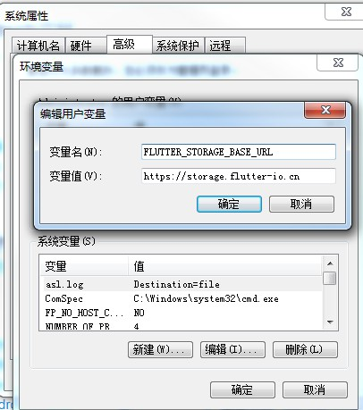
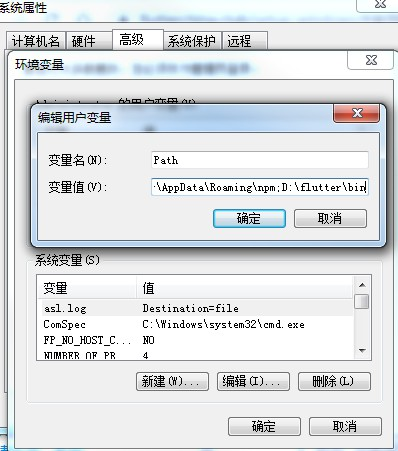

[官网-中文](https://flutterchina.club/get-started/install/)
[官网-英文](https://flutter.dev/docs/get-started/install/)

[Flutter实战](https://book.flutterchina.club/intro.html)

[万字长文轻松彻底入门 Flutter，秒变大前端](https://zhuanlan.zhihu.com/p/90836859)


# 目录
* <a href="搭建Flutter开发环境">搭建Flutter开发环境</a>
* <a href="Flutter项目目录结构">Flutter项目目录结构</a>
* <a href="vscode运行fluter">vscode运行fluter</a>
* <a href="概述">概述</a>
* <a href="基本">基本</a>
* <a href="Widget">Widget</a>
* <a href="布局">布局</a>
* <a href="Flutter for Web开发者">Flutter for Web开发者</a>
* <a href="路由跳转">路由跳转</a>
* <a href="包管理">包管理</a>
* <a href="http请求">http请求</a>
* <a href=""></a>

# <a name=""></a>
# <a name="搭建Flutter开发环境">[搭建Flutter开发环境](https://flutterchina.club/setup-windows/)</a>

* 由于在国内访问Flutter有时可能会受到限制，Flutter官方为中国开发者搭建了临时镜像，大家可以将如下环境变量加入到用户环境变量中：
PUB_HOSTED_URL=https://pub.flutter-io.cn  
FLUTTER_STORAGE_BASE_URL=https://storage.flutter-io.cn



* [Flutter SDK](https://github.com/flutter/flutter/releases)
将安装包zip解压到你想安装Flutter SDK的路径（如：D:\src\flutter；注意，不要将flutter安装到需要一些高权限的路径如C:\Program Files\）。

* 添加环境变量到系统PATH
如果解压的Flutter SDK在D:\flutter文件夹下，则在用户变量的path添加;D:\flutter


* [android-studio安装](https://www.androiddevtools.cn/)
[Java9及更高版本问题](https://blog.csdn.net/jia__/article/details/92620921)

* 添加sdk到系统变量
变量名：ANDROID_HOME   
变量值：C:\Users\Administrator\AppData\Local\Android\sdk

变量Path添加;%ANDROID_HOME%  
%ANDROID_HOME%\platform-tools;%ANDROID_HOME%\tools

* 终端输入：`flutter doctor`查看是否需要安装任何依赖项来完成安装

## 问题

* ANDROID_HOME = xxx but Android SDK not found at this location
更改android SDK路径:
>flutter config --android-sdk "现在的Android SDK 路径"
>如：flutter config --android-sdk "C:\Users\Administrator\AppData\Local\Android\sdk"

* Android license status unknown.
[参考](https://blog.csdn.net/jia__/article/details/92620921)
[参考](https://blog.csdn.net/u013275973/article/details/81134169)


# <a name="Flutter项目目录结构">Flutter项目目录结构</a>
```dart

┬
├ android      - Android部分的工程文件
├ build        - 项目的构建输出目录
├ ios          - iOS部分的工程文件
├ lib          - flutter相关代码，也是Flutter项目源码存放的地方
  ┬
  └ src        - 包含其他源文件
  └ main.dart  - 自动生成的项目入口文件，
├ test         - 测试相关文件
└ pubspec.yaml - 项目依赖配置文件类似于 package.json

```


# <a name="vscode运行fluter">vscode运行fluter</a>
* ctrl + shift + p
* 输入 ‘flutter’, 然后选择 ‘Flutter: New Project’
* 输入 Project 名称 (如myapp), 然后按回车键
* 指定放置项目的位置，然后按蓝色的确定按钮
* 等待项目创建继续，并显示main.dart文件
* f5 运行程序
* 或者终端输入`flutter run`(模拟器必须已运行) ,终端输入`r`热重载,`R`热重启


[flutter 卡在Running Gradle task 'assembleDebug'.](https://www.cnblogs.com/wupeng88/p/11455874.html)
```dart
修改项目中`android/build.gradle`文件 及`Flutter安装目录/packages/flutter_tools/gradle/flutter.gradle`所有的
google()
jcenter()
为
maven { url 'https://maven.aliyun.com/repository/google' }
maven { url 'https://maven.aliyun.com/repository/jcenter' }
maven { url 'http://maven.aliyun.com/nexus/content/groups/public' }
```

## 调试

* f5断点调试  
只需要在 Vscode 上打上一个断点，按 F5 就会停在断点处。通过左边的调试栏，观察断点处的变量以及栈堆情况。

* debugger调试  
debugger代码调试只能运行在开发阶段  
debugger()


* rendering 调试-布局线调试
```dart
import 'package:flutter/rendering.dart';

void main() {
  //开启rendering调试
  debugPaintSizeEnabled = !true;
  runApp(new MyApp());
}

```

* 真机调试  
flutter devices 验证Flutter识别您连接的Android设备。  


# <a name="概述">概述</a>
Flutter是谷歌的移动UI框架，可以快速在iOS和Android上构建高质量的原生用户界面。 
* 具有跨平台开发特性，支持IOS、Android、Web三端。
* 使用Dart语言，目前已经支持同时编译成Web端代码，
* 自绘UI引擎和编译成原生代码的方式，使得系统的运行时的高性能成为了可能

# <a name="基本">基本</a>
Flutter 中主要有：
Widget 、Element 、RenderObject 、Layer 四棵树，它们的作用是：
* Widget ：就是我们平常写的控件，在Flutter中一切都是Widget，它们都是不可变一帧，

* Element ：它是 BuildContext 的实现类，Widget 实现跨帧保存的 state 就是存放在这里，同时它也充当了 Widget 和 RenderObject 之间的桥梁。

* RenderObject ：它才是真正干活（layout、paint）等，同时它才是真实的 “dom” 。

* Layer ：一整块的重绘区域（isRepaintBoundary），决定重绘的影响区域。


# <a name="Widget">Widget</a>
[Widget](https://flutterchina.club/widgets/widgetindex/)

Dart 类build方法返回的便是Widget，`在Flutter中一切都是Widget`，Widget 是一切的基础，利用响应式模式进行渲染。


##  Widget
Widget 分为 有状态 和 无状态 两种

### StatelessWidget 无状态 
继承自Widget类，重写了createElement()方法

自身不保存状态,是不可变的, 这意味着它们的属性不能改变 - 所有的值都是最终的，外部参数变化就销毁重新创建。尽量使用无状态的组件。

它的生命周期相当简单：初始化、通过build()渲染。

无状态变更，UI静态固化的Widget， 页面渲染性能更高。

```dart
class MyHome extends StatelessWidget {
  const MyHome({ Key key }) : super(key: key);

  @override
  Widget build(BuildContext context) {
    return new Container(color: const Color(0xFF2DBD3A));
  }
}
```

### Context
build方法有一个context参数，它是BuildContext类的一个实例，表示当前widget在widget树中的上下文，每一个widget都会对应一个context对象（因为每一个widget都是widget树上的一个节点）

在子树中获取父级widget的一个示例:
```dart
class ContextRoute extends StatelessWidget {
  @override
  Widget build(BuildContext context) {
    return Scaffold(
      appBar: AppBar(
        title: Text("Context测试"),
      ),
      body: Container(
        child: Builder(builder: (context) {
          // 在Widget树中向上查找最近的父级`Scaffold` widget
          Scaffold scaffold = context.ancestorWidgetOfExactType(Scaffold);
          // 直接返回 AppBar的title， 此处实际上是Text("Context测试")
          return (scaffold.appBar as AppBar).title;
        }),
      ),
    );
  }
}
```

### StatefulWidget  
持有的状态可能在widget生命周期中发生变化.

和StatelessWidget一样，StatefulWidget也是继承自Widget类，并重写了createElement()方法，不同的是返回的Element 对象并不相同；另外StatefulWidget类中添加了一个新的接口createState()。

 实现一个 stateful widget 至少需要两个类:
  * 一个 StatefulWidget类。
  * 一个 State类。 StatefulWidget类本身是不变的，但是 State类在widget生命周期中始终存在.

因状态变更可以导致UI变更的的Widget，涉及到数据渲染场景，都使用StatefulWidget。


StatefulWidget生命周期
|生命周期|调用次数|调用时间|
|:--|:--|:--|
| createState| 1| 组件创建时
| initState| 1| 组件创建时
| didChangeDependencies| n| 组件创建或状态发生变化
| build | n| 组件创建或UI重新渲染
| didUpdateWidget| n| 组件创建或UI重新渲染
| deactivate | n |State对象将要移除时
|dispose | 1| state对象被销毁


```dart
class MyHomePage extends StatefulWidget {
  const MyHomePage({ Key key }) : super(key: key);

  @override
  Widget build(BuildContext context) {
    return new Container(color: const Color(0xFFFFE306));
  }
}
```

### State  

定义了StatefulWidget实例的行为，它包含了用于”交互/干预“Widget信息的行为和布局。应用于State的任何更改都会强制重建Widget。

State的生命周期有四种状态：

* created：当State对象被创建时候，State.initState方法会被调用；
* initialized：当State对象被创建，但还没有准备构建时，State.didChangeDependencies在这个时候会被调用；
* ready：State对象已经准备好了构建，State.dispose没有被调用的时候；
* defunct：State.dispose被调用后，State对象不能够被构建。


完整生命周期如下：
* 创建一个State对象时，会调用StatefulWidget.createState；
* 和一个BuildContext相关联，可以认为被加载了（mounted）；
* 调用initState；
* 调用didChangeDependencies；
* 经过上述步骤，State对象被完全的初始化了，调用build；
* 如果有需要，会调用didUpdateWidget；
* 如果处在开发模式，热加载会调用reassemble；
* 如果它的子树（subtree）包含需要被移除的State对象，会调用deactivate；
* 调用dispose,State对象以后都不会被构建；
* 当调用了dispose,State对象处于未加载（unmounted），已经被dispose的State对象没有办法被重新加载（remount）。
```dart
class MyHomePage extends StatefulWidget {
  const MyHomePage({ Key key }) : super(key: key);

  @override
  MyHomePageState createState() => new MyHomePageState();
}

class MyHomePageState extends State<MyHomePage> {
  @override
  Widget build(BuildContext context) {
    return new Container(color: const Color(0xFFFFE306));
  }
}
```

#### 获取State对象
* 通过Context获取

context对象有一个ancestorStateOfType(TypeMatcher)方法，该方法可以从当前节点沿着widget树向上查找指定类型的StatefulWidget对应的State对象
```dart
Scaffold(
  appBar: AppBar(
    title: Text("子树中获取State对象"),
  ),
  body: Center(
    child: Builder(builder: (context) {
      return RaisedButton(
        onPressed: () {
          // 查找父级最近的Scaffold对应的ScaffoldState对象
          ScaffoldState _state = context.ancestorStateOfType(
            TypeMatcher<ScaffoldState>()
          );
          //调用ScaffoldState的showSnackBar来弹出SnackBar
          _state.showSnackBar(
            SnackBar(
              content: Text("我是SnackBar"),
            ),
          );
        },
        child: Text("显示SnackBar"),
      );
    }),
  ),
)
```

* 通用的获取State对象的方法——通过GlobalKey来获取！
```dart
//定义一个globalKey, 由于GlobalKey要保持全局唯一性，我们使用静态变量存储
static GlobalKey<ScaffoldState> _globalKey= GlobalKey();
...
Scaffold(
    key: _globalKey , //设置key
    ...  
)
```

## <a name="布局">布局</a>
Flutter 中拥有需要将近30种内置的 [布局Widget](https://flutterchina.club/widgets/layout/)

Flutter中的边界约束，是指widget可以按照指定限定条件，来决定自身如何占用布局空间。Flutter借鉴了很多React相关的东西，包括一些布局思想，但是它自身没有抽离出布局样式，而是用不同的widget去实现不同的布局，将样式嵌入widget中，用户可以像搭积木一样写布局，写法上跟React很像，只不过没了样式的设定。

这样做的好处，我觉得可能是为了统一的渲染。加入样式，会让布局复杂不少，在渲染层面会降低很多性能。因此，Flutter在大的方向上，加入不同类型的布局widget。在小的方向上，只给出很少的定制化的东西，将布局限定在有限的范围内，在完成布局的同时，让整个渲染能够统一，加快了更新和渲染。

但是，缺点也是同样明显，少了很多灵活性，不同的布局方式都被抽离出了widget，大家需要了解的widget非常多，增加了学习成本。


常用布局

|类型|作用|特点|
|:--|:--|:--|
|Container|一个拥有绘制、定位、调整大小的 widget。默认充满，包含了padding、margin、color、宽高、decoration 等配置。|只有一个子 Widget|
|Padding|给child设置padding。|只有一个子 Widget|
|Align|将其子widget对齐，并可以根据子widget的大小自动调整大小。|只有一个子 widget|
|Center|只用于居中显示，常用于嵌套child，给child设置居中。|只有一个子 Widget|
|Transform|将其子Widget进行转换（rotate,skew...）|只有一个子 Widget|
|Expanded|拓展分配子Widget|只有一个子 Widget|
|Column|垂直布局|有多个子 Widget|
|Row|水平布局|有多个子 Widget|
|Wrap|多行显示其子widget，就像可换行的Row|有多个子 Widget|
|Flex|Flex布局|有多个子 Widget|
|Stack|将其子Widget简单的堆叠在一起,可结合Positioned进行绝对定位|有多个子 Widget|
|ListView|可滚动的列表|有多个子 Widget|


# <a name="Flutter for Web开发者">[Flutter for Web开发者](https://flutterchina.club/web-analogs/)</a>


# <a name="包管理">包管理</a>
Flutter的第三方库文件都在pubspec.yaml文件中，如果要使用某个第三方库，可以打开
[仓库地址](https://pub.dev/)
[仓库地址](https://pub.flutter-io.cn/)进行搜索

打开pubspec.yaml文件，在dependencies下添加包的名称和版本：
```dart
dependencies:
  flutter:
    sdk: flutter

  cupertino_icons: ^0.1.2
  english_words: ^3.1.0
  json_annotation: ^2.0.0
  http: ^0.12.0+2
```
直接保存（ctrl + s）| 点击右上角的Get Packages按钮 | 

# <a name="路由跳转">路由跳转</a>

## MaterialPageRoute构造函数 跳转
MaterialPageRoute继承自PageRoute类，PageRoute类是一个抽象类，表示占有整个屏幕空间的一个模态路由页面，它还定义了路由构建及切换时过渡动画的相关接口及属性。

构造函数:
```dart
MaterialPageRoute({
  WidgetBuilder builder, // 是构建路由页面的具体内容，返回值是一个widget。我们通常要实现此回调，返回新路由的实例。
  RouteSettings settings, // 包含路由的配置信息，如路由名称、是否初始路由（首页）
  bool maintainState = true, // 默认情况下，当入栈一个新路由时，原来的路由仍然会被保存在内存中，如果想在路由没用的时候释放其所占用的所有资源，可以设置maintainState为false。
  bool fullscreenDialog = false, // 表示新的路由页面是否是一个全屏的模态对话框，在iOS中，如果fullscreenDialog为true，新页面将会从屏幕底部滑入（而不是水平方向）。
})
```

## Navigator 跳转  
Navigator是一个路由管理的widget，它通过一个栈来管理一个路由widget集合。通常，当前屏幕显示的页面就是栈顶的路由。Navigator提供了一系列方法来管理路由栈，我们可以使用 push 和 pop 两个操作来进行页面的入栈和出栈。

### push 打开新的页面

返回值是一个Future对象，用以接收新路由出栈（即关闭）时的返回数据。

主要使用两个方法：   
* 直接 push 一个路由，  
* pushNamed 一个命名路由地址(需要将路由注册到路由表中)


```dart
//不传值跳转
Navigator.of(context).push(MaterialPageRoute(builder: (context) => PageA()));
Navigator.push(context,MaterialPageRoute(builder: (context) => PageA()));

//传值跳转
Navigator.of(context).push(MaterialPageRoute(builder: (context) => PageA(para: '你好',)));

//
Navigator.push(context,MaterialPageRoute(builder: (context) => PageA()),).then((data){
  //接受返回的参数
  print(data.toString());
};

或：
Navigator.pushNamed(context, '/route1')

//这里的ListPage为路由名 ,需要将路由注册到路由表中 
Navigator.of(context)
  .pushNamed(
    '/route1',
    arguments: {
      "name": 'hello'
    }
	).then((data){
  	//接受返回的参数
  	print(data.toString());
	};
```

跳转其他页面不返回(从路由栈中移除本页面)
```dart
//第一种
替换跳转路由
Navigator.of(context).pushReplacementNamed("/login");

//第二种
跳转到根路由
Navigator.pushAndRemoveUntil( context, new MaterialPageRoute(builder: (context) => new Page()),(route) => route == null,);

//第三种
Navigator.of(context).pushNamedAndRemoveUntil("/login", (Route<dynamic> route) => false);

```


### pop 返回给上一个页面
```dart
//返回上一页
Navigator.of(context).pop();  //可以传递参数
```

### 命名路由
给路由起一个名字，然后可以通过路由名字直接打开新的路由 

路由名称按惯例使用类似路径的结构，应用程序的主页路由默认为“/”，例如，'/ home' 表示 HomeScreen， '/ login' 表示 LoginScreen。

```dart
//路由表的定义
Map<String, WidgetBuilder> routes = {
  '/a': (BuildContext context) => MyPage(title: 'A 页面'),
  '/b': (BuildContext context) => MyPage(title: 'B 页面'),
  '/c': (BuildContext context) => MyPage(title: 'C 页面')
};

class MyApp extends StatelessWidget {
  @override
  Widget build(BuildContext context) {
    return  MaterialApp(
      title: 'Flutter Demo',
      home:  MyHomePage(title: '应用程序首页'),
      routes: routes,//注册路由表
    );
  }
}

```

命名路由传参
```dart
//注册路由
routes:{
  "/new_page":(context)=>EchoRoute(),
} ,
//在路由页通过RouteSetting对象获取路由参数
class EchoRoute extends StatelessWidget {
  @override
  Widget build(BuildContext context) {
    //获取路由参数  
    var args=ModalRoute.of(context).settings.arguments
    //...省略无关代码
  }
}

在打开路由时传递参数
Navigator.of(context).pushNamed("/new_page", arguments: "hi");

```


# <a name="http请求">http请求</a>
https://juejin.im/post/5d4186b0f265da03c34bd9e7

httpClient在 dart:io库中，不需要引入第三方库就可以使用，示例代码如下：

使用示例
```dart
import 'dart:convert';
import 'dart:io';

Future _getByHttpClient() async{
  //接口地址
  const url="https://www.demo.com/api";

  //定义httpClient
  HttpClient client = new HttpClient();
  //定义request
  HttpClientRequest request = await client.getUrl(Uri.parse(url));
  //定义reponse
  HttpClientResponse response = await request.close();
  //respinse返回的数据，是字符串
  String responseBody = await response.transform(utf8.decoder).join();
  //关闭httpClient
  client.close();
  //字符串需要转化为JSON
  var json= jsonDecode(responseBody);
  return json;
} 
```

第三方库
* [http](https://pub.dev/packages/http)
* [Dio](https://pub.flutter-io.cn/packages/dio)

# 使用的第三方包

[fluttertoast](https://pub.dev/packages/fluttertoast#-readme-tab-)--弹窗  

[loading](https://pub.dev/packages/modal_progress_hud) --进行网络请求等操作时的loading状态  

[网络图片处理](https://pub.dev/packages/cached_network_image) --缓存网络图片,且带有loading的placeholder

[下拉刷新及上拉加载 ](https://pub.dev/packages/flutter_easyrefresh)

# 创建可重用组件
```dart
// Flutter
class CustomCard extends StatelessWidget {
  CustomCard({@required this.index, @required this.onPress});

  final index;
  final Function onPress;

  @override
  Widget build(BuildContext context) {
    return Card(
      child: Column(
        children: <Widget>[
          Text('Card $index'),
          FlatButton(
            child: const Text('Press'),
            onPressed: this.onPress,
          ),
        ],
      )
    );
  }
}


// 使用
CustomCard(
  index: index,
  onPress: () { 
    print('Card $index');
  },
)
```