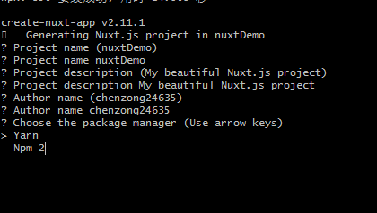

# 链接
[git-官网文档](https://git-scm.com/book/zh/v2)

[Git飞行规则-问题指南](https://github.com/k88hudson/git-flight-rules/blob/master/README_zh-CN.md)

[git学习](https://learngitbranching.js.org/?demo)

[猴子都能懂的git入门](https://backlog.com/git-tutorial/cn/contents/)

  
目录

* <a href="#vscode-sync-setting">vscode-sync-setting</a>
* <a href="#创建项目提交到仓库">创建项目提交到仓库</a>
* <a href="#将本地代码文件夹作为新分支添加到远程仓库">将本地代码文件夹作为新分支添加到远程仓库</a>
* <a href="#git基本命令">git基本命令</a>
* <a href="#gitingore">忽略某些文件提交 gitingore</a>
* <a href="#帐号设置">帐号设置</a>
  * <a href="#设置查看用户名、邮箱">设置查看用户名、邮箱</a>
  * <a href="#重设用户名、邮箱">重设用户名、邮箱</a>
  * <a href="#本地永久保存账号密码">本地永久保存账号密码</a>
  * <a href="#删除或修改本地保存的账号密码">删除或修改本地保存的账号密码</a>
* <a href="#md添加图片">md添加图片</a>
* <a href="#预览html文件">如何在github的markdown上预览html文件</a>
* <a href="#git文件名大小写重命名">git文件名大小写重命名（git大小写敏感/默认不敏感），如何重命名并提交</a>
* <a href="#执行rm -r操作后想恢复文件">执行rm -r操作后想恢复文件</a>
* <a href="#vue-cli项目创建时，git bash箭头选择无效问题">vue-cli项目创建时，git bash箭头选择无效问题</a>
* <a href="#gist.github.com无法访问">gist.github.com无法访问</a>

# 
# <a name="vscode-sync-setting">vscode-sync-setting</a>
>

    token: bb7d41e1e039fdd294a6819e7305b73bd066d9a1
    sync.gist: 0e3b4eb383f938cbacac6b443dd818a0

    Gist ID:372add5a8785e01a4c7850cadd69314f。

# <a name="创建项目提交到仓库">创建项目提交到仓库</a>
>
    git init 
    touch README.md
    git add README.md
    git commit -m "first commit"
    git remote add origin https://github.com/chenzong24635/仓库名.git   //关联远程仓库
    //,若报错: remote origin already exists. 先运行  git remote rm origin  	  
    git push -u origin master  //提交到你的仓库

    或者git push --force --set-upstream origin master // 强制替换所有内容

# <a name="将本地代码文件夹作为新分支添加到远程仓库">将本地代码文件夹作为新分支添加到远程仓库</a>
>
    git init 
    git add .  // 将文件添加到暂存区
    git commit -m 'newbranch first push' // 将暂存区文件提交到仓库
    git checkout -b <新分支名> // 新建分支并切换到该分支
    git remote add origin <仓库地址>  // 关联远程仓库
      >git remote -v  // 查看已关联的远程仓库
    git push --set-upstream origin <新分支名> // 推送当前分支并将远程设置为上游

# <a name="git基本命令">git基本命令</a>
npm i git //git安装

## TortoiseGit--git命令快捷工具
[安装及汉化](https://tortoisegit.org/download/)

[putty密钥生成](https://jingyan.baidu.com/article/495ba841f2892638b30edefa.html)

## 命令

* git init  //初始化git 将当前目录变为仓库

`克隆远程分支`
* git clone \<url> //克隆项目(默认master)
* git clone -b \<分支名> \<url> \<本地文件夹名> // 克隆项目某个的分支
  >
      git clone <url> // 克隆项目（master）
      git branch -a // 查看所有分支
      git checkout -b <分支名> origin/<分支名>  // 克隆分支项目,并切换到该分支  

`git add 添加文件到暂缓区`
* git add ./fileName | .  //将文件添加到暂存区（添加某个文件 | 添加所有）

`git commit 提交暂存区文件`
* git commit  -m "备注内容"  //将暂存区文件提交到当前分支
* git commit  -a -m "备注内容"  //git add + git commit
* git commit --amend  // 将暂存区中的文件提交

`git pull 拉取`
* git pull origin  //从远程获取最新版本到本地，并自动merge
  >相当于git fetch + git merge

`git fetch 拉取`
* git fetch origin  //从远程获取最新版本到本地，不会自动merge

`git push 更新到服务器`
* git push origin  //更新到服务器(当前分支)
  >git push origin \<branchName> //更新到分支
* git push -u origin master  //提交到远端仓库 第一次 以后用：git push origin master

`撤销修改`
* git reset HEAD \<fileName> | . // 把暂存区的修改撤销掉，重新放回工作区

* git checkout -- \<fileName> | . // 撤销文件的修改
  >一种是文件修改后还没有被放到暂存区，现在，撤销修改就回到和版本库一模一样的状态；  
  >一种是文件已经添加到暂存区后，又作了修改，现在，撤销修改就回到添加到暂存区后的状态。  
  >总之，就是让这个文件回到最近一次git commit或git add时的状态。

`git rm 删除文件`
* git rm -r fileName //删除本地文件/文件夹
* git rm -r --cached fileName //删除缓存文件/文件夹；(但仍保留在工作区中),(git push origin 后就能删除仓库文件)
>git rm -r --cached .  //删除所有缓存文件

`文件重命名`
* git mv \<oldName> \<newName>  //文件改名

`git remote 远程仓库`
* git remote // 查看你已经配置的远程仓库服务器
  * git remote -v  //查看已关联远端库
  * git remote add origin http://github.com/chenzong24635/仓库名.git //添加远端仓库关联
  * git remote rm origin  //删除远端仓库关联
  * git remote rename origin newOrigin  // 修改远程仓库的简写名

`git branch 分支`
* git branch //查看当前所有分支  
* git branch -v //查看当前所有分支及其最后一次提交  
* git branch --all //查看所有分支(本地+远程) (简：git branch -a)  
* git branch \<branchName>  //创建分支  
* git branch -d \<branchName>  //删除分支  
* git push origin --delete \<branchName>  //删除远程分支  
* git checkout \<branchName> | git switch \<branchName> //切换分支  
* git checkout -b \<branchName> | git switch -c \<branchName> //创建 + 切换分支  
* git merge \<branchName>  //合并某分支到当前分支  
* git branch --merged  // 查看哪些分支已经合并到当前分支  
* git branch --no-merged  // 查看哪些分支尚未合并到当前分支  
* git checkout branch -- file  //将你的某个文件还原到某个分支的版本
* git branch --set-upstream-to \<branchName> origin/\<branchName>  //建立本地分支和远程分支的关联

`git tag 标签` 给历史中的某一个提交打上标签,常使用其来标记发布结点（v1.0 等等） 
* git tag // 列出已有的标签

* git show \<tagName> // 查看标签信息与对应的提交信息
  >输出显示了打标签者的信息、打标签的日期时间、附注信息，然后显示具体的提交信息。

* git tag v1.4 // 添加标签(轻量标签)
  >本质上是将提交校验和存储到一个文件中——没有保存任何其他信息。 不需要使用 -a、-s 或 -m 选项

*  git tag -a v1.4 -m "my version 1.4" // 添加带有说明的标签  
   >-a指定标签名  
   >-m指定说明的信息。如果没有，Git 会运行编辑器要求你输入信息

* git tag -d \<tagName> // 删除本地仓库上标签
  >创建的标签都只存储在本地，不会自动推送到远程。所以，打错的标签可以在本地安全删除
  >如果要推送某个标签到远程，使用命令git push origin \<tagName>

* git push origin :refs/tags/\<tagName> // 删除远程标签
  >需先删除本地：git tag -d \<tagName>

* git push origin --tags // 推送所有本地标签到远程

`git status 查看文件状态`
* git status  //查看文件状态
* git status -s // 查看文件状态---紧凑的格式输出
  >
      M fileName  //在工作区被修改 ,但是还没放入暂存区
      M  fileName  //在工作区被修改 ,已经放入暂存区
      MM fileName  //在工作区被修改 ,并提交到暂存区后又在工作区中被修改了
      A  fileName  //新添加到暂存区中的文件前面
      ?? fileName  //新添加的未跟踪文件

`git diff 查看修改`  
* git diff //查看修改之后还没有暂存起来的变化内容
  >git diff \<fileName> // 查看文件修改内容
* git diff --cached //查看已暂存的将要添加到下次提交里的内容

`git log 查看记录`
* git log   //查看提交记录
* git log -p -2 // -p显示每次提交的内容差异。-2 仅显示最近两次提交
* git reflog 可以查看所有分支的所有操作记录（包括（包括commit和reset的操作），包括已经被删除的commit记录，git log则不能察看已经删除了的commit记录

`git reset 版本回退`
* git reset --hard HEAD^  //回退到上一个版本  
* git reset --hard \<commitId>  //回退某个指定版本  
  >HEAD表示当前版本，也就是最新的提交，上一个版本就是HEAD^，上上一个版本就是HEAD^^，当然往上100个版本写100个^比较容易数不过来，所以写成HEAD~100。  
  >commitId(版本号)可通过git log查看

`多人协作的工作模式`

首先，可以试图用git push origin \<branchName>推送自己的修改；

如果推送失败，则因为远程分支比你的本地更新，需要先用git pull试图合并；

如果合并有冲突，则解决冲突，并在本地提交；

没有冲突或者解决掉冲突后，再用git push origin \<branchName>推送就能成功！

如果git pull提示no tracking information，则说明本地分支和远程分支的链接关系没有创建，用命令git branch --set-upstream-to \<branchName> origin/\<branchName>

`配置别名 `  
* git config --global alias.\<别名> \<原名>

  配置git status别名为 git st
  >git config --global alias.st status

`让Git显示颜色`   
* git config --global color.ui true

`退出vim编辑器：ESC + ZZ`

# <a name="gitingore">忽略某些文件提交 gitingore</a>
* touch .gitignore 添加 gitignore文件

* git check-ignore // 检查.gitignore书写规则是否有问题  

* 配置语法
>   
    所有空行或者以＃开头的行都会被Git忽略(注释)
    以斜杠"/"开头表示目录；
    以星号"*"通配多个字符；
    以问号"?"通配单个字符
    以方括号"[]"包含单个字符的匹配列表；
    以叹号"!"表示追踪（不过滤）匹配到的文件或目录。

注意： git 对于 .gitignore配置文件是按行从上到下进行规则匹配的

>
    /mtk    过滤整个文件夹
    /mtk1/do.c   过滤某个具体文件
    !/mtk/one.txt   追踪（不过滤）某个具体文件
    *.zip   过滤所有.zip文件
    使用两个星号（*) 表示匹配任意中间目录，比如 a/**/z 可以匹配 a/z , a/b/z 或 a/b/c/z 等。

注意：如果你创建.gitignore文件之前就push了某一文件，那么即使你在.gitignore文件中写入过滤该文件的规则，该规则也不会起作用，git仍然会对该文件进行版本管理。

# <a name="帐号设置">帐号设置</a>
## <a name="设置查看用户名、邮箱">设置查看用户名、邮箱</a>
设置
>

    git config --global user.name "chenzong24635"
    git config --global user.email "chenzong24635@163.com"

查看
>
    git config --list  //查看所有配置信息
    git config user.name // 查看用户名
    git config user.email // 查看用户邮箱

## <a name="重设用户名、邮箱">重设用户名、邮箱</a>
>

    git config --global user.name "chenzong24635"
    git config --global user.email ""chenzong24635@163.com"
    删除.ssh文件夹下的known_hosts 
    git Bash下生成ssh，如不设密码，直接回车到底 
    $ ssh-keygen -t rsa -C "chenzong24635@163.com"
    拷贝公钥id_rsa.pub到托管服务（github, gitee）的SSH 公钥设置中 
    git Bash执行（管理员身份） 
    ssh -T git@github.com 或 ssh -T git@gitee.com 

## <a name="本地永久保存账号密码">本地永久保存账号密码</a>
1.   
>
    git config --global credential.helper store

2. 
>
    C:\Users\Administator目录下生成 .gitconfig配置文件。添加：
    [user]
      name = chenzong24635  //你的用户名
      email = chenzong24635@163.com  //你的git邮箱账号
    [credential]
        helper = stor

## <a name="删除或修改本地保存的账号密码">删除或修改本地保存的账号密码</a>
控制面板 -->用户账户 -->管理你的凭据 -->择Windows凭据 -->git保存的用户信息

# <a name="md添加图片">md添加图片</a>
    
    

    图片水平排列居中
    

      
      
      
    

# <a name="预览html文件">如何在github的markdown上预览html文件</a>    
>
    直接在你github地址中的html文件前面加上http://htmlpreview.github.com/?

    http://htmlpreview.github.io/?https://github.com/chenzong24635/Notes/blob/master/文件名.html

# <a name="git文件名大小写重命名">git文件名大小写重命名（git大小写敏感/默认不敏感），如何重命名并提交</a>    
git config core.ignorecase true | false //配置git 使其对文件名大小写是否敏感
>
    git rm -r --cached a.md
    git add A.md
    git commit -m '文件重命名'
    git push

>

    git config core.ignorecase false  //提交后会导致github上存在一份大写的和一份小写的文件夹。
    git rm -r --cached .  //删除本地所有缓存(注意后面‘点号’)
    git push

# <a name="执行rm -r操作后想恢复文件">执行rm -r操作后想恢复文件</a>
在未commit前，执行rm -r操作后，恢复未commit的文件
>
    git reset 
    git checkout filename

# <a name="vue-cli项目创建时，git bash箭头选择无效问题">vue-cli项目创建时，git bash箭头选择无效问题</a>
>
    选择git的安装目录，进入etc文件夹 找到bash.bashrc文件

    文件末未添加 ：
    alias vue='winpty vue.cmd'
    
    重启git bash 即可
>
    之前使用vue create hello-world 现在应该改成输入 winpty vue.cmd create hello-world，这样你的上下键就可以进行选择啦，
    
  
使用数字键盘进行选择对应的选项值

# <a name="gist.github.com无法访问">gist.github.com无法访问</a>
>
    打开C:\Windows\System32\drivers\etc\hosts文件

    编辑器打开，在最后行添加192.30.253.118 gist.github.com

    保存即可。
