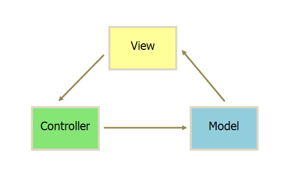
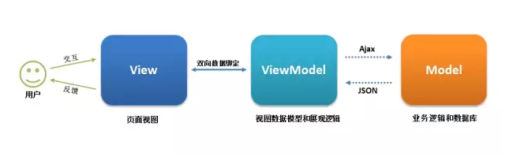
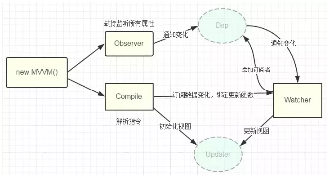

[Vue官网](http://doc.vue-js.com/v2/guide/)

[Vue.js 技术揭秘](https://ustbhuangyi.github.io/vue-analysis/prepare/flow.html)

[Vue资源精选(组件、插件...)](http://vue.awesometiny.com/)

# <a name="vue-element-admin">vue-element-admin</a>
后台页面模板，基于 vue 和 element-ui实现

[vue-element-admin](https://panjiachen.github.io/vue-element-admin-site/zh/guide/)

[手摸手，带你用vue撸后台](https://juejin.im/post/59097cd7a22b9d0065fb61d2)

#

  

    目录
  

 
* <a href="#MVC、MVP、MVVM">MVC、MVP、MVVM</a>
* <a href="#SPA">SPA SSR</a>
* <a href="#双向数据绑定原理、实现">双向数据绑定原理、实现:Object.defineProperty、proxy</a>
* <a href="#单向数据流">单向数据流</a>
* <a href="#组件生命周期">组件生命周期</a>
* <a href="#监听组件的生命周期">监听组件的生命周期</a>
* <a href="#组件销毁时，清除定时器">组件销毁时，清除定时器</a>
* <a href="#computed watch methods">computed watch methods</a>
* <a href="#解决对象新增属性不能响应的问题"> vm.$set() 解决对象新增属性不能响应的问题</a>
* <a href="#Vue检测数组的变动">Vue检测数组的变动</a>
* <a href="#组件中 data 为什么是一个函数">组件中 data 为什么是一个函数</a>
* <a href="#样式绑定">样式绑定：class、style</a>
* <a href="#v-if和v-show 的区别">v-if和v-show 的区别</a>
* <a href="#v-for 遍历避免同时使用 v-if">v-for 遍历避免同时使用 v-if</a>
* <a href="#slot">slot插槽</a>
* <a href="#组件中key作用">组件中key作用</a>
* <a href="#虚拟DOM">虚拟DOM</a>
* <a href="#Vue的运行机制简述">Vue的运行机制简述</a>
* <a href="#Vue的数据为什么频繁变化但只会更新一次">Vue的数据为什么频繁变化但只会更新一次</a>
* <a href="#$nextTick">$nextTick</a>
* <a href="#页面滚动">页面滚动</a>
* <a href="#keep-alive">keep-alive</a>
* <a href="#路由vue-router">路由vue-router</a>
  * <a href="#base">base</a>
  * <a href="#this.$route 和 this.$router区别">this.$route 和 this.$router区别</a>
  * <a href="#push(),replace(),go()">push(),replace(),go()</a>
  * <a href="#页面跳转方法">页面跳转方法</a>
  * <a href="#页面url参数获取">页面url参数获取</a>
  * <a href="#导航守卫">导航守卫</a>
  * <a href="#多个路由共用一个页面操作">多个路由共用一个页面操作</a>
  * <a href="#单页面多路由区域操作">单页面多路由区域操作</a>
  * <a href="#刷新当前路由方法">刷新当前路由方法</a>
  * <a href="#mode">mode: hash | history区别</a>
  * <a href="#切换页面时自动滚动到顶部">切换页面时自动滚动到顶部</a>
  * <a href="#设置页面title">设置页面title</a>
* <a href="#路由权限">路由权限</a>
* <a href="#vuex">vuex</a>
* <a href="#组件通信方法">组件通信方法</a>

* <a href="#axios、api 设计">axios、api 设计</a>
* <a href="#token验证">如何添加token验证</a>
* <a href="#vue项目性能优化">vue项目性能优化</a>
  * <a href="#事件的销毁">事件的销毁</a>
  * <a href="#图片资源懒加载">图片资源懒加载</a>
  * <a href="#路由懒加载">路由懒加载</a>
  * 

* <a href="#vue-cli2快速创建项目">vue-cli2快速创建项目</a>
* <a href="#vue-cli3配置">vue-cli3配置</a>

* <a href="#静态资源处理">静态资源处理：图片等</a>
* <a href="#打包">打包时常见问题及解决</a>

* <a href="#插件">插件</a>

* <a href="#其他">其他</a>
  * <a href="#rem">rem</a>
  * 

# <a name="MVC、MVP、MVVM">MVC、MVP、MVVM</a>
[MVC、MVP、MVVM三种区别及适用场合](https://blog.csdn.net/victoryzn/article/details/78392128)

[MVC,MVP,MVVM浅析](https://segmentfault.com/a/1190000006840458)

### MVC(Model-view-Controller)

* View（视图）：检测用户的键盘、鼠标等行为，传递调用Controller执行应用逻辑。View更新需要重新获取Model的数据。  
* Controller（控制器）：View和Model之间协作的应用逻辑或业务逻辑处理。
* Model（模型）：Model变更后，通过观察者模式通知View更新视图。

### MVP(Model-View-Presenter)

>

    Presenter: 负责完成View于Model间的交互和业务逻辑

>

    各部分之间的通信，都是双向的。

    View 与 Model 不发生联系，都通过 Presenter 传递。

    View 非常薄，不部署任何业务逻辑，称为"被动视图"（Passive View），即没有任何主动性，而 Presenter非常厚，所有逻辑都部署在那里。

### MVVM(Model-View-ViewModel)

>
    View: 代表视图层，负责将数据模型渲染到页面上 ;也就是用户界面。前端主要由 HTML 和 CSS 来构建 。

    ViewModel:通过双向绑定把View和Model进行同步交互，不需要手动操作DOM的一种设计思想。前端开发者对从后端获取的 Model 数据进行转换处理，做二次封装，以生成符合 View 层使用预期的视图数据模型

    Model:代表数据模型，泛指后端进行的各种业务逻辑处理和数据操控，对于前端来说就是后端提供的 api 接口。

View 和 Model 之间并没有直接的联系，而是通过ViewModel进行交互，Model 和 ViewModel 之间的交互是双向的， 因此View 数据的变化会同步到Model中，而Model 数据的变化也会立即反应到View 上。

MVVM主要通过数据来显示视图层而不是操作节点，解决了MVC中大量的DOM操作使页面渲染性能降低，加载速度慢，影响用户体验问题。主要用于数据操作比较多的场景

MVVM优点:
>

    低耦合。视图（View）可以独立于Model变化和修改，一个ViewModel可以绑定到不同的"View"上，当View变化的时候Model可以不变，当Model变化的时候View也可以不变。

    可重用性。你可以把一些视图逻辑放在一个ViewModel里面，让很多view重用这段视图逻辑。

    独立开发。开发人员可以专注于业务逻辑和数据的开发（ViewModel），设计人员可以专注于页面设计。

    可测试。界面素来是比较难于测试的，而现在测试可以针对ViewModel来写。

# <a name="SPA">SPA SSR</a>  
### SPA
>
    SPA（ single-page application ）仅在 Web 页面初始化时加载相应的 HTML、JavaScript 和 CSS。一旦页面加载完成，SPA 不会因为用户的操作而进行页面的重新加载或跳转；取而代之的是利用路由机制实现 HTML 内容的变换，UI 与用户的交互，避免页面的重新加载。

* 优点：
>
    用户体验好、快，内容的改变不需要重新加载整个页面，避免了不必要的跳转和重复渲染；

    一定程度上减少了后端服务器的压力（不用管页面逻辑和渲染）；

    前后端职责分离，架构清晰，前端进行交互逻辑，后端负责数据处理；

* 缺点：
>
    初次加载耗时多：为实现单页 Web 应用功能及显示效果，需要在加载页面的时候将 JavaScript、CSS 统一加载，部分页面按需加载；

    前进后退路由管理：由于单页应用在一个页面中显示所有的内容，所以不能使用浏览器的前进后退功能，所有的页面切换需要自己建立堆栈管理；

    SEO 难度较大：由于所有的内容都在一个页面中动态替换显示，所以在 SEO 上其有着天然的弱势。

* 常见框架
>
    AngularJS
    React
    Vue.js

### SSR
>
    SSR是 Server-Side Rendering(服务器端渲染)的缩写，

    在普通的SPA中，一般是将框架及网站页面代码发送到浏览器，然后在浏览器中生成和操作DOM（这里也是第一次访问SPA网站在同等带宽及网络延迟下比传统的在后端生成HTML发送到浏览器要更慢的主要原因），  
    可以将SPA应用打包到服务器上，在服务器上渲染出HTML，发送到浏览器，这样的HTML页面还不具备交互能力，所以还需要与SPA框架配合，在浏览器上“混合”成可交互的应用程序。所以，只要能合理地运用SSR技术，不仅能一定程度上解决首屏慢的问题，还能获得更好的SEO。

* SSR的优点
>
    更快的响应时间，不用等待所有的JS都下载完成，浏览器便能显示比较完整的页面了。

    更好的SEO，我们可以将SEO的关键信息直接在后台就渲染成HTML，而保证搜索引擎的爬虫都能爬取到关键数据。

* SSR缺点
>
    相对于仅仅需要提供静态文件的服务器，SSR中使用的渲染程序自然会占用更多的CPU和内存资源

    一些常用的浏览器API可能无法正常使用，比如window、docment和alert等，如果使用的话需要对运行的环境加以判断

    服务端渲染只支持 beforCreate 和 created 两个钩子函数

    开发调试会有一些麻烦，因为涉及了浏览器及服务器，对于SPA的一些组件的生命周期的管理会变得复杂

    可能会由于某些因素导致服务器端渲染的结果与浏览器端的结果不一致

* SSR常用框架

Vue.js 的 [Nuxt](https://nuxtjs.org/guide/installation)  
React 的 [Next](https://nextjs.org/)

# <a name="双向数据绑定原理、实现">双向数据绑定原理、实现:Object.defineProperty、proxy</a>  
[Vue 核心之数据双向绑定](https://juejin.im/post/5d421bcf6fb9a06af23853f1#comment)

[深入浅出Vue响应式原理](https://juejin.im/post/5d229bfc5188252d707f3ac6)

Vue 数据双向绑定主要是指：数据变化更新视图，视图变化更新数据

Vue2 采用数据劫持结合发布—订阅模式的方法，通过 Object.defineProperty() 来劫持各个属性的 setter，getter，在数据变动时发布消息给订阅者，触发相应的监听回调,实现数据双向绑定

Object.defineProperty无法监控到数组下标的变化，导致直接通过数组的下标给数组设置值，不能实时响应。 为了解决这个问题，经过vue内部处理后可以使用以下几种方法来监听数组
>
    push()
    pop()
    shift()
    unshift()
    splice()
    sort()
    reverse()

Vue3 则使用 Proxy

### 区别：
>
    Object.definedProperty 的作用是劫持一个对象的属性，劫持属性的getter和setter方法，在对象的属性发生变化时进行特定的操作。而 Proxy 劫持的是整个对象。

    Proxy 可以直接监听对象而非属性,以直接监听数组的变化；

    Proxy 的第二个参数可以有 13 种拦截方法，比起 Object.defineProperty() 要更加丰富

    Object.definedProperty 不支持数组，更准确的说是不支持数组的各种API，因为如果仅仅考虑arry[i] = value 这种情况，是可以劫持的，但是这种劫持意义不大。而 Proxy 可以支持数组的各种API。

    尽管 Object.defineProperty 有诸多缺陷，但是其兼容性要好于 Proxy

### [Object.defineProperty:](https://www.w3cplus.com/vue/vue-two-way-binding-object-defineproperty.html)
Object.defineProperty(obj, prop, descriptor)

定义出来的属性，默认是不可枚举，不可更改，不可配置【无法delete】

基本用法
>
    let obj = {};
    let temp = 'base';
    Object.defineProperty(obj, 'name', {
        get() {
            console.log("读取成功");
            return temp
        },
        set(value) {
            console.log("设置成功");
            temp = value;
        }
    });
    obj.name = 'change';
    console.log(obj.name);

https://juejin.im/post/5acc17cb51882555745a03f8  

//双向绑定-简
>
    const obj = {};
    Object.defineProperty(obj, 'text', {
      get: function() {
        console.log('get')
      },
      set: function(newVal) {
        console.log('set:' + newVal);
        document.getElementById('input').value = newVal;
        document.getElementById('span').innerHTML = newVal;
      }
    });

    const ipt = document.getElementById('input');
    ipt.addEventListener('keyup', function(e){
      obj.text = e.target.value;
    })

### [proxy](http://es6.ruanyifeng.com/#docs/proxy)
new Proxy(target, handler)

target参数表示所要拦截的目标对象，handler参数也是一个对象，用来定制拦截行为。

Proxy 会劫持整个对象，读取对象中的属性或者是修改属性值，那么就会被劫持。  
但是有点需要注意，复杂数据类型，监控的是引用地址，而不是值，如果引用地址没有改变，那么不会触发set。

>
    let obj = {name: 'Yvette', hobbits: ['travel', 'reading'], info: {
        age: 20,
        job: 'engineer'
    }};
    let p = new Proxy(obj, {
        get(target, key) { //第三个参数是 proxy， 一般不使用
            console.log('读取成功');
            //Reflect.get方法查找并返回target对象的key属性，如果没有该属性，则返回undefined。
            return Reflect.get(target, key);
        },
        set(target, key, value,receiver) {
            if(key === 'length') return true; //如果是数组长度的变化，返回。
            console.log('设置成功');
            return Reflect.set(target, key, value,receiver);
        }
    });
    p.name = 20; //设置成功
    p.age = 20; //设置成功; 不需要事先定义此属性
    p.hobbits.push('photography'); //读取成功;注意不会触发 set
    p.info.age = 18; //读取成功;不会触发 set

双向绑定-简
>
    const obj = new Proxy({text:''},{
      get: function(target,key) {
        console.log('get ');
        // return Reflect.get(target,key)
      },
      set: function(target,key,val) {
        console.log('set :' + val);
        document.getElementById('input').value = val;
        document.getElementById('span').innerHTML = val;
        // return Reflect.set([target,key,val])
      }
    });

    const input = document.getElementById('input');
    input.addEventListener('keyup', function(e){
      obj.text = e.target.value;
    })

## Vue的响应式原理
>
    当一个Vue实例创建时，vue会遍历data选项的属性，用 Object.defineProperty 将它们转为 getter/setter并且在内部追踪相关依赖，在属性被访问和修改时通知变化。 每个组件实例都有相应的 watcher 程序实例，它会在组件渲染的过程中把属性记录为依赖，之后当依赖项的 setter 被调用时，会通知 watcher 重新计算，从而致使它关联的组件得以更新。

# <a name="单向数据流">单向数据流</a>
父组件可以向子组件传递数据，但是子组件不能直接修改父组件的状态。  
防止从子组件意外改变父级组件的状态，从而导致你的应用的数据流向难以理解。

如所有的 prop 都使得其父子 prop 之间形成了一个单向下行绑定  
当你想要在子组件去修改 props 时，两种情况
1. 定义一个 data 属性，并用 prop 的值初始化它。
>
    props: ['count'],
    data() {
      return {
        counter: this.count
      }
    }

2. 定义一个计算属性，处理 prop 的值并返回。
>
    props: ['count'],
    computed: {
      add: function () {
        return this.count++
      }
    }

# <a name="组件生命周期">组件生命周期</a>
[Vue2.0生命周期](https://segmentfault.com/a/1190000008010666)  
[参考](https://www.cnblogs.com/yuliangbin/p/9348156.html)

Vue 实例有一个完整的生命周期，也就是从开始创建、初始化数据、编译模版、挂载 Dom -> 渲染、更新 -> 渲染、卸载等一系列过程，我们称这是 Vue 的生命周期。

调用钩子的顺序按照  
>
    name -> components -> extend/mixins -> props -> data -> computed -> watch -> filters -> created -> beforeMount -> mounted -> beforeUpdate -> updated -> activated -> deactivate -> beforeDestroy -> destroyed

## 各个生命周期作用：
>
    beforeCreated阶段: vue实例的挂载元素$el和数据对象data都为undefined，还未初始化。 
    created阶段: 完成data初始化，$el还没有。

    beforeMount阶段：完成了$el和data初始化，但还是挂载之前为虚拟的dom节点，data.message还未替换。 
    mounted阶段：vue实例挂载完成，data.message成功渲染。

    beforeUpdate 、updated:当data变化时，会触发

    activated: keep-alive组件被激活时调用
    deactivated: keep-alive组件被停用时调用

    beforeDestroy 、destroyed：在执行destroyed方法后，对data的改变不会再触发周期函数，说明此时vue实例已经解除了事件监听以及和dom的绑定，但是dom结构依然存在

## 生命周期钩子的一些使用方法：
>

    beforecreate : 可以在这加个loading事件，在加载实例时触发

    created : 初始化完成时的事件写在这里，如在这结束loading事件，异步请求也适宜在这里调用

    mounted : 挂载元素，获取到DOM节点
    
    updated : 如果对数据统一处理，在这里写上相应函数

    beforeDestroy : 可以做一个确认停止事件的确认框 (如：确认是否退出登录)

## 父子组件生命周期钩子函数执行顺序？

加载渲染过程
>
    父 beforeCreate -> 
    父 created -> 
    父 beforeMount -> 
    子 beforeCreate -> 
    子 created -> 
    子 beforeMount -> 
    子 mounted -> 
    父 mounted

子组件更新过程
>
    父 beforeUpdate -> 
    子 beforeUpdate -> 
    子 updated -> 
    父 updated

父组件更新过程
>
    父 beforeUpdate -> 
    父 updated

销毁过程
>
    父 beforeDestroy -> 
    子 beforeDestroy -> 
    子 destroyed -> 
    父 destroyed

# <a name="监听组件的生命周期">监听组件的生命周期</a>

父组件监听到子组件挂载 mounted就做一些逻辑处理

常规的写法可能如下：
>
    // Parent.vue
    <Child @mounted="doSomething"/>

    // Child.vue
    mounted() {
      this.$emit("mounted");
    }

通过 @hook来监听，子组件不需要任何处理，只需要在父组件引用的时候即可：
>
    //  Parent.vue
    <Child @hook:mounted="doSomething" ></Child>

    doSomething() {
      console.log('父组件监听到 mounted 钩子函数 ...');
    },
        
    //  Child.vue
    mounted(){
      console.log('子组件触发 mounted 钩子函数 ...');
    },    
        
    // 以上输出顺序为：
    // 子组件触发 mounted 钩子函数 ...
    // 父组件监听到 mounted 钩子函数 ...     

其它的生命周期事件，例如： created， updated等都可监听

# <a name="组件销毁时，清除定时器">组件销毁时，清除定时器</a>
>
    data() {            
      return {                              
        timer: null  // 定时器名称          
      }        
    },
    mounted() {
      this.timer = setTimeout(() => {
        // 某些操作
      }, 1000)
    },
    beforeDestroy() {
      clearTimeout(this.timer);        
      this.timer = null;
    }

通过$once这个事件侦听器器在定义完定时器之后的位置来清除定时器
>
    mounted() {
      const timer = null
      timer = setTimeout(() => {
        // 某些操作
      }, 1000)
      // 通过$once来监听定时器，在beforeDestroy钩子可以被清除。
      this.$once('hook:beforeDestroy', () => {            
        clearTimeout(timer);                                    
      })
    },

[$once、$on、$off的使用](https://cn.vuejs.org/v2/guide/components-edge-cases.html#%E7%A8%8B%E5%BA%8F%E5%8C%96%E7%9A%84%E4%BA%8B%E4%BB%B6%E4%BE%A6%E5%90%AC%E5%99%A8)

# <a name="computed watch methods">computed watch methods</a>
[computed和watch的细节全面分析](https://segmentfault.com/a/1190000012948175)

[watch](https://cn.vuejs.org/v2/api/#watch)

[computed](https://cn.vuejs.org/v2/api/#computed)

用法、区别：
>
    computed watch前两者自动追踪数据，执行相关函数，methods需手动调用；

    watch 监听某个数据的变化，执行相关操作;无缓存性，页面重新渲染时值不变化也会执行; watch的对象必须事先声明
   
    computed 是计算属性,依赖其它属性值，并且值有缓存;只有在它的相关依赖发生改变时才会重新取值; computed的对象无需声明（声明会报错）

    数据变化的同时进行异步操作或者是比较大的开销，那么watch为最佳选择

    // watch
    data: {
      firstName: 'Foo',
      lastName: 'Bar',
      fullName: 'Foo Bar'
    },
    watch: {
      firstName(val) {
        this.fullName = val + ' ' + this.lastName
      },
      lastName(val) {
        this.fullName = this.firstName + ' ' + val
      }
    }

    //computed
    data: {
      firstName: 'Foo',
      lastName: 'Bar'
    },
    computed: {
      fullName() {
        return this.firstName + ' ' + this.lastName
      }
    }

watch：深度监听

//最初绑定的时候是不会执行的，要等到 监听值 改变时才执行监听计算;但当immediate: true 时绑定就立即执行
>
    watch: {
      'obj.a': {
        handler(newName, oldName) {
          console.log('obj.a changed');
        },
        immediate: true,//立即执行
        deep: true //深度监听
      }
    }    
# <a name="解决对象新增属性不能响应的问题">vm.$set() 解决对象新增属性不能响应的问题</a>
受现代 JavaScript 的限制 ，Vue 无法检测到对象属性的添加或删除。

Vue 提供了 Vue.set (object, propertyName, value) / vm.$set (object, propertyName, value)来实现为对象添加响应式属性
>
    示例：
    <template>
      

        <ul>
          <li v-for="value in obj" :key="value">
            {{value}}
          </li>
        </ul>
        <button @click="addObjB">添加obj.b</button>
      

    </template>
    
    
    点击button会发现，obj.b 已经成功添加，但是视图并未刷新：
    原因在于在Vue实例创建时，obj.b并未声明，因此就没有被Vue转换为响应式的属性，自然就不会触发视图的更新，这时就需要使用Vue的全局api: Vue.set() 、 $set() 

    addObjB () {
          // this.obj.b = 'obj.b'
          this.$set(this.obj, 'b', 'obj.b')
          console.log(this.obj)
        }
    $set()方法相当于手动的去把obj.b处理成一个响应式的属性，此时视图也会跟着改变了：

# <a name="Vue检测数组的变动">[Vue检测数组的变动](https://cn.vuejs.org/v2/guide/list.html#%E6%95%B0%E7%BB%84%E6%9B%B4%E6%96%B0%E6%A3%80%E6%B5%8B)</a>
Vue 能检测以下数组的变动
>
    push()
    pop()
    shift()
    unshift()
    splice()
    sort()
    reverse()

Vue 不能检测以下数组的变动

* 当你利用索引直接设置一个数组项时，例如：vm.items[indexOfItem] = newValue

* 当你修改数组的长度时，例如：vm.items.length = newLength

>
    举例：

    var vm = new Vue({
      data: {
        items: ['a', 'b', 'c']
      }
    })
    vm.items[1] = 'x' // 不是响应性的
    vm.items.length = 2 // 不是响应性的

解决第一个问题：
>

    Vue.set(vm.items, indexOfItem, newValue) 
      //或使用 vm.$set，Vue.set的一个别名
      vm.$set(vm.items, indexOfItem, newValue)

    vm.items.splice(indexOfItem, 1, newValue)

解决第二类问题：

    vm.items.splice(newLength)

# <a name="组件中 data 为什么是一个函数">组件中 data 为什么是一个函数</a>
为什么组件中的 data 必须是一个函数，然后 return 一个对象，而 new Vue 实例里，data 可以直接是一个对象？
>
    // data
    data() {
      return {
        message: "子组件",
        childName:this.name
      }
    }

    // new Vue
    new Vue({
      el: '#app',
      router,
      template: '<App/>',
      components: {App}
    })

因为组件是用来复用的，且 JS 里对象是引用关系，如果组件中 data 是一个对象，那么这样作用域没有隔离，子组件中的 data 属性值会相互影响，  
如果组件中 data 选项是一个函数，每次返回的都是一个新对象，组件实例之间的 data 属性值不会互相影响；而 new Vue 的实例，是不会被复用的，因此不存在引用对象的问题。

# <a name="样式绑定">样式绑定：class、style</a>

### class绑定
普通绑定
>
    

    data() {
      return {
        isActive: true,
        hasError: false
      }
    }

绑定数据里的一个对象
> 

    

    data() {
      return {
        classObject: {
          active: true,
          'text-danger': false
        }
      }
    }

    绑定返回对象的计算属性
    data() {
      return {
        isActive: true,
        error: null
      }
    },
    computed: {
      classObject: function () {
        return {
          active: this.isActive && !this.error,
          'text-danger': this.error && this.error
        }
      }
    }

数组方式绑定
>
    

    data() {
      return {
        activeClass: 'active',
        errorClass: 'text-danger'
      }
    }

    根据条件切换class， 三元表达式 
    

### style绑定
CSS 属性名可以用驼峰式（camelCase）或短横分隔命名（kebab-case）

>
    

    data() {
      return {
        activeColor: 'red',
        fontSize: 30
      }
    }

绑定到一个样式对象
>

    

    data() {
      return {
        styleObject: {
          color: 'red',
          fontSize: '13px'
        }
      }
    }

    绑定计算属性
    data() {
      return {
        color: 'red',
        fontSize: '13px'
      }
    },
    computed: {
      styleObject: function () {
        return {
          fontSize: '1' + this.fontSize,
          color: this.red
        }
      }
    }

数组绑定
>
    

    data() {
      return {
        baseStyles:{},
        overridingStyles:{}
      }
    }

# <a name="v-if和v-show 的区别">v-if和v-show 的区别</a>
>
    v-if 切换状态时会造成 dom 的销毁和重建，初始渲染条件为 false 时，将不会渲染元素；

    v-show 只是简单的display控制显隐藏，不管初始条件如何，元素总会被渲染；
    
    v-if适用于很少改变条件的场景，v-show适用于频繁切换条件的场景。

# <a name="v-for 遍历避免同时使用 v-if">v-for 遍历避免同时使用 v-if</a>
>
    v-for 比 v-if 优先级高，如果每一次都需要遍历整个数组，将会影响速度，尤其是当之需要渲染很小一部分的时候，必要情况下应该替换成 computed 属性。

推荐：
>
    <ul>
      <li
        v-for="user in activeUsers"
        :key="user.id">
        {{ user.name }}
      </li>
    </ul>
    computed: {
      activeUsers: function () {
        return this.users.filter(function (user) {
          return user.isActive
        })
      }
    }

不推荐：
>
    <ul>
      <li
        v-for="user in users"
        v-if="user.isActive"
        :key="user.id">
        {{ user.name }}
      </li>
    </ul>

# <a name="slot">slot插槽</a>
父组件来控制 插槽显示状态、内容  
子组件控制 插槽位置

普通插槽
>
    //父组件
    <template>
      

        我是父组件
        <slot-one>
          
我是父组件插槽内容

        </slot-one>
      

    </template>
    import slotOne from '@/pages/slotOne.vue'

    export default {
      components:{
        slotOne
      }
    }

    //子组件：slotOne.vue
    <template>
      

        
我是slotOne组件

        <slot></slot>
      

    </template>

具名插槽
>
    //父组件
    <template>
      

        我是父组件
        <slot-two>
          
我是普通插槽

          <template slot="header">
            
我是name为header的slot

          </template>
          
我是name为footer的slot

        </slot-two>
      

    </template>
    import slotTwo from '@/pages/slotTwo.vue'
    export default {
      components:{
        slotTwo
      }
    }

    //slotTwo.vue
    <template>
      

        
slottwo

        <slot name="header"></slot>
        <slot></slot>
        <slot name="footer"></slot>
      

    </template>

# <a name="组件中key作用">组件中key作用</a>

[参考](https://github.com/Advanced-Frontend/Daily-Interview-Question/issues/1)

[官网解释](https://cn.vuejs.org/v2/guide/list.html#%E7%BB%B4%E6%8A%A4%E7%8A%B6%E6%80%81)
>

    当 Vue.js 用 v-for 正在更新已渲染过的元素列表时，它默认用“就地复用”策略。如果数据项的顺序被改变，Vue 将不会移动 DOM 元素来匹配数据项的顺序， 而是简单复用此处每个元素，并且确保它在特定索引下显示已被渲染过的每个元素。

    这个默认的模式是高效的，但是只适用于不依赖子组件状态或临时 DOM 状态 (例如：表单输入值) 的列表渲染输出。

    为了给 Vue 一个提示，以便它能跟踪每个节点的身份，从而重用和重新排序现有元素，你需要为每项提供一个唯一 key 属性：

[API-key](https://cn.vuejs.org/v2/api/#key)
>
    key 的特殊属性主要用在 Vue 的虚拟 DOM 算法，在新旧 nodes 对比时辨识 VNodes。如果不使用 key，Vue 会使用一种最大限度减少动态元素并且尽可能的尝试修复/再利用相同类型元素的算法。使用 key，它会基于 key 的变化重新排列元素顺序，并且会移除 key 不存在的元素。

    有相同父元素的子元素必须有独特的 key。重复的 key 会造成渲染错误
    
key是给每一个vnode的唯一id,可以依靠key,更准确, 更快的拿到oldVnode中对应的vnode节点。

1. 更准确  
因为带key就不是就地复用了，在sameNode函数 a.key === b.key对比中可以避免就地复用的情况。所以会更加准确。

2. 更快  
利用key的唯一性生成map对象来获取对应节点，比遍历方式更快。 

* 为什么不能用 index 作为 key
[参考](https://www.zhihu.com/question/61064119/answer/766607894)
操作数据更新时有bug，如删除某项时，删除了另一项

# <a name="虚拟DOM">虚拟DOM</a>
[参考](https://www.jianshu.com/p/af0b398602bc?tdsourcetag=s_pctim_aiomsg)

[参考](https://juejin.im/post/5d36cc575188257aea108a74#heading-1)

# <a name="Vue的运行机制简述">Vue的运行机制简述</a>
[参考](https://juejin.im/post/5cd8a7c1f265da037a3d0992#heading-13)

# <a name="Vue的数据为什么频繁变化但只会更新一次">Vue的数据为什么频繁变化但只会更新一次</a>
Vue 异步执行 DOM 更新。Vue在观察到数据变化时并不是直接更新DOM，而是开启一个队列，并缓冲在同一事件循环中发生的所有数据改变。在缓冲时会去除重复数据，从而避免不必要的计算和DOM操作。然后，在下一个事件循环tick中，Vue刷新队列并执行实际工作。

由于VUE的数据驱动视图更新是异步的，即修改数据的当下，视图不会立刻更新，而是等同一事件循环中的所有数据变化完成之后，再统一进行视图更新。在同一事件循环中的数据变化后，DOM完成更新，立即执行nextTick(callback)内的回调。

# <a name="$nextTick">$nextTick</a>
https://www.jianshu.com/p/a7550c0e164f

>
    Vue中DOM更新是异步的，$nextTick是DOM更新完成后执行的
    在下次 DOM 更新循环结束之后执行延迟回调
    在修改数据之后立即使用这个方法，可获取更新后的 DOM数据

* 什么时候需要用的$nextTick()
>
    如：你在Vue生命周期的created()钩子函数进行的DOM操作一定要放在Vue.nextTick()的回调函数中。原因是在created()钩子函数执行的时候DOM 其实并未进行任何渲染，而此时进行DOM操作无异于徒劳，所以此处一定要将DOM操作的js代码放进Vue.nextTick()的回调函数中。  

    而在mounted钩子函数中，因为该钩子函数执行时所有的DOM挂载和渲染都已完成，此时在该钩子函数中进行任何DOM操作都不会有问题，无需Vue.nextTick() 。

>
    
{{msg}}

    <button @click="changeMsg">点击我</button>

    data(){
      return {
        msg: "a"
      }
    },     
    methods: {
      changeMsg() {
        this.msg = "b"
        console.log(this.$refs.msgDiv.textContent) //'a' 
        this.$nextTick(function(){
            console.log(this.$refs.msgDiv.textContent) // 'b'
        })
      }
    }

    Vue在观察到数据变化时并不是直接更新DOM，而是开启一个队列，并缓冲在同一事件循环中发生的所有数据改变。在缓冲时会去除重复数据，从而避免不必要的计算和DOM操作。然后，在下一个事件循环tick中，Vue刷新队列并执行实际工作。

`总之，在数据变化后要执行的某个操作，而这个操作需要使用随数据改变而改变的DOM结构的时候，这个操作都应该放进Vue.nextTick()的回调函数中。`

# <a name="页面滚动">页面滚动</a>

切换路由时滚到头部
>
    const router = new Router({
      routes: [...],
      scrollBehavior (to, from, savedPosition) {
        // return 期望滚动到哪个的位置
        // savedPosition当且仅当在浏览器前进后退按钮触发时才可用
        if (to.hash) { //模拟“滚动到锚点”的行为：
          return {
            selector: to.hash
          }
        }
        if (savedPosition) {
          //如果返回savedPosition,那么在点击后退按钮时就会表现的像原生浏览器一样，返回的页面会滚动过到之前按钮点击跳转的位置
          return savedPosition
        } else {
          return { x: 0, y: 0 }
        }
      }
    })

新增内容时，滚到底部（如聊天）
>
    

    // 监听lists列表 ，变化就触发滚动
    watch: {
      lists(){
        setTimeout(this.scrollBottom,1000)
      }
    },
    methods: {
      scrollBottom() {
        this.$nextTick(() => {
          /* 无效？？？
          this.$refs.lists.scrollTop = this.$refs.lists.scrollHeight
          document.body.scrollTop = this.$refs.lists.scrollHeight
          ; */
          // document.querySelector('.scroll-here').scrollIntoView()
          this.$refs.scrollHere.scrollIntoView()
        });
      },
    }
>

    document.documentElement.scrollTop = 300

    this.$nextTick(() => {
      // ref绑定元素不能是display:none;
      // 在this.$nextTick里执行
      <!-- this.$refs.DOM.scrollBy(0, 300) -->
      this.$refs.DOM.scrollTo(0, 300)
    })

    document.getElementById('ID').scrollIntoView()

   window.scrollTo(0, 0)

# <a name="keep-alive">keep-alive</a>
[keep-alive](https://cn.vuejs.org/v2/api/#keep-alive)

[参考](https://juejin.im/post/5b2ce07ce51d45588a7dbf76)

包裹动态组件时，会缓存不活动的组件实例，主要用于保留组件状态或避免重新渲染；被包裹在keep-alive中的组件的状态将会被保留
>

    使用：
      缓存： <keep-alive include="组件1,组件2"></keep-alive>
      不缓存：<keep-alive exclude="组件1,组件2"></keep-alive>
      最大缓存数：<keep-alive :max="10"></keep-alive>

    如果使用了keep-alive对组件进行了缓存，组件不会销毁，destroyed不执行  
    当组件在keep-alive内被切换时组件的activated、deactivated这两个生命周期钩子函数会被执行

* 利用meta属性 设置组件是否缓存
>

    export default[
      {
        path:'/',
        name:'home',
        components:Home,
        meta:{
          keepAlive:true //需要被缓存的组件
      },
      {
        path:'/book',
        name:'book',
        components:Book,
        meta:{
          keepAlive:false //不需要被缓存的组件
      } 
    ]

      <!--会被缓存的组件-->
    <keep-alive>
      <router-view v-if="$route.meta.keepAlive"></router-view>
    </keep-alive>

    <!--不会被缓存的组件-->
    <router-view v-if="!$route.meta.keepAlive">
    </router-view>

# <a name="路由vue-router">路由vue-router</a>
https://router.vuejs.org/zh

##  <a name="base">base</a>

    {
      path: '/a/:id?',  //访问路径, id表示路由参数 ，？表示路由参数可选（可传可不传)
      name: 'a', //名称，vue页面可通过name调用,
      component: A, //具体vue页面
      meta: {title: '标题'},  //页面标题
      children: [ //嵌套路由
      ],
      redirect: '/b', // { name: 'foo' } 重定向：当用户访问 /a时，URL 将会被替换成 /b，实际访问 /b 
      alias:'/b',  // 别名：/a 的别名是 /b，意味着，当用户访问 /b 时，URL 会保持为 /b，但是路由匹配则为 /a 
        用在 path: '/',中，不起作用，如：
        {
          path: '/',
          component: Hello,
          alias:'/home'
        }
    }
##  <a name="this.$route 和 this.$router区别">this.$route 和 this.$router区别</a>

    this.$route  信息参数（query、prams）传参获取 --只读
    this.$router 功能函数，go()，push()等方法调用 --只写

##  <a name="push(),replace(),go()">push(),replace(),go()</a>
1. push()
>
    this.$router.push(location, onComplete?, onAbort?) 
    this.$router.push({ name: 'user', params: { userId: '123' }})

    等同于\<router-link :to="...">	
    页面跳转，且会向 history 栈添加一个新的记录，当用户点击浏览器后退按钮时，则回到之前的 URL。  

2. replace()
>
    this.$router.replace(location, onComplete?, onAbort?) 
    this.$router.replace({ name: 'user', params: { userId: '123' }})

    等同于\<router-link :to="..." replace>  
    页面跳转，不会向 history 添加新记录，而是替换掉当前的 history 记录。

3. go()
>
    this.$router.go(n) //参数n是一个整数，意思是在 history 记录中向前或者后退多少步，

    this.$router.go(1)  等同于 history.forward()
    this.$router.go(-1) 等同于 history.back()

##  <a name="页面跳转方法">页面跳转方法</a>
`如果提供了 path，params会被忽略，所以用params方式传参要用name来引入`
>

    声明式 <router-link :to="...">
           <router-link :to="{name:'',params:{}}">
           <router-link :to="{path:'',query:{}}">

    编程式 router.push(...)
          router.push({name:'',params:{}})
          router.push({path:'',query:{}})

### 无参数：
1. (:to动态绑定name 或则 path) 页面自动解析成path地址 
>
    <router-link :to="{name:'RouterB'}">去B页面</router-link> 

2. (to="path")，只能指定path值 
>
    <router-link to="/RouterB">去B页面</router-link>  
      
### 传参:
1. query
>
    (query传参，参数通过url get方式拼接) --在浏览器地址栏中显示参数：?id=myid&name=myname

    <router-link :to="{path:'/A', query: {name:'name1', title: 'title1'} }">去A页面</router-link>

2. params传参
>
    (params传参，参数通过路径[/001]形式拼接到url上，如果没有在路径配置种使用参数占位符，url不会拼接，直接展示是具体路由页面)：/myid/myname

    <router-link :to="{name:'B', params: {name:'name2', title: 'title2'}}">去B页面</router-link>

##  <a name="页面url参数获取">页面url参数获取</a>
>
    var param = this.$route.query; //query传参 获取方法
    var param = this.$route.params; //params传参 获取方法

## <a name="导航守卫">导航守卫</a>

### 全局前置守卫:beforeEach
>
    router = new Router({})
    router.beforeEach((to, from, next)={
      //to: 即将进入的路由
      //from: 当前离开的路由
          //to from 包含属性：
          {
            fullPath: ""
            hash: ""
            matched: []
            meta: {}
            name: null
            params: {}
            path: ""
            query: {}
          }
      //next:
          next(): 进行管道中的下一个钩子。如果全部钩子执行完了，则导航的状态就是 confirmed (确认的)。

          next(false): 中断当前的导航。如果浏览器的 URL 改变了 (可能是用户手动或者浏览器后退按钮)，那么 URL 地址会重置到 from 路由对应的地址。

          next('/') 或者 next({ path: '/' }): 跳转到一个不同的地址。当前的导航被中断，然后进行一个新的导航。你可以向 next 传递任意位置对象，且允许设置诸如 replace: true、name: 'home' 之类的选项以及任何用在 router-link 的 to prop 或 router.push 中的选项。

          next(error): (2.4.0+) 如果传入 next 的参数是一个 Error 实例，则导航会被终止且该错误会被传递给 router.onError() 注册过的回调。

`确保要调用 next 方法，否则钩子就不会被 resolved。`

------

* 判断页面是否需要登录、修改页面title
1. beforeEach
>
    router.beforeEach((to, from, next) => {
      // 判断即将进入的页面是否需要登录
      if (to.meta.requiresAuth) {
        //获取token
        let token = localStorage.getItem('accessToken')
        //不存在跳到登录页，否则不变
        if (!token) {
          next('/login')
        } else {
          next()
        }
      } else {
        next()
      }
      if (to.meta.title) {
        /* 路由发生变化修改页面title */
        document.title = to.meta.title
      }
    })

2. vue-wechat-title
假如title需要读取文章的标题，每次都不一样
>
# 安装

    npm i -D vue-wechat-title
    // 全局引入
    import Vue from 'vue'
    import Title from 'vue-wechat-title'

    Vue.use(Title)
    <template>
      <!-- 使用 -->
      

        <router-view/>
      

    </template>

    npm i -D vue-wechat-title
    // 全局引入
    import Vue from 'vue'
    import Title from 'vue-wechat-title'

    Vue.use(Title)
    <template>
      <!-- 使用 -->
      

        <router-view/>
      

    </template>

### 全局解析守卫:beforeResolve
与beforeEach 类似，区别是在导航被确认之前，同时在所有组件内守卫和异步路由组件被解析之后，解析守卫就被调用

### 全局后置钩子 

不会接受 next 函数也不会改变导航本身：
>
    router.afterEach((to, from) => {
      // ...
    })

### 组件内的守卫：beforeRouteEnter 、beforeRouteUpdate、beforeRouteLeave

>
    beforeRouteEnter (to, from, next) {
      // 在渲染该组件的对应路由被 confirm 前调用
      // 不！能！获取组件实例 `this`
      // 因为当守卫执行前，组件实例还没被创建

      //不过，你可以通过传一个回调给 next来访问组件实例。在导航被确认的时候执行回调，并且把组件实例作为回调方法的参数。
      next(vm => {
        // 通过 `vm` 访问组件实例
        // `next 函数中 vm 回调不是同步执行，而是等到 mounted 执行完之后，才执行` 。
      })
    },
    beforeRouteUpdate (to, from, next) {
      // 在当前路由改变，但是该组件被复用时调用
      // 举例来说，对于一个带有动态参数的路径 /foo/:id，在 /foo/1 和 /foo/2 之间跳转的时候，
      // 由于会渲染同样的 Foo 组件，因此组件实例会被复用。而这个钩子就会在这个情况下被调用。
      // 可以访问组件实例 `this`
    },
    beforeRouteLeave (to, from, next) {
      // 导航离开该组件的对应路由时调用
    }
    
##  <a name="多个路由共用一个页面操作">多个路由共用一个页面操作</a>
1. watch
>
    当路由变化时，watch里的路由监听函数都会被触发，可以在这个函数中对页面的数据进行重新加载的操作。
    watch:{
      "$route":function(to,from){
        if (to.name === from.name && to.params.id !== from.params.id) {
          //do something 
        }
      }
    }
2. beforeRouteUpdate  // 组件内的守卫
>
    //设置id参数 判断是否相同
    beforeRouteUpdate (to, from, next) {
      if (to.name === from.name && to.params.id !== from.params.id) {
        //do something 
        next() 
      }
    }

3.  router-view上加上一个唯一的key
简单的在 router-view上加上一个唯一的key，来保证路由切换时都会重新渲染触发钩子了
>

    <router-view :key="key"></router-view>

    computed: {
      key() {
        // 只要保证 key 唯一性就可以了，保证不同页面的 key 不相同
        return this.$route.fullPath
        // return this.$route.name !== undefined? this.$route.name + +new Date(): this.$route + +new Date()
      }
    }

##  <a name="单页面多路由区域操作">单页面多路由区域操作</a>
router.js
>
    export default new Router({
      routes: [
        {
          path: '/',
          components: {
            default:Hello,
            left:Hi1,
            right:Hi2
          }
        },{
          path: '/Hi',
          components: {
            default:Hello,
            left:Hi2,
            right:Hi1
          }
        }
    
      ]
    })

App.vue
>
    <router-link to="/">首页</router-link> | 
    <router-link to="/hi">Hi页面</router-link> 

    <router-view ></router-view>
    <router-view name="left" style="float:left;width:50%;background-color:#ccc;height:300px;"></router-view>

    <router-view name="right" style="float:right;width:50%;background-color:#c0c;height:300px;"></router-view>

##  <a name="刷新当前路由方法">刷新当前路由方法</a>

* 相当于f5刷新，页面会有卡顿的情况
>

    this.$router.go(0)
    location.reload() 
   

* beforeRouteEnter 先进入空白页再在空白页跳转回到上一个页面，
>
    
    // 要刷新的页面
    refresh () {
      this.$router.replace({
        path: '/refresh',
        query: {
          t: Date.now()
        }
      })
    }

    // 空白页 
    

* 用provide /inject组合实现
>
    //在App.vue,声明reload方法，控制router-view的显示或隐藏，从而控制页面的再次加载。
    <template>
      

        <router-view v-if="isRouterAlive"></router-view>
      

    </template>

    

    //组件注入reload方法，在需要刷新的时候调用this.reload()
    

* 通过改变router-view中的key来达到刷新组件的目的
>
    

    <router-view :key="reload"></router-view>
    默认让key等于当时的时间戳，当切换当前路由的时候改变时间戳为现在的时间戳，同样也可以达到刷新路由的目的
    this.reload = new Date().getTime()

##  <a name="mode">前端路由模式 hash | history区别</a>
[参考](https://juejin.im/post/5cd8d609e51d456e7b372155#heading-9)

什么是前端路由：
>
    路由的概念来源于服务端，在服务端中路由描述的是 URL 与处理函数之间的映射关系。
    在 Web 前端单页应用 SPA(Single Page Application)中，路由描述的是 URL 与 UI 之间的映射关系，这种映射是单向的，即 URL 变化引起 UI 更新（无需刷新页面）。

#### hash
>
    URL 中 hash (#) 及后面的那部分，常用作锚点在页面内进行导航，改变 URL 中的 hash 部分不会引起页面刷新

    比如这个 URL：http://www.abc.com/#/hello，hash 的值为#/hello。它的特点在于：hash 虽然出现在 URL 中，但不会被包括在 HTTP 请求中，对后端完全没有影响，因此改变 hash 不会重新加载页面。

    通过 hashchange 事件监听 URL 的变化，改变 URL 的方式只有这几种：通过浏览器前进后退改变 URL、通过<a>标签改变 URL、通过window.location改变URL

#### history 
>
    利用了H5 history的 pushState() 和 replaceState() 方法。（需要特定浏览器支持）

这两个方法应用于浏览器的历史记录栈，在当前已有的 back、forward、go 的基础之上，它们提供了对历史记录进行修改的功能。只是当它们执行修改时，虽然改变了当前的 URL，但浏览器不会立即向后端发送请求。

history.pushState({ page: 1 }, "", "a.html");
history.replaceState({ page: 1 }, "", "a.html");

pushState() 需要三个参数: 一个状态对象, 一个标题 (目前被忽略), 和 (可选的) 一个URL. 让我们来解释下这三个参数详细内容：

* 状态对象 — 是一个JavaScript对象，通过pushState () 创建新的历史记录条目。无论什么时候用户导航到新的状态，popstate事件就会被触发，且该事件的state属性包含该历史记录条目状态对象的副本。可以是能被序列化的任何东西。

* 标题 — 在此处传一个空字符串应该可以安全的防范未来这个方法的更改。或者，你可以为跳转的state传递一个短标题。

* URL — 该参数定义了新的历史URL记录。注意，调用 pushState() 后浏览器并不会立即加载这个URL，但可能会在稍后某些情况下加载这个URL，比如在用户重新打开浏览器时。新URL不必须为绝对路径。如果新URL是相对路径，那么它将被作为相对于当前URL处理。新URL必须与当前URL同源，否则 pushState() 会抛出一个异常。该参数是可选的，缺省为当前URL。

popstate
>
    当历史记录条目更改时，将触发popstate事件。如果被激活的历史记录条目是通过对history.pushState（）的调用创建的，或者受到对history.replaceState（）的调用的影响，popstate事件的state属性包含历史条目的状态对象的副本。

    需要注意的是调用history.pushState()或history.replaceState()不会触发popstate事件。只有在做出浏览器动作时，才会触发该事件，如用户点击浏览器的回退按钮（或者在Javascript代码中调用history.back()）

    触发浏览器回退按钮
    window.addEventListener('popstate', ()=>{
      console.log(location.href)
    })

####  abstract
支持所有 JavaScript 运行环境，如 Node.js 服务器端。如果发现没有浏览器的 API，路由会自动强制进入这个模式.

#### mode:history缺点

* 打包存放路径问题
>
    mode: 'history',
    base: '/dist/' 

* 刷新问题
>

    不怕前进，不怕后退，就怕刷新（f5），（如果后端没有准备的话）,因为刷新是实实在在地去请求服务器的。
    在hash模式下，前端路由修改的是##中的信息，而浏览器请求时是不带它玩的，所以没有问题.
    但是在history下，你可以自由的修改path，当刷新时，如果服务器中没有相应的响应或者资源，页面会404。

#### 404的配置  
>
    {
      path:'*',
      component:Error
    }

* abstract 

 支持所有 JavaScript 运行环境，如 Node.js 服务器端。如果发现没有浏览器的 API，路由会自动强制进入这个模式.

##  <a name="切换页面时自动滚动到顶部">切换页面时自动滚动到顶部, 设置页面title</a>
>
    new Router({
      scrollBehavior: () => ({ y: 0 }), //路由跳转后页面回到顶部
      routes: [...]
    })

    new Router({
      routes: [...],
      scrollBehavior (to, from, savedPosition) {
        // return 期望滚动到哪个的位置

        if (to.hash) { //模拟“滚动到锚点”的行为：
          return {
            selector: to.hash
          }
        }
        if (savedPosition) {
          return savedPosition
        } else {
          return { x: 0, y: 0 }
        }
      }
    })
>

    const router = new Router({
      routes:[...]
    })

    router.beforeEach((to, from, next) => {
      window.scrollTo(0, 0)//切换页面时滚动条自动滚动到顶部

      if (to.meta.title) {//判断是否有标题
        //设置页面title
        document.title = to.meta.title
      }

      next()//执行进入路由，如果不写就不会进入目标页
    })

    export default router

# <a name="路由权限">路由权限</a>
https://juejin.im/post/5b5bfd5b6fb9a04fdd7d687a

# <a name="vuex">vuex</a>
[详情](/details/Vuex.md)

# <a name="组件通信方法">组件通信方法</a>
[参考](https://zhuanlan.zhihu.com/p/66189674)

## EventBus 事件总线 -- 兄弟|父子|隔代
通过创建了一个空的 vue 实例，当做 $emit 事件的处理中心（事件总线），$emit触发事件，$on接收事件

>
    // 可以在main.js中定义一个新的eventBus对象，其是一个全新的Vue实例
    const eventBus = new Vue()
    Vue.prototype.eventBus = eventBus //绑定为全局对象

    //接收事件 监听当前实例上的自定义事件
    this.eventBus.$on( event, callback )

    //发送事件 触发当前实例上的事件
    this.eventBus.$emit( event,  [...args])

    // 移除事件
    this.eventBus.$off( [event, callback] )
    移除所有事件 eventBus.$off() 
    移除某事件   eventBus.$off('testEvent')

### 注意
1. $emit时，必须已经$on，否则将无法监听到事件，也就是说对组件是有一定的同时存在的要求的。(注：路由切换时，新路由组件先created，旧路由组件再destoryed，部分情况可以分别写入这两个生命周期，见此问题)。

2. $on在组件销毁后不会自动解除绑定，若同一组件多次生成则会多次绑定事件，则会一次$emit，多次响应，需额外处理。

3. 数据非“长效”数据，无法保存，只在$emit后生效

## props, $emit -- 父子组件通信 
[props-api](https://cn.vuejs.org/v2/guide/components-props.html)

父组件向子组件传值：通过绑定属性来向子组件传入数据，子组件通过 Props 属性获取对应数据。  
子组件向父组件传值：通过 $emit传入，父组件通过绑定相应方法触发获取

>
    props: {
      //指定值类型
      title: String,
      phone: Number,
      isShow: Boolean,
      lists: Array,
      author: Object,

      //指定值有多种类型
      propsA: [String, Number],

      // 设置默认值 、必填
      propsB: {
        type: Number,
        default: 100,
        required: true
      },

      //设置带默认值的对象
      propsD: {
        type: Object,
        default: function () {  // 对象或数组默认值必须从一个工厂函数获取
          return { message: 'hello' }
        }
      },

      // 自定义验证函数
      propE: {
        validator: function (value) {
          // 这个值必须匹配下列字符串中的一个
          return ['success', 'warning', 'danger'].indexOf(value) !== -1
        }
      }
    }

#### 父组件->子组件
父组件
>

    <child :child-com="content"></child> 

    data(){
      return{
        content: '父给子组件数据'
      }
    }

子组件
>
    
{{childCom}}

    
    props: ['childCom'] 

#### 子组件->父组件
子组件
>
    <template>
      

    </template>

    methods: {
      open() {
        this.$emit('showbox','子传给父组件的数据'); //触发父组件showbox方法
      }
    }

父组件
>
    \<child @showbox="toshow" ></child> //监听子组件触发的showbox事件,然后调用toshow方法

    methods: {
      toshow(msg) {
        console.log(msg)
      }
    }

## vuex -- 兄弟|父子|隔代
[详情](/details/Vuex.md)

## $attrs/$listeners -- 父子|隔代
$attrs 包含了父作用域中不作为 prop(子组件的props) 被识别 (且获取) 的特性绑定 (class 和 style 除外)。当一个组件没有声明任何 prop 时，这里会包含所有父作用域的绑定 (class 和 style 除外)，并且可以通过 v-bind="$attrs" 传入内部组件——在创建高级别的组件时非常有用。

$listeners包含了父作用域中的 (不含 .native 修饰器的) v-on 事件监听器。它可以通过 v-on="$listeners" 传入内部组件——在创建更高层次的组件时非常有用。

例：  
父组件A下面有子组件B，组件B下面有组件C，   
如果组件A直接想传递数据给组件C , 只能是组件A将数据传给组件B，然后组件B将数据传给组件C  
A -> B -> C

>
    //A.vue
    <template>
      

        <h2 >A</h2>
        <B
          :foo="foo"
          :boo="boo"
          :coo="coo"
          :doo="doo"
          title="前端工匠"
          @toB="toB"></B>
      

    </template>
    

    //B.vue
    <template>
      

        
------

        
B

        
我是B的props属性boo: {{ boo }}

        
我是A的$attrs: {{ $attrs }}

        
setToB

        <C v-bind="$attrs" v-on="$listeners"></C>

      

    </template>
    

    //C.vue
    <template>
      

        
------

        
C

        
我是C的props属性coo: {{ coo }}

        
我是通过B传来的$attrs: {{ $attrs }}

      

    </template>
    

## $parent / $children & ref --- 父子
$parent / $children 
>
    指定已创建的实例之父实例，在两者之间建立父子关系。子实例可以用 this.$parent 访问父实例，子实例被推入父实例的 $children 数组中。 
    this.$parent
    this.$children[0]

ref：如果在普通的 DOM 元素上使用，引用指向的就是 DOM 元素；如果用在子组件上，引用就指向组件实例

>
    // component-a 子组件
    export default {
      data () {
        return {
          title: 'Vue.js'
        }
      },
      methods: {
        sayHello () {
          window.alert('Hello');
        }
      }
    }
    // 父组件
    <template>
      <component-a ref="comA"></component-a>
    </template>
    

## provide/inject -- 父子 | 隔代
>
    允许一个祖先组件向其所有子孙后代注入一个依赖，不论组件层次有多深，并在起上下游关系成立的时间里始终生效。一言而蔽之：祖先组件中通过 provider 来提供变量，然后在子孙组件中通过 inject 来注入变量。 provide / inject API 主要解决了跨级组件间的通信问题，不过它的使用场景，主要是子组件获取上级组件的状态，跨级组件间建立了一种主动提供与依赖注入的关系。

`provide 和 inject 绑定并不是可响应的。这是刻意为之的。然而，如果你传入了一个可监听的对象，那么其对象的属性还是可响应的`
>
    //B 是 A 的子组件

    // A.vue
    export default {
      provide: {
        name: '浪里行舟'
      }
    }
    // B.vue
    export default {
      inject: ['name'],
      mounted () {
        console.log(this.name);  // 浪里行舟
      }
    }

# <a name="axios、api 设计">axios、api 设计</a>
[参考](https://segmentfault.com/a/1190000018964794?utm_medium=hao.caibaojian.com&utm_source=hao.caibaojian.com&share_user=1030000000178452#articleHeader8)
[参考](https://juejin.im/post/5b55c118f265da0f6f1aa354)
[参考](https://github.com/chenzong24635/vDemo/blob/master/src/api/index.js)

# <a name="token验证">如何添加token验证</a>
通过vuex管理token

#### api/index.js
在请求头添加token
>
    // 请求拦截器
    axios.interceptors.request.use(
      config => {
        if (store.state.accessToken) { // 在请求头中加token
          config.headers['X-Access-Auth-Token'] = store.state.accessToken
        }
        return config
      }, error => {
        return Promise.reject(error)
      }
    ) 

#### store/index.js 
通过vuex获取、修改token 并存在 localStorage
>
    const store = new Vuex.Store({
      state: {
        accessToken: localStorage.getItem('accessToken') ? localStorage.getItem('accessToken') : '',
      },
      mutations: {
        // 修改token，并将token存入localStorage
        changeToken (state, user) {
          state.accessToken = user.accessToken
          localStorage.setItem('accessToken', user.accessToken)
        }
      }
    })

#### router/index.js
>
    //给需要判断是否登录的页面添加参数 requiresAuth
    const router = new Router({
      routes: [
        {
          path: '/cart',
          meta: {
            title: '购物车',
            requiresAuth: true
          }
        },
        {
          path: '/login',
          name: 'login',
          component: login
        }
      ]
    })

    //  在全局前置守卫中判断
    router.beforeEach((to, from, next) => {
      if (to.meta.requiresAuth) { // 是否需要toekn验证
        let token = localStorage.getItem('accessToken')
        if (!token) { // toekn是否存在
          next('/login') //进入登录页
        } else {
          next()
        }
      } else {
        next()
      }
    })

#### 登录页面的token设置
>
    import { mapMutations } from 'vuex'
    methods: {
      ...mapMutations([
        'changeToken'
        // 将 `this.changeToken(args)` 映射为 `this.$store.commit('changeToken', args)`
        // 对应store/index.js的mutations方法
      ]),
      login () { // 登录成功时
        // // 将用户token保存到vuex中
        this.changeToken({ accessToken: this.accessToken})
      }
    }

# <a name="vue项目性能优化">vue项目性能优化</a>

## <a name="事件的销毁">事件的销毁</a>
Vue 组件销毁时，会自动清理它与其它实例的连接，解绑它的全部指令及事件监听器，但是仅限于组件本身的事件。  
如果在 js 内使用addEventListene 等方式是不会自动销毁的，我们需要在组件销毁时手动移除这些事件的监听，以免造成内存泄露
>
    created() {
      addEventListener('click', this.func, false)
    },
    beforeDestroy() {
      removeEventListener('click', this.func, false)
    }

## <a name="图片资源懒加载">图片资源懒加载</a>
对于图片过多的页面，为了加速页面加载速度，所以很多时候我们需要将页面内未出现在可视区域内的图片先不做加载， 等到滚动到可视区域后再去加载。这样对于页面加载性能上会有很大的提升，也提高了用户体验。我们在项目中使用 Vue 的 vue-lazyload 插件：

>
    //安装插件
    npm install vue-lazyload --save-dev

    //man.js 中引入并使用
    import VueLazyload from 'vue-lazyload'
    
    //直接使用
    Vue.use(VueLazyload)

    //或者添加自定义选项
    Vue.use(VueLazyload, {
      preLoad: 1.3,
      error: 'dist/error.png',
      loading: 'dist/loading.gif',
      attempt: 1
    })

    //将 img 标签的 src 属性直接改为 v-lazy 
    

## <a name="路由懒加载">路由懒加载</a>
Vue  是单页面应用，会有很多的路由引入 ，打包后的文件很大，当进入首页时，加载的资源过多，页面会出现白屏的情况，不利于用户体验。如果我们能把不同路由对应的组件分割成不同的代码块，然后当路由被访问的时候才加载对应的组件，这样就更加高效了。这样会大大提高首屏显示的速度，但是可能其他的页面的速度就会降下来。

>
    //import Foo from './Foo.vue'
    const Foo = () => import('./Foo.vue')
    const router = new VueRouter({
      routes: [
        { path: '/foo', component: Foo }
      ]
    })

# <a name="vue-cli2快速创建项目">vue-cli2快速创建项目</a>

npm install --global vue-cli //  vue-cli安装  
vue init webpack vuedemo  
输入命令后，会跳出几个选项让你回答：  
>
    Project name (baoge)： -----项目名称，直接回车，按照括号中默认名字（注意这里的名字不能有大写字母，如果有会报错Sorry, name can no longer contain capital letters）

    Project description (A Vue.js project)： ----项目描述，也可直接点击回车，使用默认名字

    Author ()： ----作者名

    Runtime + Compiler: recommended for most users 运行加编译，既然已经说了推荐，就选它了

    Runtime-only: about 6KB lighter min+gzip, but templates (or any Vue-specificHTML) are ONLY allowed in .vue files - render functions are required elsewhere 仅运行时，已经有推荐了就选择第一个了

    Install vue-router? (Y/n) 是否安装vue-router，这是官方的路由，大多数情况下都使用，这里就输入“y”后回车即可。

    Use ESLint to lint your code? (Y/n) 是否使用ESLint管理代码，ESLint是个代码风格管理工具，是用来统一代码风格的，一般项目中都会使用。
      > Pick an ESLint preset (Use arrow keys) 选择一个ESLint预设，编写vue项目时的代码风格，直接y回车
      
      > Setup unit tests with Karma + Mocha? (Y/n) 是否安装单元测试，选择安装y回车

    Setup e2e tests with Nightwatch(Y/n)? 是否安装e2e测试 ，选择安装y回车

## 生成文件目录后，使用 npm / cnpm安装依赖
npm install

安装淘宝镜像 npm config set registry https://registry.npm.taobao.org  
>cnpm安装  npm install -g cnpm --registry=https://registry.npm.taobao.org

切换镜像 npm set registry https://registry.npm.taobao.org/

查看当前镜像 npm config get registry

## 启动项目 npm run dev 
如果浏览器打开之后，没有加载出页面，有可能是本地的 8080 端口被占用，需要修改一下配置文件 config里的index.js  

dev --> port

## 打包上线 npm run build
>
    打开config/index.js，将其中build的assetsPublicPath值改为’./’
    组件的路径不能使用@/../static   只能使用../../../static这个时候，打包过后的登陆页面引用图片路径错误，多了一个/static/css
      修改build文件夹下边的utils.js文件
      if (options.extract) {
        return ExtractTextPlugin.extract({
          use: loaders,
          fallback: 'vue-style-loader',
          publicPath:'../../'  //此处添加publicPath:'../../'
        })
      } else {
        return ['vue-style-loader'].concat(loaders)
      }

    在项目开发完成之后，npm run build 来进行打包工作。注意，自己的项目文件都需要放到 src 文件夹下。
    打包完成后，会生成 dist 文件夹，如果已经修改了文件路径，可以直接打开本地文件查看。项目上线时，只需要将 dist 文件夹放到服务器就行了。

## 查看所有注入的命令 npx vue-cli-service help

## 查看打包后各文件的体积 npm run build --report 
如果你是vue-cli初始化的项目，会默认安装webpack-bundle-analyzer插件，该插件可以帮助我们查看项目的体积结构对比和项目中用到的所有依赖。也可以直观看到各个模块体积在整个项目中的占比

记得运行的时候先把之前npm run dev开启的本地关掉

## dependencies 与 devdependencies 区别
>
    –-save会把依赖包名称添加到package.json文件dependencies键下
    –-save-dev则添加到package.json文件devDependencies键下

    dependencies ----- 生产环境中需要的依赖，即正常运行该包时所需要的依赖项。 
    devDependencies -- 开发时用的依赖项，它们不会被部署到生产环境。

---
>

    ├── build/                      ## webpack 编译任务配置文件: 开发环境与生产环境
    │   └── ...
    ├── config/                     
    │   ├── index.js                ## 项目核心配置
    │   └── ...
    ├ ── node_module/               ##项目中安装的依赖模块
       ── src/
    │   ├── main.js                 ## 程序入口文件
    │   ├── App.vue                 ## 程序入口vue组件
    │   ├── components/             ## 组件
    │   │   └── ...
    │   └── assets/                 ## 资源文件夹，一般放一些静态资源文件
    │       └── ...
    ├── static/                     ## 纯静态资源 (直接拷贝到dist/static/里面)
    ├── test/
    │   └── unit/                   ## 单元测试
    │   │   ├── specs/              ## 测试规范
    │   │   ├── index.js            ## 测试入口文件
    │   │   └── karma.conf.js       ## 测试运行配置文件
    │   └── e2e/                    ## 端到端测试
    │   │   ├── specs/              ## 测试规范
    │   │   ├── custom-assertions/  ## 端到端测试自定义断言
    │   │   ├── runner.js           ## 运行测试的脚本
    │   │   └── nightwatch.conf.js  ## 运行测试的配置文件
    ├── .babelrc                    ## babel 配置文件
    ├── .editorconfig               ## 编辑配置文件
    ├── .gitignore                  ## 用来过滤一些版本控制的文件，比如node_modules文件夹 
    ├── index.html                  ## index.html 入口模板文件
    └── package.json                ## 项目文件，记载着一些命令和依赖还有简要的项目描述信息 
    └── README.md                   ##介绍自己这个项目的，可参照github上star多的项目。
    build/

# <a name="vue-cli3配置">vue-cli3配置</a>
[参考](https://blog.csdn.net/qq_36407748/article/details/80739787)

[官网](https://cli.vuejs.org/zh/config/#%E5%85%A8%E5%B1%80-cli-%E9%85%8D%E7%BD%AE)

安装更新  
npm install -g @vue/cli 

创建项目  
vue create projectName

* vue.config.js
>
    const path = require('path');
    function resolve(dir) {
      return path.join(__dirname, dir)
    }
    module.exports = {
      publicPath: process.env.NODE_ENV === 'production' ? './' : '/',
      //baseUrl (Vue CLI 3.3已弃用)

      outputDir: "dist", // 在npm run build时 生成文件的目录 

      assetsDir: "static", // 放置生成的静态资源的目录
      
      indexPath: "index.html", // 指定生成的 index.html 的输出路径 (相对于 outputDir)。也可以是一个绝对路径。

      lintOnSave: true, // 保存时检验格式

      productionSourceMap: false, // 生产环境是否生成map文件

      lintOnSave: process.env.NODE_ENV !== 'production', // eslint检验

      chainWebpack: config => { 
        // 自定义路径名
        config.resolve.alias
          .set('@', resolve('src'))
          .set('_c', resolve('src/components'))
      },

      devServer:{ // 代理
        open: true,// 启动服务器后是否打开浏览器
        host: 'localhost',
        port: 8080, 
        https: false, 
        hotOnly: false,
        
        proxy: { // 代理
          '/api': {
            target: '要跨域的域名',
            ws: true,
            changeOrigin: true
          },
          '/foo': {
            target: '<other_url>'
          }
        },
      }  
    }

* 引用public文件夹内文件
process.env.BASE_URL + 'img/temp.jpg'

* 打包时不生成.map文件，map文件的作用
>
    productionSourceMap: false

    作用：项目打包后，代码都是经过压缩加密的，如果运行时报错，输出的错误信息无法准确得知是哪里的代码报错。  
    有了map就可以像未加密的代码一样，准确的输出是哪一行哪一列有错。
    但是我们在生成环境是不需要.map文件的

* [引用public文件路径](https://cli.vuejs.org/zh/guide/html-and-static-assets.html#public-%E6%96%87%E4%BB%B6%E5%A4%B9)
>
    

    data () {
      return {
        publicPath: process.env.BASE_URL
      }
    }

* vue-cli项目创建时，git bash箭头选择无效问题
>
    选择git bash 的安装目录，找到bash.bashrc文件

    文件末未添加 ：
    alias vue='winpty vue.cmd'
    
    重启git bash 即可

## <a name="proxy跨域设置">vue-cli2 proxy跨域设置</a>
>
    // config/index.js
    //配置跨域请求,注意配置完之后需要重启编译该项目
    proxyTable: {
      //请求名字变量可以自己定义
      '/api': {
        target: 'http://www.thenewstep.cn', // 请求的接口域名或IP地址，开头是http或https
        // secure: false,  // 如果是https接口，需要配置这个参数
        changeOrigin: true, // 是否跨域，如果接口跨域，需要进行这个参数配置
        pathRewrite: {
          '^/api': ''//表示需要rewrite重写路径  
        }
      }
    },

# <a name="静态资源处理">静态资源处理</a>

## 处理静态资源
[参考](http://vuejs-templates.github.io/webpack/static.html)

  #### 图片路径 
    1. 相对URL，例如./assets/logo.png将被解释为模块依赖性。它们将替换为基于Webpack输出配置的自动生成的URL。

    2. 未加前缀的URL(同相对URL)，例如，assets/logo.png将被视为与相对URL相同并被翻译成./assets/logo.png。

    3. 带有前缀的URL~被视为模块请求，类似于require('some-module/image.png')。如果要利用Webpack的模块解析配置，则需要使用此前缀。例如，如果您有解析别名assets，则需要使用\以确保遵守别名。

    4. 根相对URL，如/assets/logo.png根本不处理。--打包后图片不加载

  #### src/assets和static/区别

      能被 webpack 追踪到的静态资源，如 img 标签引入的图片， 可以放到 assets 里，
      而webpack无法追踪到的图片，如通过 css backgrount-image 引入的图片，只能放到 static 目录。

      相同点：资源在html中使用，都是可以的。

      不同点：使用assets下面的资源，在js中使用的话，路径要经过webpack中file-loader编译，路径不能直接写。

      assets中的文件会经过webpack打包，重新编译，推荐该方式。而static中的文件，不会经过编译static中的文件只是复制一遍而已。简单来说，static中建议放一些外部第三方，自己的放到assets，别人的放到static中。

      注意：如果把图片放在assets与static中，html页面可以使用；但在动态绑定中，assets路径的图片会加载失败，因为webpack使用的是commenJS规范，必须使用require才可以

1. 图片路径为static
>
    

    onerror图片
    * 
    * 
      data下: errorImg: 'this.src="' + require('../../assets/images/common/errorImg.jpg') + '"',

2. assets
>
    
    编译后会转为
    

3. 在JavaScript中获取资源路径 使用require对图片路径进行引用，这样通过变量传递的不是字符串而是图片资源。
>
    例： 
    data () {
      return {
        imgUrl: require('../assets/images/index/m-t.jpg')
      }
    }

# <a name="打包">打包时常见问题及解决</a>

## vue中打包后出现css中文本超出部分隐藏显示省略号失效
>
    原因：webpack打包后-webkit-box-orient被移除，所以导致失效。

    解决：该属性前后添加/*! autoprefixer: off */ /* autoprefixer: on */
     .ovh {
        display: -webkit-box; /*作为弹性伸缩盒子模型显示*/
        -webkit-line-clamp: 2; /*显示的行数；如果要设置2行加...则设置为2*/
        overflow: hidden;
        text-overflow: ellipsis; /* 溢出用省略号*/

        /*! autoprefixer: off */ 
        -webkit-box-orient: vertical;/*伸缩盒子的子元素排列：从上到下*/
        /* autoprefixer: on */
      }

## vue-cli2打包后打开 index.html 空白,某些图片字体文件加载不出来解决办法

1. 修改config下面的index.js中bulid模块导出的路径
>
    build: {
      //修改此处路径
      assetsPublicPath: './',
    }

2. build下utils.js文件
>
    if (options.extract) {
      return ExtractTextPlugin.extract({
        use: loaders,
        fallback: 'vue-style-loader',
          //此处添加publicPath:'../../'
        publicPath:'../../'
      })
    } else {
      return ['vue-style-loader'].concat(loaders)
    }

3. 使用了mode：history
>
    src里边router/index.js路由配置里边默认模式是hash，如果你改成了history模式的话，打开也会是一片空白。
    dist包不是服务器跟目录，在index.htm里手动给js和css添加dist目录即可/dist/；

    mode: 'history',
    base: '/dist/', 
    //base: process.env.BASE_URL

## nginx
* 基本命令
>
    启动服务：start nginx
    退出服务：nginx -s quit
    强制关闭服务：nginx -s stop
    重载服务：nginx -s reload　　（重载服务配置文件，类似于重启，服务不会中止）
    验证配置文件：nginx -t
    使用配置文件：nginx -c "配置文件路径"
    使用帮助：nginx -h

# <a name="插件">插件</a>
[Vue资源精选(组件、插件...)](http://vue.awesometiny.com/)

## [vue-baidu-map(百度地图)](https://github.com/Dafrok/vue-baidu-map)

## [vue-amap(高德地图)](https://elemefe.github.io/vue-amap/#/zh-cn/introduction/install)

## [国际化插件-vue-i18n](https://link.zhihu.com/?target=https%3A//github.com/kazupon/vue-i18n)

## echart 
* 重新渲染(重新绘制,重新加载数据) 解决数据更新后图表不更新
>
    this.myChart.setOption(this.option,true);

>
    document.getElementById('div的ID').setAttribute('_echarts_instance_', '')
    //这样的操作会重新渲染echarts的div容器结构,也就是重新操作了dom,会影响性能
    
* 动态设置高度  
>
    

    let myChart = this.$echarts.init(document.getElementById('myChart1'))
    this.myChart1 = myChart
    myChart.setOption(this.option1,true);
    // 动态设置高度
    myChart.getDom().style.height = res.result.chartX.length * 10  + "px";
    myChart.resize();

## 轮播图--VueAwesomeSwiper
https://segmentfault.com/a/1190000014609379

https://blog.csdn.net/wcy7916/article/details/87357007

[3.X-API](https://3.swiper.com.cn/api/pagination/2014/1217/70.html)  
[API](https://www.swiper.com.cn/api/index.html)

api同swiper
// notNextTick是一个组件自有属性，如果notNextTick设置为true，组件则不会通过NextTick来实例化swiper，也就意味着你可以在第一时间获取到swiper对象，假如你需要刚加载遍使用获取swiper对象来做什么事，那么这个属性一定要是true
>
    swiperOption: {
      notNextTick: true,
      swiperOption: { // swiper options 所有的配置同swiper官方api配置
        autoplay: true, // 可设置数值来指定播放速度
        speed: 400, // 滑动速度
        direction : 'horizontal', // 滑动方向
        loop: true, //是否循环
        navigation: { // 上一张、下一张
          nextEl: '.swiper-button-next',
          prevEl: '.swiper-button-prev',
        },
        pagination: { // 圆点
          el: '.swiper-pagination',
          clickable: true, // 点击滑动
          type: 'custom',
          renderCustom: function (swiper, current, total) { // 自定义分页器样式
            const activeColor = '##168fed'
            const normalColor = '##aeaeae'
            let color = ''
            let paginationStyle = ''
            let html = ''
            for (let i = 1; i <= total; i++) {
              if (i === current) {
                  color = activeColor
              } else {
                  color = normalColor
              }
              paginationStyle = `background:${color};opacity:1;margin-right:20px;width:20px;height:20px;transform:skew(15deg);border-radius:0;`
              html += ``
            }
            return html
          }
        },
        initialSlide: 0, // 设定初始化时slide的索引
        grabCursor: true, // 小手掌抓取滑动
        setWrapperSize: true,
        autoHeight: true,
        scrollbar: '.swiper-scrollbar', // 滚动条
        on: { // 滑动之后回调函数
          slideChangeTransitionEnd: function(){
            console.log(this.activeIndex);//切换结束时，告诉我现在是第几个slide
          },
        },
      }
    }

    // 如果你需要得到当前的swiper对象来做一些事情，你可以像下面这样定义一个方法属性来获取当前的swiper对象，同时notNextTick必须为true
    computed: {
    swiper() {
      return this.$refs.mySwiper.swiper
    }
    },
    mounted() {
    // 然后你就可以使用当前上下文内的swiper对象去做你想做的事了
    console.log('this is current swiper instance object', this.swiper)
    // this.swiper.slideTo(3, 1000, false)
    }

# <a name="其他">其他</a>
## 组件引用 自定义路径名
>
    build -- webpack.base.conf.js
    module.exports -- resolve --a>lias

    'vue$': 'vue/dist/vue.esm.js',
    '@': resolve('src'),
    'styles': resolve('src/assets/styles'), // 自己配置

    在main.js直接 styles，其他地方需要加波浪线 ‘ ~ ’

    使用：@/commponents/a.vue

## Vue 用 axios 调用本地的 json 文件，
  json 必须存放在 “ static ” 文件夹下，static 目录是 vue-cli 向外暴露的静态文件夹，所有静态数据都应该放到static目录中。
  #### 调本地json文件
  import data from '@/assets/json/index/swiper1.json'
  console.log(data)

## 修改组件css  /deep/ 或 >>>   
    // less和sass中不支持 >>> 
    .wrap /deep/ .vux-header {
      background-color: ##3cc51f;
    }

## 修改Vux组件中样式变量（组件颜色）
    修改build/webpack.base.conf.js
    module.exports = vuxLoader.merge(webpackConfig, {
      plugins:[
        {name: 'vux-ui'},
        {name: 'less-theme', path: 'src/assets/style/dy.less'}//自定义的Less文件路径
      ]
    })

    自定义dy.less内容
    @tabbar-text-active-color: ##ff0d00;

    最后需要重新启动项目，不然配置不起效果

# <a name="rem">rem</a>
>    
    npm install lib-flexible --save //安装flexible
    import 'lib-flexible' //在main.js中引入flexible

    npm install px2rem-loader --save-dev //安装px2rem-loader,自动将px转换为rem

    配置px2rem-loader
    在vue-cli生成的文件中,找到以下文件 build/utils.js,
    在exports.cssLoaders添加
    const px2remLoader = {
      loader: 'px2rem-loader',
      options: {
        remUnit: 75
      }
    }
    在generateLoaders修改
    const loaders = options.usePostCSS ? [cssLoader, px2remLoader, postcssLoader] : [cssLoader, px2remLoader]

#### px2remLoader用法
>
    直接写px，编译后会直接转化成rem —- 除开下面两种情况，其他长度用这个
    在px;后面添加/*no*/，不会转化px，原样输出。 — 一般border需用这个
    在px;后面添加/*px*/,会根据dpr的不同，生成三套代码。—- 一般字体需用这个
    border: 1px solid ##ddd; /*no*/
    height: 64px; /*px*/
    font-size: 28px; /*px*/

