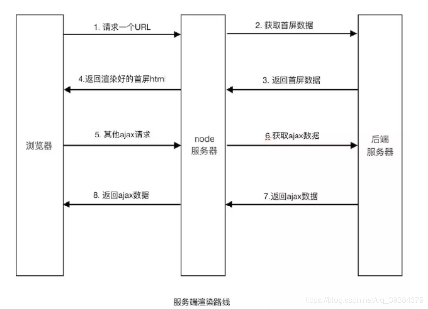
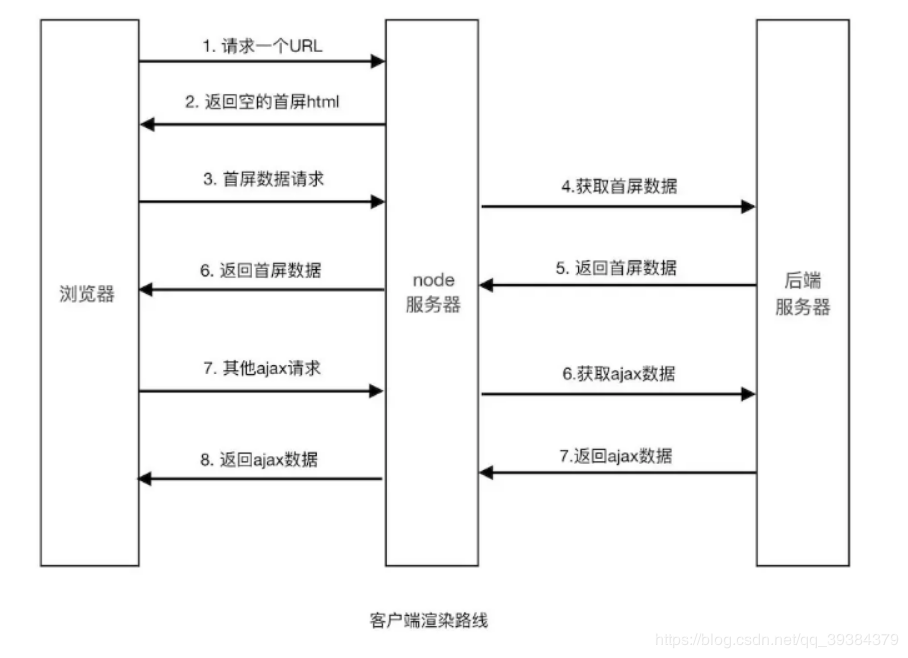

<a id="top"></a>

# 
[Vue官网](http://doc.vue-js.com/v2/guide/)


[Vue 插件-组件](/details/Vue/插件-组件.md)


[Vue开发技巧+性能优化](/details/Vue/Vue开发技巧+性能优化.md)


# 目录

<details open>
  <summary>
    目录
  </summary>

* <a href="#了解">了解</a>  
* <a href="#Vue的运行机制简述">Vue的运行机制简述</a>
* <a href="#MVC、MVP、MVVM">MVC、MVP、MVVM</a>  
* <a href="#SPA">SPA SSR</a>
* <a href="#生命周期">生命周期</a>
* <a href="#监听组件的生命周期">监听组件的生命周期</a>

* <a href="#computed watch methods">computed watch methods</a>
* <a href="#Vue事件绑定原理">Vue事件绑定原理</a>

* <a href="#响应式数据原理、实现">响应式数据原理、实现:Object.defineProperty、proxy</a>

* <a href="#v-model原理">v-model原理</a>
* <a href="#解决对象新增属性不能响应的问题"> vm.$set() 解决对象新增属性不能响应的问题</a>
* <a href="#Vue检测数组的变动">Vue检测数组的变动</a>
* <a href="#Vue的数据为什么频繁变化但只会更新一次">Vue的数据为什么频繁变化但只会更新一次</a>
* <a href="#forceUpdate">forceUpdate</a> 
* <a href="#nextTick">nextTick</a> 
* <a href="#组件中key作用">组件中key作用</a>
* <a href="#组件中 data 为什么是一个函数">组件中 data 为什么是一个函数</a>
* <a href="#slot">slot插槽</a>
* <a href="#虚拟DOM">虚拟DOM</a>
* <a href="#Vue模板编译过程">Vue模板编译过程</a>
* <a href="#Vue.use,Vue.extend,Vue.component,mixins,extends">Vue.use,Vue.mixin,Vue.extend,Vue.component,mixins,extends等</a>

* <a href="#keep-alive">keep-alive</a>
* <a href="#路由vue-router">路由vue-router</a>
  * <a href="#多个路由共用一个组件操作">多个路由共用一个组件,组件如何重新渲染</a>
  * <a href="#单页面多路由区域操作">单页面多路由区域操作</a>
  * <a href="#刷新当前路由方法">刷新当前路由方法</a>
  * <a href="#mode">mode: hash | history区别</a>
  * <a href="#切换页面时自动滚动到顶部">切换页面时自动滚动到顶部</a>
  * <a href="#切换页面时设置title">切换页面时设置title</a>
  * <a href="#路由权限">路由权限</a>

* <a href="#vuex">vuex</a>
* <a href="#vuex数据持久化">vuex数据持久化</a>

* <a href="#组件通信方法">组件通信方法</a>

* <a href="#vue-cli3配置">vue-cli3配置</a>
* <a href="#vue项目性能优化">Vue开发技巧+性能优化</a>
* <a href="#UI组件">UI组件常见问题</a>
* <a href="#静态资源处理">静态资源处理</a>
* <a href="#打包时常见问题及解决">打包时常见问题及解决</a>
* <a href="#rem">rem</a>

</details>


# <a name="了解">了解</a>[](#top)  
Vue (读音 /vjuː/，类似于 view) 是一套用于构建用户界面的渐进式框架。

与其它大型框架不同的是，Vue 被设计为可以自底向上逐层应用。Vue 的核心库只关注视图层，不仅易于上手，还便于与第三方库或既有项目整合

核心思想是由数据驱动视图。所谓数据驱动，是指视图是由数据驱动生成的，我们对视图的修改，不会直接操作 DOM，而是通过修改数据。


Vue 完全有能力驱动采用单文件组件和Vue生态系统支持的库开发的复杂单页应用。

Vue包含了声明式渲染、组件化系统、客户端路由、大规模状态管理、构建工具、数据持久化、跨平台支持等，但在实际开发中，并没有强制要求开发者之后某一特定功能，而是根据需求逐渐扩展。
```js
var arr = [1, 2, 3, 4, 5];

// 命令式渲染，关心每一步、关心流程。用命令去实现
var newArr = [];
for (var i = 0; i < arr.length; i++) {
    newArr.push(arr[i] * 2);
}

// 声明式渲染，不用关心中间流程，只需要关心结果和实现的条件
var newArr1 = arr.map(function (item) {
    return item * 2;
});
```

## [为什么说 vue 并不完全是一个MVVM框架？](https://www.zhihu.com/question/327050991/answer/701449139)
[先看Vue.js 官网上的这句话](https://cn.vuejs.org/v2/guide/instance.html)


写过 Vue 组件的人应该都知道它的单文件组件开发方式。那么怎么和 MVVM 设计模式对应起来？
* Model：对应的是组件中的 data、props 属性。
* View：组件中 template 的部分（也包括 style ？）。
* ViewModel。继承自 Vue 类的组件实例。

看上去不是完美地遵循了 MVVM 么？

[先别急着下结论，来看看官网上的另一段话：](https://cn.vuejs.org/v2/guide/migration.html#v-el-%E5%92%8C-v-ref-%E6%9B%BF%E6%8D%A2)


因此简单来说：
MVVM只能数据驱动视图，视图更改数据，而不能通过其他方式操作数据,
而 Vue 可以通过其他方式操作dom（如$refs）


## 对比其他框架
[对比其他框架-vue官网](https://doc.vue-js.com/v2/guide/comparison.html)


## Vue的优缺点
首先Vue最核心的两个特点，响应式和组件化。

* 响应式：这也就是vue.js最大的优点，通过MVVM思想实现数据的双向绑定，通过虚拟DOM让我们可以用数据来操作DOM，而不必去操作真实的DOM，提升了性能。且让开发者有更多的时间去思考业务逻辑。

* 组件化：把一个单页应用中的各个模块拆分到一个个组件当中，或者把一些公共的部分抽离出来做成一个可复用的组件。所以组件化带来的好处就是，提高了开发效率，方便重复使用，使项目的可维护性更强。

* [虚拟DOM](/details\Vue\Vue2-Source\虚拟DOM.md)


缺点：
* 基于对象配置文件的写法，也就是options写法，开发时不利于对一个属性的查找。另外一些缺点，在小项目中感觉不太出什么，vuex的魔法字符串，对ts的支持。兼容性上存在一些问题。Vue3已解决这些问题
* 不利于seo。可使用ssr框架 nuxt
* 导航不可用，如果一定要导航需要自行实现前进、后退。（由于是单页面不能用浏览器的前进后退功能，所以需要自己建立堆栈管理）。 vue封装了 vue-router
* 初次加载时耗时多。spa页面特点，可使用ssr框架 nuxt


## Vue的运行机制简述 
[参考](https://juejin.im/post/5cd8a7c1f265da037a3d0992#heading-14)

# <a name="MVC、MVP、MVVM">MVC、MVP、MVVM</a>[](#top)  
[MVC，MVP 和 MVVM 的图示](http://www.ruanyifeng.com/blog/2015/02/mvcmvp_mvvm.html)--阮一峰

[基于Vue实现一个简易MVVM](https://juejin.im/post/5cd8a7c1f265da037a3d0992)

### MVVM(Model-View-ViewModel)
<!--  -->
数据驱动视图，视图更新数据


* View: 代表视图层，负责将数据模型渲染到页面上 ;也就是用户界面。前端主要由 HTML 和 CSS 来构建 。

* Model: 代表数据模型，泛指后端进行的各种业务逻辑处理和数据操控，对于前端来说就是后端提供的 api 接口。

* ViewModel: 通过双向绑定把View和Model进行同步交互，不需要手动操作DOM的一种设计思想。前端开发者对从后端获取的 Model 数据进行转换处理，做二次封装，以生成符合 View 层使用预期的视图数据模型

View 和 Model 之间并没有直接的联系，而是通过ViewModel进行交互，Model 和 ViewModel 之间的交互是双向的， 因此View 数据的变化会同步到Model中，而Model 数据的变化也会立即反应到View 上。


MVVM主要通过数据来显示视图层而不是操作节点，解决了MVC中大量的DOM操作使页面渲染性能降低，加载速度慢，影响用户体验问题。主要用于数据操作比较多的场景


MVVM优点:
```html
低耦合。视图（View）可以独立于Model变化和修改，一个ViewModel可以绑定到不同的"View"上，当View变化的时候Model可以不变，当Model变化的时候View也可以不变。

可重用性。你可以把一些视图逻辑放在一个ViewModel里面，让很多view重用这段视图逻辑。

独立开发。开发人员可以专注于业务逻辑和数据的开发（ViewModel），设计人员可以专注于页面设计。

可测试。界面素来是比较难于测试的，而现在测试可以针对ViewModel来写。
```

# <a name="SPA">SPA SSR SEO</a>[](#top)    
[浅谈SPA、SEO、SSR](https://www.jianshu.com/p/fcb98533bc18)

## SPA（Single Page Application）单页面应用
仅在 Web 页面初始化时加载相应的 HTML、JavaScript 和 CSS。一旦页面加载完成，SPA 不会因为用户的操作而进行页面的重新加载或跳转；取而代之的是利用路由机制实现 HTML 内容的变换，UI 与用户的交互，避免页面的重新加载。

 优点：
* 用户体验好、快，内容的改变不需要重新加载整个页面，避免了不必要的跳转和重复渲染；
* 服务器压力小；
* 前后端职责分离，架构清晰，前端进行交互逻辑，后端负责数据处理；

缺点：
* 初次加载耗时较长：会等待所有编译后的 js、CSS 文件都下载完成后，才开始进行页面的渲染,所以首屏渲染需要一定的时间

* 前进后退路由管理：由于单页应用在一个页面中显示所有的内容，所以不能使用浏览器的前进后退功能，所有的页面切换需要自己建立堆栈管理；

* SEO 难度较大：因为 SPA 页面的内容是通过 Ajax 获取，而搜索引擎爬取工具并不会等待 Ajax 异步完成后再抓取页面内容，所以在 SPA 中是抓取不到页面通过 Ajax 获取到的内容。


## SSR(Server-Side Rendering) 服务器端渲染 
[Vue SSR 指南](https://ssr.vuejs.org/zh/)
[Vue SSR 踩坑之旅](https://juejin.im/post/5cb6c36e6fb9a068af37aa35)

在客户端将标签渲染成的整个 html 片段的工作在服务端完成，服务端形成的html 片段直接返回给客户端这个过程就叫做服务端渲染。

在普通的SPA中，一般是将框架及网站页面代码发送到浏览器，然后在浏览器中生成和操作DOM（这里也是第一次访问SPA网站在同等带宽及网络延迟下比传统的在后端生成HTML发送到浏览器要更慢的主要原因），    

可以将SPA应用打包到服务器上，在服务器上渲染出HTML，发送到浏览器，这样的HTML页面还不具备交互能力，所以还需要与SPA框架配合，在浏览器上“混合”成可交互的应用程序。所以，只要能合理地运用SSR技术，不仅能一定程度上解决首屏慢的问题，还能获得更好的SEO。

SSR的优点
* 更利于首屏渲染，更快的响应时间，直接由服务端渲染好页面直接返回显示，无需等待下载 js 文件及再去渲染。

* 更好的SEO，我们可以将SEO的关键信息直接在后台就渲染成HTML，而保证搜索引擎的爬虫都能爬取到关键数据。

SSR缺点
* 服务器压力大，相对于仅仅需要提供静态文件的服务器，SSR中使用的渲染程序自然会占用更多的CPU和内存资源

* 一些常用的浏览器API可能无法正常使用，比如window、document和alert等，如果使用的话需要对运行的环境加以判断

* 服务端渲染只支持 beforCreate 和 created 两个钩子函数

* 开发调试会有一些麻烦，因为涉及了浏览器及服务器，对于SPA的一些组件的生命周期的管理会变得复杂

* 可能会由于某些因素导致服务器端渲染的结果与浏览器端的结果不一致

* SSR常用框架  
[Vue.js 的 Nuxt](https://nuxtjs.org/guide/installation)  
[React 的 Next](https://nextjs.org/)

## SEO（Search Engine Optimization）搜索引擎优化
SEO是一种通过了解搜索引擎的运作规则（如何抓取网站页面，如何索引以及如何根据特定的关键字展现搜索结果排序等）来调整网站，以提高该网站在搜索引擎中某些关键词的搜索结果排名。


## 总结
服务器端渲染会先向后端请求数据，生成完整首屏HTML后返回给客户端

客户端渲染会等待JS下载，解析完之后再向服务器请求数据，等待过程中是什么也没有的，所以会出现首屏白页的情况

服务端渲染
 

客户端渲染



# <a name="生命周期">生命周期</a>[](#top)  
[官网-生命周期钩子](https://cn.vuejs.org/v2/api/#%E9%80%89%E9%A1%B9-%E7%94%9F%E5%91%BD%E5%91%A8%E6%9C%9F%E9%92%A9%E5%AD%90)

[Vue2.0生命周期](https://segmentfault.com/a/1190000008010666)  

[Vue父子组件生命周期执行顺序及钩子函数的个人理解](https://www.cnblogs.com/yuliangbin/p/9348156.html)

[「进击的前端工程师」从源码解读Vue生命周期，让面试官对你刮目相看](https://juejin.im/post/5d1b464a51882579d824af5b)


## 生命周期
Vue 实例有一个完整的生命周期，也就是从开始创建、初始化数据、编译模版、挂载 Dom -> 渲染、更新 -> 渲染、卸载等一系列过程，我们称这是 Vue 的生命周期,有时也叫它们生命周期钩子。

生命周期就是回调函数，在组件实例创建/销毁过程中会调用对应的钩子方法

钩子函数:  
>
    钩子函数是Windows消息处理机制的一部分，通过设置“钩子”，应用程序可以在系统级对所有消息、事件进行过滤，访问在正常情况下无法访问的消息。钩子的本质是一段用以处理系统消息的程序，通过系统调用，把它挂入系统。---百度

[JavaScript：理解事件、事件处理函数、钩子函数、回调函数](https://www.jianshu.com/p/a0c580ed3432)

一般认为，钩子函数就是回调函数的一种，其实还是有差异的，差异地方就是：触发的时机不同。

钩子函数 Hook
//在按钮点击时候立即执行钩子函数
```js
let btn = document.getElementById("btn");
btn.onclick = function(){
    console.log(this.onclick); //function
}
```
回调函数：  
//给按钮绑定了一个监听器，消息捕获的过程不能参与，而在捕获执行完毕的时候，回调函数才会执行。
```js
let btn = document.getElementById("btn");
btn.addEventListener("click",function(){
  console.log(this.onclick);//null
});
```

钩子函数在捕获消息的第一时间就执行，而回调函数是捕获结束时，最后一个被执行的。
钩子函数和回调函数都是事件处理函数

----


## 各个生命周期作用：

* beforeCreate阶段: 实例创建前发生；数据对象data和vue实例的挂载元素$el都为undefined，还未初始化。 

* created阶段: 实例创建完成后发生；完成data,methods初始化，$el还没有。此时无法与操作DOM，但可以通过vm.$nextTick来访问。

* beforeMount阶段：挂载前发生；完成了data和$el初始化；已完成模板编译但还是挂载之前为虚拟的dom节点，data.message还未替换。 此时也可以对数据进行更改，但不会触发updated。

* mounted阶段：挂载完成后发生；实例初始化完毕，$el挂载完成，data数据渲染；

* beforeUpdate：更新前发生；也就是响应式数据发生更新，虚拟dom重新渲染之前被触发，你可以在当前阶段进行更改数据，不会造成重新渲染。

* updated: 更新完成后发生；当前阶段组件Dom已完成更新。`避免在此期间更改数据，因为这可能会导致无限循环的更新。`

* activated: keep-alive组件被激活时调用

* deactivated: keep-alive组件被停用时调用

* beforeDestroy: 实例销毁前发生；此时，实例仍然完全可用。可以在这时进行善后收尾工作，比如清除计时器，弹窗提示是否退出。

* destroyed：销毁完成后发生；对data的改变不会再触发周期函数，说明此时vue实例已经解除了事件监听以及和dom的绑定，但是dom结构依然存在

* errorCaptured： 当捕获一个来自子孙组件的错误时被调用

## 生命周期的一些操作：

* beforecreate: 可以在这加个loading事件，在加载实例时触发  

* created: 初始化完成时的事件写在这里，如在这结束loading事件，异步请求也适宜在这里调用  

* mounted: 挂载元素，获取到DOM节点  

* updated: 任何数据的更新,如果要做统一的业务逻辑处理使用此钩子函数  

* beforeDestroy: 页面退出前操作(如：确认是否退出登录)

* Vue的所有生命周期函数都是自动绑定到this的上下文上。所以，你这里使用箭头函数的话，就会出现this指向的父级作用域，就会报错

## 在哪个生命周期内调用异步请求？
可以在钩子函数 created、beforeMount、mounted 中进行调用，因为在这三个钩子函数中，data 已经创建，可以将服务端端返回的数据进行赋值。  
推荐在 created 钩子函数中调用异步请求，因为在 created 钩子函数中调用异步请求有以下优点：
* 能更快获取到服务端数据，减少页面 loading 时间；
* ssr 只支持 beforeCreate和created 钩子函数，所以放在 created 中有助于一致性；


## 父子组件生命周期调用顺序？

加载渲染过程
>
    父 beforeCreate -> 父 created -> 父 beforeMount -> 
    子 beforeCreate -> 子 created -> 子 beforeMount -> 子 mounted -> 
    父 mounted


子组件更新过程
>
    父 beforeUpdate -> 
    子 beforeUpdate -> 子 updated -> 
    父 updated


父组件更新过程
>
    父 beforeUpdate ->  父 updated


销毁过程
>
    父 beforeDestroy -> 
    子 beforeDestroy -> 子 destroyed -> 
    父 destroyed

##  从源码上看生命周期
[从源码上看生命周期](/details\Vue\Vue2-Source\生命周期.md)


# <a name="Vue事件绑定原理">Vue事件绑定原理</a>[](#top)  

Vue的事件分为2种，一种是原生事件绑定，还有一种是组件的事件绑定。
* 原生dom事件的绑定，采用的是addEventListener实现；
* 组件事件绑定是通过Vue自定义的$on实现的


# <a name="响应式数据原理、实现">响应式数据原理、实现:Object.defineProperty、proxy</a>[](#top)    
[响应式原理](/details/Vue/Vue2-Source/响应式原理.md)

# <a  name="v-model原理">v-model原理</a>[](#top)
在 vue 项目中主要使用 v-model 指令在表单 input、textarea、select 等元素上创建双向数据绑定，
v-model 本质上不过是语法糖，v-model 在内部为不同的输入元素使用不同的属性并抛出不同的事件：

* input 和 textarea 元素使用 value 属性和 input 事件；
* checkbox 和 radio 使用 checked 属性和 change 事件；
* select 字段将 value 作为 prop 并将 change 作为事件。

以 input  表单元素为例：
```html
<input v-model='val'>
相当于
<input :value="val" @input="val = $event.target.value">
```

如果在自定义组件中，v-model 默认会利用名为 value 的 prop 和名为 input 的事件，如下所示

```html
点击 ModelChild 后，其值会更新为 '我点了一下'

<!-- 父组件： -->
<ModelChild v-model="message"></ModelChild>

<!-- 子组件： -->
<template>
  <div @click="click">
    {{value}}
  </div>
</template>

<script>
  export default {
    props:{
    value: String
},
  methods: {
    click(){
      this.$emit('input', '我点了一下')
    },
  },
};
</script>
```
[Vue开发技巧+性能优化#自定义组件双向绑定](/details/Vue/Vue开发技巧+性能优化.md/#自定义组件双向绑定)

# <a name="单向数据流">单向数据流</a>[](#top)  
父组件可以向子组件传递数据，但是子组件不能直接修改父组件的状态。  
防止从子组件意外改变父级组件的状态，从而导致你的应用的数据流向难以理解。

如所有的 prop 都使得其父子 prop 之间形成了一个单向下行绑定；每次父级组件发生更新时，子组件中 prop 也会更新。这意味着你不应该在一个子组件内部改变 prop

当你想要在子组件去修改 props 时，两种情况
* prop 用来传递一个初始值, 定义一个 data 属性，并用 prop 的值初始化它。
  >vue初始化属性顺序
  (src\core\instance\init.js的_init方法)
  (src\core\instance\state.js的initState方法)：
    inject -> props -> methods -> data -> computed -> watch -> provide
  ```js
  props: ['size'],
  data: function () {
    return {
      counter: this.size
    }
  }
  ```

* prop 以一种原始的值传入且需要进行转换,定义一个计算属性，处理 prop 的值并返回。
  ```js
  props: ['size'],
  computed: {
    normalizedSize: function () {
      return this.size.trim().toLowerCase()
    }
  }
  ```

# <a name="computed watch methods">computed watch methods用法，区别</a>[](#top)  
[computed和watch的细节全面分析](https://segmentfault.com/a/1190000012948175)

[官网-watch](https://cn.vuejs.org/v2/api/#watch)

[官网-computed](https://cn.vuejs.org/v2/api/#computed)

## 用法、区别：
* computed watch 前两者自动追踪数据，执行相关函数；methods需手动调用；  

* computed 是`计算属性`,依赖其它属性值，并且值有缓存(页面重新渲染值不变化,计算属性会立即返回之前的计算结果，而不必再次执行函数);  
  只有在它的相关依赖发生改变时才会重新取值; computed的对象无需声明（声明会报错）

* watch `监听`某个数据的变化，执行相关操作;无缓存性(页面重新渲染时值不变化也会执行); watch的对象必须事先声明  

* 当需要进行数值计算，并且依赖于其它数据时，应该使用 computed，可以利用 computed 的缓存特性，  
* 数据变化的同时进行异步操作或者是比较大的开销，那么watch为最佳选择  
* computed本质是一个具备缓存(dirty: true)的watcher,内部实现了一个惰性的 watcher(lazy: true)

## 基本使用：
```js
// watch
data() {
  return {
    firstName: 'Foo',
    lastName: 'Bar',
    fullName: 'Foo Bar'
  }
},
watch: {
  firstName(val) {
    this.fullName = val + ' ' + this.lastName
  },
  lastName(val) {
    this.fullName = this.firstName + ' ' + val
  }
}

//computed
data() {
  return {
    firstName: 'Foo',
    lastName: 'Bar',
  }
},

computed: {
  // 仅读取
  fullName() {
    return this.firstName + ' ' + this.lastName
  }
}

//computed：get(),set()用法
computed: {
  // 读取和设置
  fullName:{
    get(){
      return this.firstName + ' ' + this.lastName
    },
    set(val){
      //监视当前属性值的变化，当属性值发生变化时执行，更新相关的属性数据
      //val就是fullName的最新属性值
      var names = val.split(' ')
      this.firstName = names[0]
      this.lastName = names[names.length - 1]
    }
  }
}
```

## watch：深度监听
最初绑定的时候是不会执行的，要等到 `监听值改变`才执行监听计算; 

`immediate: true`初始化的时候就会自动触发  
`deep: true` 监听复杂数据类型需用深度监听
```js
watch: {
  'obj.a': {
    //深度监听对应的函数名必须为handler,否则无效果,因为watcher里面对应的是对handler的调用
    handler(newName, oldName) {
      console.log('obj.a changed');
    },
    immediate: true,//立即执行
    deep: true //深度监听
  },
}  
```

### 触发监听执行多个方法
使用数组可以设置多项，形式包括字符串、函数、对象

```html
<template>
  <div>{{name}}</div>
</template>
<script>
export default {
  data(){
      return{
        name: 'Joe'
      }
  },
  watch: {
    name: [ // name改变时，执行了三个方法
      'sayName1',
      function(newVal, oldVal) { //
        console.log(newVal, oldVal);
        this.sayName2()
      },
      {
        handler: 'sayName3',
        immaediate: true
      }
    ]
  },
  created(){
    this.name = 'name改变了'
  },
  methods: {
    sayName1() {
      console.log('sayName1==>', this.name)
    },
    sayName2() {
      console.log('sayName2==>', this.name)
    },
    sayName3() {
      console.log('sayName3==>', this.name)
    }
  }
}
</script>
```
`注意，不应该使用箭头函数来定义 watch 函数。理由是箭头函数绑定了父级作用域的上下文，所以 this 将不会按照期望指向 Vue 实例，`

###  卸载watch
```js
export default {
  data() {
    return {
        count: 1
    }
  },
  // watch: {
  //   count(newVal) {
  //       console.log('count 新值：'+newVal)
  //   }
  // },
  created() {
    // $watch 会返回一个取消观察函数
    let unwatchFn = this.$watch('count', function(){
        console.log('count 新值：'+newVal)
    }, {
        immediate: true // 立即执行watch
    })
    unwatchFn() // 取消监听
  }
}
```

### [watch/computed源码解析](/details\Vue\Vue2-Source\computed-watch.md)

# <a name="解决对象新增属性不能响应的问题">$set() 解决对象新增属性不能响应的问题</a>[](#top)  
[Vue文档-深入响应式原理](https://cn.vuejs.org/v2/guide/reactivity.html)

在实例初始化的时候，遍历data里所有的属性，并使用 Object.defineProperty 把这些属性全部转为 getter/setter。  
对于已经创建的实例，Vue 不允许动态添加根级别的响应式属性  
但是，可以使用 Vue.set(object, propertyName, value)方法向嵌套对象添加响应式属性

示例：
```vue
<template>
  <div>
    <ul>
      <li v-for="value in obj" :key="value">
        {{value}}
      </li>
    </ul>
    <button @click="addObjB">添加obj.b</button>
  </div>
</template>
<script>
export default {
  data () {
    return {
      obj: {
        a: 'obj.a'
      }
    }
  },
  methods: {
    addObjB () {
      this.obj.b = 'obj.b'
      console.log(this.obj)
    }
  }
}
</script>
<style></style>
```
点击button会发现，obj.b 已经成功添加，但是视图并未刷新：
原因在于在Vue实例创建时，obj.b并未声明，因此就没有被Vue转换为响应式的属性，自然就不会触发视图的更新，这时就需要使用Vue的全局api: Vue.set() 
```js
addObjB () {
  // this.obj.b = 'obj.b'
  this.$set(this.obj, 'b', 'obj.b')
  console.log(this.obj)
}
```
$set()方法相当于手动的去把obj.b处理成一个响应式的属性，此时视图也会跟着改变了：

[$set源码解析](/details\Vue\Vue2-Source\$set.md)

# <a name="Vue检测数组的变动">Vue检测数组的变动</a>[](#top)  
[Vue文档-深入响应式原理](https://cn.vuejs.org/v2/guide/reactivity.html)  

vue使用了函数劫持的方式，重写了数组部分方法，Vue将data中的数组进行了原型链重写，指向了自己定义的数组原型方法，当调用数组api时，可以通知依赖更新。
如果数组中包含着引用类型，会对数组中的引用类型再次递归遍历进行监控。这样就实现了监测数组变化。

[源码解析](/details/Vue/Vue2-Source/数组方法劫持重写.md)

### Vue 重写了以下数组的方法，能检测其变动
* push()
* pop()
* shift()
* unshift()
* splice()
* sort()
* reverse()

### Vue 不能检测以下数组的变动
1. 当你利用索引直接设置一个数组项时，例如：vm.items[indexOfItem] = newValue  

2. 当你修改数组的长度时，例如：vm.items.length = newLength


举例：
```js
var vm = new Vue({
  data: {
    items: ['a', 'b', 'c']
  }
})
vm.items[1] = 'x' // 不是响应性的
vm.items.length = 2 // 不是响应性的
```

解决第一个问题：
```js

vm.$set(vm.items, indexOfItem, newValue)

vm.items.splice(indexOfItem, 1, newValue)
```
$set对数组处理的核心方法就是通过splice

解决第二类问题：
```js
vm.items.splice(newLength)
```

# <a name="forceUpdate">forceUpdate</a>[](#top)
[forceUpdate-官网](https://cn.vuejs.org/v2/guide/components-edge-cases.html#%E5%BC%BA%E5%88%B6%E6%9B%B4%E6%96%B0)

迫使Vue实例重新（rander）渲染虚拟DOM，注意并不是重新加载组件。结合vue的生命周期，调用$forceUpdate后只会触发beforeUpdate和updated这两个钩子函数，不会触发其他的钩子函数。它仅仅影响实例本身和插入插槽内容的子组件，而不是所有子组件。


但是这种做法并不推荐，官方说如果你现在的场景需要用forceUpdate方法 ,那么99%是你的操作有问题，如上data里不显示声明对象的属性，之后添加属性时正确的做法时用 `vm.$set()` 方法，所以forceUpdate请慎用

### 

### [forceUpdate源码解析](/details\Vue\Vue2-Source\$forceUpdate.md)


# <a name="Vue的数据为什么频繁变化但只会更新一次">Vue采用异步渲染:Vue的数据为什么频繁变化但只会更新一次</a>[](#top)  
Vue 异步执行 DOM 更新。Vue在观察到数据变化时并不是直接更新DOM，而是开启一个队列，并缓冲在同一事件循环中发生的所有数据改变。在缓冲时会去除重复数据，从而避免不必要的计算和DOM操作。然后，在下一个事件循环tick中，Vue刷新队列并执行实际工作。

由于VUE的数据驱动视图更新是异步的，即修改数据的当下，视图不会立刻更新，而是等同一事件循环中的所有数据变化完成之后，再统一进行视图更新。在同一事件循环中的数据变化后，DOM完成更新，立即执行nextTick(callback)内的回调。

# <a name="nextTick">nextTick</a>[](#top)  

[nextTick](/details/Vue/Vue2-Source/nextTick.md)


# <a name="组件中data为什么是一个函数">为什么组件中的 data 必须是一个函数，然后 return 一个对象，而 new Vue 实例里，data 可以直接是一个对象？</a>[](#top)  

[风格指南](https://cn.vuejs.org/v2/style-guide/#%E7%BB%84%E4%BB%B6%E6%95%B0%E6%8D%AE%E5%BF%85%E8%A6%81)

组件使用时会进行实例化操作，同一个组件被复用多次，会创建多个实例。
这些实例用的是同一个构造函数，如果 data 是一个对象的话。那么所有组件都共享了同一个对象。

此时如果在某个组件中对 data 进行修改，会导致其他组件里的 data 也被污染。
而如果使用函数的话，每个组件里的 data 会有单独的引用，避免多个组件间数据影响。

为了保证组件的数据独立性要求每个组件必须通过 data 函数返回一个对象作为组件的状态。

```js
function Vue(options) {
  this.data1 = typeof options.data1 === 'function' ? options.data1() : options.data1
  this.data2 = typeof options.data2 === 'function' ? options.data2() : options.data2
}
let data1 = {
  num: 1
}
let data2 = () => ({
  num: 1
})
let vm1 = new Vue({
  data1,
  data2
})
let vm2 = new Vue({
  data1,
  data2
})

// 仅改变 vm1 的data num值
vm1.data1.num++
vm1.data2.num++
console.log(vm1.data1.num, vm2.data1.num) // 2 2
console.log(vm1.data2.num, vm2.data2.num) // 2 1
```
发现data为对象时，vm1,vm2实例中的数据是同步的，因为其引用同一地址；
data为函数形式时，实例数据互补干扰

从原理出发，先看看它被[编译成什么样](https://template-explorer.vuejs.org/#%3Cdiv%3E%0A%20%3CCounter%20%2F%3E%0A%20%3CCounter%20%2F%3E%0A%3C%2Fdiv%3E)的 render 函数：
```js
function render() {
  with(this) {
    return _c('div', [_c('Counter'), _c('Counter')], 1)
  }
}

```
每一个 Counter 会被 _c 所调用，也就是 createElement，想象一下 createElement 内部会发生什么，它会直接拿着 Counter 上的 data 这个引用去创建一个组件。 也就是所有的 Counter 组件实例上的 data 都指向同一个引用。

此时假如 id 为 a 的 Counter 组件内部调用了 count++，会去对 data 这个引用上的 count 属性赋值，那么此时由于 id 为 b 的 Counter 组件内部也是引用的同一份 data，它也会感觉到变化而更新组件，这就造成了多个组件之间的数据混乱了

而换成函数后，每个组件拥有了自己的一份全新的 data，再也不会互相污染数据了
```js
var Counter = {
  template: `<span @click="count++"></span>`
  data(){
    return {count: 0}
  }
}
```


# <a name="修饰符">修饰符</a>[](#top)  
[事件修饰符](https://cn.vuejs.org/v2/guide/events.html#%E4%BA%8B%E4%BB%B6%E4%BF%AE%E9%A5%B0%E7%AC%A6)
* .native 将原生事件绑定到组件
* .stop 阻止冒泡
* .prevent 阻止默认行为
* .capture 事件捕获
* .self
* .once 事件将只会触发一次
* .passive 事件的默认行为立即触发

使用修饰符时，顺序很重要；相应的代码会以同样的顺序产生。  
因此，用 v-on:click.prevent.self 会阻止所有的点击，而 v-on:click.self.prevent 只会阻止对元素自身的点击。

[表单修饰符](https://cn.vuejs.org/v2/guide/forms.html#%E4%BF%AE%E9%A5%B0%E7%AC%A6)
* .lazy v-model在input的 change 事件后同步
* .number 输入值转为数值类型
* .trim 过滤输入框的首尾空白符  

[.sync 修饰符](https://cn.vuejs.org/v2/guide/components-custom-events.html#sync-%E4%BF%AE%E9%A5%B0%E7%AC%A6)

[按键修饰符](https://cn.vuejs.org/v2/guide/events.html#%E6%8C%89%E9%94%AE%E4%BF%AE%E9%A5%B0%E7%AC%A6)

* .enter
* .tab
* .delete 删除和退格键
* .esc
* .space
* .up
* .down
* .left
* .right


# <a name="指令">指令</a>[](#top)  
[指令](https://cn.vuejs.org/v2/api/#%E6%8C%87%E4%BB%A4)
* v-text 渲染文本
* v-html 渲染html
* v-show 是否显示
* v-if 是否渲染
* v-else 
* v-else-if
* v-for 列表循环
* v-on  绑定事件监听器
* v-bind  绑定属性
* v-model 双向绑定
* v-slot 提供具名插槽或需要接收 prop 的插槽
* v-pre 跳过此元素和它的子元素的编译
* v-clock 在编译结束后，才显示
* v-once 仅渲染一次


# <a name="slot">slot插槽</a>[](#top)  
[官网-插槽](https://cn.vuejs.org/v2/guide/components-slots.html)

父组件来控制 插槽显示状态、内容  
子组件控制 插槽位置

### 普通插槽
一个不带 name 的 \<slot> 出口会带有隐含的名字“default”

```html
//父组件
<template>
  <div>
    我是父组件
    <slot-one >
      <p style="color:red">我是父组件插槽内容</p>
    </slot-one>
  </div>
</template>
<script>
import slotOne from '@/pages/slotOne.vue'

export default {
  components:{
    slotOne
  }
}
</script>

//子组件：slotOne.vue
<template>
  <div>
    <div>我是slotOne组件</div>
    <slot></slot>
  </div>
</template>
```

### 插槽默认值
有时为一个插槽设置具体的后备 (也就是默认的) 内容是很有用的，它只会在没有提供内容的时候被渲染。

```html
//父组件
<template>
  <div>
    我是父组件
    <slot-one></slot-one> <!-- 此时会显示子组件的 后备内容-->
    <slot-one>我不当备胎</slot-one>
  </div>
</template>
<script>
import slotOne from '@/pages/slotOne.vue'

export default {
  components:{
    slotOne
  }
}
</script>

//子组件：slotOne.vue
<template>
  <div>
    <div>我是slotOne组件</div>
    <slot>我是备胎</slot>
  </div>
</template>
```


### 具名插槽 ,作用域插槽
具名插槽: 多个插槽时，便于区分
* v-slot:header (注意 v-slot 只能添加在 \<template> 上)  
  >v-slot:缩写# ；等同于 #header
* slot="header" `自 2.6.0 起被废弃`

作用域插槽：让插槽内容能够访问子组件中才有的数据
* #header="slotProps" //所有插槽属性
* slot="header" slot-scope="slotProps" //所有插槽属性 `自 2.6.0 起被废弃`
* #header="{user}" //解构插槽属性：user 

```html
//父组件
<template>
  <div>
    我是父组件
    <slot-one >
      <p>我是普通插槽</p>
      <template v-slot:header>
        <p>我是具名插槽 header</p>
      </template>
      <template #footer>
        <p>我是具名插槽 footer</p>
      </template>

      <template #main="slotProps">
        我是作用域插槽main: 用于访问插槽所有数据：{{slotProps}}
      </template>
      <!-- 解构插槽 Prop -->
      <!-- <template #main="{user}">
        我是作用域插槽main: 用于访问插槽某些数据：{{user}}
      </template> -->
      <!-- 解构插槽 Prop 重命名 -->
      <!-- <template #main="{user: newUser}">
        我是作用域插槽main: 用于访问插槽某些数据：{{newUser}}
      </template> -->
    </slot-one>
  </div>
</template>
<script>
import slotOne from '@/pages/slotOne.vue'
export default {
  components:{
    slotOne
  }
}
</script>

//子组件：slotOne.vue
<template>
  <div>
    <div>我是slotOne组件</div>
    <slot></slot>
    <slot name="header"></slot>
    <slot name="main" :user="{name: 'tom'}" num="1"></slot>
    <slot name="footer"></slot>
  </div>
</template>
```

# <a name="组件中key作用">组件中key作用</a>[](#top)  

[写 React / Vue 项目时为什么要在列表组件中写 key，其作用是什么？](https://github.com/Advanced-Frontend/Daily-Interview-Question/issues/1)

[官网解释](https://cn.vuejs.org/v2/guide/list.html#%E7%BB%B4%E6%8A%A4%E7%8A%B6%E6%80%81)
```html
当 Vue.js 用 v-for 正在更新已渲染过的元素列表时，它默认用“就地复用”策略。如果数据项的顺序被改变，Vue 将不会移动 DOM 元素来匹配数据项的顺序， 而是简单复用此处每个元素，并且确保它在特定索引下显示已被渲染过的每个元素。

这个默认的模式是高效的，但是只适用于不依赖子组件状态或临时 DOM 状态 (例如：表单输入值) 的列表渲染输出。

为了给 Vue 一个提示，以便它能跟踪每个节点的身份，从而重用和重新排序现有元素，你需要为每项提供一个唯一 key 属性：
```
建议尽可能在使用 v-for 时提供 key attribute，除非遍历输出的 DOM 内容非常简单，或者是刻意依赖默认行为以获取性能上的提升。

`不要使用对象或数组之类的非基本类型值作为 v-for 的 key。请用字符串或数值类型的值。`


[VueAPI-key](https://cn.vuejs.org/v2/api/#key)
```html
key 的特殊属性主要用在 Vue 的虚拟 DOM 算法，在新旧 nodes 对比时辨识 VNodes。如果不使用 key，Vue 会使用一种最大限度减少动态元素并且尽可能的尝试修复/再利用相同类型元素的算法。使用 key，它会基于 key 的变化重新排列元素顺序，并且会移除 key 不存在的元素。

有相同父元素的子元素必须有独特的 key。重复的 key 会造成渲染错误
```

Vue源码中，在sameVnode函数中，由a.key === b.key 对比中可以避免就地复用的情况

src\core\vdom\patch.js
```js
function sameVnode (a, b) {
  return (
    a.key === b.key && (
      (
        a.tag === b.tag &&
        a.isComment === b.isComment &&
        isDef(a.data) === isDef(b.data) &&
        sameInputType(a, b)
      ) || (
        isTrue(a.isAsyncPlaceholder) &&
        a.asyncFactory === b.asyncFactory &&
        isUndef(b.asyncFactory.error)
      )
    )
  )
}
// isSameNode为false的话，直接销毁旧的 vnode，渲染新的 vnode
```

* 总结： 

key是给每一个vnode的唯一id,可以依靠key,更准确, 更快的拿到oldVnode中对应的vnode节点。

1. 更准确  
因为带key就不是就地复用了，在sameNode函数 a.key === b.key对比中可以避免就地复用的情况。所以会更加准确。

2. 更快  
利用key的唯一性生成map对象来获取对应节点，比遍历方式更快。 


### 为什么某些情况(增删改)不能用 index 作为 key  
[Vue2.0 v-for 中 :key 到底有什么用？](https://www.zhihu.com/question/61064119/answer/766607894)

[为什么 Vue 中不要用 index 作为 key？（diff 算法详解）](https://juejin.im/post/5e8694b75188257372503722)

在删除子节点的场景下还会造成严重的错误
```html
<body>
  <div id="app">
    <ul>
      <li v-for="(value, index) in arr" :key="index">
        <test />
      </li>
    </ul>
    <button @click="handleDelete">delete</button>
  </div>
  </div>
</body>
<script>
  new Vue({
    name: "App",
    el: '#app',
    data() {
      return {
        arr: [1, 2, 3]
      };
    },
    methods: {
      handleDelete() {
        this.arr.splice(0, 1);
      }
    },
    components: {
      test: {
        template: "<li>{{Math.random()}}</li>"
      }
    }
  })
</script>

```
第一个 vnode 被删除了，但是对于 Vue 来说，它是感知不到子组件里面到底是什么样的实现（它不会深入子组件去对比文本内容），那么这时候 Vue 会怎么 patch 呢？
由于对应的 key使用了 index导致的错乱，它会把

1. 原来的第一个节点text: 1直接复用。
2. 原来的第二个节点text: 2直接复用。
3. 然后发现新节点里少了一个，直接把多出来的第三个节点text: 3 丢掉。

至此为止，我们本应该把 text: 1节点删掉，然后text: 2、text: 3 节点复用，就变成了错误的把 text: 3 节点给删掉了。


为了标识独有dom，key值一般我们取类似id这种唯一且 不变的变量，如果仅为了区分dom，元素不会频繁更新, 则可使用index索引


# <a name="虚拟DOM">虚拟 DOM</a>[](#top)  
[源码解析](\details\Vue\Vue2-Source\虚拟DOM.md)

# <a name="Vue模板编译过程">Vue模板编译过程</a>[](#top) 
[源码解析](\details\Vue\Vue2-Source\模板编译.md)


# <a name="Vue.use,Vue.extend,Vue.component,mixins,extends">Vue.use,Vue.mixin,Vue.extend,Vue.component,mixins,extends等</a>[](#top) 
### [Vue.use](https://cn.vuejs.org/v2/api/#Vue-use)
* 参数：{Object | Function} plugin  
* 用法：
  >
      安装 Vue.js 插件。如果插件是一个对象，必须提供 install 方法。如果插件是一个函数，它会被作为 install 方法。install 方法调用时，会将 Vue 作为参数传入。

      该方法需要在调用 new Vue() 之前被调用。

      当 install 方法被同一个插件多次调用，插件将只会被安装一次。


### [Vue.mixin](https://cn.vuejs.org/v2/api/#Vue-mixin)
* 参数：{Object} mixin
* 用法：
  >
    全局注册一个混入，影响注册之后所有创建的每个 Vue 实例。插件作者可以使用混入，向组件注入自定义的行为。不推荐在应用代码中使用

```js
Vue.mixin({
  created: function () {
    var myOption = this.$options.myOption
    if (myOption) {
      console.log(myOption)
    }
  }
})
```

### [Vue.extend](https://cn.vuejs.org/v2/api/#Vue-extend)

* 参数：{Object} options  
* 用法: 使用基础 Vue 构造器，创建一个“子类”。参数是一个包含组件选项的对象。

Vue.extend实际是创建一个构造器,对应的初始化构造器,并将其挂载到标签上

```js
// 创建构造器
let Profile = Vue.extend({
  template: `<div><p>名字{{name}}</p><p>id:{{id}}</p></div>`,
  props: ['id'],
  data(){
    return {
      name: 'dadan'
    }
  }
})
// 使用

// 1. 可以挂载到元素上,可以通过propsData传参.
// new Profile({propsData:{id:'我是实例传入的id'}}).$mount('#app')

// 2.全局注册使用
Vue.component('Profile',Profile)

//3.局部注册
//  components: {
//    Profile
//  }
```
[源码解析](/details\Vue\Vue2-Source\Vue.extend.md)

### [Vue.component](https://cn.vuejs.org/v2/api/#Vue-component)
* 参数：  
  {string} id  
  {Function | Object} [definition]

用法：注册或获取全局组件。注册还会自动使用给定的 id 设置组件的名称

```js
// 注册组件，传入一个扩展过的构造器
Vue.component('my-component', Vue.extend({ /* ... */ }))

// 注册组件，传入一个选项对象 (自动调用 Vue.extend)
Vue.component('my-component', { /* ... */ })

// 获取注册的组件 (始终返回构造器)
var MyComponent = Vue.component('my-component')
```

### [extends](https://cn.vuejs.org/v2/api/#extends)
* 类型：Object | Function
* 详细：
  允许声明扩展另一个组件 (可以是一个简单的选项对象或构造函数)，而无需使用 Vue.extend。这主要是为了便于扩展单文件组件。  

和 mixins 类似,只不过接收的参数是简单的选项对象或构造函数,所以extends只能单次扩展一个组件

```js
var CompA = { ... }

// 在没有调用 `Vue.extend` 时候继承 CompA
var CompB = {
  extends: CompA,
  ...
}
```

### [mixins](https://cn.vuejs.org/v2/api/#mixins)
* 类型：Array\<Object\>
* 详细：  
  mixins 选项接收一个混入对象的数组。这些混入对象可以像正常的实例对象一样包含实例选项，这些选项将会被合并到最终的选项中，使用的是和 Vue.extend() 一样的选项合并逻辑。也就是说，如果你的混入包含一个 created 钩子，而创建组件本身也有一个，那么两个函数都会被调用。

  Mixin 钩子按照传入顺序依次调用，并在调用组件自身的钩子之前被调用。

```js
export default{
  mixins:[mixinA, mixinxB, ...]
}
```

`简单来说就是抽离公共的业务逻辑`

当组件初始化时会（调用 mergeOptions ）进行合并，采用策略模式针对不同的属性进行合并，如果产生冲突（mixin和组件中都有某属性方法），则已组件中的为准

```js
function mergeOptions(parent,child){
  let opts ={}
  // 合并钩子
  for(let key in child){
    opts[key]= mergeHook(parent[key],child[key])
  }
  return opts
}
```


mixin缺点：
* 命名冲突
* 依赖问题
* 数据来源不清晰

### extends,mixins区别
extends,mixins都是为了拓展组件

extends 只能单次扩展一个组件，优先于 mixins 调用
mixins 可多个， 钩子按照传入顺序依次调用

```html
<>
  let extend = {
    data() {
      return {extendData:'我是extend的data'}
    },
    created(){
      console.log('这是extend的created');
    },
    methods:{
      getSum(){
        console.log('这是extend的getSum里面的方法');
      },
      fn(type){
        console.log(`这是${type}调用 extend的 Fn方法`);
      },
    }
  }

  let mixin1 = {
    data() {
      return {extendData:'我是mixin1的data'}
    },
    created() {
      this.fn('mixin1');
      console.log('这是mixin1的created');
    },
    methods: {
      getSum() {
        console.log('这是mixin1的getSum里面的方法');
      }
    }
  }
  let mixin2 = {
    data() {
      return {extendData:'我是mixin2的data'}
    },
    created() {
      console.log('这是mixin2的created');
    },
    methods: {
      getSum() {
        console.log('这是mixin2的getSum里面的方法');
      }
    }
  }

  export default {
    data() {
      return {mixinData:'我是vue实例的data'}
    },
    created() {
      console.log('这是vue实例的created');
    },
    methods:{
      getSum() {
        console.log('这是vue实例里面getSum的方法');
      }
    },
    mixins: [mixin1,mixin2],
    extends: extend
  }
</>

//输出

这是extend的created
这是mixin1调用 extend 的Fn方法
这是mixin1的created
这是mixin2的created
这是vue实例的created
这是vue实例里面getSum的方法
```
执行顺序： extends > mixins > 实例自身


### 源码解析
[Vue.mixin](/details\Vue\Vue2-Source\Vue.mixin.md)
[Vue.use](/details\Vue\Vue2-Source\Vue.use.md)
[Vue.extend](/details\Vue\Vue2-Source\Vue.extend.md)
[Vue.component](/details\Vue\Vue2-Source\Vue.component.md)


# <a name="Vue.directive">Vue.directive</a>[](#top)  
[自定义指令](https://doc.vue-js.com/v2/guide/custom-directive.html)

```js
// 注册一个全局自定义指令 `v-focus`
Vue.directive('focus', {
  // 当被绑定的元素插入到 DOM 中时……
  inserted: function (el) {
    // 聚焦元素
    el.focus()
    // el.style.backgroundColor='red'
  }
})

// 注册局部指令
export default {
  directives: {
    focus: {
      // 指令的定义
      inserted: function (el) {
        el.focus()
        // el.style.backgroundColor='red'
      }
    }
  }
}
```

使用
```html
<input type="text" v-focus>
```

### 指令的钩子函数(均为可选)：
生命周期
* bind 只调用一次，指令第一次绑定到元素时调用。在这里可以进行一次性的初始化设置。

* inserted 被绑定元素插入父节点时调用 (仅保证父节点存在，但不一定已被插入文档中)。

* update 所在组件的 VNode 更新时调用，但是可能发生在其子 VNode 更新之前。

* componentUpdated 指令所在组件的 VNode 及其子 VNode 全部更新后调用。

* unbind 只调用一次，指令与元素解绑时调用

```js
Vue.directive('directiveName', {
  bind(el, binding, vnode, oldVnode) {
    //做绑定的准备工作,添加时间监听
    console.log('指令的bind执行啦');
  },
  inserted() {
    //获取绑定的元素
    console.log('指令的inserted执行啦');
  },
  update() {
    //根据获得的新值执行对应的更新
    //对于初始值也会调用一次
    console.log('指令的update执行啦');
  },
  componentUpdated() {
    console.log('指令的componentUpdated执行啦');
  },
  unbind() {
    //做清理操作
    //比如移除bind时绑定的事件监听器
    console.log('指令的unbind执行啦');
  }
})
```


指令参数
* el：指令所绑定的元素，可以用来直接操作 DOM 。
* binding：一个对象，包含以下属性：
  * name：指令名，不包括 v- 前缀。
  * value：指令的绑定值，例如：v-my-directive="1 + 1" 中，绑定值为 2。
  * oldValue：指令绑定的前一个值，仅在 update 和 componentUpdated 钩子中可用。无论值是否改变都可用。
  * expression：字符串形式的指令表达式。例如 v-my-directive="1 + 1" 中，表达式为 "1 + 1"。
  * arg：传给指令的参数，可选。例如 v-my-directive:foo 中，参数为 "foo"。
  * modifiers：一个包含修饰符的对象。例如：v-my-directive.foo.bar 中，修饰符对象为 { foo: true, bar: true }。
* vnode：Vue 编译生成的虚拟节点。
* oldVnode：上一个虚拟节点，仅在 update 和 componentUpdated 钩子中可用。

### [loading组件-指令封装](/details\Vue\loading组件-指令封装.md)


# <a name="keep-alive">keep-alive</a>[](#top)  
[keep-alive](https://cn.vuejs.org/v2/api/#keep-alive)

### 用法 
包裹动态组件时，会缓存不活动的组件实例，主要用于保留组件状态或避免重新渲染；被包裹在keep-alive中的组件的状态将会被保留

keep-alive 是 Vue 内置的一个组件，可以使被包含的组件保留状态，避免重新渲染 ，其有以下特性：
* 一般结合路由和动态组件一起使用，用于缓存组件；

* 提供 include 和 exclude 属性，两者都支持字符串或正则表达式， include 表示只有名称匹配的组件会被缓存，exclude 表示任何名称匹配的组件都不会被缓存 ，其中 exclude 的优先级比 include 高；

* 对应两个钩子函数 activated 和 deactivated ，当组件被激活时，触发钩子函数 activated，当组件被移除时，触发钩子函数 deactivated。

```html
使用：
    缓存： <keep-alive include="组件1,组件2"></keep-alive>
    不缓存：<keep-alive exclude="组件1,组件2"></keep-alive>
    最大缓存数：<keep-alive :max="10"></keep-alive>

如果使用了keep-alive对组件进行了缓存，组件不会销毁，destroyed不执行  
当组件在keep-alive内被切换时组件的activated、deactivated这两个生命周期钩子函数会被执行

include,exclude内容除了字符串形式(以逗号分隔)也可使用正则（include="/a|b/"）或数组形式（include="['a', 'b']"）
```


* 利用meta属性 设置组件是否缓存
```js
export default[
  {
    path:'/',
    name:'home',
    components:Home,
    meta:{
      keepAlive:true //需要被缓存的组件
  },
  {
    path:'/book',
    name:'book',
    components:Book,
    meta:{
      keepAlive:false //不需要被缓存的组件
  } 
]

<div id="app">
  <!--会被缓存的组件-->
  <keep-alive>
    <router-view v-if="$route.meta.keepAlive"></router-view>
  </keep-alive>

  <!--不会被缓存的组件-->
  <router-view v-if="!$route.meta.keepAlive">
  </router-view>
</div>
```

### 使用场景
设计有A、B、C三个页面，
B->C，缓存B，
B->A，不缓存B

[VUE缓存：动态keep-alive](https://juejin.im/post/6844903745042857997)

### keep-alive源码解析
主要是缓存，采用LRU(Least Recently Used)算法（最近最久使用法）

[keep-alive源码解析](/details\Vue\Vue2-Source\keep-alive.md)

# <a name="路由vue-router">路由vue-router</a>[](#top)  
[Vue Router](/details\Vue\Vue-router.md)


## <a name="数据获取">[数据获取](https://router.vuejs.org/zh/guide/advanced/data-fetching.html)</a>[](#top)  

* 导航完成后获取数据
```js
created () {
  // 组件创建完后获取数据，
  // 此时 data 已经被 observed 了
  this.fetchData()
},
watch: {
  // 如果路由有变化，会再次执行该方法
  '$route': 'fetchData'
},
```

* 在导航完成前获取数据
```js
export default {
  data () {
    return {
      post: null,
      error: null
    }
  },
  // 路由进入前
  beforeRouteEnter (to, from, next) {
    // 调用接口
    getPost(to.params.id, (err, post) => {
      next(vm => vm.setData(err, post))
    })
  },
  // 路由改变前，组件就已经渲染完了,逻辑稍稍不同
  beforeRouteUpdate (to, from, next) {
    this.post = null
    getPost(to.params.id, (err, post) => {
      this.setData(err, post)
      next()
    })
  },
  methods: {
    setData (err, post) {
      if (err) {
        this.error = err.toString()
      } else {
        this.post = post
      }
    }
  }
}
```

##  <a name="多个路由共用一个组件操作">多个路由共用一个组件,组件如何重新渲染</a>[](#top)  
* router-view上加上一个唯一的key
```html
<div id="app">
  <router-view :key="$route.fullPath" />
</div>
```

* watch监听
```js
当路由变化时，watch里的路由监听函数都会被触发，可以在这个函数中对页面的数据进行重新加载的操作。
watch:{
  // "$route": getLists
  "$route":function(to,from){
    if (to.name === from.name && to.params.id !== from.params.id) {
      this.getLists()
    }
  }
}
```

* beforeRouteUpdate  // 组件内的守卫
```js
//设置id参数 判断是否相同
beforeRouteUpdate (to, from, next) {
  if (to.name === from.name && to.params.id !== from.params.id) {
    this.getLists()
    next() 
  }
}
```

##  <a name="单页面多路由区域操作">命名视图：单页面多路由区域操作</a>[](#top)  
router.js
```js
export default new Router({
  routes: [
    {
      path: '/',
      // 注意加 s
      components: {
        default:Hello,
        left:Hi1,
        right:Hi2
      }
    },{
      path: '/Hi',
      // 注意加 s
      components: {
        default:Hello,
        left:Hi2,
        right:Hi1
      }
    }

  ]
})
```

App.vue
```html
<router-link to="/">首页</router-link> | 
<router-link to="/hi">Hi页面</router-link> 

<router-view ></router-view>
<router-view name="left" style="float:left;width:50%;background-color:#ccc;height:300px;"></router-view>

<router-view name="right" style="float:right;width:50%;background-color:#c0c;height:300px;"></router-view>
```

##  <a name="刷新当前路由方法">刷新当前路由方法</a>[](#top)  

* 相当于f5刷新，页面会有卡顿的情况
```js
this.$router.go(0)
location.reload() 
```

* router-view上加上一个唯一的key

简单的在 router-view上加上一个唯一的key，来保证路由切换时都会重新渲染触发钩子了,

默认让key等于当时的时间戳，当切换当前路由的时候改变时间戳为现在的时间戳，同样也可以达到刷新路由的目的

```html
<router-view :key="key"></router-view>
<script>
export default{
  computed: {
    key() {
      // 只要保证 key 唯一性就可以了，保证不同页面的 key 不相同
      return this.$route.fullPath
      // return this.$route.name !== undefined? this.$route.name + +new Date(): this.$route + +new Date()
    }
  }
}
</script>
```

* beforeRouteEnter 先进入空白页再在空白页跳转回到上一个页面，
```js
// pageA需要 刷新时，调用该 refreshPage 方法跳转到refresh
refreshPage () {
  this.$router.replace({
    path: '/refresh',
    query: {
      t: Date.now()
    }
  })
}

// refresh 空白页
export default {
  beforeRouteEnter(to, from, next) {
    // replace 路由重定向
    next(vm => {
      vm.$router.replace(from.path)
    })
  }
}
```

* 用provide /inject组合实现
```js
//在App.vue,声明reload方法，控制router-view的显示或隐藏，从而控制页面的再次加载。
<template>
  <div id="app">
    <router-view v-if="isRouterAlive"></router-view>
  </div>
</template>

<>
export default {
  name: 'App',
  provide () {
    return {
      reload: this.reload
    }
  },
  data () {
    return {
      isRouterAlive: true
    }
  },
  methods: {
    reload () {
      this.isRouterAlive = false
      this.$nextTick(function () {
        this.isRouterAlive = true
      })
    }
  }
}
</>

//组件注入reload方法，在需要刷新的时候调用this.reload()
<>
export default {
  inject:['reload'],
  data(){
    return {
    }
  }
}
</>
```


##  <a name="切换页面时自动滚动到顶部">切换页面时自动滚动到顶部</a>[](#top) 

* scrollBehavior //只在支持 history.pushState 的浏览器中可用
```js
//路由跳转后页面回到顶部
new Router({
  routes: [...],
  scrollBehavior: () => ({ y: 0 }),
})

//期望滚动到哪个的位置
new Router({
  routes: [...],
  scrollBehavior (to, from, savedPosition) {

    //模拟“滚动到锚点”的行为：
    if (to.hash) {
      return {
        selector: to.hash
      }
    }
    
    // 当且仅当 popstate 导航 (通过浏览器的 前进/后退 按钮触发) 时才可用。  { x: number, y: number }
    if (savedPosition) {
      return savedPosition
    } else {
      if (from.meta.keepAlive) { //如果 keepAlive 的话，保存停留的位置
        from.meta.savedPosition = document.documentElement.scrollTop
      }
      return { x: 0, y: to.meta.savedPosition || 0 }
    }
  }
})


  // 异步滚动 2.8.0 新增
  scrollBehavior (to, from, savedPosition) {
    return new Promise((resolve, reject) => {
      setTimeout(() => {
        resolve({ x: 0, y: 0 })
      }, 500)
    })
  }
```

其他滚动： 
* window.scrollTo(0, 0)  
```js
window.scrollTo({ 
  top: 0, 
  behavior: "smooth" //平滑滚动
});
```

* requestAnimationFrame
```js
const scrollToTop = () => {
  const top = document.documentElement.scrollTop || document.body.scrollTop;
  if (top > 0) {
    window.requestAnimationFrame(scrollToTop);
    window.scrollTo(0, top - top / 8);
  }
}
```


* document.documentElement.scrollTop = 0


##  <a name="切换页面时设置title">切换页面时设置title</a>[](#top)  
```js
const router = new Router({
  routes:[...]
})

router.beforeEach((to, from, next) => {
  window.scrollTo(0, 0)//切换页面时滚动条自动滚动到顶部

  if (to.meta.title) {//判断是否设置标题
    //设置页面title
    document.title = to.meta.title
  }

  next()//执行进入路由，如果不写就不会进入目标页
})

export default router
```

# <a name="路由权限">路由权限</a>[](#top)  
[路由权限](/details\Vue\Vue路由权限.md)


# <a name="vuex">vuex</a>[](#top)  
[详情](/details/Vue/Vuex.md)


# <a name="vuex数据持久化">vuex数据持久化</a>[](#top)  
## 
[vuex页面刷新数据丢失的解决办法](https://blog.csdn.net/guzhao593/article/details/81435342)

window.addEventListener有一个方法可以监听页面刷新 "beforeunload"

```js
//app.vue
export default {
  name: 'App',
  created () {
    //在页面加载时读取sessionStorage里的状态信息
    if (sessionStorage.getItem("store") ) {
        this.$store.replaceState(Object.assign({}, this.$store.state,JSON.parse(sessionStorage.getItem("store"))))
    } 

    //在页面刷新时将vuex里的信息保存到sessionStorage里
    window.addEventListener("beforeunload",()=>{
        sessionStorage.setItem("store",JSON.stringify(this.$store.state))
    })
  }
}
```
[兼容iOS端](https://www.jianshu.com/p/15221e9d388b)

在IOS中 beforeunload 已经废弃且 sessionStorage 是无法被存储的

```js
// 兼容iOS端微信无法存取sessionStorage的问题
// 在页面加载时读取localStorage里的状态信息
if (localStorage.getItem('store')) {
  this.$store.replaceState(Object.assign({}, this.$store.state, JSON.parse(localStorage.getItem('store'))));
}
// 在页面刷新时将vuex里的信息保存到localStorage里
window.addEventListener('pagehide', () => {
  localStorage.setItem('store', JSON.stringify(this.$store.state));
});

// 在登录和注销界面增加
localStorage.removeItem('store');
```

## vuex-persistedstate插件
[vuex-persistedstate](https://github.com/robinvdvleuten/vuex-persistedstate)

```js
npm install --save vuex-persistedstate //安装插件

//store/index.js
import createPersistedState from "vuex-persistedstate";
const store = new Vuex.Store({
  // ...
  plugins: [createPersistedState()],
});

//在uni-app的使用
const store = new Vuex.Store({
  // ...
  plugins: [
		createPersistedState({
			storage: {
				getItem: key => uni.getStorageSync(key),
				setItem: (key, value) => uni.setStorageSync(key, value),
				removeItem: key => uni.removeStorageSync(key)
			}
		})
	],
});
```

# <a name="组件通信方法">组件通信方法</a>[](#top)  
[组件通信方法](/details/Vue/组件通信.md)

# <a name="vue-cli3配置">vue-cli3配置</a>[](#top)  
[参考](https://blog.csdn.net/qq_36407748/article/details/80739787)

[官网](https://cli.vuejs.org/zh/config/#%E5%85%A8%E5%B1%80-cli-%E9%85%8D%E7%BD%AE)

安装更新  
npm install -g @vue/cli //全局安装
npm install -D @vue/cli //局部安装

创建项目  
vue create projectName

[查看webpack配置: vue inspect](https://cli.vuejs.org/zh/guide/webpack.html#%E5%AE%A1%E6%9F%A5%E9%A1%B9%E7%9B%AE%E7%9A%84-webpack-%E9%85%8D%E7%BD%AE)
>输出到一个文件 vue inspect > output.js
查看webpack 某些配置 vue inspect --rule vue

* vue.config.js
```js
const path = require('path');
function resolve(dir) {
  return path.join(__dirname, dir)
}
module.exports = {
  publicPath: process.env.NODE_ENV === 'production' ? './' : '/',
  //baseUrl (Vue CLI 3.3已弃用)

  outputDir: "dist", // 在npm run build时 生成文件的目录 

  assetsDir: "static", // 放置生成的静态资源的目录
  
  indexPath: "index.html", // 指定生成的 index.html 的输出路径 (相对于 outputDir)。也可以是一个绝对路径。

  lintOnSave: true, // 保存时检验格式

  productionSourceMap: false, // 生产环境是否生成map文件

  lintOnSave: process.env.NODE_ENV !== 'production', // eslint检验

  chainWebpack: config => { 
    // 自定义路径名
    config.resolve.alias
      .set('@', resolve('src'))
      .set('_c', resolve('src/components'))
  },

  devServer:{ // 代理
    open: true,// 启动服务器后是否打开浏览器
    host: 'localhost',
    port: 8080, 
    https: false, 
    hotOnly: false,
    proxy: { // 代理
      '/api': {
        target: '要跨域的域名',
        ws: true, // socket
        changeOrigin: true, // 是否改变域名
         pathRewrite: {
          "/api": '' // 路径替换
        }
      },
    },
  }  
}
```

* configureWebpack  
>Type: object | Function

[configureWebpack:简单的配置方式](https://cli.vuejs.org/zh/guide/webpack.html#%E7%AE%80%E5%8D%95%E7%9A%84%E9%85%8D%E7%BD%AE%E6%96%B9%E5%BC%8F)

如果这个值是一个对象，则会通过 webpack-merge 合并到最终的配置中。

如果这个值是一个函数，则会接收被解析的配置作为参数。该函数既可以修改配置并不返回任何东西，也可以返回一个被克隆或合并过的配置版本。

configureWebpack为 object 形式  
该对象将会被 webpack-merge 合并入最终的 webpack 配置。
```js
module.exports = {
  configureWebpack: {
    plugins: [
      new xxx()
    ]
  }
}
```

如果你需要基于环境有条件地配置行为，或者想要直接修改配置，那就换成一个函数 (该函数会在环境变量被设置之后懒执行)。该方法的第一个参数会收到已经解析好的配置。在函数内，你可以直接修改配置，或者返回一个将会被合并的对象：

configureWebpack为 函数 形式
```js
const resolve = dir => {
  return path.resolve(__dirname, dir)
}

configureWebpack: config => {
  // config为被解析的配置
  Object.assign(config, {
    // 开发生产共同配置，新增一些别名设置
    resolve: {
      alias: {
        // '@': path.resolve(__dirname, './src'),
        '@': resolve('src'),
        '@c': resolve('src/components'),

      } // 别名配置
    }

    if (process.env.NODE_ENV === 'production') {
      // 为生产环境修改配置...
      // config.plugins.push(new xxxx())
    } else {
      // 为开发环境修改配置...
    }
  })
}
```

* chainWebpack:
>Type: Function

[chainWebpack:链式操作 (高级)](https://cli.vuejs.org/zh/guide/webpack.html#%E7%AE%80%E5%8D%95%E7%9A%84%E9%85%8D%E7%BD%AE%E6%96%B9%E5%BC%8F)

```js
module.exports = {
  chainWebpack: config => {
    config.resolve.alias
      .set('@', resolve('src'))
      .set('_c', resolve('src/components'))
      .end()
  }
}
```  

# <a name="vue项目性能优化">Vue开发技巧+性能优化</a>[](#top)  
[Vue开发技巧+性能优化](/details/Vue/Vue开发技巧+性能优化.md)

# <a name="Vue其他">Vue其他</a>[](#top)  

* Vue.version 当前vue版本

* [Vue.config 是一个对象，包含 Vue 的全局配置](https://doc.vue-js.com/v2/api/#%E5%85%A8%E5%B1%80%E9%85%8D%E7%BD%AE)
  * Vue.config.performance 监听性能(布尔值,默认false)，只适用于开发模式和支持 performance.mark API 的浏览器上
    ```js
      console.log(Vue.config.performance) // false
      Vue.config.performance = true //
    ```

  * Vue.config.keyCodes 自定义按键修饰符别名
    ```html
    
    <input type="text" @keyup.f1="add"/>
    <>
      export default{
        created() {
          // 将键码为 112 定义为 f2
          Vue.config.keyCodes.f1 = 112;
          /* 
            Vue.config.keyCodes = {
              v: 86,
              f1: 112,
              // camelCase 不可用
              // mediaPlayPause: 179,
              // 取而代之的是 kebab-case 且用双引号括起来
              "media-play-pause": 179,
              up: [38, 87]
            } 
          */
          //获取所有自定义按键修饰符
          console.log(Vue.config.keyCodes)
        }
      }
    </>
    ```
  * ....


* 调试 template

在Vue开发过程中, 经常会遇到template模板渲染时JavaScript变量出错的问题, 

此时也许你会通过console.log来进行调试这时可以在开发环境挂载一个 log 函数

```js
// main.js
Vue.prototype.$log = window.console.log;

// 组件内部
<div>{{$log(info)}}</div>
```

# <a name="UI组件">UI组件常见问题</a>[](#top)  
* 组件事件触发不了  

加.native`@key.native`

* element UI 自定义传参的解决方法

这里的handleSelect默认绑定的参数是选中的那条数据。如果一个页面有好几个相同的组件，要想知道选的是哪个？
```html
<el-autocomplete
    v-model="state4"
    :fetch-suggestions="querySearchAsync"
    placeholder="请输入内容"
    @select="handleSelect"
></el-autocomplete>
```
解决方案：
```html
<el-autocomplete
    v-model="state4"
    :fetch-suggestions="querySearchAsync"
    placeholder="请输入内容"
    @select="((item)=>{handleSelect(item, index)})"
    // 写个闭包就可以了，index表示第几个组件
></el-autocomplete>
```


# <a name="静态资源处理">静态资源处理</a>[](#top)  

[参考](http://vuejs-templates.github.io/webpack/static.html)

#### 图片路径 
1. 相对URL，例如./assets/logo.png将被解释为模块依赖性。它们将替换为基于Webpack输出配置的自动生成的URL。

2. 未加前缀的URL(同相对URL)，例如，assets/logo.png将被视为与相对URL相同并被翻译成./assets/logo.png。

3. 带有前缀的URL~被视为模块请求，类似于require('some-module/image.png')。如果要利用Webpack的模块解析配置，则需要使用此前缀。例如，如果您有解析别名assets，则需要使用\以确保遵守别名。

4. 根相对URL，如/assets/logo.png根本不处理。--打包后图片不加载

#### src/assets和static/区别

能被 webpack 追踪到的静态资源，如 img 标签引入的图片， 可以放到 assets 里，
而webpack无法追踪到的图片，如通过 css backgrount-image 引入的图片，只能放到 static 目录。

相同点：资源在html中使用，都是可以的。

不同点：使用assets下面的资源，在js中使用的话，路径要经过webpack中file-loader编译，路径不能直接写。

assets中的文件会经过webpack打包，重新编译，推荐该方式。而static中的文件，不会经过编译static中的文件只是复制一遍而已。简单来说，static中建议放一些外部第三方，自己的放到assets，别人的放到static中。

注意：如果把图片放在assets与static中，html页面可以使用；但在动态绑定中，assets路径的图片会加载失败，因为webpack使用的是commenJS规范，必须使用require才可以

1. 图片路径为static
```html


onerror图片

或者

data() {
  return {
    errorImg: 'this.src="' + require('@/assets/images/common/errorImg.jpg') + '"'
  }
}
```
2. assets
>
    
    编译后会转为
    

3. 在JavaScript中获取资源路径 使用require对图片路径进行引用，这样通过变量传递的不是字符串而是图片资源。
>
    例： 
    data () {
      return {
        imgUrl: require('../assets/images/index/m-t.jpg')
      }
    }

# <a name="打包时常见问题及解决">打包时常见问题及解决</a>[](#top)  

## vue中打包后出现css中文本超出部分隐藏显示省略号失效
原因：webpack打包后-webkit-box-orient被移除，所以导致失效。

解决：该属性前后添加/*! autoprefixer: off */ /* autoprefixer: on */
```css
.ovh {
  display: -webkit-box; /*作为弹性伸缩盒子模型显示*/
  -webkit-line-clamp: 2; /*显示的行数；如果要设置2行加...则设置为2*/
  overflow: hidden;
  text-overflow: ellipsis; /* 溢出用省略号*/

  /*! autoprefixer: off */ 
  -webkit-box-orient: vertical;/*伸缩盒子的子元素排列：从上到下*/
  /* autoprefixer: on */
}
```

# <a name="rem">rem</a>[](#top)  
>    
    npm install lib-flexible --save //安装flexible
    import 'lib-flexible' //在main.js中引入flexible

    npm install px2rem-loader --save-dev //安装px2rem-loader,自动将px转换为rem

    配置px2rem-loader
    在vue-cli生成的文件中,找到以下文件 build/utils.js,
    在exports.cssLoaders添加
    const px2remLoader = {
      loader: 'px2rem-loader',
      options: {
        remUnit: 75
      }
    }
    在generateLoaders修改
    const loaders = options.usePostCSS ? [cssLoader, px2remLoader, postcssLoader] : [cssLoader, px2remLoader]

#### px2remLoader用法
>
    直接写px，编译后会直接转化成rem —- 除开下面两种情况，其他长度用这个
    在px;后面添加/*no*/，不会转化px，原样输出。 — 一般border需用这个
    在px;后面添加/*px*/,会根据dpr的不同，生成三套代码。—- 一般字体需用这个
    border: 1px solid ##ddd; /*no*/
    height: 64px; /*px*/
    font-size: 28px; /*px*/


# <a name="vue3+ts">vue3+ts</a>[](#top)  
vue2 的typescript项目 基础下 vue add vue-next 升级到 vue3，将 .js 文件改为 .ts

步骤
```js
vue create vue-ts (选择typescript)

vue add vue-next (升级到vue3)

npm run serve 

此时会报错，是

删除 HelloWorld.vue 文件 <script>里的内容（这是 v2的ts写法）

```

# Vue 自动化部署打包上线
https://juejin.im/post/6844904185876447245

https://segmentfault.com/a/1190000018729701