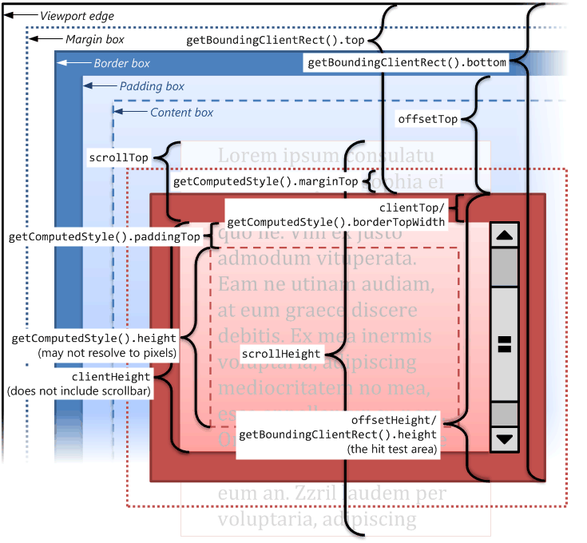

# 目录

<a href="#JS兼容写法">**JS兼容写法**</a>

* <a href="#浏览器高度">浏览器高度</a>
* <a href="#屏幕可视区域的宽高">屏幕可视区域的宽高</a>
* <a href="#获取节点的兼容">获取节点的兼容</a>
* <a href="#event获取目标对象">event获取目标对象</a>
* <a href="#阻止冒泡">阻止冒泡</a>
* <a href="#阻止默认行为">阻止默认行为</a>
* <a href="#事件监听的兼容">事件监听的兼容</a>
* <a href="#清除选中">清除选中</a>
* <a href="#滚动事件mouseWheel">滚动事件mouseWheel</a>

* 

# <a name="JS兼容写法">**JS兼容写法**</a>

## <a name="浏览器高度">浏览器高度</a>
>

    页面宽/高(包括滚动的部分) ： document.documentElement.scrollWidth / scrollHeight | $(document).width() / height()

    窗口相对于屏幕的X和Y坐标： window.screenTop / window.screenLeft

    屏幕分辨率的宽： window.screen.width
    屏幕分辨率的高： window.screen.height
    屏幕可用工作区高度： window.screen.availHeight

    el.offsetWidth/offsetHeight：包含content + padding + border，效果与el.getBoundingClientRect()相同
    el.clientWidth/clientHeight：只包含content + padding，不包含滚动条
    el.scrollWidth/scrollHeight：包含content + padding + 包含滚动条

## <a name="屏幕可视区域的宽高">屏幕可视区域的宽高</a>

标准模式(有DTD)(CSS1Compat)： document.documentElement.clientWidth / clientHeight

ie9及其以上的版本   window.innerWidth / innerHeight  

混杂模式 (没有DTD)(BackCompat)： document.body.clientWidth / clientHeight

jquery方法: $(window).width() / height()

兼容写法：
>
    clientWidth = 
      document.documentElement.clientWidth || 
      window.innerWidth || 
      document.documentElement.clientWidth

    clientHeight =
     document.documentElement.clientHeight || 
     window.innerHeight || 
     document.body.clientHeight
     

## <a name="滚动条滚动的距离">滚动条滚动的距离</a>

标准模式 (有DTD)(CSS1Compat): window.pageYOffset

IE低版本(ie<=8)的标准模式 (有DTD)(CSS1Compat): document.documentElement.scrollTop

混杂模式 (没有DTD)(BackCompat): document.body.scrollTop

jquery方法：$(document).scrollTop(); 

兼容写法：
>
    scrollTop = 
      window.pageYOffset || 
      document.documentElement.scrollTop ||  document.body.scrollTop  

    scrollLeft = 
      window.pageXOffset ||  
      document.documentElement.scrollLeft ||  document.body.scrollLeft 

封装函数：
>
    function scroll() { 
      if(window.pageYOffset != null) {  // ie9+ 高版本浏览器
        // 因为 window.pageYOffset 默认的是  0  所以这里需要判断
        return {
          left: window.pageXOffset,
          top: window.pageYOffset
        }
      }
      else if(document.compatMode === "CSS1Compat") {    // 标准浏览器   来判断有没有声明DTD
        return {
          left: document.documentElement.scrollLeft,
          top: document.documentElement.scrollTop
        }
      }
      return {   // 未声明 DTD
        left: document.body.scrollLeft,
        top: document.body.scrollTop
      }
    }

## <a name="鼠标在页面的位置">鼠标在页面的位置 = 被卷去的部分+鼠标在当前屏幕的坐标</a>
>

    event = event || window.event;
    // pageX、Y 鼠标在页面的位置
    //scrollLeft、scrollTop为上面 滚动条滚动的距离的兼容写法
    //event.clientX、Y 鼠标点击的位置相对于文档的左边距，上边距
    var mouseX = event.pageX || (scrollLeft + event.clientX)
    var mouseY = event.pageY || (scrollTop + event.clientY)

>
    document.querySelector('html').addEventListener('click',function(e){
      scrollTop = window.pageYOffset || document.documentElement.scrollTop ||  document.body.scrollTop  
      scrollLeft = window.pageXOffset || document.documentElement.scrollLeft ||  document.body.scrollLeft 
      var event = e || window.event
      console.log(event)
      console.log('event.pageX,event.clientX，scrollLeft',event.pageX , event.clientX,scrollLeft)
      console.log('event.pageY,event.clientY，scrollTop',event.pageY, event.clientY,scrollTop)
      var pagex = event.pageX || (scrollLeft + event.clientX);
      var pagey = event.pageY || (scrollTop + event.clientY);
      console.log('pagex,y',pagex,pagey)
    })

## <a name="获取节点的兼容">获取节点的兼容</a>
>
    firstElementChild || firstChild
    lastElementChild || lastChild
    previousElementSibling || previousSibling
    nextElementChild || nextChild

## <a name="event获取目标对象">event获取目标对象</a>
>
    IE678  event.srcElement(事件源)
    其他   event.target(事件源)

    function getTarget(e){   
      const event = e || window.event // w3c | IE
      event.target?e.target:event.srcElement
    } 

## <a name="阻止冒泡">阻止冒泡</a>
>
    w3c的方法是：(火狐、谷歌、IE11)event.stopPropagation()
    IE10以下则是使用：event.cancelBubble = true

    function stopPropagation(e){
      const  event = e || window.event;
      event.stopPropagation ? event.stopPropagation() : event.cancelBubble = true;
    }

## <a name="阻止默认行为">阻止默认行为</a>
>
    w3c:preventDefault()
    IE:returnValue = false

    function preventDefault(e){ 
      cosnt event = e || window.event;
      event.preventDefault ? event.preventDefault() : event.returnValue = false;
    }

## <a name="事件监听的兼容">事件监听的兼容</a>
  //eventListen.addEvent(btn,"click",fn)
>
    eventListen={
      addEvent: function (target, type, fn) {
        if (target.addEventListener) {
          target.addEventListener(type,fn);
        } else if(target.attachEvent) {
          target.attachEvent("on" + type, fn);
        } else {
          target["on" + type] = fn;
        }
      },
      removeEvent: function(target, type, fn) { //IE6~8
        if (target.removeEventListener) {
          target.removeEventListener(type, fn);
        } else if(target.removeEvent) {
          target.detachEvent("on" + type, fn);
        } else {
          target["on" + type] = null;
        }
      }
    }
>
    Event = {
    // 参数： 操作的元素,事件名称 ,事件处理程序
    // 添加事件
      addEvent : function(ele, type, handler) {
        ele.addEventListener?ele.addEventListener(type, handler, false):
        ele.attachEvent?ele.attachEvent('on'+type,function(){handler.call(ele);}):
        elet['on' + type] = handler;
      },
    // 移除事件
      removeEvent : function(ele, type, handler) {
        ele.removeEventListener?ele.removeEventListener(type, handler, false):
        ele.datachEvent?ele.detachEvent('on' + type, handler):
        ele['on' + type] = null;
      },
    // 阻止事件 (主要是事件冒泡，因为IE不支持事件捕获)
      stopPropagation : function(e) {
       var e=window.event || e;
        e.stopPropagation?e.stopPropagation():e.cancelBubble = true;
      },
    // 取消事件的默认行为
      preventDefault : function(e) {
       var e=window.event || e;
        e.preventDefault?e.preventDefault():e.returnValue = false;
      },
    // 获取事件目标
      getTarget : function(e) {
             var e=window.event || e;
        return e.target || e.srcElement;
      },
    };

## <a name="清除选中">清除选中</a>
>
    window.getSelection ? window.getSelection().removeAllRanges() : document.selection.empty();
                                              IE9以下

## <a name="滚动事件mouseWheel">滚动事件mouseWheel</a>
>
    Firefox：DOMMouseScroll    (detail判断上下滑动)
      向上滚动：e.detail < 0
      向下滚动 ：e.detail > 0
>
    IE/Chrome/Safari/Opera：mousewheel  (wheelDelta判断鼠标上下滑动)
      向上滚动：  e.wheelDelta == -120
      向下滚动 ： e.wheelDelta == 120

## 
## 
## 