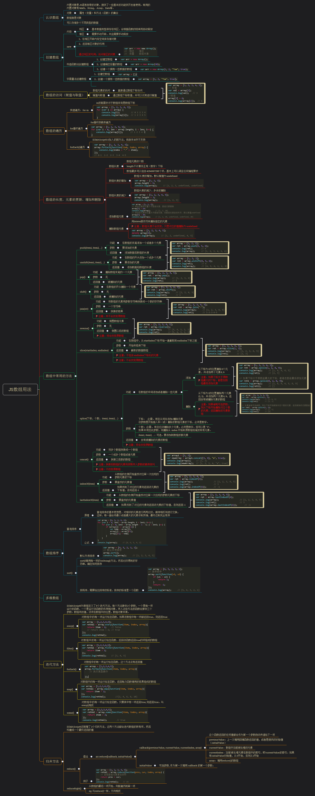

[Array - MDN](https://developer.mozilla.org/zh-CN/docs/Web/JavaScript/Reference/Global_Objects/Array)

  

    展开/收缩
  

  
  

* 
##  

数组属性、方法

* <a href="#属性">属性</a>
    * <a href="#length">length</a>
    * <a href="#Array.protype">Array.protype</a>
* <a href="#方法">方法</a>
    * <a href="#toString()">toString()</a>
    * <a href="#toLocaleString()">toLocaleString()</a>
    * <a href="#Array.isArray()">Array.isArray()判断是否数组</a>
    * <a href="#Array.of()">Array.of()</a>
    * <a href="#Array.from()">Array.from()</a>
    * <a href="#find()、findIndex(),indexOf()、lastIndexOf(),includes()">find()、findIndex(),indexOf()、lastIndexOf(),includes())</a>
    * <a href="#join()">join()数组转字符串</a>
    * <a href="#fill()">fill()填充数组 -- 改变原数组</a>
    * <a href="#push()、unshift()、pop()、shift()">push()、unshift()、pop()、shift() -- 改变原数组</a>
    * <a href="#slice()">slice() -- 不改变原数组</a>
    * <a href="#splice()">splice() -- 改变原数组</a>
    * <a href="#sort()">sort() -- 改变原数组</a>
    * <a href="#reverse()">reverse() -- 改变原数组</a>
    * <a href="#flat()">flat()数组扁平化-- 不改变原数组</a>
    * <a href="#concat()">concat() -- 不改变原数组</a>
    * <a href="#copyWith()">copyWith() -- 改变原数组，但不改变原数组长度</a>
 
    * <a href="#forEach()">forEach() -- 不改变原数组</a>
    * <a href="#map()">map() -- 不改变原数组</a>
    * <a href="#some()、every()、filter()">some()、every()、filter() -- 不改变原数组</a>
    * <a href="#reduce()、reduceRight()">reduce()、reduceRight()</a>
    * <a href="#keys()、values()、entries()">keys()、values()、entries()——用于遍历数组。它们都返回一个遍历器对象</a>

* 

# <a name="属性">属性</a>
## <a name="length">length</a>
每个数组都有一个length属性。针对稠密数组，length属性值代表数组中元素的个数。当数组是稀疏数组时，length属性值大于元素的个数。
>
    let arr = [ 'a', 'b', 'c' ];  
    console.log(arr.length);  // 输出 3

    //删除数组
        arr.length = 2;
        console.log(arr);  // 输出 [ "a", "b" ]

        delete arr[2] //返回true | false
        console.log(arr);  // 输出 [ "a", "b",undefined ]

    //增加数组
    arr.length = 4;
    console.log(arr);  // 输出 [ "a", "b"，"c", undefined ]

## <a name="Array.protype">Array.protype</a>
Array 构造函数的原型，并允许您向所有Array对象添加新的属性和方法。

属性特性：
>
    writable	false
    enumerable	false
    configurable	false

Array.prototype.length = 0 //它是个空数组

Array.prototype.constructor === Array //true 实例的原型的构造函数既本身

# <a name="方法">方法</a>
## <a name="toString()">toString()</a>
返回一个字符串，表示指定的数组及其元素

Array对象覆盖了Object的 toString 方法。对于数组对象，toString 方法连接数组并返回一个字符串，其中包含用逗号分隔的每个数组元素。

当一个数组被作为文本值或者进行字符串连接操作时，将会自动调用其 toString 方法。
>
    [1,3,'a'].toString() //"1,3,4,a"

## <a name="toLocaleString()">toLocaleString()</a>
toLocaleString(locales, options)

返回一个字符串表示数组中的元素。数组中的元素将使用各自的 toLocaleString 方法转成字符串，这些字符串将使用一个特定语言环境的字符串（例如一个逗号 ","）隔开。

locales 可选  
带有BCP 47语言标记的字符串或字符串数组，关于locales参数的形式与解释，请看Intl页面。  

options 可选  
一个可配置属性的对象，对于数字Number.prototype.toLocaleString()，对于日期Date.prototype.toLocaleString()
>
    var array1 = [1, 'a', new Date('21 Dec 1997 14:12:00 UTC')];
    var localeString = array1.toLocaleString('en', {timeZone: "UTC"});

    console.log(localeString);//  "1,a,12/21/1997, 2:12:00 PM"

>
    var prices = ['￥7', 500, 8123, 12];
    prices.toLocaleString('ja-JP', { style: 'currency', currency: 'JPY' });

    // "￥7,￥500,￥8,123,￥12"

## <a name="Array.isArray()"> Array.isArray()判断是否为数组</a>
>

    console.log(Array.isArray([1, 2, 3]));   // 输出 true
    console.log(Array.isArray({num: 123}));   //输出 false

## <a name="Array.of()">Array.of()、Array()</a>
将一组值 转换为数组，不管参数的数量或类型如何。
>

  console.log(Array.of(3));    // 输出 [3]
  console.log(Array.of(1,2,3));   // 输出 [1,2,3]

主要目的，是弥补数组构造函数Array()的不足。因为参数个数的不同，会导致Array()的行为有差异。
>
    Array() // []
    Array(3) // [, , ,]
    Array(3, 11, 8) // [3, 11, 8]
>
    Array.of() // []
    Array.of(3) // [3]
    Array.of(3, 11, 8) // [3,11,8]

## <a name="Array.from">Array.from()</a>
将(如: 数组、类数组、可遍历对象、或者是字符串、map 、set 等可迭代对象) 转为数组。

* Array.from(arrayLike[, mapFunction[, thisArg]])

arrayLike：必传参数，想要转换成数组的伪数组对象或可迭代对象。

mapFunction：可选参数，mapFunction(item，index){…} 是在集合中的每个项目上调用的函数。返回的值将插入到新集合中。

thisArg：可选参数，执行回调函数 mapFunction 时 this 对象。这个参数很少使用。
  >

      console.log(Array.from('abcd'));  // 输出 [ "a", "b", "c", "d" ]
      console.log(Array.from([1, 2, 3], item => item + 1));  // 输出 [ 2, 3, 4 ]

* 使用值填充数组
  >
      Array.from({length:3} , () => ({})) // [{},{},{}]
      Array(3).fill({}) // [{},{},{}]
      Array(3).map(() => {}) // [undefined, undefined, undefined]
      //这是因为 Array(length) 创建了一个有3个空项的数组(也称为稀疏数组)，但是 map() 方法会跳过空项。

* 生成数字范围[0,1,2....]
  >
      Array.from({ length: 5 }, (item, index) => index)
      // [0,1,2,3,4]

* 克隆数组
>
    // 数组的浅拷贝
    Array.from([1,2,3]) //[1,2,3]

    // 深拷贝（限于数组嵌套）
    function clone(val) {
      return Array.isArray(val) ? Array.from(val, clone) : val;
    }

## <a name="find()、findIndex(),indexOf()、lastIndexOf(),includes()">find()、findIndex(),indexOf()、lastIndexOf(),includes()</a>

### find()、findIndex()

find(callback[, thisArg])  
callback：在数组每一项上执行的函数，接收 3 个参数
>
    element：当前遍历到的元素。

    index可选：当前遍历到的索引

    array可选：数组本身

thisArg可选： 执行回调时用作this 的对象。

* find() 找到第一个满足检测函数条件的元素，并返回该元素，没找到则返回 undefined。
>

    let arr = [1, 2, 3, 4, 5];
    console.log(arr.find(x => x > 3));    // 输出  4

* findIndex() 找到第一个满足检测函数条件的元素，并返回该元素索引。找不到返回-1。
>

    let arr = [6, 7, 8, 9, 10];
    console.log(arr.findIndex(x => x > 8));    // 输出  3

### indexOf()、lastIndexOf()
indexOf(searchElement[, fromIndex = 0])  
lastIndexOf(searchElement[, fromIndex = arr.length - 1])

searchElement： 查找的元素  
fromIndex：表示查找的起始位置。

* indexOf() 查找元素并返回第一个满足的元素索引值，找不到返回-1。  

>

    let arr= [1, 2, 3, 4];
    console.log(arr.indexOf(3));    // 输出 2
    console.log(arr.indexOf(6));    // 输出 -1
    console.log(arr.indexOf(2, 2));    // 输出 -1
   

* lastIndexOf() 从后向前查找元素并返回元素索引值，找不到返回 -1。
>
    let arr = ['a', 'b', 'c', 'd'];
    console.log(arr.lastIndexOf('b'));    // 输出 1
    console.log(arr.lastIndexOf('e'));    // 输出 -1

### includes()
includes(searchElement[, fromIndex=0])

searchElement：查找的元素   
fromIndex：表示查找的起始位置，  
  >为负值从this.length + fromIndex 开始  
  >大于等于数组的长度，则会返回 false，且该数组不会被搜索。

判断一个数组是否包含一个指定的值，根据情况，如果包含则返回 true，否则返回false。

对象数组不能使用includes方法来检测
>

    let arr = [1, 2, 3];
    console.log(arr.includes(2));    // 输出 true
    console.log(arr.includes(4));    // 输出 false

## <a name="join()">join()数组转字符串 -- 不改变原数组</a>
join([separator])  
指定一个字符串来分隔数组的每个元素。如果缺省该值，默认逗号（,）分隔。如果separator是空字符串("")，则所有元素之间都没有任何字符。

`如果一个元素为 undefined 或 null，它会被转换为空字符串。`

>
    let arr= [ 'a', 'b', 'c', 1, null, undefined ];
    console.log(arr.join());    // 输出 "a,b,c,1,,"
    console.log(arr.join("-"));   // 输出"a-b-c-1--"

## <a name="fill()">fill() 用一个固定值填充数组-- 改变原数组</a>
fill(value,start,end)  
用一个固定值填充一个数组中从起始索引到终止索引内的全部元素。不包括终止索引。`改变原数组，不能改变数组长度`

用于空数组的初始化非常方便。数组中已有的元素，会被全部抹去。  

value: 填充的值   
start: 填充的起始位置 （默认0），负数为 this.length+start  
end: 填充的结束位置（不包含）（默认this.length），负数为this.length+end  

>
    let arr = [1, 2, 3, 4];
    console.log(arr.fill(9, 1, 2));    // 输出 [ 1, 9, 3, 4 ]
    console.log(arr.fill(8, 1));      // 输出 [ 1, 8, 8, 8 ]
    console.log(arr.fill(7));          // 输出 [ 7, 7, 7, 7 ]

## <a name="push()、unshift()、pop()、shift()">push()、unshift()、pop()、shift() -- 改变原数组</a>

push() 在尾部添加一个或多个元素，返回数组的新长度。
>
    let arr= ['a', 'b', 'c'];
    console.log(arr.push('d'));   // 输出 4
    console.log(arr);   // 输出 [ "a", "b", "c", "d" ]

____

unshift() 在头部添加一个或多个元素，并返回数组的新长度。
>
    let arr = [ 4, 5, 6 ];
    console.log(arr.unshift(3));    // 输出 4
    console.log(arr);    // 输出 [ 3, 4, 5, 6 ]
    console.log(arr.unshift(1, 2));    // 输出 6
    console.log(arr);    // 输出 [ 1, 2, 3, 4, 5, 6 ]

____

pop() 从尾部删除一个元素，并返回该元素。
>
    let arr= ['a', 'b', 'c', 'd'];
    console.log(arr.pop());    // 输出 d
    console.log(arr);    // 输出 [ "a", "b", "c" ]

____

shift() 从头部删除一个元素，并返回该元素。
>
    let arr = [1, 2, 3];
    console.log(arr.shift());    // 输出 1
    console.log(arr);    // 输出 [ 2, 3 ]

## <a name="slice()">slice() -- 不改变原数组</a>
slice(start, end) 删除元素，返回一个新的数组对象，`不会改变原数组`  
start：开始位置（包含），默认0   
  >负数，表示从原数组中的倒数第几个元素开始提取  
  >大于原数组的长度，则会返回空数组 

end： 结束位置（不包含）,默认this.length
  >负数，表示从原数组中的倒数第几个元素结束提取  
  >大于数组的长度，this.length

## <a name="splice()">splice() -- 改变原数组</a>
splice(start, deleteCount, item1,tem2, ...)   添加、替换、删除元素。以数组形式返回被删除的元素(没有删除元素，返回空数组)。`改变原数组`    
start：表示替换的位置  
deleteCount ：表示删除元素的数量(>=0)   
item1... ： 表示添加的元素  
>

    let arr = [ 'a', 'c', 'd' ];

    arr.splice( 1, 0, 'b'); //返回 []
    console.log(arr);    // 输出 [ "a", "b", "c", "d" ]

    arr.splice(1,1);     // 返回 ["b"]
    console.log(arr);    // 输出 [ "a", "c", "d" ]

    arr.splice(1,1,'bb','cc');// 返回["c"]
    console.log(arr);    // 输出 [ "a", "bb", "cc", "d" ]

## <a name="sort()">sort() -- 改变原数组</a>
sort(compareFunction(a, b)) 数组排序，并返回新数组 。`改变原数组`

默认排序顺序是在将元素转换为字符串，然后比较它们的UTF-16代码单元值序列时构建的

>
    let arr = [ 4, 3, 10, 2 ];
    console.log(arr.sort());    // 输出 [ 10, 2, 3, 4 ]

    //升序
    console.log(arr.sort((a, b) => a - b));    // 输出 [ 2, 3, 4, 10 ]

    //降序
    console.log(arr.sort((a, b) => b - a));    // 输出 [ 2, 3, 4, 10 ]

## <a name="reverse()">reverse() -- 改变原数组</a>

reverse() 倒置数组，并返回新数组。`会改变原数组`
>

    let sourceArray= [ 'a', 'b', 'c' ];
    let reverseArray = sourceArray.reverse();
    console.log(reverseArray);    // 输出 [ "c", "b", "a" ]
    console.log(sourceArray == reverseArray);    // 输出 true

## <a name="flat()">flat()数组扁平化-- 不改变原数组</a>

flat(n)按指定深度递归遍历数组，并返回包含所有遍历到的元素组成的新数组。`不改变原数组`。  

n:要提取嵌套数组的结构深度，默认值为 1。使用 Infinity 作为深度，展开任意深度的嵌套数组  

会移除数组中的空项
>
    let arr1 = [ 1, 2, ,'',null, undefined,[ 3, 4 ] ];
    console.log(arr1.flat());     // 输出 [1, 2, '', null, undefined, 3, 4]  ---移除数组中的空项

    let arr2 = [ 1, 2, [3, 4, [ 5, 6 ] ] ];
    console.log(arr2.flat());    // 输出 [ 1, 2, 3, 4,  [ 5, 6 ] ]

    let arr3 = [1, 2, [ 3, 4, [ 5, 6 ] ] ];
    console.log(arr3.flat(2));    // 输出 [ 1, 2, 3, 4, 5, 6 ]

    console.log(arr3.flat(Infinity));    // 输出 [ 1, 2, 3, 4, 5, 6 ]

## <a name="concat()">concat() -- 不改变源数组</a>
合并两个或多个数组，返回新数组，`不改变源数组`  
arr.concat(arr2,arr3,...)
>

  let arr = [ 'a', 'b' ];
  let arr1 = [ 'c', 'd' ];
  console.log(arr.concat(arr1));    // 输出 [ "a", "b", "c", "d" ]
  该方法可以有多个参数。

## <a name="copyWithin()">copyWithin() -- 改变原数组，但不改变原数组长度</a>
copyWithin(target,start,end)  
浅复制数组的一部分到改数组中的另一个位置，返回数组，`改变原数组，但不改变原数组长度`  

target : 要复制到的索引位置，如为负值则从后向前计数。
start : 要复制序列的起始索引位置，如为负值则从后向前计数。如省略该值，则从索引0开始。
end : 要复制序列的结束位置，如为负值则从后向前计数。如省略该值，则复制到结尾位置。

>

    let arr = ['a', 'b', 'c', 'd', 'e','f'];
    console.log(arr.copyWithin(0, 3, 5));    // 输出 [ "d", "e", "c", "d", "e", "f" ]
    console.log(arr.copyWithin(1, 3));    // 输出 [ "d", "d", "e", "f", "e", "f" ]

   

## <a name="forEach()">forEach()-- 不改变原数组</a>
遍历数组 ,无法遍历对象, IE不支持  
`没有返回值 undefined` , `不改变原数组 、不能中断`
>
    forEach((item, index, array) => {})
    // 	item-- 当前元素的值
    // 	index--当前元素的索引
    // 	array--源数组
    //  break,continue不能中断其循环，使用return也不能返回到外层函数。
    arr.forEach((item, index, array) => {
      console.log('forEach()-->', 'index:', index, ';item:', item, '源数组:', array)
    });

## <a name="map()">map() -- 不改变原数组</a>
遍历数组，返回修改后的数组，`不改变原数组，不能中断`
>
    arr.map((item, index) => {
      console.log('map()-->', 'index:', index, ';item:', item)
      return item + index
    });

## <a name="some()、every()、filter()">some()、every()、filter() -- 不改变原数组</a>
some、、every、filter(item, index, array)  
item: 键值  
index: 索引  
array：源数组  

| |检测元素是否符合条件| 空数组测试| 不改变原数组|
|:--|:--|:--:|:--:|
|every()| 全部满足才返回true|返回false| √|
|some()| 一个满足就返回true|返回false|√ | 
|filter()| 数组形式返回符合元素|返回[]| √|

>

    let arr = [ 1, 2, 3, 4 ];
    arr.some((item, index, array) => {
      console.log(item, index, array)
    })
    console.log(arr.some(x => x >3));    // 输出  true
    console.log(arr.some(x => x > 5));    // 输出  false
____

* every()  

检测数组中是否`所有元素`可以通过检测函数验证。返回Boolean值；（某个元素不满足会立即返回false）  
>
    let arr = [ 1, 2, 3, 4 ];
    arr.some((item, index, array) => {
      console.log(item, index, array)
    })
    console.log(arr.every(x => x < 8));    //输出 true
    console.log(arr.every(x => x < 4));    //输出 false

____

* filter() 

以数组形式返回满足条件的元素，没有返回[]
>
    arr.filter((item, index, array) => {
      return index > 1 //返回索引大于1的元素
    });

## <a name="reduce()、reduceRight()">reduce()、reduceRight()</a>
reduce((sum, item, index, array) => {})  
reduce()接收一个函数作为累加器，数组中的每个值（从左到右）开始缩减，最终为一个值，  
// reduceRight() (从右到左)  

sum：累计器 累计回调的返回值; 它是上一次调用回调时返回的累积值)  
item：当前值  
index：当前索引
array：源数组
>

    arr.reduce((prev, now, index, array) => {
      console.log('reduce()-->', '前一个值prev', prev, ';当前索引index:', index, ';值now:', now, '源数组array:', array);
      return prev += now
    }, 0);

    //使用reduce进行数组扁平化
    let givenArr = [[1, 2, 2], [3, 4, 5, 5], [6, 7, 8, 9, [11, 12, [12, 13, [14]]]], 10];
    // 扁平结果：[1,2,2,3,4,5,5,6,7,8,9,11,12,12,13,14,10]
    function flatted(arr) {
      return arr.reduce((pre, now, index, array) => {
        return pre.concat(Array.isArray(now) ? flatted(now) : now) 
      }, [])
    }

## <a name="keys()、values()、entries()">keys()、values()、entries()——用于遍历数组。它们都返回一个遍历器对象</a>
entries(): 键/值对迭代器  
keys():键迭代器  
values(): 值迭代器  

next()，返回一个对象{ value: 数组的key, done: false }  
next().done 用于指示迭代器是否完成：在每次迭代时进行更新而且都是false

    let iterator = arr.entries();
    iterator.next() // {done: false, value: [0, "a"]}
    iterator.next() // {done: false, value: [1, "b"]}
    iterator.next() // {done: true, value: undefined}

    for (let [index, item] of arr.entries()) {
      console.log('entries()-->','index:', index, ';item:', item);
    }
    for (let index of arr.values()) {
      console.log('.values()-->', 'index:', index);
    }
    for (let item of arr.keys()) {
      console.log('.keys()-->', 'item:', item);
    }

## 
## 
## 