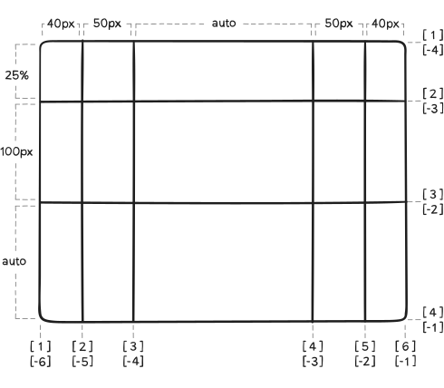
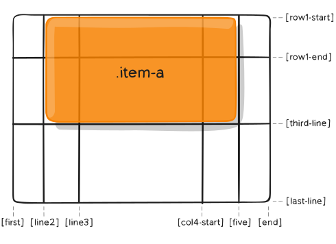

# [Grid](https://www.html.cn/archives/8510)

[兼容性](https://caniuse.com/#search=grid)

## 基本

Grid(网格)布局，是一个二维的基于网格的布局系统，它的目标是完全改变我们基于网格的用户界面的布局方式

display:grid | inline-grid;

使用 grid-template-columns 和 grid-template-rows 设置 列 和 行 的尺寸大小，  
然后通过 grid-column 和 grid-row 将其子元素放入这个 grid(网格) 中。

* 网格项(Grid Item):网格容器（Grid Container）的直接子元素
>
    这里 item 元素就是网格项(Grid Item)，但是 sub-item 不是。
    

      

 
      

        

      

      

    

* 网格线(Grid Line):构成网格结构的分界线。它们既可以是垂直的（“列网格线(column grid lines)”），也可以是水平的（“行网格线(row grid lines)”），并位于行或列的任一侧。例如，这里的黄线就是一条列网格线  
  

* 网格轨道(Grid Track): 两条相邻网格线之间的空间。你可以把它们想象成网格的列或行。  
  下图是第二条和第三条 行网格线 之间的 网格轨道(Grid Track)。  
  

* 网格单元格(Grid Cell):两个相邻的行和两个相邻的列网格线之间的空间。这是 Grid(网格) 系统的一个“单元”。  
  下图是第 1 至第 2 条 行网格线 和第 2 至第 3 条 列网格线 交汇构成的 网格单元格(Grid Cell)。
  

* 网格区域(Grid Area):4条网格线包围的总空间。一个 网格区域(Grid Area) 可以由任意数量的 网格单元格(Grid Cell) 组成。  
  下图是 行网格线1和3，以及列网格线1和3 之间的网格区域。  
  
  
  
## 容器属性
* display: 将元素定义为网格容器，并为其内容建立新的 网格格式上下文。
  >grid | inline-grid  
  >块级网格 | 内联网格

* grid-template-rows / grid-template-columns: 使用空格分隔的值列表，用来定义网格的列和行。这些值表示 网格轨道(Grid Track) 大小，它们之间的空格表示网格线。
  >grid-template-columns: \<track-size> ... | \<line-name> \<track-size> ...;  

  >\<track-size>： 长度值(px...) | auto | 百分比 | 等份网格容器中可用空间（使用 fr 单位）  
  >>grid-template-columns: 1fr 1fr 1fr 1fr;每个网格项等分为网格容器宽度的四分之一  
  >>grid-template-columns: 1fr 50px 1fr 1fr;剩余可用空间是除去所有非灵活网格项之后计算得到的。此例中，可用空间总量减去 50px 后，再给 fr 单元的值 3 等分：

  >\<line-name>：自定义网格线名称，需在\[]中（如：\[自定义网格名]） ;可以有多个名称空格隔开（[name1 name2]）
     
  (如果未显示的给网格线命名)，轨道值之间仅仅有空格时，网格线会被自动分配数字名称：
  >
      //定义了5行，3列的网格
      .container {
        grid-template-columns: 40px 50px auto 50px 40px;
        grid-template-rows: 25% 100px auto;
      }
    
    
  给网格线指定确切的命名。 注意中括号里的网格线命名语法：
  >   
      //[]里的网格名都是自定义的
      请注意，一条网格线(Grid Line)可以有多个名称。例如，这里的第二条 行网格线将有两个名字：row1-end 和 row2-start ：
      .container {
        grid-template-columns: [first] 40px [line2] 50px [line3] auto [col4-start] 50px [five] 40px [end];
        grid-template-rows: [row1-start] 25% [row1-end row2-start] 100px [third-line] auto [last-line];
      }

    

repeat()函数：如果你的定义包含多个重复值，则可以使用其来简化定义 
> repeat(auto-fill | auto-fit | number, \<line-name> \<track-size> \<line-name> \<track-size> ...)   

>auto-fill:自动填充轨道，最后不会折叠空轨道,保留空轨道留白

>auto-fit:自动调整轨道，与 auto-fill 相同，只是在网格项目放置后，它只会根据需要创建任意数量的轨道，最后折叠空轨道，将空轨道的空间全部平均分配给已有元素的轨道

>\<line-name> \<track-size>可设置多个，对应行列相应网格的宽高  
>> grid-template-columns: repeat(3, 10px 20px 80px);定义了6列，第一列和第四列的宽度为10px，第二列和第五列为20px，第三列和第六列为80px。

>注意：repeat(auto-fill, 1fr); 只会创建一个轨道，因为宽度为 1fr 的单个轨道已经填满了整个网格容器。  
>
    grid-template-columns: repeat(3, [col-start] 1fr);
    等价于
    grid-template-columns: [col-start] 1fr [col-start] 1fr [col-start] 1fr;

minmax(min,max)函数
>min | max值 : auto | \<length> | percent | 弹性值(fr) | max-content(单元格最大宽度) | min-content(单元格最小宽度)  
>> auto 如果用于最大值，相当于max-content值；  
>>如果用于最小值，那么auto值相当于min-content。  

* grid-template-areas:通过引用项目的grid-area 属性指定的网格区域(Grid Area) 名称来定义网格模板。重复网格区域的名称导致内容跨越这些单元格。一个点号（.）代表一个空单元格。这个语法本身可视作网格的可视化结构。  
  >grid-template-areas: "\<grid-area-name> | . | none | ..."  
  >\<grid-area-name>：由网格项的 grid-area 指定的网格区域名称  
  >\.（点号）：代表一个空的网格单元  
  >none：不定义网格区域  
  >
      // grid-template-areas 声明中的每一行都需要有相同数量的单元格
      .header {
          grid-area: header;
          background-color: #74c576;
      }
      .footer {
          grid-area: footer;
        background-color: #f89427;
      }
      .main {
          grid-area: main;
          background-color: #3dbfe6;
      }
      .sidebar {
          grid-area: sidebar;
          background-color: #ec7272;
      }

      .container {
        display: grid;
        grid-template-columns: repeat(4,1fr);
        grid-template-rows: auto;
        grid-template-areas: 
          "header header header header"
          "main main . sidebar"
          "footer footer footer footer";
      }
      

        
header

        
main

        
sidebar

        
footer

      

  

* grid-template:grid-template-rows grid-template-columns  grid-template-areas 简写属性
  >none：将所有三个属性设置为其初始值  
  >\<grid-template-rows> / \<grid-template-columns>：将 grid-template-columns 和 grid-template-rows 设置为相应地特定的值，并且设置grid-template-areas为none

  >
      //上面.container的css等价于
      .container {
        display: grid;
        grid-template:
          "header header header header" auto 
          "main main . sidebar" auto 
          "footer footer footer footer" auto 
          / 1fr 1fr 1fr 1fr;
      }

  由于 grid-template 不会重置 隐式 网格属性（grid-auto-columns， grid-auto-rows， 和 grid-auto-flow），
这可能是你想在大多数情况下做的，建议使用 grid 属性而不是 grid-template。

* grid-row-gap 、grid-column-gap：指定网格线(grid lines)的大小（列/行之间间距的宽度）
  >长度，百分比或 calc  

  

* grid-gap：grid-row-gap grid-column-gap 简写形式
  >省略第二个，则值同第一个
  >>grid-gap: 10px 10px; 等价于 grid-gap: 10px;

* justify-items: 沿着 inline（行）轴线对齐网格项(grid items)。此值适用于容器内的所有网格项。  
  >stretch：填满单元格的宽度（默认值）  
  >start：将网格项对齐到其单元格的左侧起始边缘（左侧对齐）  
  >center：将网格项对齐到其单元格的水平中间位置（水平居中对齐） 
  >end：将网格项对齐到其单元格的右侧结束边缘（右侧对齐）  

  

  也可以通过每个单独网格项(grid items) 的 justify-self 属性设置。

* align-items: 沿着 block（列）轴线对齐网格项(grid items)。此值适用于容器内的所有网格项。
  >stretch：填满单元格的高度（默认值）  
  >start：将网格项对齐到其单元格的顶部起始边缘（顶部对齐）  
  >center：将网格项对齐到其单元格的垂直中间位置（垂直居中对齐）  
  >end：将网格项对齐到其单元格的底部结束边缘（底部对齐  ）

  

  也可以通过每个单独网格项(grid items) 的 align-self 属性设置

* place-items:align-items justify-items 的简写形式。
  >省略第二个，则值同第一个

---

网格合计大小可能小于其 网格容器(grid container) 大小
>
    //网格容器   width: 1000px;height: 600px;
    //此时网格合计width: 900px;height: 300px;
    ul{
      list-style: none;
      display:grid;
      width: 1000px;
      height: 600px;
      grid-template:  repeat(3,100px) / repeat(3,300px);
      /* justify-content: start; */
      /* align-content: space-between; */
      background-color: gold;
    }
    li{
      border:1px solid #000;
    }
    <ul>
      <li>1</li><li>2</li><li>3</li><li>4</li>
      <li>5</li><li>6</li><li>7</li><li>8</li><li>9</li>
    </ul>

* justify-content: 设置网格容器内的网格的对齐方式。 此属性沿着 inline（行）轴线对齐网格 
  >start(默认值)：将网格对齐到 网格容器(grid container) 的左侧起始边缘（左侧对齐）  
  >center：将网格对齐到 网格容器 的水平中间位置（水平居中对齐）  
  >end：将网格对齐到 网格容器 的右侧结束边缘（右侧对齐）  
  >stretch：调整 网格项(grid items) 的宽度，允许该网格填充满整个 网格容器 的宽度  
  >space-around：在每个网格项之间放置一个均匀的空间，左右两端放置一半的空间  
  >space-between：在每个网格项之间放置一个均匀的空间，左右两端没有空间  
  >space-evenly：在每个网格项目之间放置一个均匀的空间，左右两端放置一个均匀的空间  

  类似于flex的justify-content  
  `若网格合计宽度 等于 网格容器宽度时，此属性无效`

  justify-content-start   
    
  justify-content-stretch    
    
  justify-content-space-around  
    
  ....

* align-content: 设置网格容器内的网格的对齐方式。 此属性沿着 block（列）轴线对齐网格
  >start(默认值）：将网格对齐到 网格容器(grid container) 的顶部起始边缘（顶部对齐）  
  >end：将网格对齐到 网格容器 的底部结束边缘（底部对齐）  
  >center：将网格对齐到 网格容器 的垂直中间位置（垂直居中对齐）  
  >stretch：调整 网格项(grid items) 的高度，允许该网格填充满整个 网格容器 的高度  
  >space-around：在每个网格项之间放置一个均匀的空间，上下两端放置一半的空间  
  >space-between：在每个网格项之间放置一个均匀的空间，上下两端没有空间  
  >space-evenly：在每个网格项目之间放置一个均匀的空间，上下两端放置一个均匀的空间  
 
  类似于flex的align-items  
  `若网格合计高度 等于 网格容器高度时，此属性无效`

  align-content-start   
    
  ....

* place-content: align-content 和 justify-content 的简写形式。
  >省略第二个，则值同第一个
  >默认start start

当网格中的网格项多于单元格时，或者当网格项位于显式网格之外时，就会创建隐式轨道。[显式网格和隐式网格之间的区别](https://www.html.cn/archives/10327)。

* grid-auto-columns / grid-auto-rows: 指定任何自动生成的网格轨道(grid tracks)（又名隐式网格轨道）的大小。  
  >
      通过使用 minmax() 函数来指定范围，可以使调整隐式轨道更灵活。
      grid-auto-columns: minmax(200px, auto);
      grid-auto-rows: minmax(60px, auto);

* grid-auto-flow: 如果你有一些没有明确放置在网格上的网格项(grid items)，自动放置算法 会自动放置这些网格项。该属性控制自动布局算法如何工作。  
  >row（默认）：告诉自动布局算法依次填充每行，根据需要添加新行   
  >column：告诉自动布局算法依次填入每列，根据需要添加新列  
  >dense：告诉自动布局算法在稍后出现较小的网格项时，尝试填充网格中较早的空缺  

  >grid-auto-flow: row | column | row dense | column dense

* grid: grid-template-rows  grid-template-columns  grid-template-areas  grid-auto-rows  grid-auto-columns  grid-auto-flow 简写形式

## 项目属性
float，
display: inline-block，
display: table-cell，
vertical-align 和 column-* 属性对网格项无效

* grid-column-start / grid-column-end / grid-row-start / grid-row-end :
通过引用特定网格线(grid lines) 来确定 网格项(grid item) 在网格内的位置。 grid-column-start / grid-row-start 是网格项开始的网格线，grid-column-end / grid-row-end 是网格项结束的网格线。

  >\<line> ：可以是一个数字引用一个编号的网格线，或者一个名字来引用一个命名的网格线  
  >span \<number> ：该网格项将跨越所提供的网格轨道数量  
  >span \<name> ：该网格项将跨越到它与提供的名称位置  
  >auto：表示自动放置，自动跨度，默认会扩展一个网格轨道的宽度或者高度  

  >: \<number> | \<name> | span \<number> | span \<name> | auto

  >
      .item-a {
        grid-column-start: 2;
        grid-column-end: five;
        grid-row-start: row1-start
        grid-row-end: 3;
      }  
  

  >
      .item-b {
        grid-column-start: 1;
        grid-column-end: span col4-start;
        grid-row-start: 2
        grid-row-end: span 2
      }

  

* grid-column: grid-column-start / grid-column-end 简写形式  
* grid-row: grid-row-start / grid-row-end 简写形式  
  >grid-column: 3 / span 2;  
  >grid-row: third-line / 4;  

* grid-area：为网格项提供一个名称，以便可以 被使用网格容器 grid-template-areas 属性创建的模板进行引用。 另外，这个属性可以用作grid-row-start  grid-column-start  grid-row-end   grid-column-end 的简写。

  >\<name>：自定义名称  

  >\<row-start> / \<column-start> / \<row-end> / \<column-end> //数字或分隔线名称
  >>grid-area: 1 / col4-start / last-line / 6

  
  
* justify-self:沿着 inline（行）轴线对齐网格项。此值适用于单个网格项内的内容。
覆盖容器的justify-content属性

  >stretch：填满单元格的宽度（默认值）  
  >start：将网格项对齐到其单元格的左侧起始边缘（左侧对齐）  
  >center：将网格项对齐到其单元格的水平中间位置（水平居中对齐）  
  >end：将网格项对齐到其单元格的右侧结束边缘（右侧对齐）  

* align-self:沿着 block（列）轴线对齐网格项。此值适用于单个网格项内的内容。覆盖容器的align-content属性
  >stretch：填满单元格的高度（默认值）  
  >start：将网格项对齐到其单元格的顶部起始边缘（顶部对齐）  
  >center：将网格项对齐到其单元格的垂直中间位置（垂直居中对齐）  
  >end：将网格项对齐到其单元格的底部结束边缘（底部对齐）  

* place-self:align-self justify-self 简写形式。
  >auto 默认的对齐方式(stretch)。
  >>省略第二个，则值同第一个
