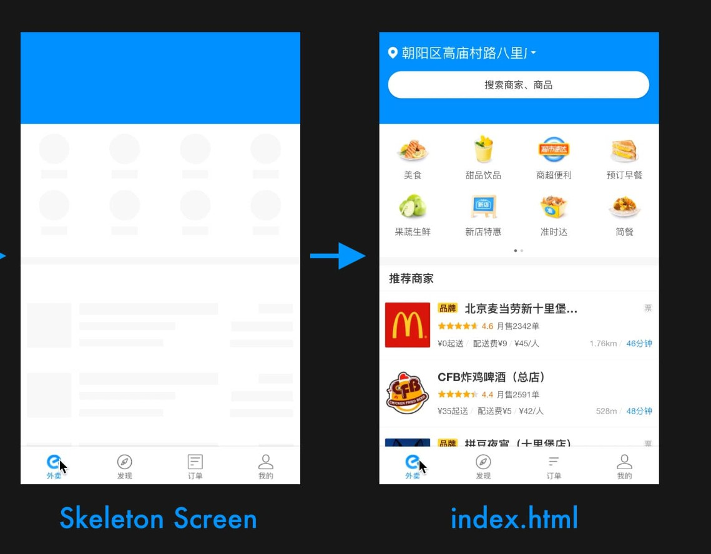

* <a href="#vue项目性能优化">Vue开发技巧+性能优化</a>


# <a name="vue项目性能优化">Vue开发技巧 + 性能优化</a>[](#top)  
[10个Vue开发技巧助力成为更好的工程师](https://juejin.im/post/5e8a9b1ae51d45470720bdfa)

[这 10 个技巧让你成为一个更好的 Vue 开发者](https://juejin.im/post/5e8286f6e51d4546c72dfff0)

[30 道 Vue 面试题，内含详细讲解（涵盖入门到精通，自测 Vue 掌握程度）](https://juejin.im/post/5d59f2a451882549be53b170)

[Vue 开发必须知道的 36 个技巧【近1W字】](https://juejin.im/post/5d9d386fe51d45784d3f8637)


[Vue 项目性能优化 — 实践指南（网上最全 / 详细）](https://juejin.im/post/5d548b83f265da03ab42471d)

## <a name="v-if和v-show的区别">v-if和v-show的区别</a>[](#top)  
[vue官网](https://cn.vuejs.org/v2/guide/conditional.html#v-if-vs-v-show)

```html
v-if 是“真正”的条件渲染，因为它会确保在切换过程中条件块内的事件监听器和子组件适当地被销毁和重建。

v-if 也是惰性的：如果在初始渲染时条件为假，则什么也不做——直到条件第一次变为真时，才会开始渲染条件块。

v-show 只是简单的display控制显隐藏，不管初始条件如何，元素总会被渲染；
注意：v-show 是添加/移除 display: none; 属性 因此 v-show 由 false 切换 true 后 ，元素的 display 依旧为原先值，而不是 display: block

```

v-if 有更高的切换开销，而 v-show 有更高的初始渲染开销。  
因此，v-if适用于很少改变条件的场景，v-show适用于频繁切换条件的场景。

## <a name="v-for 遍历避免同时使用 v-if">v-for 遍历避免同时使用 v-if</a>[](#top)  
[vue官网](https://cn.vuejs.org/v2/guide/conditional.html#v-if-%E4%B8%8E-v-for-%E4%B8%80%E8%B5%B7%E4%BD%BF%E7%94%A8)

[风格指南-避免 v-if 和 v-for 用在一起](https://cn.vuejs.org/v2/style-guide/#%E9%81%BF%E5%85%8D-v-if-%E5%92%8C-v-for-%E7%94%A8%E5%9C%A8%E4%B8%80%E8%B5%B7%E5%BF%85%E8%A6%81)

v-for 具有比 v-if 更高的优先级; 

推荐：
```html
isShow为false时，不会渲染列表，
如果将 v-if="isShow" 放在li标签里，列表依旧会渲染
<template>
<ul v-if="isShow">
  <li
    v-for="item in lists"
    :key="item.id">
    {{ item.name }}
  </li>
</ul>
</template>
```

当只需要渲染很小一部分的时候，可以通过 computed 过滤掉无需渲染的列表。
而不是在 li 标签里使用  v-if="item.isActive"   

推荐：
```html
<template>
<ul>
  <li
    v-for="item in activeLists"
    :key="item.id">
    {{ item.name }}
  </li>
</ul>
</template>

<script>
export default{
  data(){
    return{
      lists: [],
    }
  },
  computed: {
    activeLists() {
      return this.lists.filter((item) => {
        return item.isActive
      })
    }
  }
}
</script>
```

不推荐：v-for,v-if 同时使用 
```html
<ul>
  <li
    v-for="user in users"
    v-if="user.isActive"
    :key="user.id">
    {{ user.name }}
  </li>
</ul>
```

## <a name="自定义组件双向绑定">v-model,model,.sync选项实现自定义组件双向绑定</a>[](#top)
[Vue中从v-model，model，.sync到双向数据传递，再到双向数据绑定](https://blog.csdn.net/Qin_Shuo/article/details/82693919)

### v-model
一个组件上的 v-model 默认会利用名为 value 的 prop 和名为 input 的事件

```<input v-model='val'>```  
相当于  
```<input :value="val" @input="val = $event.target.value">```

父组件使用
```html
<vmodel-input v-model="val" />

<input v-model="val"><!-- v-model -->
```

子组件
```html
<template>
  <div>
    <input
      :value="value"
      @input="handleInput"
    />
  </div>
</template>
<script>
export default {
  props: {
    value: {
      type: [String, Number],
      default: ''
    }
  },
  methods:{
    handleInput(event){
      console.log(event.target.value);
      this.$emit('input',event.target.value)//这里$emit调用的是默认的input
    }
  }
}
</script>
```

### [model](https://cn.vuejs.org/v2/api/#model)

允许一个自定义组件在使用 v-model 时定制 prop 和 event。  

默认情况下，一个组件上的 v-model 会把 value 用作 prop 且把 input 用作 event，但是一些输入类型比如单选框和复选框按钮可能想使用 value prop 来达到不同的目的。使用 model 选项可以回避这些情况产生的冲突。

父组件使用
```html
<model-input v-model="val" />
<input  v-model="val">

```

子组件
```html
<template>
  <div>
    <input
      :value="value"
      @blur="handleInput"
    />
  </div>
</template>
<script>
export default {
  //自定义prop和event，作为v-model触发依据
  model: {
    prop: 'value',
    event: 'blur',
  },
  props: {
    value: {
      type: [String, Number],
      default: ''
    }
  },
  methods:{
    handleInput(event){
      console.log(event.target.value);
      this.$emit('blur',event.target.value)
      //自定义组件中使用v-model都需要通过$emit触发
      //触发的方法 必须和 model.event 相同
    }
  }
}
```

### .sync
[.sync 修饰符](https://cn.vuejs.org/v2/guide/components-custom-events.html#sync-%E4%BF%AE%E9%A5%B0%E7%AC%A6)

父组件使用
```html
<div >
  <!-- <sync-input 
    :syncVal="val"
    @update:syncVal="val = $event"
  /> -->
  <!-- 使用 .sync语法简写 -->
  <sync-input 
    :syncVal.sync="val"
 />

  <input v-model="val"><!-- v-model -->
</div>
```

子组件
```html
<template>
  <input
    :value="syncVal"
    @input="handleInput"
  />
</template>
<script>
  export default {
    props: {
      syncVal: {
        type: [String, Number],
        default: ''
      }
    },
    methods:{
      handleInput(event){
        console.log(event.target.value);
        this.$emit('update:syncVal', event.target.value)
        //默认 update 
      }
    }
  }
</script>
```
但 .sync 可以设置很多个

注意带有 .sync 修饰符的 v-bind 不能和表达式一起使用 (例如 v-bind:title.sync="doc.title + 'abcd'" 是无效的)


#### .sync 更新 props 
通过 $emit

child.vue
```html
export defalut {
  props: {
    title: String  
  },
  methods: {
    changeTitle(){
        this.$emit('change-title', 'hello')
    }
  }
}

```
parent.vue:
```html
<child :title="title" @change-title="changeTitle"></child>
export default {
  data(){
    return {
      title: 'title'
    }  
  },
  methods: {
    changeTitle(title){
      this.title = title
    }
  }
}

```

优雅写法 .sync
在绑定属性上添加 .sync，在子组件内部就可以触发 update:属性名 来更新 prop

child.vue:
```js
export defalut {
  props: {
      title: String  
  },
  methods: {
    changeTitle(){
        this.$emit('update:title', 'hello')
    }
  }
}
```
parent.vue:
```html
<child :title.sync="title"></child>
```

## <a name="render函数">使用render函数 优化代码</a>[](#top)  
[渲染函数 & JSX-vue官网](https://cn.vuejs.org/v2/guide/render-function.html)
场景:有些代码在 template 里面写会重复很多,可使用 render 函数
```html
// 初级
<template>
 <div>
    <h1 v-if="level == 1"><slot></slot></h1>
    <h2 v-if="level == 2"><slot></slot></h2>
    <h3 v-if="level == 3"><slot></slot></h3>
    <h4 v-if="level == 4"><slot></slot></h4>
    <h5 v-if="level == 5"><slot></slot></h5>
    <h6 v-if="level == 6"><slot></slot></h6>
  </div>
</template>

// 优化版,利用 render 函数减小了代码重复率
<template>
  <div>
    <child :level="1">我是h1</child>
    <child :level="2">我是h2</child>
  </div>
</template>
<script>
  export default {
    components: {
      child: ()=> import('./child.vue')
    },
  }
</script>

//child.vue
<script>
  export default {
    props: {
      level: {
        require: true,
        type: Number,
      }
    },
    render(createElement) {
      return createElement(
        'h' + this.level,  // 标签名称
        this.$slots.default // 子节点数组
      );
    }
  };
</script>
```

template和render函数的区别：
* template适合简单的组件封装，render函数适合复杂的组件封装
* template理解起来相对简单，但灵活性不高，性能低，而render灵活性较高，对使用者要求亦高
* template最终会解析为render函数
* render函数渲染没有编译过程，相当于把代码直接给程序，所以容易出现错误，对使用者要求高
* render函数较template优先级别高

[详情](https://github.com/vuejs/vue/blob/dev/src/platforms/web/entry-runtime-with-compiler.js#L34-L81)

## <a name="动态组件">动态组件</a>[](#top)
[动态组件](https://cn.vuejs.org/v2/guide/components.html#%E5%8A%A8%E6%80%81%E7%BB%84%E4%BB%B6)

有的时候，在不同组件之间进行动态切换是非常有用的，比如在一个多标签的界面里：

通过 Vue 的 \<component\> 元素加一个特殊的 is attribute 来实现
```html
<template>
  <div>
    <button
      v-for="tab in tabs"
      :key="tab"
      :class="['tab-button', { active: currentTab === tab }]"
      @click="currentTab = tab"
    >
      {{ tab }}
    </button>
    <component :is="currentTabComponent" class="tab"></component>
    <!-- 渲染所有组件 -->
    <!-- <component v-for="item in currentTabComponent" :key="item" :is="item" ></component> -->

  </div>
</template>

<script>
  export default {
    components: {
      "tab-a": ()=>import('./A.vue'),
      "tab-b":  ()=>import('./B.vue'),
      "tab-c": ()=>import('./C.vue'),
    },
    data() {
      return {
        currentTab: "a",
        tabs: ["a", "b", "c"]
      }
    },
    computed: {
      currentTabComponent: function() {
        return "tab-" + this.currentTab.toLowerCase();
      }
    }
  }
</script>
```

#### [在动态组件上使用 keep-alive](https://cn.vuejs.org/v2/guide/components-dynamic-async.html#%E5%9C%A8%E5%8A%A8%E6%80%81%E7%BB%84%E4%BB%B6%E4%B8%8A%E4%BD%BF%E7%94%A8-keep-alive)


每次切换新标签的时候，Vue 都创建了一个新的 currentTabComponent 实例。

有时会想保持这些组件的状态，以避免反复重渲染导致的性能问题
```html
<!-- 组件缓存-->
<keep-alive>
  <component :is="currentTabComponent"></component>
</keep-alive>
```

#### is的作用

`<component :is="currentTabComponent" class="tab"></component>`里is动态绑定的是一个组件对象（Object），它直接指向 A / B / C 三个组件中的一个。除了直接绑定一个 Object，还可以是一个 String，比如标签名、组件名。

下面的这个组件，将原生的按钮 button 进行了封装，如果传入了 prop: to，那它会渲染为一个 \<a> 标签，用于打开这个链接地址，如果没有传入 to，就当作普通 button 使用。

```html
<!-- button.vue -->
<template>
  <component :is="tagName" v-bind="tagProps">
    <slot></slot>
  </component>
</template>
<script>
  export default {
    props: {
      // 链接地址
      to: {
        type: String,
        default: ''
      },
      // 链接打开方式，如 _blank
      target: {
        type: String,
        default: '_self'
      }
    },
    computed: {
      // 动态渲染不同的标签
      tagName () {
        return this.to === '' ? 'button' : 'a';
      },
      // 如果是链接，把这些属性都绑定在 component 上
      tagProps () {
        let props = {};

        if (this.to) {
          props = {
            target: this.target,
            href: this.to
          }
        }

        return props;
      }
    }
  }
</script>
```

使用组件
```html
<template>
  <div>
    <i-button>普通按钮</i-button>
    <i-button to="https://juejin.im">链接按钮</i-button>
    <i-button to="https://juejin.im" target="_blank">新窗口打开链接按钮</i-button>
  </div>
</template>
<script>
  import iButton from '../components/a.vue';

  export default {
    components: { iButton }
  }
</script>
```


## <a name="异步组件">异步组件,路由懒加载</a>[](#top)  
[异步组件-vue官网](https://cn.vuejs.org/v2/guide/components-dynamic-async.html#%E5%BC%82%E6%AD%A5%E7%BB%84%E4%BB%B6)

Vue 允许你以一个工厂函数的方式定义你的组件，这个工厂函数会异步解析你的组件定义。Vue 只有在这个组件需要被渲染的时候才会触发该工厂函数，且会把结果缓存起来供未来重渲染。

全局
```js
// 工厂函数执行 resolve 回调
Vue.component('async-webpack-example', function (resolve) {
  // 这个特殊的 `require` 语法将会告诉 webpack
  // 自动将你的构建代码切割成多个包，这些包
  // 会通过 Ajax 请求加载
  require(['./my-async-component'], resolve)
})

或者
// 工厂函数返回 Promise
Vue.component(
  'async-webpack-example',
  // 这个 `import` 函数会返回一个 `Promise` 对象。
  () => import(/* webpackChunkName: 'async-webpack-example' */'./my-async-component')
)

注释的webpackChunkName作用： 把某个路由下的所有组件都打包在同个异步块 (chunk) 中
```

局部
```js
new Vue({
  components: {
    'my-component': () => import('./my-async-component')
  }
})
```

// 工厂函数返回一个配置化组件对象
```js
const AsyncComponent = () => ({
  // 需要加载的组件 (应该是一个 `Promise` 对象)
  component: import('./MyComponent.vue'),
  // 异步组件加载时使用的组件
  loading: LoadingComponent,
  // 加载失败时使用的组件
  error: ErrorComponent,
  // 展示加载时组件的延时时间。默认值是 200 (毫秒)
  delay: 200,
  // 如果提供了超时时间且组件加载也超时了，
  // 则使用加载失败时使用的组件。默认值是：`Infinity`
  timeout: 3000
})
```

路由懒加载：
```js
const Foo = () => import(/* webpackChunkName: "group-foo" */ './Foo.vue')
```

打包后发现一些页面文件很小，只有几K  
通过配置webpack的特殊注释，将一些按需加载的路由打包到同一个js文件
```js
const Foo = () => import(/* webpackChunkName: "group-foo" */ './Foo.vue')
const Bar = () => import(/* webpackChunkName: "group-foo" */ './Bar.vue')
const Baz = () => import(/* webpackChunkName: "group-foo" */ './Baz.vue')
```


## <a name="递归组件">递归组件</a>[](#top)  
[递归组件-vue官网](https://cn.vuejs.org/v2/guide/components-edge-cases.html#%E9%80%92%E5%BD%92%E7%BB%84%E4%BB%B6)

递归组件:组件是在它们自己的模板中调用自身。

实现一个递归组件的必要条件是:
* 必须在组件中设置一个 name 选项
* 必须给一个条件来限制数量，否则会抛出错误: max stack size exceeded，所以请确保递归调用是条件性的 (例如使用一个最终会得到 false 的 v-if)。


当你的数据结构如下时，就需要递归组件
```js
{
  lists: [
    {
      id: '1',
      title: 't1',
      children: [
        id: 't1-1',
        title: 't1-1',
      ]
    },
    {
      id: '2',
      title: 't2',
      children: [
        id: 't2-1',
        title: 't2-1',
      ]
    },
  ]
}
```

```html
<template>
  <div class="">
    <ul v-for="list in lists" :key="list.id">
      <list-item :list="list" />
    </ul>
  </div>
</template>
<script>
import listItem from './test1.vue'
export default {
  components: {
    listItem
  },
  data () {
    return {
      lists: [
        {
          id: '1',
          title: 't1',
          children: [
            {
              id: 't1-1',
              title: 't1-1',
              children: [
                {
                  id: 't1-1-1',
                  title: 't1-1-1',
                },
              ]
            },
            {
              id: 't1-2',
              title: 't1-2',
            },
          ]
        },
        {
          id: '2',
          title: 't2',
          children: [
            {
              id: 't2-2',
              title: 't2-2',
            }
          ]
        },
        {
          id: '3',
          title: 't3',
        },
      ]
    }
  },
}
</script>
```

```html
<template>
  <li class="">
    -{{list.title}}
    <ul  v-if="hasChild" style="padding-left: 10px">
      <list-item 
        v-for="item in list.children"
        :list="item" 
        :key="item.id" 
      />
    </ul>
  </li>
</template>
<script>
export default {
  name: 'list-item', //必要
  props: {
    list: {
      type: Object,
      required: true
    }
  },
  computed:{
      hasChild(){ //递归终止条件，避免抛错
        return this.list.children && this.list.children.length
      }
    },
}
</script>
```

显示结果  


[树形控件Tree](./details/树形控件Tree.md)

## <a name="函数式组件">函数式组件 functional</a>[](#top)  
[函数式组件](https://cn.vuejs.org/v2/guide/render-function.html#%E5%87%BD%E6%95%B0%E5%BC%8F%E7%BB%84%E4%BB%B6)

定义：
* Stateless(无状态)： 没有响应式数据
* Instanceless(无实例)：组件自身没有实例，即没有 this 上下文

特点：渲染开销低，对性能有好处

应用：  
当组件没有管理任何状态，也没有监听任何传递给它的状态，也没有生命周期方法。实际上，它只是一个接受一些 prop 的函数。在这样的场景下，我们可以将组件标记为 functional。


子组件使用 函数式组件
```html
<template functional>
  <div class="list">
      <div class="item" v-for="item in props.list" :key="item.id" @click="props.itemClick(item)">
          <p>{{item.title}}</p>
          <p>{{item.content}}</p>
      </div>
  </div>
</template>
```

父组件
```js
<template>
  <div>
    <List :list="list" :itemClick="func" />
  </div>
</template>
import List from '@/components/List.vue'
export default {
  components: {
      List
  },
  data() {
    return {
      list: [
        {
          title: 'title1',
          content: 'content1'
        },
        {
          title: 'title2',
          content: 'content2'
        },
      ],
      currentItem: ''
    }
  },
  methods: {
    func(val){
      console.log(val);
    }
  }
}
```

## <a name="批量注册全局组件">require.context 批量注册全局组件</a>[](#top)  

* require.context(arg1,arg2,arg3) --webpack 的方法
  >arg1 - 读取文件的路径  
  >arg2 - 是否遍历文件的子目录  
  >arg3 - 匹配文件的正则  


globalComponent.js  
```js
export default {
  install(Vue) {
    // 批量注册公用组件
    const components = require.context('@/components/common', false, /\.vue$/)
    components.keys().forEach(path => {
      const fileName = path.replace(/(.*\/)*([^.]+).*/ig, "$2"); // 获取组件文件名
      Vue.component(fileName, components(path).default || components(path)) // 动态注册该目录下的所有.vue文件
    })
  }
}
```

main.js
```js
import globalComponent from '@/lib/globalComponent.js'
Vue.use(globalComponent)
```

## <a name="批量注册全局filter">批量注册全局filter</a>[](#top)  
filters/index.js
```js
// 定义需要全局的filter
const filters = {
  fn: ()=>{}
}

// 批量注册全局filter
export default {
  install(Vue) {
    Object.keys(filters).forEach(item => {
      Vue.filter(item, filters[item])
    })
  }
}
```

main.js
```js
import filters from '@/filters'
Vue.use(filters)
```

## <a name="自定义全局loading">自定义 loading 组件|指令</a>[](#top) 
[实战技巧，Vue原来还可以这样写](https://juejin.im/post/5eef7799f265da02cd3b82fe#heading-6)

#### 自定义loading组件
用Vue.extend + 单例模式去实现一个loading

components/loading/index.vue
```html
<template>
  <transition name="custom-loading-fade">
    <!--loading遮罩-->
    <div v-show="visible" class="custom-loading-mask">
      <!--loading内容-->
      <div class="custom-loading-box">
        <div class="loading"><svg-icon name="loading" :size="30" color="#fff"></svg-icon></div>
        <p class="custom-loading-text">{{ text }}</p>
      </div>
    </div>
  </transition>
</template>
<script>
export default {
  data() {
    return {
      text: '',
      visible: false
    }
  }
}

</script>
<style lang="less">
.custom-loading{
  &-mask{
    position: fixed;
    top: 0;
    left: 0;
    right: 0;
    bottom: 0;
    display: flex;
    z-index: 9999;
    background-color: rgba(0, 0, 0, 0.3);
  }
  &-box{
    text-align: center;
    margin: auto;
    color: #fff;
    p{margin-top: 10px;}
    .loading{
      animation: loading-rotate 0.6s linear infinite;
    }
  }
}
@keyframes loading-rotate {
  0% {
    transform:  rotate(0);
  }
  100% {
    transform:  rotate(1turn);
  }
}
</style>
```

components/loading/index.js
```js
import Vue from 'vue'
import LoadingComponent from './index.vue'

// 通过Vue.extend将组件包装成一个子类
const LoadingConstructor = Vue.extend(LoadingComponent)

let loading = undefined

LoadingConstructor.prototype.close = function() {
  // 如果loading 有引用，则去掉引用
  if (loading) {
    loading = undefined
  }
  // 先将组件隐藏
  this.visible = false
  // 延迟300毫秒，等待loading关闭动画执行完之后销毁组件
  setTimeout(() => {
    // 移除挂载的dom元素
    if (this.$el && this.$el.parentNode) {
      this.$el.parentNode.removeChild(this.$el)
    }
    // 调用组件的$destroy方法进行组件销毁
    this.$destroy()
  }, 300)
}

const Loading = (options = {}) => {
  // 如果组件已渲染，则返回即可
  if (loading) {
    return loading
  }
  // 要挂载的元素
  const parent = document.body
  // 组件属性
  const opts = {
    text: '加载中。。。',
    ...options
  }
  // 通过构造函数初始化组件 相当于 new Vue()
  const instance = new LoadingConstructor({
    el: document.createElement('div'),
    data: opts
  })
  // 将loading元素挂在到parent上面
  parent.appendChild(instance.$el)
  // 显示loading
  Vue.nextTick(() => {
    instance.visible = true
  })
  // 将组件实例赋值给loading
  loading = instance
  return instance
}

// 挂载在Vue.prototype
Vue.prototype.$loading = Loading

//导出组件
// export default Loading
```

main.js
```js
import '@/components/loading/index.js'
```

使用
```js
const loading = this.$loading()
const loading1 = this.$loading()
setTimeout(() => {
  loading.close()
}, 1000 * 3)

// 调用了两次loading,但是只出现了一个，而且我只关闭了loading，但是loading1也被关闭了
```

#### 自定义loading指令

components/loading/index.vue
```html
同上
```

components/loading/directive.js
```js
import Vue from 'vue'
import LoadingComponent from './index.vue'
// 使用 Vue.extend构造组件子类
const LoadingContructor = Vue.extend(LoadingComponent)

// 定义一个名为loading的指令
export default{
  install(){
    Vue.directive('loading', {
      /**
       * 只调用一次，在指令第一次绑定到元素时调用，可以在这里做一些初始化的设置
       * @param {*} el 指令要绑定的元素
       * @param {*} binding 指令传入的信息，包括 {name:'指令名称', value: '指令绑定的值',arg: '指令参数 v-bind:text 对应 text'}
       */
      bind(el, binding) {
        const instance = new LoadingContructor({
          el: document.createElement('div'),
          data: {
            text: '加载中。。。',
          }
        })
        el.appendChild(instance.$el)
        el.instance = instance
        Vue.nextTick(() => {
          el.instance.visible = binding.value
        })
      },
      /**
       * 所在组件的 VNode 更新时调用
       * @param {*} el
       * @param {*} binding
       */
      update(el, binding) {
        // 通过对比值的变化判断loading是否显示
        if (binding.oldValue !== binding.value) {
          el.instance.visible = binding.value
        }
      },
      /**
       * 只调用一次，在 指令与元素解绑时调用
       * @param {*} el
       */
      unbind(el) {
        const mask = el.instance.$el
        if (mask.parentNode) {
          mask.parentNode.removeChild(mask)
        }
        el.instance.$destroy()
        el.instance = undefined
      }
    })
  }
}
```

main.js
```js
import loading from '@/components/loading/directive.js'
Vue.use(loading)
```

## <a name="SVG封装">SVG封装</a>[](#top) 
[SVG封装](./SVG封装.md)

## <a name="路由参数解耦">路由参数解耦 props</a>[](#top)  
[路由组件传参](https://router.vuejs.org/zh/guide/essentials/passing-props.html#%E5%B8%83%E5%B0%94%E6%A8%A1%E5%BC%8F)

一般用法,与 $route 的耦合
```js
export default {
  methods: {
    getParamsId() {
      return this.$route.params.id
    }
  }
}
```

正确的做法是通过 props 解耦
```js
const router = new VueRouter({
  routes: [{
    path: '/user/:id',
    component: User,
    //布尔模式
    props: true

    //对象模式
    /* props: {
      newsletterPopup: false
    } */

    //函数模式
    /* props: (route) => ({
      id: route.params.id
    }) */
  }]
})

将路由的 props 属性设置为 true 后，组件内可通过 props 接收到 params 参数

export default {
  props: ['id'],
  methods: {
    getParamsId() {
      return this.id
    }
  }
}
```


## <a name="debounce使用">debounce使用 beforeDestroy或$once</a>[](#top) 
当一个按钮多次点击时会导致多次触发事件，可以结合场景是否立即执行immediate

```js
import {debounce} from 'lodash'

methods：{
  remoteMethod: debounce(function (query) {
    // to do ...
    // this 的指向没有问题
  }, 200),
}
```

##  <a name="多个路由共用一个组件操作">多个路由共用一个组件,组件如何重新渲染</a>[](#top)  
* router-view上加上一个唯一的key
```html
<div id="app">
  <router-view :key="$route.fullPath" />
</div>
```

* watch监听
```js
当路由变化时，watch里的路由监听函数都会被触发，可以在这个函数中对页面的数据进行重新加载的操作。
watch:{
  "$route":function(to,from){
    if (to.name === from.name && to.params.id !== from.params.id) {
      //do something 
    }
  }
}
```

* beforeRouteUpdate  // 组件内的守卫
```js
//设置id参数 判断是否相同
beforeRouteUpdate (to, from, next) {
  if (to.name === from.name && to.params.id !== from.params.id) {
    //do something 
    next() 
  }
}
```

## <a name="监听组件的生命周期">监听组件的生命周期@hook</a>[](#top) 

父组件监听到子组件挂载 mounted就做一些逻辑处理

常规的写法可能如下：

```js
// Parent.vue
<Child @mounted="doSomething"/>

// Child.vue
mounted() {
  this.$emit("mounted");
}
```

通过 @hook来监听，子组件不需要任何处理，只需要在父组件引用的时候即可：
```js
//  Parent.vue
<Child @hook:mounted="doSomething" ></Child>
doSomething() {
  console.log('父组件监听到 子组件的 mounted 钩子 ...');
},
    
//  Child.vue
mounted(){
  console.log('子组件触发 mounted 钩子 ...');
},    
    
// 以上输出顺序为：
// 子组件触发 mounted 钩子 ...
// 父组件监听到 mounted 钩子 ...     
```
其它的生命周期事件，例如：beforeCreate, created， updated等都可监听


## <a name="事件的销毁">事件的销毁 beforeDestroy, $once('hook:beforeDestroy')</a>[](#top) 
在 js 内使用 定时器, addEventListener 等方式是不会自动销毁的 

* beforeDestroy,destroyed周期清除
```js
data() {
  return {
    timer: null  // 定时器名称
  }
},
mounted() {
  this.timer = setTimeout(() => {
    // 某些操作
  }, 1000)
},
beforeDestroy() {
  clearTimeout(this.timer);
}
```

* 通过$once这个事件侦听器器在定义完定时器之后的位置来清除定时器
```js
mounted() {
  const timer = null
  timer = setTimeout(() => {
    // 某些操作
  }, 1000)
  // 通过$once来监听定时器，在beforeDestroy钩子可以被清除。
  this.$once('hook:beforeDestroy', () => {
    clearTimeout(timer);
  })
},
```

[$once、$on、$off的使用](https://cn.vuejs.org/v2/guide/components-edge-cases.html#%E7%A8%8B%E5%BA%8F%E5%8C%96%E7%9A%84%E4%BA%8B%E4%BB%B6%E4%BE%A6%E5%90%AC%E5%99%A8)


## <a name="长列表性能优化">长列表性能优化 Object.freeze</a>[](#top) 

Vue 会通过 Object.defineProperty 对数据进行劫持，来实现视图响应数据的变化，然而有些时候我们的组件就是纯粹的数据展示，不会有任何改变  

通过 Object.freeze 方法来冻结一个对象,可以减少组件初始化的时间
```js
export default {
  data(){
    return {
      users: {}
    }
  },
  async created() {
    const users = await axios.get("xxx");
    this.users = Object.freeze(users);
  }
};
```

## <a name="优化无限列表性能">优化无限列表性能</a>[](#top) 

如果你的应用存在非常长或者无限滚动的列表，那么需要采用 窗口化 的技术来优化性能，只需要渲染少部分区域的内容，减少重新渲染组件和创建 dom 节点的时间。 

开源项目 
* [vue-virtual-scroll-list](https://github.com/tangbc/vue-virtual-scroll-list) 
* [vue-virtual-scroller](https://github.com/Akryum/vue-virtual-scroller) 


## <a name="图片资源懒加载">图片资源懒加载</a>[](#top) 

```js
//安装插件
npm install vue-lazyload --save-dev

//man.js 中引入并使用
import VueLazyload from 'vue-lazyload'

//直接使用
Vue.use(VueLazyload)

//或者添加自定义选项
Vue.use(VueLazyload, {
  preLoad: 1.3,
  error: 'dist/error.png',
  loading: 'dist/loading.gif',
  attempt: 1
})

//将 img 标签的 src 属性直接改为 v-lazy 

```


## <a name="全局引入less变量">全局引入less变量</a>[](#top)  
```npm i style-resources-loader -D```  安装 style-resources-loader

安装完成之后，命令行会让你选择预处理器，我们选择 less!

安装完预处理器 会在项目的 vue.config.js 里面生成一段代码，我们只需要将 less 文件路径放入其中
```js
pluginOptions: {
    'style-resources-loader': {
      preProcessor: 'less',
      patterns: [path.resolve(__dirname, 'src/assets/css/index.less')]
    }
  }
```

样式穿透
* less使用  /deep/
* scss使用 ::v-deep
* stylus使用 >>>


## <a name="CDN引入">CDN引入</a>[](#top) 

国内的CDN服务推荐使用[BootCDN](https://www.bootcdn.cn/)

index.html
```html
<!-- CDN引入外部资源 -->
<script src="//cdn.bootcss.com/vue/2.6.11/vue.min.js"></script>
<script src="//cdn.bootcss.com/vuex/3.0.1/vuex.min.js"></script>
<script src="//cdn.bootcss.com/vue-router/3.0.1/vue-router.min.js"></script>
<script src="//cdn.bootcss.com/axios/0.18.0/axios.min.js"></script>
<script src="//unpkg.com/iview@1.0.1/dist/iview.min.js"></script>
```

[vue.config.js配置externals](https://webpack.js.org/configuration/externals/)
```js
configureWebpack: {
  externals: {
    'vue': 'Vue',
    'vuex': 'Vuex',
    'vue-router': 'VueRouter',
    'axios': 'axios',
    'iView': 'iview',
    // 'element-ui': 'ELEMENT',
  },
},
```

优化写法

public/index.html添加
```html
<head>
  <!-- 使用CDN加速的CSS文件，配置在vue.config.js下 -->
  <% for (var i in htmlWebpackPlugin.options.cdn && htmlWebpackPlugin.options.cdn.css) { %>
    <link href="<%= htmlWebpackPlugin.options.cdn.css[i] %>" rel="preload" as="style" />
    <link href="<%= htmlWebpackPlugin.options.cdn.css[i] %>" rel="stylesheet" />
  <% } %>
  <title><%= htmlWebpackPlugin.options.title %></title>
</head>
```

vue.config.js
```js
// cdn预加载使用
const externals = {
  vue: 'Vue',
  'vue-router': 'VueRouter',
  vuex: 'Vuex',
  axios: 'axios'
}
const cdn = {
  // 开发环境
  dev: {
    css: [],
    js: []
  },
  // 生产环境
  build: {
    css: [],
    js: [
      "//cdn.bootcss.com/vue/2.6.11/vue.min.js",
      "//cdn.bootcss.com/vuex/3.1.3/vuex.min.js",
      "//cdn.bootcss.com/vue-router/3.1.6/vue-router.min.js",
      "//cdn.bootcss.com/axios/0.19.2/axios.min.js"
    ]
  }
}

module.exports = {
  chainWebpack(config) {
    // 添加CDN参数到 htmlWebpackPlugin 配置中， 详见public/index.html 修改
    config.plugin('html').tap(args => {
      if (process.env.NODE_ENV === 'production') {
          args[0].cdn = cdn.build
      }
      if (process.env.NODE_ENV === 'development') {
          args[0].cdn = cdn.dev
      }
      return args
    })
  }
}
```

## <a name="骨架屏">骨架屏</a>[](#top) 

[骨架屏](https://www.jianshu.com/p/eacac700630e)
骨架屏就是在页面数据尚未加载前先给用户展示出页面的大致结构，直到请求数据返回后再渲染页面，补充进需要显示的数据内容。常用于文章列表、动态列表页等相对比较规则的列表页面。



## Webpack 层面的优化
https://juejin.im/post/5d548b83f265da03ab42471d#heading-12

### webpack-bundle-analyzer 打包后模块大小分析
npm install -g webpack-bundle-analyzer 

vue.config.js
```js
const {BundleAnalyzerPlugin} = require('webpack-bundle-analyzer')

module.exports = {
  configureWebpack: (config) => {
    if (process.env.NODE_ENV === 'production') {
      config.plugins.push(new BundleAnalyzerPlugin())
    }
  },
  // 或者
  /* chainWebpack: (config) => {
    if (process.env.NODE_ENV === 'production') {
      if (process.env.npm_config_report) {
        config
          .plugin('webpack-bundle-analyzer')
          .use(BundleAnalyzerPlugin)
          .end();
        config.plugins.delete('prefetch')
      }
    } else {
    }
  }, */
}
```
npm run build --report

### 最小化JS文件
config.optimization.minimize(true);


### compression-webpack-plugin 开启gzip压缩
```js
const CompressionWebpackPlugin = require('compression-webpack-plugin')

configureWebpack: (config) => {
  if (process.env.NODE_ENV === 'production') {
    config.plugins.push(
      new CompressionWebpackPlugin({
        filename: '[path].gz[query]',
        algorithm: 'gzip',
        test: /\.(js|css|json|txt|html|ico|svg)(\?.*)?$/i, // 匹配文件名
        threshold: 10240, // 对超过 10*1024 的数据进行压缩
        minRatio: 0.8, // 压缩比例，值为0 ~ 1
        deleteOriginalAssets: false // 是否删除原文件
      })
    )
  }
}
```

### image-webpack-loader 图片资源压缩
```js
config.module
  .rule('images')
  .use('image-webpack-loader')
  .loader('image-webpack-loader')
  .options({
    bypassOnDebug: true
  })
  .end()

```

### 去除生产环境console
```js
config.optimization.minimizer('terser').tap((args) => {
  args[0].terserOptions.compress.drop_console = true
  return args
})
```

## 报错
vue.runtime.esm.js?2b0e:619 [Vue warn]: You are using the runtime-only build of Vue where the template compiler is not available. Either pre-compile the templates into render functions, or use the compiler-included build.


这里引用的是`vue.runtime.esm.js`，造成的不能正常运行，  
在 vue.config.js 修改引用文件为 `vue.esm.js`
```js
const path = require('path')
function resolve (dir) {
  return path.join(__dirname,dir)
}
module.exports = {
  chainWebpack: config => {
    config.resolve.alias
      .set('vue$','vue/dist/vue.esm.js') // key,value自行定义，比如.set('@@', resolve('src/components'))
  },
}
```