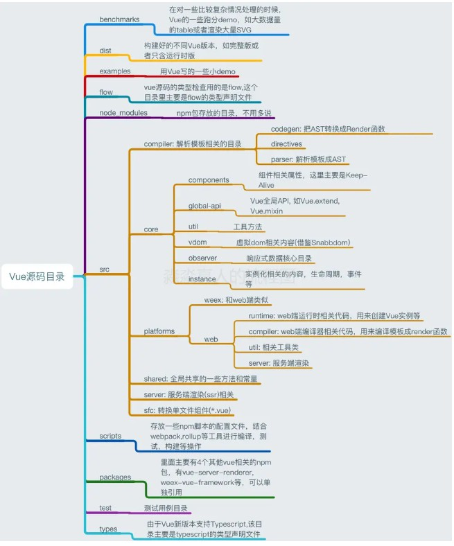

[Vue技术内幕](http://caibaojian.com/vue-design/art/1start-learn.html)

[Vue.js 技术揭秘](https://github.com/ustbhuangyi/vue-analysis)-github  
[Vue.js 技术揭秘](https://ustbhuangyi.github.io/vue-analysis/v2/prepare/)-电子书

[Vue源码简析(版本vue-2.4.4)](https://juejin.im/post/5ab07a63f265da2389258b12)

<!-- https://github.com/57code/vue-study -->


## 了解Vue

### Vue.js 源码主要目录
```js
src
├── compiler        # 编译相关 
├── core            # 核心代码 
├── platforms       # 不同平台的支持
├── server          # 服务端渲染
├── sfc             # .vue 文件解析
├── shared          # 共享代码
```

* compiler
目录包含 Vue.js 所有编译相关的代码。它包括把模板解析成 ast 语法树，ast 语法树优化，代码生成等功能。

* core 
目录包含了 Vue.js 的核心代码，包括内置组件、全局 API 封装，Vue 实例化、观察者、虚拟 DOM、工具函数等等

* server
Vue.js 2.0 支持了服务端渲染，所有服务端渲染相关的逻辑都在这个目录下。注意：这部分代码是跑在服务端的 Node.js，不要和跑在浏览器端的 Vue.js 混为一谈。  
服务端渲染主要的工作是把组件渲染为服务器端的 HTML 字符串，将它们直接发送到浏览器，最后将静态标记"混合"为客户端上完全交互的应用程序。

* platform
Vue.js 是一个跨平台的 MVVM 框架，它可以跑在 web 上，也可以配合 weex 跑在 native 客户端上。platform 是 Vue.js 的入口，2 个目录代表 2 个主要入口，分别打包成运行在 web 上和 weex 上的 Vue.js。

* sfc
通常我们开发 Vue.js 都会借助 webpack 构建， 然后通过 .vue 单文件来编写组件。这个目录下的代码逻辑会把 .vue 文件内容解析成一个 JavaScript 的对象。

* shared
Vue.js 会定义一些工具方法，这里定义的工具方法都是会被浏览器端的 Vue.js 和服务端的 Vue.js 所共享的。




### Vue.js 源码构建
如果按照输出的模块形式分类，那么 Vue 有三种不同的构建输出，分别是：
* UMD
* CommonJS
* ES Module，

打开 scripts/config.js 文件，发现三个构建配置的入口是相同的，即 web/entry-runtime.js 文件（web指向src/platforms/web），但是输出的格式(format)是不同的，分别是 cjs（CommonJS）、es（ES Module） 以及 umd（UMD）。


每种模块形式又分别输出了 （区别：能否解析 template ）
* 运行时构建：entry-runtime.js
   打包生成到dist（不同模块情况, UMD, CommonJS 和 ES Module）
  * dist/vue.runtime.common.dev.js (CommonJS -- deveploment)
  * dist/vue.runtime.common.prod.js (CommonJS -- production)
  * dist/vue.runtime.esm.js (ES -- 预编译调试时， esm标准，支持import from 最新标准的)
  * dist/vue.runtime.js(UMD -- development)
  * dist/vue.runtime.min.js(UMD -- production)
* 完整构建：entry-runtime-with-compiler.js
   打包生成到dist（不同模块情况, UMD, CommonJS 和 ES Module）
  * dist/vue.common.dev.js (CommonJS -- deveploment)
  * dist/vue.common.prod.js (CommonJS -- production)
  * dist/vue.esm.js(ES -- esm标准)
  * dist/vue.esm.browser.js(ES -- development)
  * dist/vue.esm.browser.min.js(ES -- production)
  * dist/vue.js(UMD -- development)
  * dist/vue.min.js(UMD -- production)

完整版比运行时多了 compiler，它的作用是：将 template 编译为 render 函数。

scripts/config.js里 build 构建生成 dist 目录对应的文件


### Runtime Only VS Runtime + Compiler
* Runtime Only

我们在使用 Runtime Only 版本的 Vue.js 的时候，通常需要借助如 webpack 的 vue-loader 工具把 .vue 文件编译成 JavaScript，因为是在编译阶段做的，所以它只包含运行时的 Vue.js 代码，因此代码体积也会更轻量。

* Runtime + Compiler
 
我们如果没有对代码做预编译，但又使用了 Vue 的 template 属性并传入一个字符串，则需要在客户端编译模板

```js
// 需要编译器的版本
new Vue({
  template: '<div>{{ hi }}</div>'
})

// 这种情况不需要
new Vue({
  render (h) {
    return h('div', this.hi)
  }
})
```

最终渲染都是通过 render 函数，如果写 template 属性，则需要编译成 render 函数，那么这个编译过程会发生运行时，所以需要带有编译器的版本。

## Vue构造函数(src\core\instance\index.js)
